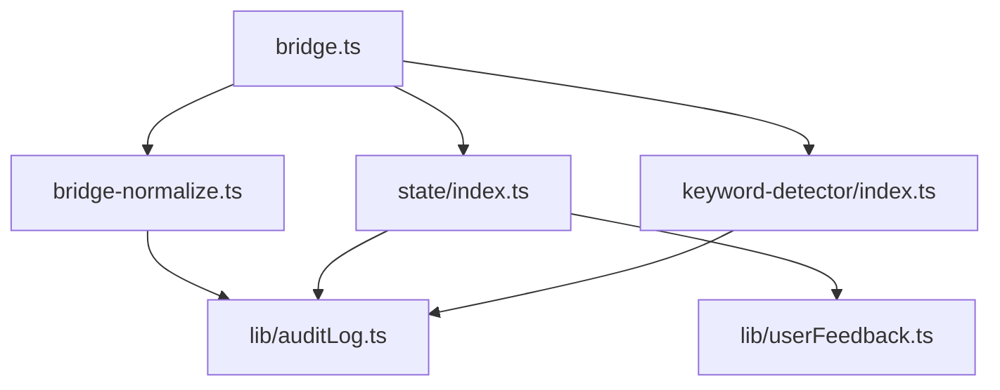

# 系统架构设计

**基于**: Rough PRD v1.0
**生成时间**: 2026-03-15T03:48:00Z

## 架构概览

本次修复涉及 3 个核心模块：

```
ultrapower/
├── src/
│   ├── hooks/
│   │   ├── bridge-normalize.ts    [BUG-002] 输入验证
│   │   ├── bridge.ts              [BUG-004, BUG-006] 状态清理、错误处理
│   │   └── keyword-detector/
│   │       └── index.ts           [BUG-003, BUG-005] ReDoS、冲突解决
│   ├── state/
│   │   └── index.ts               [BUG-001] 竞态条件
│   └── lib/
│       ├── auditLog.ts            [新增] 审计日志
│       └── userFeedback.ts        [新增] 用户反馈
└── .omc/
    └── audit.log                  [新增] 审计日志文件
```

## 模块依赖关系



## 关键接口定义

### 审计日志接口

```typescript
interface SecurityEvent {
  timestamp: string;
  event: string;
  severity: 'low' | 'medium' | 'high';
  details: any;
  sessionId?: string;
}

function auditLog(category: string, event: SecurityEvent): void;
```

### 状态管理接口

```typescript
class StateManager<T> {
  private writeQueue: Map<string, Promise<void>>;
  async writeSync(data: T, sessionId?: string): Promise<boolean>;
  private async atomicWrite(path: string, data: T): Promise<void>;
}
```

### 用户反馈接口

```typescript
function showProgress(message: string, current: number, total: number): void;
function showError(message: string, recoverable: boolean): void;
function showConflict(detected: string[], selected: string): void;
```

## 数据流

### BUG-002 修复流程

```
用户输入 → bridge.ts → bridge-normalize.ts
                              ↓
                    检查是否敏感 hook
                              ↓
                    是 → 强制完整验证 → auditLog
                    否 → 快速路径/完整验证
```

### BUG-001 修复流程

```
多个 agent 写入请求 → StateManager.writeSync
                              ↓
                    加入写入队列（序列化）
                              ↓
                    atomicWrite（temp + rename）
                              ↓
                    成功 → userFeedback.showProgress
                    失败 → auditLog + 清理临时文件
```

## 测试策略

### 单元测试覆盖

- `bridge-normalize.ts`: 100% 覆盖率（原型污染、白名单过滤）
- `state/index.ts`: 并发写入、异常场景
- `keyword-detector/index.ts`: ReDoS、冲突解决

### 集成测试

- 多 agent 并发写入端到端测试
- 异常退出恢复测试
- 安全攻击模拟测试

## 性能影响评估

| 修复项 | 性能影响 | 缓解措施 |
|--------|---------|---------|
| BUG-002 强制验证 | +2-5ms | 仅敏感 hook 受影响 |
| BUG-001 原子写入 | +5-10ms | 可接受，保证数据完整性 |
| BUG-003 输入限制 | -50% | 截断长文本，显著减少回溯 |

## 向后兼容性

- ✅ 所有修复向后兼容
- ✅ 不影响现有 API 契约
- ✅ 状态文件格式不变
