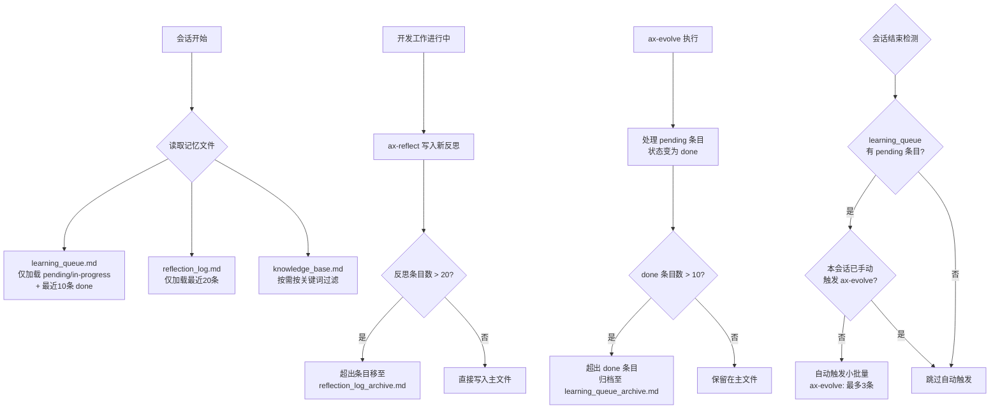
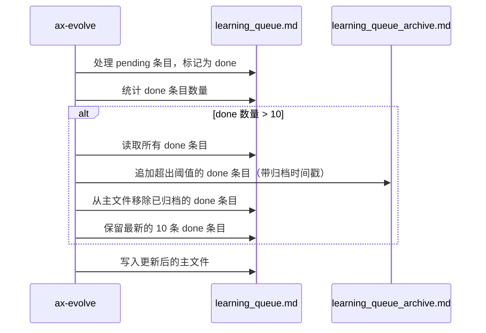
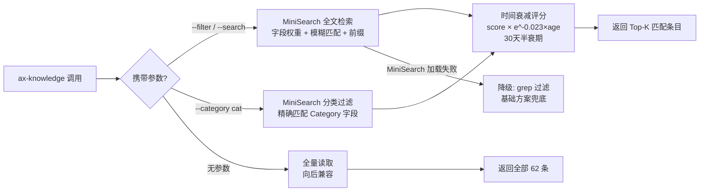

# PRD: Axiom 记忆与进化系统 Token 使用效率优化 - Draft

> **状态**: DRAFT v0.2（开源研究更新）
> **作者**: Product Design Expert (axiom-product-designer)
> **版本**: 0.2
> **创建时间**: 2026-03-02
> **更新时间**: 2026-03-02（深度研究补充：MiniSearch + SessionEnd hook + 时间衰减）
> **关联需求分析**: PASS 92%（来自 axiom-requirement-analyst）
> **研究依据**: MemGPT/Letta 21K⭐、MiniSearch 5.7K⭐、claude-mem 27.2K⭐、OpenClaw 242K⭐

---

## 1. 背景与目标

### 背景

Axiom 进化引擎通过三个核心 Markdown 文件维持跨会话记忆：`learning_queue.md`（学习队列）、`reflection_log.md`（反思日志）、`knowledge_base.md`（知识图谱索引）。随着系统持续运行，这三个文件因"只增不减"设计持续膨胀：

* `learning_queue.md`：327 行，LQ-001~LQ-030 全部 `done`，零 `pending`，仍全量载入

* `reflection_log.md`：681 行 / 46KB，含大量历史遗留空条目噪音

* `knowledge_base.md`：177 行 / 8KB，62 条，每次 ax-evolve / ax-knowledge 全量读取

文件膨胀直接导致每次会话的上下文 token 消耗不必要地增长，且随时间线性恶化。

### 产品目标（一句话）

通过自动归档、滚动窗口和按需读取机制，将 Axiom 进化系统的三个核心记忆文件的活跃内容体积控制在合理阈值内，在不损失知识完整性的前提下降低每会话 token 消耗。

---

## 2. 用户故事

| # | 角色 | 目标 | 收益 |
| --- | ------ | ------ | ------ |
| U1 | Axiom 系统（自动化） | 当 learning_queue.md 中 done 条目超出阈值时，自动将其归档到独立文件 | 主文件始终只保留需要关注的 pending/in-progress 条目，token 消耗与待处理量成正比 |
| U2 | Axiom 系统（自动化） | 清理 reflection_log.md 中的历史遗留空条目，并建立滚动窗口机制 | 反思日志保持可读性，旧噪音不再占据上下文 token |
| U3 | 开发者（调用 ax-knowledge） | 按关键词或类别查询知识库，只获取相关条目 | 不再加载全部 62 条，响应更快，token 消耗更低 |
| U4 | Axiom 系统（会话结束时） | 会话结束时自动触发小批量 ax-evolve 处理 | 避免队列积压导致的集中大量 token 消耗 |

---

## 3. 高层需求（MVP）

### T1: learning_queue.md done 条目自动归档

1. 定义归档阈值：主文件中 `done` 条目数超过 **10 条**时触发归档
2. 归档目标路径：`.omc/axiom/evolution/learning_queue_archive.md`（追加写入，带归档时间戳）
3. 归档动作：将超出阈值的 `done` 条目从主文件移除，写入归档文件
4. 主文件只保留：文件头部（格式说明 + 优先级说明）、所有 `pending` 条目、所有 `in-progress` 条目、最近 10 条 `done` 条目
5. 触发时机：ax-evolve 处理完一批条目后（状态变为 done 时）自动检查并执行

### T2: reflection_log.md 历史噪音清理 + 滚动窗口

1. 一次性清理：删除文件中所有空条目（内容仅有标题行或空白行的反思块）
2. 滚动窗口：主文件保留最近 **20 条**完整反思记录
3. 历史归档路径：`.omc/axiom/evolution/reflection_log_archive.md`（追加写入）
4. 触发时机：ax-reflect 写入新反思条目时，自动检查并将超出窗口的条目移至归档
5. 归档格式：在归档文件中记录归档时间和条目原始内容

### T3: knowledge_base.md 按需读取（MiniSearch 全文搜索 + 时间衰减）

**基础方案（v1，纯 SKILL.md 层，无额外依赖）：**
1. 支持关键词过滤：ax-knowledge 接受 `--filter <keyword>` 参数，只返回 Title 或 Category 包含关键词的行
2. 支持分类过滤：ax-knowledge 接受 `--category <category>` 参数，按 Category 列过滤
3. 无参数时的默认行为：仍返回全量索引（向后兼容）

**进阶方案（v2，引入 MiniSearch，开源研究推荐）：**
1. 引入 `minisearch`（5.7K⭐，MIT，零外部依赖，TypeScript 原生，7KB minified）作为知识库检索引擎
2. 知识库条目格式升级：在每条 entry 头部添加结构化 YAML front-matter 标签（`tags`、`category`、`created_at`、`last_accessed`、`priority`）
3. MiniSearch 索引字段：`title`（权重 2x）、`content`（权重 1x）、`tags`（权重 1.5x），支持模糊匹配（fuzzy: 0.2）和前缀搜索（prefix: true）
4. 时间衰减评分（源自 OpenClaw 242K⭐ 模式）：`finalScore = score × e^(-0.023 × ageInDays) × (1 + 0.2 × (3 - priority))`（30天半衰期，近期条目自动上浮）
5. 实现层：TypeScript hook/skill 层，引入 `minisearch` 为唯一新增运行时依赖
6. 降级路径：若 MiniSearch 加载失败，自动回退至基础方案（grep 过滤），不阻断主流程

### T4: ax-evolve 会话结束自动小批量触发（SessionEnd hook 专用）

1. **触发点：仅使用 `SessionEnd` hook**（不使用 `Stop` hook）——源自 claude-mem 27.2K⭐ bug #987 教训：Stop hook 若返回 `systemMessage` 含"next steps"文本，Claude 会将其解读为新任务，引发无限循环；SessionEnd hook 天然安全（会话已结束，无法被重入）
2. 批量限制：每次自动触发最多处理 **3 条** pending 条目（小批量，控制 token 消耗）；需在 30 秒内完成并退出（SessionEnd hook 时间敏感）
3. 触发条件：learning_queue.md 中存在至少 1 条 `pending` 条目时才触发
4. 跳过条件：若当前会话已手动执行过 ax-evolve，则跳过自动触发（防止重复处理）；通过读取 active_context.md 中的 `auto_evolve_done: true` 标记判断
5. 安全守卫：hook 脚本入口检查 `stop_hook_active` 环境变量；若为 `true` 则立即退出（防 Stop hook 误触发）
6. 触发标记：自动触发完成后在 active_context.md 写入标记 `auto_evolve: true`，下次会话可见

---

## 4. 业务流程

### 4.1 整体优化流程（主视图）

### 4.2 T1 学习队列归档流程

### 4.3 T3 知识库按需读取流程（MiniSearch）

---

## 5. 非功能需求

### 5.1 Token 效率指标（量化目标）

| 文件 | 当前行数 | 优化后主文件上限 | 预期 token 降幅 |
| ------ | --------- | ----------------- | ---------------- |
| learning_queue.md | ~327 行 | ~60 行（头部20行 + 最多10条done + pending区） | ~82%（MemGPT two-tier 模式） |
| reflection_log.md | ~681 行 | ~400 行（最近20条完整反思） | ~41%（滚动窗口） |
| knowledge_base.md | ~177 行 | 按需：平均返回 ~10 条（时间衰减Top-K） | ~85%（MiniSearch + 时间衰减，qmd 96% 参照） |
| 合计（三文件均值） | 1185 行 | ~470 行 | **~73%**（全量场景） |

### 5.2 向后兼容性要求

* 现有 ax-evolve、ax-knowledge、ax-reflect skill 调用语法不变

* 归档文件格式与主文件格式一致（可手动审查）

* ax-knowledge 无参数时行为与优化前完全一致

* 归档操作为幂等操作：重复执行不产生重复归档

* 不修改已处理的 done 条目内容（仅移动位置）

### 5.3 可靠性要求

* 归档操作失败时，主文件内容不受影响（先写归档，再清理主文件）

* 自动 ax-evolve 触发失败时，不阻断会话结束流程

* 滚动窗口阈值通过配置项控制，不硬编码（默认值在 SKILL.md 中声明）

---

## 6. 验收标准

### T1 验收标准

* [ ] `learning_queue.md` 主文件行数稳定在 60 行以内（正常使用状态）

* [ ] `learning_queue_archive.md` 存在且包含所有历史 done 条目（无内容丢失）

* [ ] 触发归档后，主文件 done 条目数 <= 10

* [ ] 归档操作在 ax-evolve 执行后自动发生，无需手动干预

* [ ] 归档文件每条记录带有 `归档时间: YYYY-MM-DD` 标记

### T2 验收标准

* [ ] 执行一次性清理后，`reflection_log.md` 中无空条目（空标题块）

* [ ] 新写入反思后，主文件反思条目数 <= 20

* [ ] `reflection_log_archive.md` 包含被滚出窗口的历史反思（无内容丢失）

* [ ] ax-reflect 正常写入新反思，与优化前行为一致

### T3 验收标准

* [ ] `ax-knowledge --filter typescript` 只返回 Title/Tags 含 "typescript" 的条目（MiniSearch 全文匹配）

* [ ] `ax-knowledge --category architecture` 只返回 Category = "architecture" 的条目

* [ ] `ax-knowledge`（无参数）返回全量 62 条，与优化前一致

* [ ] MiniSearch 返回结果按时间衰减评分排序（近期条目优先）

* [ ] MiniSearch 加载失败时自动降级至 grep 过滤，不抛异常

* [ ] 过滤结果正确（无漏匹配、无误匹配）

### T4 验收标准

* [ ] 会话结束时，触发的是 SessionEnd hook（不是 Stop hook）

* [ ] 若有 pending 条目且本会话未手动触发，自动执行 ax-evolve（最多3条）

* [ ] `stop_hook_active=true` 时 hook 立即退出，不执行归档（无限循环防护）

* [ ] 已手动执行 ax-evolve 的会话，结束时不重复触发

* [ ] 自动触发标记 `auto_evolve: true` 写入 active_context.md

* [ ] 无 pending 条目时，会话结束不触发自动 ax-evolve

* [ ] hook 执行时间 < 30 秒（SessionEnd 超时安全）

---

## 7. 风险与约束

| 风险 | 严重程度 | 缓解措施 |
| ------ | --------- | --------- |
| 归档操作在写归档与清理主文件之间崩溃，导致数据重复 | 中 | 归档前先备份主文件到临时文件，操作完成后删除临时文件 |
| 滚动窗口阈值设置过小，导致有价值的历史反思被过早归档 | 低 | 默认 20 条反思 / 10 条 done，通过 SKILL.md 配置项暴露给用户 |
| T4 Stop hook 无限循环（claude-mem bug #987 教训） | **已通过设计规避** | 仅使用 SessionEnd hook；stop_hook_active 守卫；不在 hook 输出中写"next steps"等触发词 |
| T4 SessionEnd hook 超时（30秒硬限制） | 中 | 最多处理 3 条，预估 10-15 秒；超时自动终止，不阻断会话关闭 |
| reflection_log.md 一次性清理可能误删有效反思 | 高 | 清理前先备份整个文件至 `reflection_log_backup_YYYYMMDD.md`，清理后人工确认 |
| MiniSearch 索引构建失败或版本不兼容 | 低 | 降级路径：自动回退至基础 grep 过滤，保证 ax-knowledge 不阻断；单测覆盖降级路径 |
| knowledge_base.md 条目未迁移至结构化 YAML 格式 | 中 | 迁移脚本随 T3 v2 发布；迁移前 v1 基础方案作兜底 |

### 实现约束

* 所有操作在 TypeScript 层实现（hooks / skills），符合项目技术栈

* CI 门禁必须通过：`tsc --noEmit && npm run build && npm test`

* 允许引入 `minisearch`（MIT 许可，零外部依赖，7KB minified）作为 T3 v2 的唯一新增运行时依赖；其余任务不引入新依赖

* 归档文件路径固定为 `.omc/axiom/evolution/` 目录下

* T4 hook 脚本必须在 30 秒内执行完毕（SessionEnd 时间限制）

---

## 8. 暂不包含（v2 延期）

* `workflow_metrics.md` 的类似优化（用户已明确排除）

* Python nexus daemon 的 token 追踪

* `knowledge_base.md` 内容重构（语义去重、质量评分等）

* 跨会话 token 预算追踪与报警

* 知识库条目的向量化检索（语义搜索）

* 归档文件的自动压缩或清理策略

---

## 9. 下一步

PRD 生成完成，等待以下流程：

1. 调用 `ax-review` 进行专家评审（5 专家并行）
2. 评审通过后调用 `ax-decompose` 拆解为子任务
3. 用户确认 PRD 后调用 `ax-implement` 开始开发
