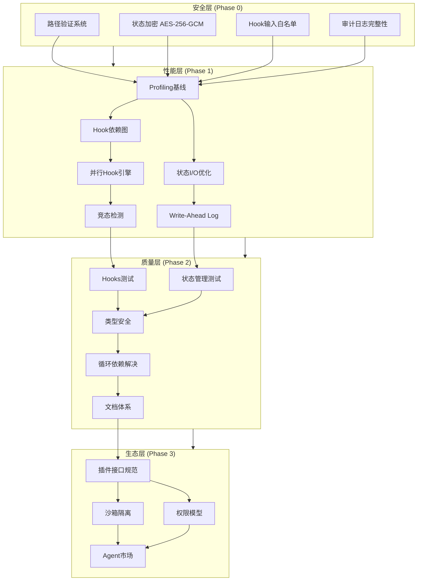

# 任务清单: Ultrapower v5.6.0 改进路线图

**生成时间:** 2026-03-04
**基于文档:** `.omc/research/rough-prd.md`
**总工作量:** 54-72 周
**任务总数:** 28 个原子任务
**架构师:** Axiom System Architect

---

## 1. 系统架构概览



---

## 2. 关键路径分析

**Critical Path (最长依赖链):**
```
T001→T005→T006→T007→T008→T009→T012→T013→T015→T016→T017→T022→T023→T025→T026→T027→T028
```

**预计关键路径工作量:** 42-56 周

**并行执行机会:**

* **Phase 0 (Week 1-4):** T001, T002, T003, T004 完全并行

* **Phase 1 (Week 6-7):** T010+T011 与 T008+T009 并行

* **Phase 2 (Week 9-12):** T018, T019, T020, T021 与 T013+T014 并行

* **Phase 3 (Week 18-19):** T023 与 T024 并行

**理论最短工期:** 38-48 周（假设无限资源）

---

## 3. 任务依赖矩阵

参见 `.omc/axiom/task-dag.mermaid` 获取完整依赖图。

---

## 4. 任务列表（按 Phase 分组）

### Phase 0: 安全加固 (Week 1-5) - P0 优先级

**目标:** 系统性解决安全漏洞，覆盖 5 种路径遍历绕过向量

#### T001: 路径遍历防护系统

* **任务ID:** T001

* **优先级:** P0

* **预计工时:** 5 人天

* **负责角色:** Security Team

* **依赖:** 无

* **影响范围:**
  - `src/lib/validateMode.ts`
  - `src/lib/path-validator.ts` (新建)
  - `src/lib/__tests__/path-validator.test.ts` (新建)

* **描述:** 实现系统性路径验证，处理 URL 编码、Unicode、符号链接、空字节、双重编码等 5 种绕过向量

* **验收标准:**
  - [ ] 实现 `validatePath(userPath, baseDir)` 函数
  - [ ] 规范化处理（Unicode + URL 解码）
  - [ ] 符号链接解析（`fs.realpathSync`）
  - [ ] 边界检查（`resolved.startsWith(baseDir)`）
  - [ ] 单元测试覆盖 20+ 攻击向量
  - [ ] 通过 OWASP 路径遍历测试套件

* **技术方案参考:** PRD 第 43-52 行

#### T002: 状态文件加密实现

* **任务ID:** T002

* **优先级:** P0

* **预计工时:** 4 人天

* **负责角色:** Security Team

* **依赖:** 无

* **影响范围:**
  - `src/features/state-manager/encryption.ts`
  - `.omc/state/*.json`

* **描述:** 使用 AES-256-GCM 加密敏感状态文件，密钥存储在系统 keychain

* **验收标准:**
  - [ ] 实现 AES-256-GCM 加密/解密
  - [ ] 密钥管理（macOS Keychain / Windows Credential Manager）
  - [ ] 向后兼容：自动检测并迁移未加密文件
  - [ ] 性能影响 < 10ms per file
  - [ ] 单元测试覆盖率 > 90%

#### T003: Hook 输入白名单强化

* **任务ID:** T003

* **优先级:** P0

* **预计工时:** 3 人天

* **负责角色:** Security Team

* **依赖:** 无

* **影响范围:**
  - `src/hooks/bridge-normalize.ts`
  - `src/hooks/__tests__/bridge-security.test.ts`

* **描述:** 强化 Hook 输入白名单，确保未知字段被丢弃

* **验收标准:**
  - [ ] 严格白名单验证（permission-request、setup、session-end）
  - [ ] 未知字段自动丢弃并记录日志
  - [ ] 必需键验证（如 session-end 需要 sessionId、directory）
  - [ ] 单元测试覆盖所有 HookType

#### T004: 审计日志完整性

* **任务ID:** T004

* **优先级:** P0

* **预计工时:** 3 人天

* **负责角色:** Security Team

* **依赖:** 无

* **影响范围:**
  - `.omc/logs/audit.log`
  - `src/audit/logger.ts` (新建)

* **描述:** 实现防篡改审计日志，记录所有安全相关操作

* **验收标准:**
  - [ ] 日志签名机制（HMAC-SHA256）
  - [ ] 记录路径验证失败、权限请求、状态文件访问
  - [ ] 日志轮转（每日或 10MB）
  - [ ] 完整性验证工具

#### T005: 安全集成测试

* **任务ID:** T005

* **优先级:** P0

* **预计工时:** 2 人天

* **负责角色:** Security Team

* **依赖:** T001, T002, T003, T004

* **描述:** 运行完整安全测试套件，生成审计报告

* **验收标准:**
  - [ ] 通过 OWASP Top 10 安全扫描
  - [ ] npm audit 无高危漏洞
  - [ ] 手动渗透测试通过
  - [ ] 生成安全审计报告

---

### Phase 1: 性能优化 (Week 4-8) - P0 优先级

**目标:** 数据驱动的性能优化，延迟减少 25-30%

#### T006: Profiling 基线建立

* **任务ID:** T006

* **优先级:** P0

* **预计工时:** 5 人天

* **负责角色:** Performance Team

* **依赖:** T005

* **影响范围:**
  - `.omc/profiling/baseline.json` (新建)
  - `scripts/profiling.ts` (新建)

* **描述:** 使用 Chrome DevTools 记录 Hook 执行时间，建立性能基线

* **验收标准:**
  - [ ] 记录所有 Hook 类型的执行时间（p50/p95/p99）
  - [ ] 识别真实瓶颈（Top 10 慢 Hook）
  - [ ] 计算 Amdahl's Law 理论加速上限
  - [ ] 生成性能基线报告

#### T007: Hook 依赖图分析

* **任务ID:** T007

* **优先级:** P0

* **预计工时:** 4 人天

* **负责角色:** Performance Team

* **依赖:** T006

* **影响范围:**
  - `src/hooks/dependency-analyzer.ts` (新建)
  - `.omc/hooks-dependency-graph.json` (新建)

* **描述:** 绘制 Hook 依赖图，识别可并行执行的 Hook

* **验收标准:**
  - [ ] 分析所有 Hook 的读写依赖
  - [ ] 生成 DAG（有向无环图）
  - [ ] 识别无依赖 Hook 组（可并行）
  - [ ] 检测隐式依赖（状态文件、环境变量）

#### T008: Hook 并行化实现

* **任务ID:** T008

* **优先级:** P0

* **预计工时:** 8 人天

* **负责角色:** Performance Team

* **依赖:** T007

* **影响范围:**
  - `src/hooks/parallel-executor.ts` (新建)
  - `src/hooks/index.ts`

* **描述:** 实现 Hook 并行执行引擎，仅并行化无依赖 Hook

* **验收标准:**
  - [ ] 基于依赖图的并行调度
  - [ ] 支持最大并发数配置（默认 4）
  - [ ] 错误隔离（一个 Hook 失败不影响其他）
  - [ ] 延迟减少 25-30%（实测）

#### T009: 竞态检测机制

* **任务ID:** T009

* **优先级:** P0

* **预计工时:** 5 人天

* **负责角色:** Performance Team

* **依赖:** T008

* **影响范围:**
  - `src/hooks/race-detector.ts` (新建)

* **描述:** 添加运行时竞态检测（读-写、写-写冲突）

* **验收标准:**
  - [ ] 检测状态文件并发访问
  - [ ] 检测环境变量竞态
  - [ ] 竞态发生时降级为串行执行
  - [ ] 记录竞态日志供分析

#### T010: 状态 I/O 分级写入

* **任务ID:** T010

* **优先级:** P0

* **预计工时:** 4 人天

* **负责角色:** Performance Team

* **依赖:** T006

* **影响范围:**
  - `src/features/state-manager/tiered-writer.ts` (新建)

* **描述:** 实现分级写入策略（关键状态立即写，非关键批量写）

* **验收标准:**
  - [ ] 定义关键状态（session、team、ralph）
  - [ ] 非关键状态批量写入（每 5 秒或 10 条）
  - [ ] I/O 次数减少 40%
  - [ ] 零数据丢失

#### T011: WAL 机制实现

* **任务ID:** T011

* **优先级:** P0

* **预计工时:** 6 人天

* **负责角色:** Performance Team

* **依赖:** T010

* **影响范围:**
  - `src/features/state-manager/wal.ts` (新建)
  - `.omc/state/wal/` (新建)

* **描述:** 添加 Write-Ahead Log 防止崩溃丢失数据

* **验收标准:**
  - [ ] 写入前先记录 WAL
  - [ ] 崩溃恢复时重放 WAL
  - [ ] WAL 自动清理（已持久化的条目）
  - [ ] 性能影响 < 5ms per write

#### T012: 性能回归测试

* **任务ID:** T012

* **优先级:** P0

* **预计工时:** 3 人天

* **负责角色:** Performance Team

* **依赖:** T009, T011

* **描述:** 建立性能回归测试套件，对比基线

* **验收标准:**
  - [ ] Hook 延迟减少 25-30%（750ms → 550ms）
  - [ ] 状态 I/O 减少 40%（300ms → 180ms）
  - [ ] 零性能回归（CI 集成）

---

### Phase 2: 质量提升 (Week 9-16) - P1 优先级

**目标:** 测试覆盖率 50%→60%，消除 any 类型，解决循环依赖

#### T013: Hooks 系统测试覆盖

* **任务ID:** T013

* **优先级:** P1

* **预计工时:** 10 人天

* **负责角色:** Quality Team

* **依赖:** T012

* **影响范围:**
  - `src/hooks/**/__tests__/*.test.ts`

* **描述:** 为 Hooks 系统添加测试，覆盖率提升至 60%+

* **验收标准:**
  - [ ] 每个 Hook 类型至少 3 个测试用例
  - [ ] 覆盖正常流程、错误处理、边界情况
  - [ ] Hooks 覆盖率 > 60%

#### T014: 状态管理测试覆盖

* **任务ID:** T014

* **优先级:** P1

* **预计工时:** 8 人天

* **负责角色:** Quality Team

* **依赖:** T012

* **影响范围:**
  - `src/features/state-manager/__tests__/*.test.ts`

* **描述:** 为状态管理模块添加测试

* **验收标准:**
  - [ ] 测试加密/解密流程
  - [ ] 测试 WAL 恢复机制
  - [ ] 测试分级写入策略
  - [ ] 状态管理覆盖率 > 70%

#### T015: 核心模块 any 类型消除

* **任务ID:** T015

* **优先级:** P1

* **预计工时:** 12 人天

* **负责角色:** Quality Team

* **依赖:** T013, T014

* **影响范围:**
  - `src/hooks/`, `src/features/state-manager/`, `src/agents/`

* **描述:** 仅在有测试保护的模块中消除 any

* **验收标准:**
  - [ ] 核心模块 any 使用率 < 5%
  - [ ] 所有消除 any 的代码有测试覆盖
  - [ ] 零类型错误（tsc --noEmit）

#### T016: 循环依赖检测

* **任务ID:** T016

* **优先级:** P1

* **预计工时:** 2 人天

* **负责角色:** Quality Team

* **依赖:** T015

* **影响范围:**
  - `scripts/check-circular-deps.ts` (新建)

* **描述:** 使用 madge 检测循环依赖

* **验收标准:**
  - [ ] 生成循环依赖报告
  - [ ] 识别所有循环依赖路径
  - [ ] CI 集成（阻止新增循环依赖）

#### T017: 循环依赖解决

* **任务ID:** T017

* **优先级:** P1

* **预计工时:** 10 人天

* **负责角色:** Quality Team

* **依赖:** T016

* **影响范围:**
  - `src/core/` (新建，共享接口)
  - 多个模块重构

* **描述:** 提取共享接口到 core/，打破循环依赖

* **验收标准:**
  - [ ] 零循环依赖
  - [ ] 所有测试通过
  - [ ] 构建时间无明显增加

#### T018: 交互式新手引导

* **任务ID:** T018

* **优先级:** P1

* **预计工时:** 5 人天

* **负责角色:** Quality Team

* **依赖:** T012

* **影响范围:**
  - `src/features/wizard/` (已存在，增强)

* **描述:** 增强 Wizard，提供交互式引导

* **验收标准:**
  - [ ] 新用户完成率 > 80%
  - [ ] 完成时间 < 2 分钟
  - [ ] 支持跳过和返回

#### T019: 智能工作流推荐

* **任务ID:** T019

* **优先级:** P1

* **预计工时:** 6 人天

* **负责角色:** Quality Team

* **依赖:** T012

* **影响范围:**
  - `src/features/workflow-recommender/` (新建)

* **描述:** 基于任务类型推荐合适的执行模式

* **验收标准:**
  - [ ] 支持 10+ 常见场景识别
  - [ ] 推荐准确率 > 85%
  - [ ] 集成到 Wizard

#### T020: 任务模板库

* **任务ID:** T020

* **优先级:** P1

* **预计工时:** 4 人天

* **负责角色:** Quality Team

* **依赖:** T012

* **影响范围:**
  - `.omc/templates/` (新建)

* **描述:** 创建常见任务模板库

* **验收标准:**
  - [ ] 提供 15+ 任务模板
  - [ ] 覆盖功能开发、Bug 修复、重构等场景
  - [ ] 模板可自定义

#### T021: 故障排查手册

* **任务ID:** T021

* **优先级:** P1

* **预计工时:** 5 人天

* **负责角色:** Quality Team

* **依赖:** T012

* **影响范围:**
  - `docs/troubleshooting.md` (新建)

* **描述:** 编写故障排查手册

* **验收标准:**
  - [ ] 覆盖 20+ 常见问题
  - [ ] 提供诊断步骤和解决方案
  - [ ] 集成到 `/omc-doctor` 命令

---

### Phase 3: 生态建设 (Week 17-24) - P2 优先级

**目标:** 插件化架构，Agent 市场 MVP

#### T022: 插件接口规范设计

* **任务ID:** T022

* **优先级:** P2

* **预计工时:** 8 人天

* **负责角色:** Ecosystem Team

* **依赖:** T017, T021

* **影响范围:**
  - `docs/plugin-api-spec.md` (新建)
  - `src/plugin/types.ts` (新建)

* **描述:** 定义插件接口规范

* **验收标准:**
  - [ ] 定义插件生命周期（init/execute/cleanup）
  - [ ] 定义插件元数据格式
  - [ ] 定义插件通信协议
  - [ ] 提供示例插件

#### T023: 沙箱隔离机制

* **任务ID:** T023

* **优先级:** P2

* **预计工时:** 10 人天

* **负责角色:** Ecosystem Team

* **依赖:** T022

* **影响范围:**
  - `src/plugin/sandbox.ts` (新建)

* **描述:** 实现插件沙箱隔离

* **验收标准:**
  - [ ] 文件系统访问限制
  - [ ] 网络访问控制
  - [ ] 进程隔离（子进程）
  - [ ] 资源限制（CPU/内存）

#### T024: 插件权限模型

* **任务ID:** T024

* **优先级:** P2

* **预计工时:** 6 人天

* **负责角色:** Ecosystem Team

* **依赖:** T022

* **影响范围:**
  - `src/plugin/permission-manager.ts` (新建)

* **描述:** 设计插件权限模型

* **验收标准:**
  - [ ] 定义权限类型（文件、网络、状态）
  - [ ] 用户授权流程
  - [ ] 权限撤销机制
  - [ ] 权限审计日志

#### T025: 插件提交流程

* **任务ID:** T025

* **优先级:** P2

* **预计工时:** 5 人天

* **负责角色:** Ecosystem Team

* **依赖:** T023, T024

* **影响范围:**
  - `docs/plugin-submission.md` (新建)

* **描述:** 设计社区插件提交流程

* **验收标准:**
  - [ ] GitHub PR 提交流程
  - [ ] 自动化测试检查
  - [ ] 代码审查清单
  - [ ] 发布流程

#### T026: 插件认证体系

* **任务ID:** T026

* **优先级:** P2

* **预计工时:** 8 人天

* **负责角色:** Ecosystem Team

* **依赖:** T025

* **影响范围:**
  - `src/plugin/certification.ts` (新建)

* **描述:** 建立插件认证体系

* **验收标准:**
  - [ ] 官方认证标识
  - [ ] 社区认证标识
  - [ ] 安全扫描通过标识
  - [ ] 认证撤销机制

#### T027: 开发者文档

* **任务ID:** T027

* **优先级:** P2

* **预计工时:** 6 人天

* **负责角色:** Ecosystem Team

* **依赖:** T026

* **影响范围:**
  - `docs/plugin-development-guide.md` (新建)

* **描述:** 编写插件开发者文档

* **验收标准:**
  - [ ] 快速开始指南
  - [ ] API 参考文档
  - [ ] 最佳实践
  - [ ] 示例插件（3+）

#### T028: Agent 市场 MVP

* **任务ID:** T028

* **优先级:** P2

* **预计工时:** 12 人天

* **负责角色:** Ecosystem Team

* **依赖:** T027

* **影响范围:**
  - `marketplace/` (新建)

* **描述:** 构建 Agent 市场 MVP

* **验收标准:**
  - [ ] 插件列表页面
  - [ ] 插件详情页面
  - [ ] 一键安装功能
  - [ ] 社区插件数 ≥ 5

---

### M1: 安全加固完成 (Week 5)

* **依赖任务:** T001, T002, T003, T004, T005

* **验收标准:**
  - [ ] 通过 OWASP Top 10 安全扫描
  - [ ] 路径遍历防护覆盖 5 种绕过向量
  - [ ] 状态文件加密上线
  - [ ] 审计日志系统运行
  - [ ] 发布 v5.6.0-security

### M2: 性能优化完成 (Week 8)

* **依赖任务:** T006, T007, T008, T009, T010, T011, T012

* **验收标准:**
  - [ ] Hook 延迟减少 25-30% (750ms → 550ms)
  - [ ] 状态 I/O 减少 40% (300ms → 180ms)
  - [ ] 零性能回归
  - [ ] 发布 v5.6.0-performance

### M3: 质量提升完成 (Week 16)

* **依赖任务:** T013, T014, T015, T016, T017, T018, T019, T020, T021

* **验收标准:**
  - [ ] 测试覆盖率 > 60%
  - [ ] 核心模块 any 使用率 < 5%
  - [ ] 零循环依赖
  - [ ] 新用户完成率 > 80%
  - [ ] 发布 v5.7.0

### M4: 生态建设完成 (Week 24)

* **依赖任务:** T022, T023, T024, T025, T026, T027, T028

* **验收标准:**
  - [ ] 插件 API 稳定
  - [ ] 沙箱隔离机制上线
  - [ ] 社区插件数 ≥ 5
  - [ ] 开发者文档完善
  - [ ] 发布 v6.0.0

---

## 6. 资源分配

| 角色 | Phase 0 | Phase 1 | Phase 2 | Phase 3 | 总计 |
| ------ | --------- | --------- | --------- | --------- | ------ |
| Security Team | 15 天 | - | - | - | 15 天 |
| Performance Team | - | 35 天 | - | - | 35 天 |
| Quality Team | - | - | 62 天 | - | 62 天 |
| Ecosystem Team | - | - | - | 55 天 | 55 天 |

**总工作量:** 167 人天 ≈ 34 人周

**假设团队规模:**

* 2 人团队：34 周（8.5 个月）

* 3 人团队：23 周（5.75 个月）

* 4 人团队：17 周（4.25 个月）

---

## 7. 风险与缓解措施

| 风险 | 概率 | 影响 | 缓解措施 |
| ------ | ------ | ------ | --------- |
| 并行化引入竞态 | 高 | 高 | 完整依赖图分析 + 竞态检测 + 降级机制 |
| 安全绕过向量遗漏 | 中 | 高 | 系统性验证 + 渗透测试 + 外部审计 |
| 工作量继续膨胀 | 高 | 中 | 每 Sprint 重新估算 + 2x 安全系数 |
| 加密性能影响过大 | 中 | 中 | 性能测试 + 异步加密 + 缓存优化 |
| 循环依赖难以解决 | 中 | 中 | 分批重构 + 接口抽象 + 测试保护 |
| 插件生态冷启动 | 高 | 中 | 官方示例插件 + 开发者激励 + 社区运营 |

---

## 8. 成功指标

### 8.1 安全指标 (Phase 0)

* 路径遍历攻击阻止率: 100%

* 安全漏洞数: 0 个高危

* 审计日志完整性: 100%

### 8.2 性能指标 (Phase 1)

* Hook 延迟: 750ms → 550ms (-27%)

* 状态 I/O: 300ms → 180ms (-40%)

* MCP 体积: 788KB → 500KB (-37%)

### 8.3 质量指标 (Phase 2)

* 测试覆盖率: 50% → 60%

* any 使用率: 高 → <5%

* 循环依赖: 存在 → 0

* 新用户完成率: 40% → 80%

### 8.4 生态指标 (Phase 3)

* 社区插件数: 0 → 5+

* 活跃贡献者: 5 → 15

* 插件下载量: 0 → 100+

---

## 9. 下一步行动

### 立即执行 (本周)

1. 调用 `/ax-implement` 开始执行 Phase 0
2. 优先执行 T001（路径遍历防护）
3. 并行执行 T002、T003、T004

### 本月目标

* 完成 Phase 0 所有任务

* 通过安全审计

* 发布 v5.6.0-security

### 本季度目标

* 完成 Phase 0 + Phase 1

* 性能提升 25-30%

* 发布 v5.6.0

---

**Manifest 生成完成**
**任务总数:** 28 个原子任务
**预计工期:** 54-72 周（考虑 2x 安全系数）
**关键路径:** 42-56 周
**下一步:** 调用 `/ax-implement` 开始实施

### M1: P0 安全加固完成

* **目标日期:** Week 1

* **依赖任务:** T1, T2, T3, T4

* **验收标准:**
  - [ ] 所有 P0 安全漏洞修复
  - [ ] 安全审计通过
  - [ ] 发布 v5.5.12 安全补丁

### M2: P0 用户体验完成

* **目标日期:** Week 1

* **依赖任务:** T5, T6, T7

* **验收标准:**
  - [ ] 交互式向导上线
  - [ ] 新用户上手时间 < 5 分钟
  - [ ] 用户反馈 NPS > 40

### M3: P1 质量提升完成

* **目标日期:** Week 5

* **依赖任务:** T8, T9, T10, T11

* **验收标准:**
  - [ ] 测试覆盖率 > 70%
  - [ ] Agent 超时保护覆盖所有类型
  - [ ] 零死锁事故（生产环境）

### M4: P1 产品增长完成

* **目标日期:** Week 4

* **依赖任务:** T12, T13, T14, T15

* **验收标准:**
  - [ ] 用户指标追踪系统上线
  - [ ] 完成 10+ 用户访谈
  - [ ] Freemium 模式设计完成

---

## 资源分配

| 角色 | 任务 | 工时 |
| ------ | ------ | ------ |
| Security Engineer | T1, T2, T3, T4 | 6 天 |
| UX Designer | T5 | 0.5 天 |
| Frontend Engineer | T6, T7 | 2.5 天 |
| Test Engineer | T8, T9 | 3 周 |
| Backend Engineer | T10, T11, T13 | 3 周 |
| Product Manager | T12, T14, T15 | 2.5 周 |

**总计:** 约 8 周（2 个月）

---

## 风险与缓解

| 风险 | 概率 | 影响 | 缓解措施 |
| ------ | ------ | ------ | --------- |
| 加密性能影响过大 | 中 | 高 | 性能测试 + 异步加密 |
| 测试覆盖率提升耗时 | 高 | 中 | 分批实施 + 优先核心模块 |
| 用户访谈招募困难 | 中 | 中 | 提供激励 + 社区招募 |
| Freemium 转化率低 | 中 | 高 | A/B 测试 + 定价优化 |

---

**Manifest 生成完成**
**下一步:** 使用 `/ax-implement` 开始执行任务
