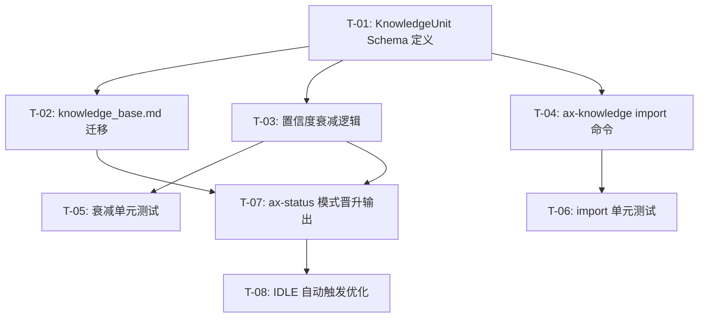

# Manifest：方向1 Axiom 进化引擎完整化

## 1. 架构图（全局上下文）



## 2. 任务列表（DAG）

### T-01: 定义 KnowledgeUnit 结构化 Schema

* 描述：在 `src/hooks/learner/types.ts` 新增 `KnowledgeUnit` interface，字段：`id / title / content / tags / confidence / source_project / namespace / created / last_used`。同步更新 `knowledge_base.md` YAML frontmatter 的 schema 版本字段。

* 文件：`src/hooks/learner/types.ts`，`.omc/axiom/evolution/knowledge_base.md`（frontmatter only）

* 依赖：[]

* 估时：2小时

* 验收：`tsc --noEmit` 零错误；`KnowledgeUnit` 可从 `types.ts` 正确导入；frontmatter `schema_version: 2` 存在

### T-02: knowledge_base.md 全量迁移为结构化格式

* 描述：将 `.omc/axiom/evolution/knowledge_base.md` 中 67 条记录全部补全 T-01 定义的所有字段（content 摘要、tags、source_project、namespace 默认 `ultrapower`、last_used 初始化为 created 日期）。

* 文件：`.omc/axiom/evolution/knowledge_base.md`

* 依赖：T-01

* 估时：3小时

* 验收：索引表每行含全部 9 个字段；`namespace` 列全部有值；无空白 content 字段

### T-03: 模式置信度衰减逻辑实现

* 描述：在 `src/hooks/learner/confidence.ts` 新增 `decayConfidence(unit: KnowledgeUnit, nowMs?: number): KnowledgeUnit` 函数：若 `last_used` 距今 ≥ 30 天，confidence 乘以衰减系数 0.9（可配置），最低不低于 0.1。同步更新 `pattern_library.md` 中各模式的 `last_used` 字段（若缺失则补全）。

* 文件：`src/hooks/learner/confidence.ts`，`.omc/axiom/evolution/pattern_library.md`

* 依赖：T-01

* 估时：2小时

* 验收：`decayConfidence` 导出正确；30天边界行为符合预期；`tsc --noEmit` 零错误

### T-04: ax-knowledge import 命令实现

* 描述：在 `skills/ax-knowledge/SKILL.md` 新增 `ax-knowledge import <file>` 命令说明：读取外部 JSON/YAML 知识文件，显示确认提示（条目数 + source_project），用户确认后以 `namespace: <source_project>` 隔离追加到 `knowledge_base.md`。在 `src/hooks/learner/index-manager.ts` 新增 `importKnowledge(filePath: string, namespace: string): Promise<ImportResult>` 函数。

* 文件：`skills/ax-knowledge/SKILL.md`，`src/hooks/learner/index-manager.ts`

* 依赖：T-01

* 估时：3小时

* 验收：`importKnowledge` 函数导出；namespace 隔离逻辑可验证（同 namespace 条目聚合）；`tsc --noEmit` 零错误

### T-05: 置信度衰减单元测试

* 描述：在 `src/hooks/learner/__tests__/confidence.test.ts` 新增测试：① 30天内不衰减；② 恰好30天触发衰减；③ 多次衰减累积；④ 最低值 0.1 边界；⑤ `nowMs` 参数注入（时间可控）。

* 文件：`src/hooks/learner/__tests__/confidence.test.ts`

* 依赖：T-03

* 估时：2小时

* 验收：≥5 个测试用例；`npm run test:run` 全部通过

### T-06: ax-knowledge import 单元测试

* 描述：在 `src/hooks/learner/__tests__/index-manager-import.test.ts` 新增测试：① 正常导入 JSON 文件；② namespace 隔离（不同 namespace 条目不混合）；③ 重复 id 跳过/覆盖策略；④ 文件不存在错误处理。

* 文件：`src/hooks/learner/__tests__/index-manager-import.test.ts`

* 依赖：T-04

* 估时：2小时

* 验收：≥4 个测试用例；`npm run test:run` 全部通过

### T-07: ax-status 增加模式晋升通知输出

* 描述：在 `skills/ax-status/SKILL.md` 新增「模式晋升记录」输出节：读取 `pattern_library.md` 中 `status: active` 且 `created` 在最近 7 天内的条目，格式化输出。同步在 `src/hooks/learner/promotion.ts` 新增 `getRecentPromotions(days?: number): PatternEntry[]` 函数。

* 文件：`skills/ax-status/SKILL.md`，`src/hooks/learner/promotion.ts`

* 依赖：T-02，T-03

* 估时：2小时

* 验收：`getRecentPromotions` 导出；ax-status 输出模板含「最近晋升」节；`tsc --noEmit` 零错误

### T-08: IDLE 状态自动触发进化队列优化

* 描述：在 `src/hooks/learner/orchestrator.ts` 的 IDLE 状态处理路径中，确保自动处理 `learning_queue.md` 中 P0/P1 优先级条目（当前仅处理 P0）。新增 `processQueue(priority: 'P0' | 'P1' | 'all')` 重载，IDLE 时调用 `processQueue('P1')` 补充处理。

* 文件：`src/hooks/learner/orchestrator.ts`

* 依赖：T-07

* 估时：2小时

* 验收：IDLE 路径覆盖 P1 队列；`tsc --noEmit` 零错误；现有测试不回归

---

## 3. 执行顺序

```
T-01 → T-02 → T-07 → T-08
T-01 → T-03 → T-05
T-01 → T-04 → T-06
T-07（依赖 T-02 + T-03）
T-08（依赖 T-07）
```

**可并行执行**：T-02、T-03、T-04（均依赖 T-01，互相独立）
