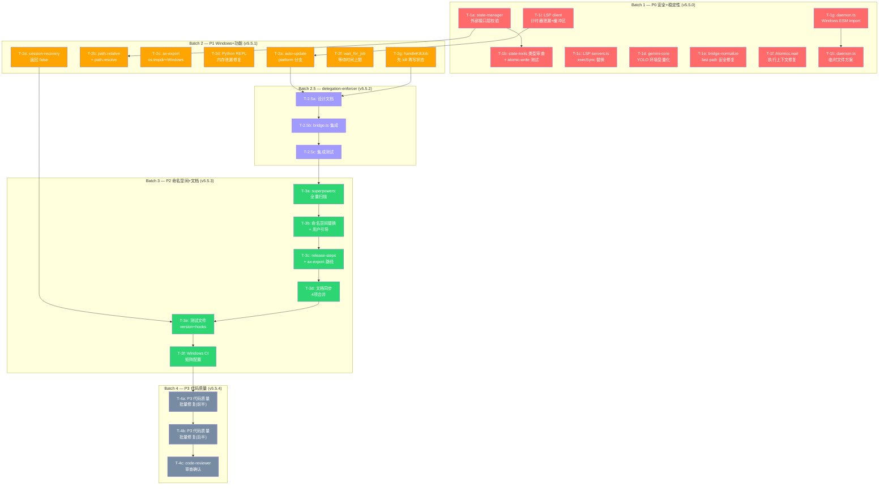

# 任务清单: ultrapower 项目全面痛点修复计划

**来源 PRD：** `.omc/axiom/rough_prd_pain_points.md`
**生成时间：** 2026-03-01
**生成者：** axiom-system-architect
**总任务数：** 28 个原子任务（Batch 1: 9, Batch 2: 7, Batch 2.5: 3, Batch 3: 6, Batch 4: 3）
**发布策略：** v5.5.0 -> v5.5.1 -> v5.5.2 -> v5.5.3 -> v5.5.4

---

## 1. 架构图（全局上下文）

---

## 2. 任务列表（DAG）

> 顺序表示执行优先级和依赖关系。红色 = P0 安全，橙色 = P1 功能，紫色 = P1 高复杂度，绿色 = P2 文档，灰色 = P3 质量。

---

### Batch 1: P0 安全 + 稳定性 (v5.5.0) — ✅ 全部完成 (2026-03-02，CI 4790/0)

- [x] **T-1a: state-manager 外部接口层路径遍历防护**
  - Sub-PRD: `.omc/axiom/sub_prd_pp_T1a.md`
  - 上下文: 在 state_read/state_write tool handler 入口添加 assertValidMode() 校验，防止路径遍历攻击。仅修改外部接口层，不改 getStatePath() 签名
  - 目标文件: `src/tools/state-tools.ts`, `src/lib/validateMode.ts`
  - 估计工时: 3h
  - 依赖: None
  - 验收条件:
    - [ ] state_read/state_write 入口对 mode 参数执行 assertValidMode() 白名单校验
    - [ ] 非法 mode 值（如 `../../etc/passwd`）返回明确错误
    - [ ] 新增至少 2 个路径遍历防护回归测试
    - [ ] 现有 state-manager 测试全部通过

- [x] **T-1b: state-tools 类型审查 + atomic-write 测试**
  - Sub-PRD: `.omc/axiom/sub_prd_pp_T1b.md`
  - 上下文: 审查 StateToolMode 类型覆盖范围，新建 atomic-write.test.ts 测试文件，覆盖 6+ 场景（正常写入、无权限、原子性、并发、大文件、特殊字符路径）
  - 目标文件: `src/tools/state-tools.ts`, `src/lib/__tests__/atomic-write.test.ts`(CREATE)
  - 估计工时: 5h
  - 依赖: T-1a
  - 验收条件:
    - [ ] StateToolMode 类型联合覆盖所有合法 mode 值
    - [ ] atomic-write.test.ts 包含至少 6 个测试场景
    - [ ] 全部测试通过

- [x] **T-1c: LSP servers.ts Shell 注入修复**
  - Sub-PRD: `.omc/axiom/sub_prd_pp_T1c.md`
  - 上下文: execSync 拼接命令字符串存在 shell 注入风险，改用 execFileSync。补充分析 command 参数来源（静态列表 vs 用户配置）
  - 目标文件: `src/tools/lsp/servers.ts`
  - 估计工时: 3h
  - 依赖: None
  - 验收条件:
    - [ ] 所有 execSync 命令拼接替换为 execFileSync
    - [ ] command 参数来源分析文档化（代码注释）
    - [ ] Windows/macOS/Linux 三平台 which/where 分支覆盖
    - [ ] 现有 LSP 测试全部通过

- [x] **T-1d: gemini-core YOLO 环境变量化**
  - Sub-PRD: `.omc/axiom/sub_prd_pp_T1d.md`
  - 上下文: --yolo 硬编码改为 OMC_GEMINI_YOLO 环境变量控制，默认 true（维持现有行为）。两处修改：gemini-core.ts 和 mcp-team-bridge.ts
  - 目标文件: `src/mcp/gemini-core.ts`, `src/team/mcp-team-bridge.ts`
  - 估计工时: 2h
  - 依赖: None
  - 验收条件:
    - [ ] OMC_GEMINI_YOLO=true 时行为不变（--yolo 传入）
    - [ ] OMC_GEMINI_YOLO=false 时不传 --yolo
    - [ ] 未设置环境变量时默认 true
    - [ ] 新增单元测试验证三种状态

- [x] **T-1e: bridge-normalize fast path 安全修复**
  - Sub-PRD: `.omc/axiom/sub_prd_pp_T1e.md`
  - 上下文: isAlreadyCamelCase() 快速路径跳过 Zod 验证，攻击者可构造恶意输入绕过白名单。修复方案：SENSITIVE_HOOKS 类型禁用 fast path，或 fast path 输出经 KNOWN_FIELDS 过滤
  - 目标文件: `src/hooks/bridge-normalize.ts`
  - 估计工时: 4h
  - 依赖: None
  - 验收条件:
    - [ ] SENSITIVE_HOOKS 类型（permission-request, setup, session-end）不走 fast path
    - [ ] 新增回归测试：恶意 camelCase 输入不绕过验证
    - [ ] 非敏感 hook 的 fast path 性能不退化
    - [ ] 现有 bridge-normalize 测试全部通过

- [x] **T-1f: Atomics.wait 主线程执行上下文修复**
  - Sub-PRD: `.omc/axiom/sub_prd_pp_T1f.md`
  - 上下文: Atomics.wait() 在主线程调用会抛 TypeError 导致 hook bridge 崩溃。两处修改：subagent-tracker 和 session-registry。需先验证执行上下文
  - 目标文件: `src/hooks/subagent-tracker/index.ts`, `src/notifications/session-registry.ts`
  - 估计工时: 4h
  - 依赖: None
  - 验收条件:
    - [ ] 主线程环境下使用 setTimeout 异步等待替代 Atomics.wait
    - [ ] Worker 线程环境保持 Atomics.wait（标注为安全）
    - [ ] 新增测试验证两种执行上下文
    - [ ] hook bridge 不再因 TypeError 崩溃

- [x] **T-1g: daemon.ts Windows ESM import URL 修复**
  - Sub-PRD: `.omc/axiom/sub_prd_pp_T1g.md`
  - 上下文: Windows 路径格式 C:\Users\... 在 ESM import() 中失败。使用 pathToFileURL(modulePath).href 构建合法 file URL。需 POC 验证通过后全量实施
  - 目标文件: `src/features/rate-limit-wait/daemon.ts`
  - 估计工时: 4h
  - 依赖: None (POC 为前置条件，非任务依赖)
  - 验收条件:
    - [ ] Windows 路径正确转换为 file:///C:/Users/... 格式
    - [ ] POC 在 Windows 11 真实环境验证通过
    - [ ] 打包产物（dist/）上同步验证
    - [ ] macOS/Linux 行为不退化

- [x] **T-1h: daemon.ts 临时文件方案替代代码注入**
  - Sub-PRD: `.omc/axiom/sub_prd_pp_T1h.md`
  - 上下文: config 通过 JSON.stringify 注入 JS 代码字符串，改为写入 os.tmpdir() 随机临时文件，通过环境变量传路径，子进程读取后删除。需 POC 验证通过后全量实施
  - 目标文件: `src/features/rate-limit-wait/daemon.ts`
  - 估计工时: 5h
  - 依赖: T-1g (串行：共同修改子进程通信路径)
  - 验收条件:
    - [ ] config 不再通过代码字符串注入
    - [ ] 临时文件命名含 UUID，路径通过环境变量传递
    - [ ] 子进程启动后立即删除临时文件
    - [ ] fire-and-forget daemon 设计不被破坏
    - [ ] POC 验证通过

- [x] **T-1i: LSP client 计时器泄漏 + 缓冲区上限**
  - Sub-PRD: `.omc/axiom/sub_prd_pp_T1i.md`
  - 上下文: P1-6 disconnect 不清理 setTimeout 和 P1-7 缓冲区无上限合并为一个任务。虽为 P1 但属资源安全类，提前至 Batch 1
  - 目标文件: `src/tools/lsp/client.ts`
  - 估计工时: 3h
  - 依赖: None
  - 验收条件:
    - [ ] disconnect() 遍历 Map 调用 clearTimeout 后再 clear()
    - [ ] 缓冲区添加 64MB 上限，超出时断开连接并输出警告
    - [ ] 新增测试验证清理逻辑
    - [ ] 现有 LSP 测试全部通过

---

### Batch 2: P1 Windows + 功能 (v5.5.1) — ✅ 全部完成 (2026-03-02，CI 4790/0)

- [x] **T-2a: auto-update.ts Windows platform 分支**
  - Sub-PRD: `.omc/axiom/sub_prd_pp_T2a.md`
  - 上下文: which/where 命令按 process.platform 分支调用，统一 .trim() 处理
  - 目标文件: `src/features/auto-update.ts`
  - 估计工时: 2h
  - 依赖: None (Batch 2 起始)
  - 验收条件:
    - [ ] Windows 使用 where，macOS/Linux 使用 which
    - [ ] 返回值统一 .trim() 处理
    - [ ] Windows 11 端到端验证通过

- [x] **T-2b: subagent-tracker + pre-tool 路径处理修复**
  - Sub-PRD: `.omc/axiom/sub_prd_pp_T2b.md`
  - 上下文: P1-2 路径替换改用 path.relative()，P1-3 路径安全检查添加 path.resolve() 规范化。合并为一个任务（均为路径处理修复）
  - 目标文件: `src/hooks/subagent-tracker/index.ts`, `src/hooks/guards/pre-tool.ts`
  - 估计工时: 3h
  - 依赖: None
  - 验收条件:
    - [ ] subagent-tracker 使用 path.relative() 替代字符串 replace
    - [ ] pre-tool 路径比较前先经 path.resolve() 规范化
    - [ ] Windows 反斜杠路径正确处理

- [x] **T-2c: ax-export os.tmpdir + Windows 提示**
  - Sub-PRD: `.omc/axiom/sub_prd_pp_T2c.md`
  - 上下文: SKILL.md 中 /tmp 路径改为 os.tmpdir()，Windows 用户提供 PowerShell Compress-Archive 替代方案和平台提示
  - 目标文件: `skills/ax-export/SKILL.md`
  - 估计工时: 2h
  - 依赖: None
  - 验收条件:
    - [ ] 临时路径使用 os.tmpdir() 替代硬编码 /tmp
    - [ ] Windows 平台输出提示文案
    - [ ] PowerShell Compress-Archive 命令正确

- [x] **T-2d: Python REPL executionCounters 内存泄漏修复**
  - Sub-PRD: `.omc/axiom/sub_prd_pp_T2d.md`
  - 上下文: handleReset/killBridgeWithEscalation 成功后未清理 executionCounters Map 条目，导致 session 累积时内存泄漏
  - 目标文件: `src/tools/python-repl/tool.ts`
  - 估计工时: 2h
  - 依赖: None
  - 验收条件:
    - [ ] handleReset 成功后调用 executionCounters.delete(sessionId)
    - [ ] killBridgeWithEscalation 成功后同样清理
    - [ ] 新增测试验证清理逻辑

- [x] **T-2e: session-recovery 占位实现修复**
  - Sub-PRD: `.omc/axiom/sub_prd_pp_T2e.md`
  - 上下文: recoverToolResultMissing 函数体为注释占位返回 true，改为返回 false 或抛出"未实现"错误
  - 目标文件: `src/hooks/recovery/session-recovery.ts`
  - 估计工时: 2h
  - 依赖: None
  - 验收条件:
    - [ ] 函数返回 false（明确标识"恢复未实现"）
    - [ ] 调用方正确处理 false 返回值
    - [ ] 添加 TODO 注释标记后续实现计划

- [x] **T-2f: wait_for_job 等待时间上限**
  - Sub-PRD: `.omc/axiom/sub_prd_pp_T2f.md`
  - 上下文: handleWaitForJob 无超时上限可阻塞事件循环，添加单次最长等待时间上限
  - 目标文件: `src/mcp/job-management.ts`
  - 估计工时: 3h
  - 依赖: None
  - 验收条件:
    - [ ] 单次 wait 最长等待时间上限（建议 60s）
    - [ ] 超时后返回 timeout 状态，客户端可重新轮询
    - [ ] 新增超时测试

- [x] **T-2g: handleKillJob 状态写入顺序修复**
  - Sub-PRD: `.omc/axiom/sub_prd_pp_T2g.md`
  - 上下文: 当前先写状态再 kill 进程，顺序颠倒。改为先 process.kill() 成功后再更新状态文件
  - 目标文件: `src/mcp/job-management.ts`
  - 估计工时: 2h
  - 依赖: None
  - 验收条件:
    - [ ] 先 process.kill() 再更新状态文件
    - [ ] kill 失败时状态文件不变
    - [ ] 新增测试验证操作顺序

---

### Batch 2.5: delegation-enforcer 集成 (v5.5.2) — ✅ 全部完成 (2026-03-02，CI 4790/0)

- [x] **T-2.5a: delegation-enforcer 集成设计文档**
  - Sub-PRD: `.omc/axiom/sub_prd_pp_T25a.md`
  - 上下文: 明确集成接口（hook type 范围、modifiedInput 协议、与 processOrchestratorPreTool 的关系），输出设计文档供评审
  - 目标文件: `docs/design/delegation-enforcer-integration.md`(CREATE), `src/features/delegation-enforcer.ts`(REFERENCE)
  - 估计工时: 4h
  - 依赖: Batch 2 全部完成 (bridge.ts 稳定)
  - 验收条件:
    - [ ] 设计文档明确 hook type 范围（pre-tool-use）
    - [ ] 定义 modifiedInput 协议（model 注入位置和格式）
    - [ ] 分析与 processOrchestratorPreTool 的交互
    - [ ] 设计文档经产品评审

- [x] **T-2.5b: bridge.ts processPreToolUse 集成 delegation-enforcer**
  - Sub-PRD: `.omc/axiom/sub_prd_pp_T25b.md`
  - 上下文: 在 bridge.ts 的 processPreToolUse 中实际集成 delegation-enforcer，实现自动 model 注入
  - 目标文件: `src/hooks/bridge.ts`, `src/features/delegation-enforcer.ts`
  - 估计工时: 6h
  - 依赖: T-2.5a
  - 验收条件:
    - [ ] processPreToolUse 中调用 delegation-enforcer
    - [ ] Task/Agent 调用未指定 model 时自动注入默认模型
    - [ ] explore 类型自动注入 haiku，executor 注入 sonnet
    - [ ] 不破坏显式指定 model 的调用

- [x] **T-2.5c: delegation-enforcer 集成测试**
  - Sub-PRD: `.omc/axiom/sub_prd_pp_T25c.md`
  - 上下文: 解除 delegation-enforcer-integration.test.ts 的 skip 标记，验证 model 自动注入行为
  - 目标文件: `src/__tests__/delegation-enforcer-integration.test.ts`
  - 估计工时: 4h
  - 依赖: T-2.5b
  - 验收条件:
    - [ ] 所有 skip 标记解除
    - [ ] explore 类型 Task 无 model 参数时实际使用 haiku
    - [ ] 显式 model 参数不被覆盖
    - [ ] 测试全部通过

---

### Batch 3: P2 命名空间 + 文档 + 测试 (v5.5.3) — ✅ 全部完成 (2026-03-02，CI 4790/0)

- [x] **T-3a: superpowers: 全量扫描**
  - Sub-PRD: `.omc/axiom/sub_prd_pp_T3a.md`
  - 上下文: 在 commands/, skills/, docs/, templates/ 中全量扫描 superpowers: 残留，输出精确文件清单
  - 目标文件: 无修改（扫描输出报告）
  - 估计工时: 2h
  - 依赖: Batch 2.5 完成
  - 验收条件:
    - [ ] grep 扫描覆盖 commands/, skills/, docs/, templates/
    - [ ] 输出残留文件清单（精确到行号）
    - [ ] 若结果为 0，标记 P2-1/P2-2 为关闭

- [x] **T-3b: 命名空间替换 + 用户引导**
  - Sub-PRD: `.omc/axiom/sub_prd_pp_T3b.md`
  - 上下文: 根据 T-3a 扫描结果，将 superpowers: 替换为 ultrapower:。在旧命名空间文档顶部添加废弃声明，hook 层添加友好拦截提示
  - 目标文件: T-3a 输出的文件清单
  - 估计工时: 4h
  - 依赖: T-3a
  - 验收条件:
    - [ ] 全量扫描确认无 superpowers: 残留（除废弃声明注释外）
    - [ ] 旧命名空间文档顶部有废弃声明
    - [ ] 用户调用 superpowers: 前缀时获得迁移提示

- [x] **T-3c: release-steps.mjs + ax-export 路径修复**
  - Sub-PRD: `.omc/axiom/sub_prd_pp_T3c.md`
  - 上下文: P2-3 release-steps.mjs 的 git push main 改为 PR 流程；P2-4 ax-export 引用不存在的 .agent/ 改为实际路径
  - 目标文件: `scripts/release-steps.mjs`, `skills/ax-export/SKILL.md`
  - 估计工时: 3h
  - 依赖: T-3b
  - 验收条件:
    - [ ] release-steps.mjs 使用 PR 流程替代 git push main
    - [ ] ax-export SKILL.md 引用路径全部为实际存在的路径
    - [ ] dryRun 模式验证通过

- [x] **T-3d: 文档同步（4 项合并）**
  - Sub-PRD: `.omc/axiom/sub_prd_pp_T3d.md`
  - 上下文: P2-5 ax-status 路径修复、P2-6 AGENTS.md 版本号同步、P2-7 agent 数量更新、P2-8 bump-version 正则锚点
  - 目标文件: `skills/ax-status/SKILL.md`, `AGENTS.md`, `src/agents/definitions.ts`, `scripts/bump-version.mjs`
  - 估计工时: 3h
  - 依赖: T-3c
  - 验收条件:
    - [ ] ax-status SKILL.md 引用 .omc/axiom/active_context.md
    - [ ] AGENTS.md 版本号 = package.json 版本号
    - [ ] definitions.ts 中 agent 数量与实际一致
    - [ ] bump-version.mjs 正则使用 $ 结尾锚点

- [x] **T-3e: 测试文件新增（version.ts + hooks.ts）**
  - Sub-PRD: `.omc/axiom/sub_prd_pp_T3e.md`
  - 上下文: P2-9 新增 version.test.ts（4+ 场景），P2-10 新增 hooks.test.ts（5+ 场景）
  - 目标文件: `src/lib/__tests__/version.test.ts`(CREATE), `src/installer/__tests__/hooks.test.ts`(CREATE)
  - 估计工时: 5h
  - 依赖: T-3d
  - 验收条件:
    - [ ] version.test.ts 包含至少 4 个场景（正常、跳过当前目录、多层嵌套、找不到）
    - [ ] hooks.test.ts 包含至少 5 个场景
    - [ ] 全部测试通过

- [x] **T-3f: Windows CI 矩阵配置**
  - Sub-PRD: `.omc/axiom/sub_prd_pp_T3f.md`
  - 上下文: 在 GitHub Actions 中配置 windows-latest runner，使 P0-6 等 Windows 相关修复可自动化回归验证
  - 目标文件: `.github/workflows/ci.yml`(MODIFY or CREATE)
  - 估计工时: 4h
  - 依赖: T-3e
  - 验收条件:
    - [ ] CI 矩阵包含 ubuntu-latest + windows-latest
    - [ ] Windows runner 上 npm test 全部通过
    - [ ] P0-6 ESM import 修复在 CI 中自动验证

---

### Batch 4: P3 代码质量 (v5.5.4) — ✅ 全部完成 (2026-03-02，CI 4790/0)

- [x] **T-4a: P3 代码质量批量修复（前半 5 项）**
  - Sub-PRD: `.omc/axiom/sub_prd_pp_T4a.md`
  - 上下文: installer/index.ts atomicWriteJson 替换、safeReadJson 错误区分、rules-injector 遍历深度限制、session-recovery 拼写修复、parseInt 修复
  - 目标文件: `src/installer/index.ts`, `src/lib/atomic-write.ts`(safeReadJson), `src/hooks/recovery/session-recovery.ts`, `src/mcp/codex-core.ts`, `src/mcp/gemini-core.ts`
  - 估计工时: 5h
  - 依赖: Batch 3 完成
  - 验收条件:
    - [ ] 4 处 writeFileSync 替换为 atomicWriteJson
    - [ ] safeReadJson 区分文件不存在和文件损坏
    - [ ] rules-injector 有最大遍历深度
    - [ ] "preceeding" 修正为 "preceding"
    - [ ] parseInt 逻辑修复

- [x] **T-4b: P3 代码质量批量修复（后半 4 项）**
  - Sub-PRD: `.omc/axiom/sub_prd_pp_T4b.md`
  - 上下文: prompt-persistence generatePromptId 扩展、notepads-tools catch 统一、skills-tools 动态计算、Gemini 4MB 上限
  - 目标文件: `src/mcp/prompt-persistence.ts`, `src/tools/notepads-tools.ts`(如有), `src/skills/skills-tools.ts`(如有), `src/mcp/gemini-core.ts`
  - 估计工时: 4h
  - 依赖: T-4a
  - 验收条件:
    - [ ] generatePromptId 从 4 字节扩展到 8 字节
    - [ ] catch 块统一返回 isError: true
    - [ ] ALLOWED_BOUNDARIES 改为动态计算
    - [ ] executeGemini 添加 4MB prompt 上限

- [x] **T-4c: code-reviewer 审查确认**
  - Sub-PRD: `.omc/axiom/sub_prd_pp_T4c.md`
  - 上下文: Batch 4 全部代码变更经 code-reviewer 审查后合并
  - 目标文件: 无（审查任务）
  - 估计工时: 3h
  - 依赖: T-4b
  - 验收条件:
    - [ ] code-reviewer 审查通过
    - [ ] 无反模式或代码异味
    - [ ] 所有测试通过

---

## 3. Sub-PRD 摘要索引

| Sub-PRD | 对应任务 | 核心内容 | 状态 |
|---------|---------|---------|------|
| `sub_prd_pp_T1a.md` | T-1a | state-manager 路径遍历防护 - assertValidMode 外部接口层 | ✅ DONE |
| `sub_prd_pp_T1b.md` | T-1b | state-tools 类型审查 + atomic-write 6 场景测试 | ✅ DONE |
| `sub_prd_pp_T1c.md` | T-1c | LSP servers.ts execFileSync 替换 + command 来源分析 | ✅ DONE |
| `sub_prd_pp_T1d.md` | T-1d | OMC_GEMINI_YOLO 环境变量（默认 true）两处修改 | ✅ DONE |
| `sub_prd_pp_T1e.md` | T-1e | bridge-normalize SENSITIVE_HOOKS fast path 禁用 | ✅ DONE |
| `sub_prd_pp_T1f.md` | T-1f | Atomics.wait 主线程检测 + setTimeout 降级 | ✅ DONE |
| `sub_prd_pp_T1g.md` | T-1g | daemon.ts pathToFileURL Windows ESM 修复 | ✅ DONE |
| `sub_prd_pp_T1h.md` | T-1h | daemon.ts 临时文件方案替代 JSON.stringify 注入 | ✅ DONE |
| `sub_prd_pp_T1i.md` | T-1i | LSP client clearTimeout + 64MB 缓冲区上限 | ✅ DONE |
| `sub_prd_pp_T2a.md` | T-2a | auto-update which/where platform 分支 | ✅ DONE |
| `sub_prd_pp_T2b.md` | T-2b | path.relative + path.resolve 路径处理 | ✅ DONE |
| `sub_prd_pp_T2c.md` | T-2c | ax-export os.tmpdir + Windows PowerShell 提示 | ✅ DONE |
| `sub_prd_pp_T2d.md` | T-2d | executionCounters.delete(sessionId) 内存泄漏修复 | ✅ DONE |
| `sub_prd_pp_T2e.md` | T-2e | recoverToolResultMissing 返回 false | ✅ DONE |
| `sub_prd_pp_T2f.md` | T-2f | handleWaitForJob 60s 超时上限 | ✅ DONE |
| `sub_prd_pp_T2g.md` | T-2g | handleKillJob 先 kill 再写状态 | ✅ DONE |
| `sub_prd_pp_T25a.md` | T-2.5a | delegation-enforcer 集成设计文档 | ✅ DONE |
| `sub_prd_pp_T25b.md` | T-2.5b | bridge.ts processPreToolUse 集成实现 | ✅ DONE |
| `sub_prd_pp_T25c.md` | T-2.5c | 集成测试解除 skip + model 注入验证 | ✅ DONE |
| `sub_prd_pp_T3a.md` | T-3a | superpowers: 全量扫描报告 | ✅ DONE |
| `sub_prd_pp_T3b.md` | T-3b | 命名空间替换 + 废弃声明 + 拦截提示 | ✅ DONE |
| `sub_prd_pp_T3c.md` | T-3c | release-steps PR 流程 + ax-export 路径 | ✅ DONE |
| `sub_prd_pp_T3d.md` | T-3d | 4 项文档同步合并任务 | ✅ DONE |
| `sub_prd_pp_T3e.md` | T-3e | version.test.ts + hooks.test.ts 新增 | ✅ DONE |
| `sub_prd_pp_T3f.md` | T-3f | GitHub Actions windows-latest CI 矩阵 | ✅ DONE |
| `sub_prd_pp_T4a.md` | T-4a | P3 前半 5 项批量修复 | ✅ DONE |
| `sub_prd_pp_T4b.md` | T-4b | P3 后半 4 项批量修复 | ✅ DONE |
| `sub_prd_pp_T4c.md` | T-4c | code-reviewer 最终审查 | ✅ DONE |

---

## 4. CI Gate 清单

| Batch | Gate 内容 | 阻断条件 |
|-------|----------|---------|
| Batch 1 | `tsc --noEmit && npm run build && npm test` + 安全验证 P0-8/P0-9 + Windows 验证 P0-6/P0-7 | 任一测试失败 |
| Batch 2 | `tsc --noEmit && npm run build && npm test` + Windows 11 端到端 (auto-update, ax-export) | Windows 验证失败 |
| Batch 2.5 | 设计文档评审 + 集成测试通过 + 成本日志验证 | 设计文档未评审 |
| Batch 3 | `tsc --noEmit && npm run build && npm test` + grep 确认无 superpowers: 残留 | 残留未清零 |
| Batch 4 | `npm test` + code-reviewer 审查通过 | 审查未通过 |

---

## 5. 验收标准（全局）

1. **零回归：** npm test 当前测试基线全部通过
2. **P0 回归测试：** 每个 P0 修复新增至少 1 个回归测试
3. **安全门禁：** P0-8/P0-9 修复经安全评审确认
4. **Windows 测试：** P1-1/P1-2/P1-3/P1-4 在 Windows 11 真实环境验证
5. **Windows CI：** Batch 3 后配置 windows-latest runner
6. **测试新增：** atomic-write(6+), version.ts(4+), hooks(5+)
7. **命名空间：** 全量扫描无 superpowers: 残留
8. **文档同步：** AGENTS.md 版本号 = package.json 版本号
9. **delegation-enforcer：** explore 无 model 时实际使用 haiku
10. **用户可见性：** P1-4, P2-1/P2-2 有用户可感知提示文案
