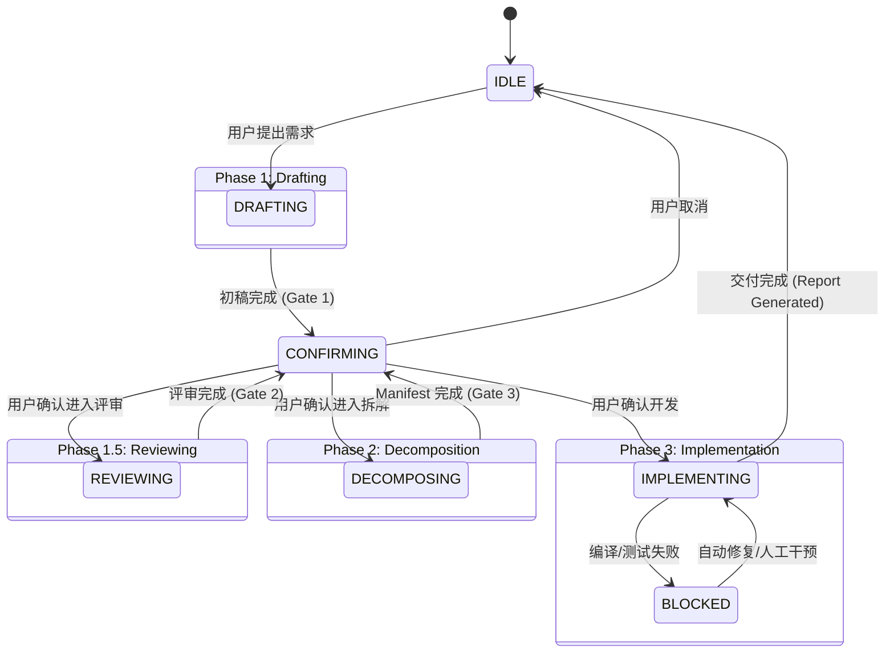

# Agent State Machine (v4.2 Manifest Driven)

本文件定义 Agent 的完整生命周期状态及其转换规则，严格对齐 v4.2 四阶段流水线。

## 1. 状态定义 (States)

| 状态 | 代码 | 对应阶段 | 描述 |
|-----|------|---------|-----|
| **空闲** | `IDLE` | - | 无活跃任务，等待用户输入 |
| **起草中** | `DRAFTING` | Phase 1 | 正在澄清需求或生成 PRD 初稿 |
| **评审中** | `REVIEWING` | Phase 1.5 | 专家评审团并行工作或正在仲裁 |
| **待确认** | `CONFIRMING` | Gates | 等待用户通过门禁 (Draft/Review/Manifest) |
| **拆解中** | `DECOMPOSING` | Phase 2 | 正在生成 Manifest 或串行撰写 Sub-PRDs |
| **开发中** | `IMPLEMENTING` | Phase 3 | 正在基于 Manifest 并行开发或编译 |
| **阻塞** | `BLOCKED` | - | 熔断/错误/门禁拒绝，需要人工介入 |

## 2. 状态转换规则 (Transitions)



## 3. 转换触发器 (Triggers)

| 触发器 | 源状态 | 目标状态 | 触发条件 |
|-------|-------|---------|---------|
| `START_DRAFT` | IDLE | DRAFTING | `/draft` 或 自然语言需求 |
| `DRAFT_DONE` | DRAFTING | CONFIRMING | 初稿生成完毕，等待 Review |
| `START_REVIEW` | CONFIRMING | REVIEWING | `/review` 或 用户确认 Review |
| `REVIEW_DONE` | REVIEWING | CONFIRMING | 评审汇总完毕，等待 Decompose |
| `START_DECOMPOSE` | CONFIRMING | DECOMPOSING | `/decompose` 或 用户确认 Manifest |
| `MANIFEST_DONE` | DECOMPOSING | CONFIRMING | 拆解完毕，等待 Implement |
| `START_IMPLEMENT` | CONFIRMING | IMPLEMENTING | `/feature-flow` 或 用户确认开发 |
| `COMPILATION_FAIL`| IMPLEMENTING | BLOCKED | 编译门禁失败 |
| `ALL_DONE` | IMPLEMENTING | IDLE | 研发报告生成完毕 |

## 4. 状态持久化

当前状态存储在 `active_context.md` 的 YAML Frontmatter 中：

```yaml
---
session_id: "..."
task_status: DRAFTING
current_phase: "Phase 1"
last_gate: "Gate 1 Pass"
---
```
