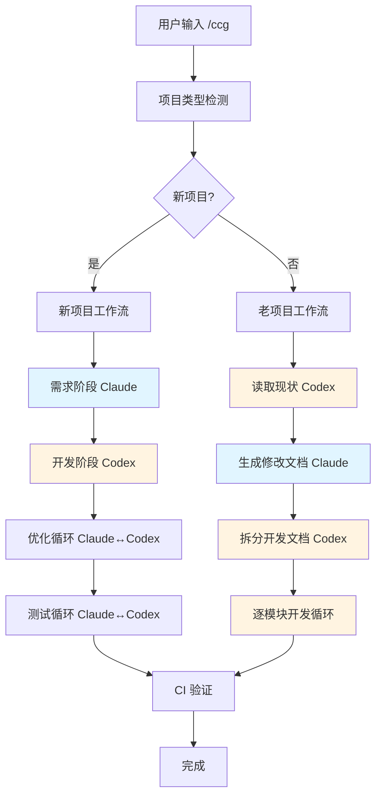

# 系统架构设计：Claude-Codex 协作工作流

## 1. 组件划分

### 1.1 入口层

* **Skill 入口**: `/ccg` 命令

* **职责**: 工作流路由、项目类型检测、用户交互

### 1.2 文档管理层

* **模板系统**: 7 种文档模板

* **路径管理**: 白名单校验、安全路径生成

* **版本控制**: 文档历史追踪

### 1.3 协调层

* **工作流引擎**: 新项目/老项目流程路由

* **循环控制器**: 优化循环（5 轮）、测试循环（10 次）

* **模型调度**: Claude ↔ Codex 切换逻辑

### 1.4 执行层

* **代码生成**: Codex 执行器

* **代码评审**: Claude 评审器

* **CI 验证**: 编译检查、测试执行

## 2. 模块依赖图



## 3. 技术栈

### 3.1 核心技术

* **语言**: TypeScript

* **MCP 工具**: `ask_codex`, `ask_gemini`

* **文件系统**: Node.js fs/promises

* **状态管理**: `.omc/axiom/active_context.md`

### 3.2 安全机制

* **路径校验**: 白名单 + `assertValidMode()`

* **输入消毒**: `bridge-normalize.ts`

* **权限控制**: 文档目录隔离

## 4. 数据流

```
用户需求
  → requirements.md (Claude)
  → tech-design.md (Claude)
  → 代码实现 (Codex)
  → feature-flow.md (Codex)
  → optimization-list.md (Claude)
  → 代码优化 (Codex)
  → test-checklist.md (Claude)
  → 测试报告 (Codex)
  → CI 验证
  → 完成
```

## 5. 关键设计决策

### 5.1 为什么双模型？

* **Claude**: 擅长需求理解、架构设计、代码评审

* **Codex**: 擅长代码生成、文档输出、测试执行

### 5.2 为什么周期化开发？

* 避免一次性生成大量代码导致质量失控

* 每周期输出变更摘要，便于追踪和回滚

### 5.3 为什么模块化改造？

* 老项目复杂度高，全量修改风险大

* 逐模块闭环保证每个模块质量后再进入下一个

## 6. 扩展性设计

### 6.1 支持新文档类型

```typescript
// 在 ALLOWED_DOC_TYPES 添加新类型
const ALLOWED_DOC_TYPES = [
  'requirements', 'tech-design', 'feature-flow',
  'modification-plan', 'optimization-list', 'test-checklist',
  'new-doc-type' // 新增
];
```

### 6.2 支持新工作流

```typescript
// 在 WorkflowRouter 添加新路由
class WorkflowRouter {
  route(projectType: string) {
    switch(projectType) {
      case 'new': return new NewProjectWorkflow();
      case 'old': return new OldProjectWorkflow();
      case 'custom': return new CustomWorkflow(); // 新增
    }
  }
}
```
