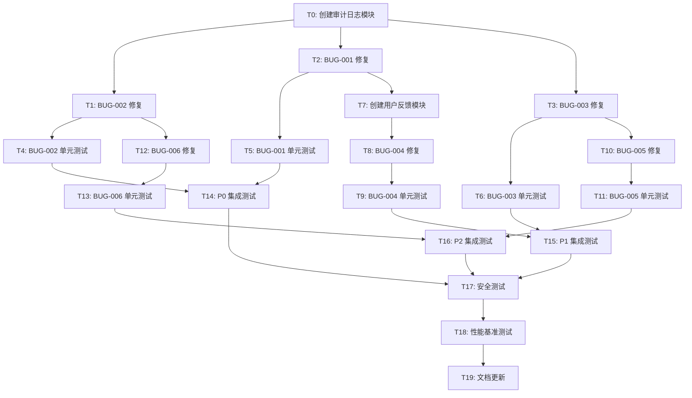

# 原子任务 DAG

**基于**: Rough PRD v1.0 + Architecture
**生成时间**: 2026-03-15T03:48:30Z

## 任务依赖图



## 并行执行分组

### 阶段 0: 基础设施（串行）
- **T0**: 创建审计日志模块

### 阶段 1: P0 修复（并行）
- **T1**: BUG-002 修复（依赖 T0）
- **T2**: BUG-001 修复（依赖 T0）

### 阶段 2: P1 修复（并行）
- **T3**: BUG-003 修复（依赖 T0）
- **T7**: 创建用户反馈模块（依赖 T2）

### 阶段 3: P0 测试（并行）
- **T4**: BUG-002 单元测试（依赖 T1）
- **T5**: BUG-001 单元测试（依赖 T2）

### 阶段 4: P1/P2 修复（并行）
- **T8**: BUG-004 修复（依赖 T7）
- **T10**: BUG-005 修复（依赖 T3）
- **T12**: BUG-006 修复（依赖 T1）

### 阶段 5: P1/P2 测试（并行）
- **T6**: BUG-003 单元测试（依赖 T3）
- **T9**: BUG-004 单元测试（依赖 T8）
- **T11**: BUG-005 单元测试（依赖 T10）
- **T13**: BUG-006 单元测试（依赖 T12）

### 阶段 6: 集成测试（串行）
- **T14**: P0 集成测试（依赖 T4, T5）
- **T15**: P1 集成测试（依赖 T6, T9）
- **T16**: P2 集成测试（依赖 T11, T13）

### 阶段 7: 验证（串行）
- **T17**: 安全测试（依赖 T14, T15, T16）
- **T18**: 性能基准测试（依赖 T17）
- **T19**: 文档更新（依赖 T18）

## 关键路径

```
T0 → T2 → T7 → T8 → T9 → T15 → T17 → T18 → T19
```

**关键路径长度**: 9 个任务
**预计总时长**: 6 人天（开发）+ 2.5 人天（测试）= 8.5 人天
