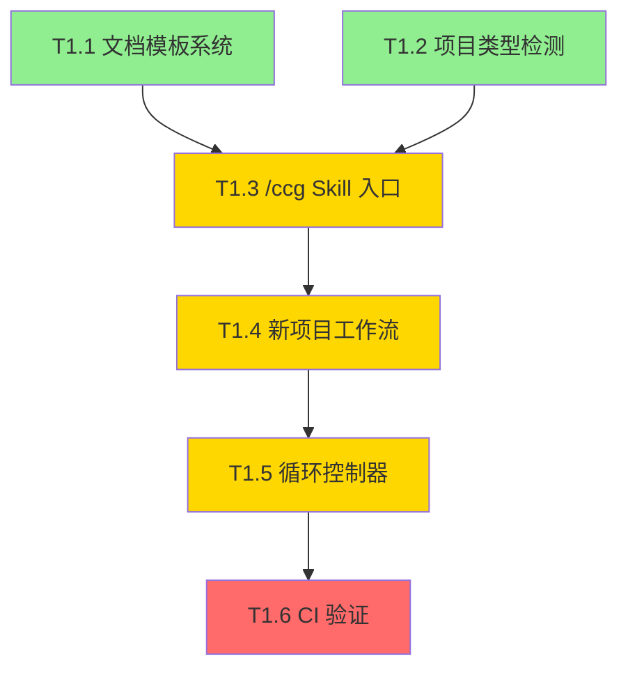
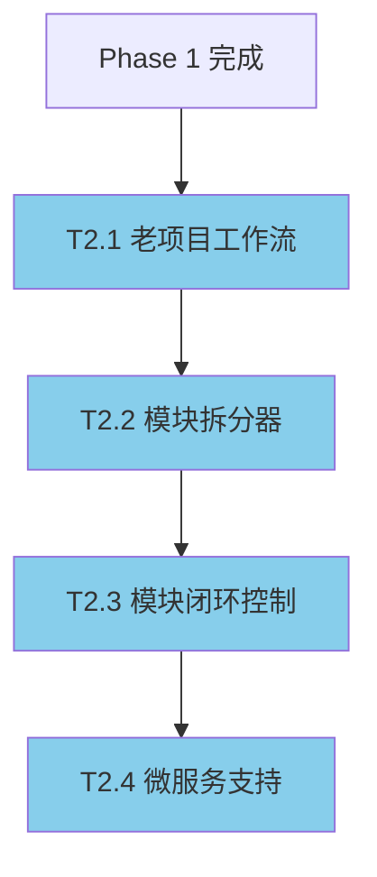
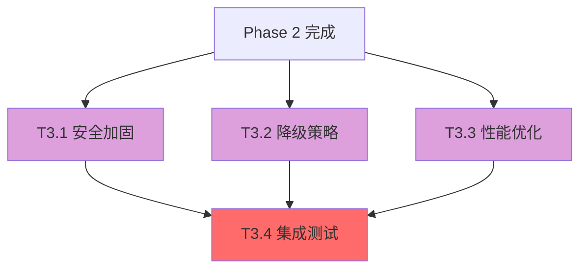
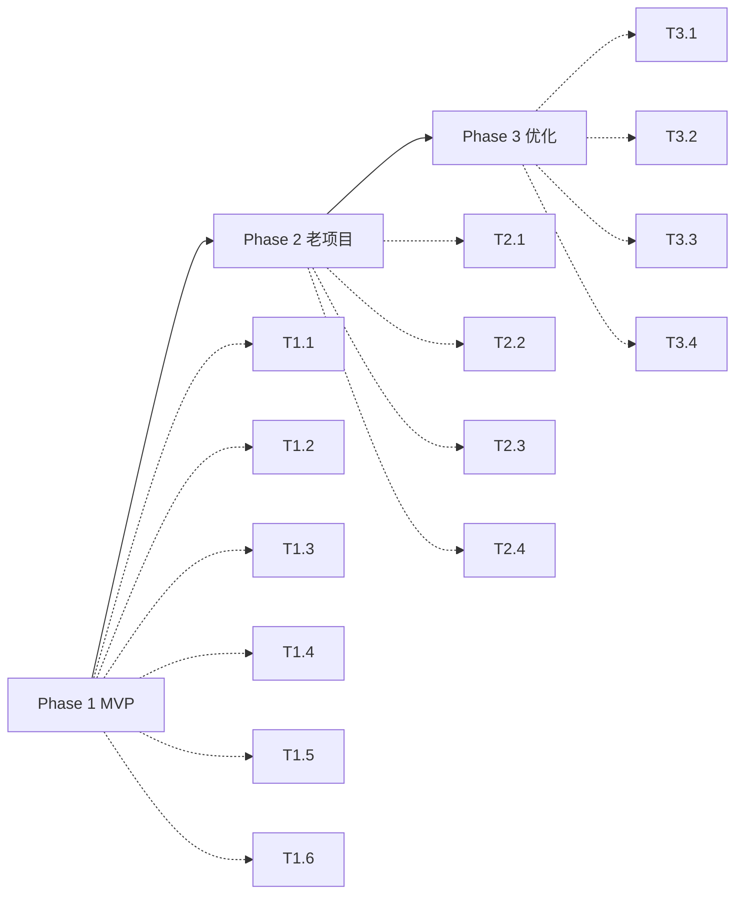

# 任务依赖图（DAG）

## Phase 1: MVP 核心流程（Week 1-2）⭐

### 并行任务组 A（无依赖）

```
T1.1 [文档模板系统]
T1.2 [项目类型检测器]
```

### 串行任务链 B（依赖 A）

```
T1.1 + T1.2 → T1.3 [/ccg Skill 入口]
              ↓
            T1.4 [新项目工作流引擎]
              ↓
            T1.5 [循环控制器]
              ↓
            T1.6 [CI 验证集成]
```

### Mermaid 可视化



**关键路径**: T1.1/T1.2 → T1.3 → T1.4 → T1.5 → T1.6（预计 12-16 小时）

---

## Phase 2: 老项目流程（Week 3-6）

### 串行任务链 C（依赖 Phase 1）

```
T1.6 → T2.1 [老项目工作流引擎]
       ↓
     T2.2 [模块拆分器]
       ↓
     T2.3 [模块闭环控制器]
       ↓
     T2.4 [微服务支持]
```

### Mermaid 可视化



---

## Phase 3: 安全与优化（Week 7-10）

### 并行任务组 D（依赖 Phase 2）

```
T2.4 → T3.1 [安全加固]
    → T3.2 [降级策略]
    → T3.3 [性能优化]
      ↓
    T3.4 [集成测试]
```

### Mermaid 可视化



---

## 全局依赖关系总览



---

## 并行度分析

| Phase | 可并行任务 | 串行任务 | 预计工期 |
| ------- | ----------- | --------- | --------- |
| Phase 1 | T1.1, T1.2 | T1.3→T1.4→T1.5→T1.6 | 12-16h |
| Phase 2 | 无 | T2.1→T2.2→T2.3→T2.4 | 20-24h |
| Phase 3 | T3.1, T3.2, T3.3 | T3.4 | 8-12h |

**总预计工期**: 40-52 小时（5-7 个工作日）
