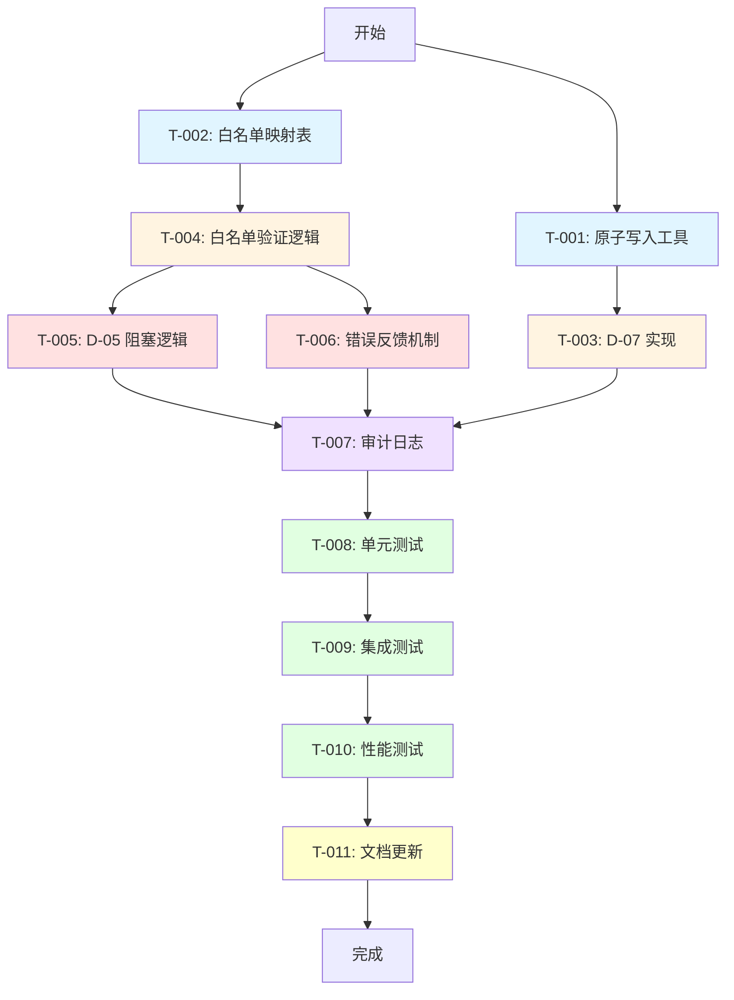

# 任务 DAG: Hook 系统安全加固 v6.0.0

## 1. 架构图（全局上下文）



## 2. 关键路径

**主路径 (7 天):**
```
T002 → T004 → T005 → T007 → T008 → T009 → T010 → T011
```

**并行路径:**
- T001 → T003 (可与 T002-T006 并行)
- T006 (可与 T005 并行)

## 3. 阶段划分

### Phase 1: 基础设施 (Day 1)
- T-001: 原子写入工具
- T-002: 白名单映射表

### Phase 2: 核心实现 (Day 2-4)
- T-003: D-07 实现
- T-004: 白名单验证逻辑
- T-005: D-05 阻塞逻辑
- T-006: 错误反馈机制

### Phase 3: 监控与日志 (Day 5)
- T-007: 审计日志

### Phase 4: 测试验证 (Day 6)
- T-008: 单元测试
- T-009: 集成测试
- T-010: 性能测试

### Phase 5: 文档交付 (Day 7)
- T-011: 文档更新

## 4. 风险节点

| 任务 | 风险 | 缓解措施 |
|------|------|---------|
| T-005 | 破坏现有工作流 | 完整回归测试 |
| T-004 | 白名单定义不完整 | CI 门禁验证 |
| T-010 | 性能退化 | 基准测试对比 |
