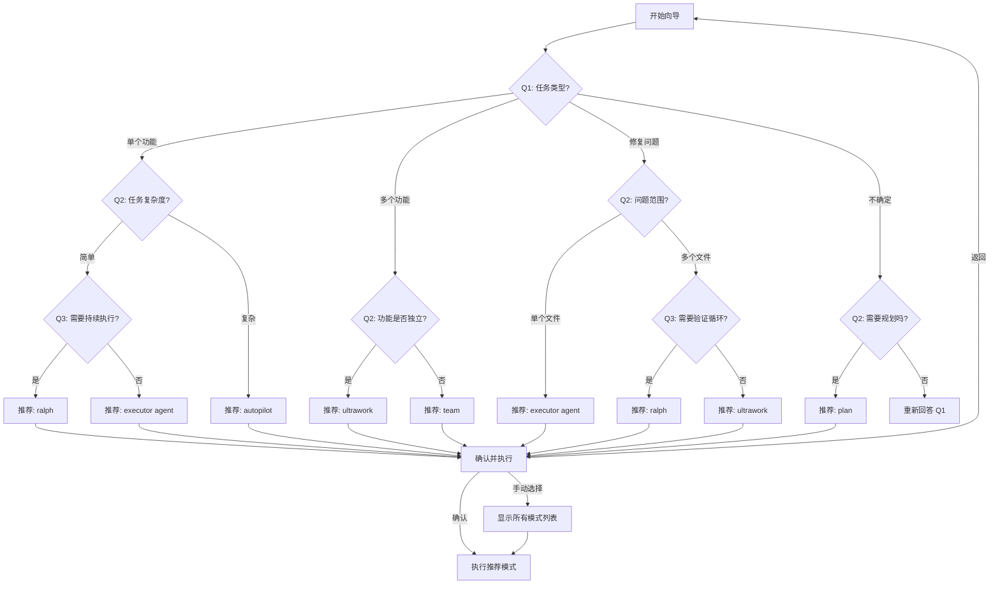

# 交互式向导 UI 设计

**版本**: v1.0
**日期**: 2026-03-03
**目标**: 帮助新用户在 2 分钟内选择合适的执行模式

---

## 核心设计原则

1. **简洁**: 3 个问题，每个 ≤ 4 个选项
2. **快速**: 完成时间 < 2 分钟
3. **智能**: 覆盖 80% 使用场景
4. **友好**: 清晰的描述和示例

---

## 向导流程图



---

## 问题设计

### Q1: 你想做什么？

**目的**: 识别任务类型

**选项**:
1. **实现单个功能**
   - 描述: 添加一个新功能或改进现有功能
   - 示例: "添加用户登录"、"优化搜索性能"

1. **实现多个功能**
   - 描述: 同时开发多个独立或相关的功能
   - 示例: "构建完整的用户系统"、"重构整个模块"

1. **修复问题**
   - 描述: 修复 bug、错误或测试失败
   - 示例: "修复登录失败"、"解决类型错误"

1. **不确定，需要探索**
   - 描述: 还不清楚具体要做什么，需要先分析
   - 示例: "优化性能"、"改进架构"

---

### Q2: 分支问题（根据 Q1 答案）

#### Q2A: 任务复杂度？（当 Q1 = 单个功能）

**选项**:
1. **简单** - 修改 1-3 个文件，逻辑清晰
2. **复杂** - 涉及多个模块，需要架构设计

#### Q2B: 功能是否独立？（当 Q1 = 多个功能）

**选项**:
1. **是** - 功能之间没有依赖，可以并行开发
2. **否** - 功能之间有依赖关系，需要协调

#### Q2C: 问题范围？（当 Q1 = 修复问题）

**选项**:
1. **单个文件** - 问题定位明确，影响范围小
2. **多个文件** - 问题涉及多个模块或不确定位置

#### Q2D: 需要规划吗？（当 Q1 = 不确定）

**选项**:
1. **是** - 需要先分析和制定计划
2. **否** - 直接开始探索

---

### Q3: 细化问题（根据 Q2 答案）

#### Q3A: 需要持续执行直到完成？（当 Q2A = 简单）

**选项**:
1. **是** - 不停止直到任务完全完成并验证通过
2. **否** - 完成基本实现即可

#### Q3C: 需要验证循环？（当 Q2C = 多个文件）

**选项**:
1. **是** - 修复后需要反复测试验证
2. **否** - 修复一次即可

---

## 推荐逻辑映射表

| Q1 答案 | Q2 答案 | Q3 答案 | 推荐模式 | 理由 |
| --------- | --------- | --------- | ---------- | ------ |
| 单个功能 | 简单 | 否 | `executor` | 直接实现，无需编排 |
| 单个功能 | 简单 | 是 | `ralph` | 持续执行直到验证通过 |
| 单个功能 | 复杂 | - | `autopilot` | 自主规划和实现 |
| 多个功能 | 独立 | - | `ultrawork` | 最大并行度 |
| 多个功能 | 不独立 | - | `team` | 协调式团队执行 |
| 修复问题 | 单文件 | - | `executor` | 直接修复 |
| 修复问题 | 多文件 | 否 | `ultrawork` | 并行定位和修复 |
| 修复问题 | 多文件 | 是 | `ralph` | 持续修复直到通过 |
| 不确定 | 需要规划 | - | `plan` | 先制定计划 |
| 不确定 | 不需要 | - | 重新回答 Q1 | 引导用户明确需求 |

---

## 输出格式

### 推荐结果展示

```
✨ 根据你的回答，我推荐使用: ralph

📋 Ralph 模式说明:
持续执行直到任务完成并通过验证。适合需要反复迭代的任务。

🎯 使用方式:
/ralph "你的任务描述"

💡 示例:
/ralph "添加用户登录功能并确保所有测试通过"

❓ 选择:
1. 确认并执行
2. 返回重新选择
3. 查看所有模式
```

---

## 错误处理

### 场景 1: 用户输入无效

* **处理**: 显示错误提示，重新显示当前问题

* **提示**: "请输入 1-4 之间的数字"

### 场景 2: 用户想退出

* **处理**: 确认后退出向导

* **提示**: "确定要退出向导吗？(y/n)"

### 场景 3: 用户想返回上一步

* **处理**: 返回上一个问题，保留之前的答案

* **快捷键**: 输入 "b" 或 "back"

---

## 可访问性

1. **键盘导航**: 支持数字键快速选择
2. **清晰标识**: 每个选项有明确的编号
3. **进度指示**: 显示当前步骤 (1/3, 2/3, 3/3)
4. **帮助信息**: 每个问题提供 "?" 查看详细说明

---

## 性能要求

* 问题加载时间: < 100ms

* 选项切换响应: < 50ms

* 总完成时间: < 2 分钟（用户操作时间）

---

## 未来扩展

1. **学习用户偏好**: 记录用户选择，下次优先推荐
2. **上下文感知**: 根据当前项目状态智能推荐
3. **多语言支持**: 支持中英文切换
4. **自定义模式**: 允许用户保存自己的工作流

---

**设计完成** ✅
**下一步**: T6 实现向导核心逻辑
