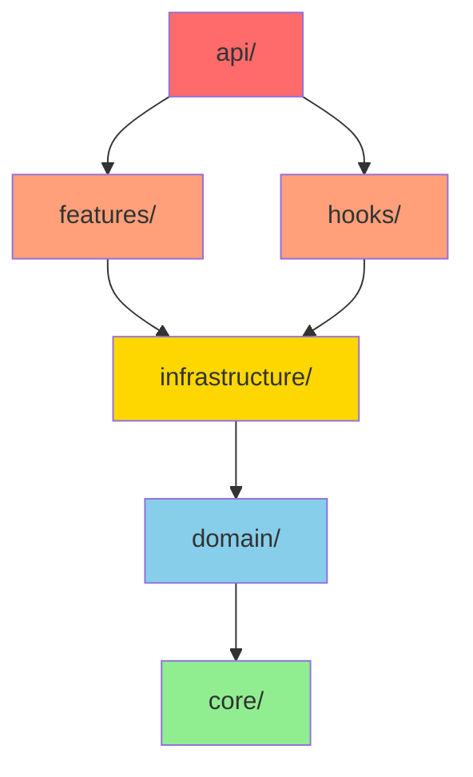
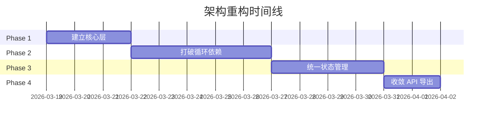

# 架构重构计划 - ultrapower v7.7.1

**创建时间**: 2026-03-18
**优先级**: P0（循环依赖）+ P1（分层优化）
**预计总工时**: 40-60 小时

---

## 执行摘要

本计划旨在解决 ultrapower 代码库的核心架构问题：
- **P0**: 打破 features ↔ hooks 循环依赖（19处）
- **P0**: 收敛过度暴露的 API（24个 barrel exports）
- **P1**: 建立清晰的分层架构
- **P1**: 统一状态管理系统

重构分为 **4 个阶段**，每个阶段可独立验证和回滚。

---

## 目标架构

```
src/
├── core/              # L0: 核心层（零依赖）
│   ├── types/         # 共享类型定义
│   ├── utils/         # 纯函数工具
│   └── constants/     # 常量定义
│
├── domain/            # L1: 领域层（仅依赖 core）
│   ├── agents/        # Agent 定义和逻辑
│   ├── skills/        # Skill 定义
│   └── state/         # 统一状态管理抽象
│
├── infrastructure/    # L2: 基础设施层（依赖 core + domain）
│   ├── mcp/           # MCP 集成
│   ├── tools/         # 工具实现
│   └── storage/       # 存储适配器
│
├── features/          # L3: 功能层（依赖 L0-L2）
│   ├── autopilot/
│   ├── team/
│   └── ...
│
├── hooks/             # L3: Hook 层（依赖 L0-L2）
│   ├── registry/
│   └── processors/
│
└── api/               # L4: API 层（受控导出）
    └── index.ts       # 公共 API
```

### 依赖规则



---

## 阶段 1: 建立核心层 (Phase 1)

**目标**: 创建零依赖的 core/ 层，提取共享类型和工具

**工时**: 8-12 小时
**优先级**: P0
**风险**: 低（纯新增，不破坏现有代码）

### 1.1 创建目录结构

```bash
mkdir -p src/core/{types,utils,constants}
```

### 1.2 提取共享类型

**文件移动清单**:

| 源文件 | 目标文件 | 说明 |
|--------|----------|------|
| `src/agents/definitions.ts` (types only) | `src/core/types/agent-types.ts` | Agent 类型定义 |
| `src/hooks/bridge-types.ts` | `src/core/types/hook-types.ts` | Hook 类型定义 |
| `src/core/job-types.ts` | `src/core/types/job-types.ts` | Job 类型定义 |
| `src/features/state-manager/index.ts` (types) | `src/core/types/state-types.ts` | 状态类型 |

### 1.3 提取纯函数工具

**文件移动清单**:

| 源文件 | 目标文件 |
|--------|----------|
| `src/lib/safe-json.ts` | `src/core/utils/safe-json.ts` |
| `src/lib/path-validator.ts` | `src/core/utils/path-validator.ts` |
| `src/lib/validateMode.ts` | `src/core/utils/validate-mode.ts` |
| `src/lib/crypto.ts` | `src/core/utils/crypto.ts` |

### 1.4 提取常量

**文件移动清单**:

| 源文件 | 目标文件 |
|--------|----------|
| `src/constants/index.ts` | `src/core/constants/index.ts` |
| `src/constants/names.ts` | `src/core/constants/names.ts` |
| `src/lib/constants.ts` | `src/core/constants/paths.ts` |

### 1.5 创建 core/index.ts

```typescript
// src/core/index.ts - 受控导出
export * from './types';
export * from './utils';
export * from './constants';
```

### 验证标准

- [ ] `tsc --noEmit` 通过
- [ ] 所有 core/ 文件零外部依赖
- [ ] 现有代码仍可编译（通过路径别名）

### 回滚策略

保留原文件，仅新增 core/ 目录。如需回滚，删除 core/ 即可。

---

## 阶段 2: 打破循环依赖 (Phase 2)

**目标**: 消除 features ↔ hooks 的 19 处循环依赖

**工时**: 16-24 小时
**优先级**: P0
**风险**: 中（需要重构导入路径）

### 2.1 依赖分析

**循环依赖清单**:

```
features/beads-context → hooks/beads-context/types.js
hooks/keyword-detector → features/magic-keywords
hooks/autopilot → features/continuation-enforcement
hooks/persistent-mode → features/delegation-enforcer
... (共 19 处)
```

### 2.2 解决方案：依赖倒置

**原则**: hooks 和 features 都依赖 domain/，而不是互相依赖

#### 步骤 2.2.1: 创建 domain/events

```typescript
// src/domain/events/keyword-events.ts
export interface KeywordDetectedEvent {
  keyword: string;
  context: string;
}

export type KeywordHandler = (event: KeywordDetectedEvent) => void;
```

#### 步骤 2.2.2: 重构 magic-keywords

**Before**:
```typescript
// hooks/keyword-detector/index.ts
import { MAGIC_KEYWORDS } from '../../features/magic-keywords';
```

**After**:
```typescript
// hooks/keyword-detector/index.ts
import { KeywordRegistry } from '../../domain/events/keyword-registry';

// features/magic-keywords/index.ts
import { KeywordRegistry } from '../../domain/events/keyword-registry';
KeywordRegistry.register('autopilot', handler);
```

### 2.3 文件重构清单

| 问题 | 解决方案 | 文件 |
|------|----------|------|
| hooks → features/magic-keywords | 创建 domain/events/keyword-registry | hooks/keyword-detector/* |
| hooks → features/continuation-enforcement | 创建 domain/events/continuation-events | hooks/autopilot/* |
| features → hooks/beads-context/types | 移动类型到 core/types/beads-types | features/beads-context/* |
| hooks → features/delegation-enforcer | 创建 domain/policies/delegation-policy | hooks/persistent-mode/* |

### 2.4 迁移步骤

1. **创建 domain/ 抽象**（新增文件，零风险）
2. **更新 features/ 使用 domain/**（逐个模块迁移）
3. **更新 hooks/ 使用 domain/**（逐个 hook 迁移）
4. **删除旧的直接依赖**（最后一步）

### 验证标准

- [ ] `madge --circular src/` 报告零循环依赖
- [ ] `npm run build` 成功
- [ ] `npm test` 全部通过
- [ ] 手动测试关键工作流（autopilot、team、ralph）

### 回滚策略

每个模块迁移后立即提交。如出现问题，回滚到上一个提交。

---

## 阶段 3: 统一状态管理 (Phase 3)

**目标**: 合并 3 个独立状态系统为统一抽象

**工时**: 12-16 小时
**优先级**: P1
**风险**: 中（涉及运行时状态）

### 3.1 当前状态系统

| 系统 | 位置 | 用途 |
|------|------|------|
| Mode State | `.omc/state/*.json` | 执行模式状态 |
| Boulder State | `features/boulder-state/` | 会话状态 |
| Notepad | `.omc/notepad.md` | 记忆存储 |

### 3.2 统一抽象设计

```typescript
// src/domain/state/state-manager.ts
export interface StateManager {
  read<T>(key: string): Promise<T | null>;
  write<T>(key: string, value: T): Promise<void>;
  delete(key: string): Promise<void>;
  list(prefix: string): Promise<string[]>;
}

// src/infrastructure/storage/file-state-adapter.ts
export class FileStateAdapter implements StateManager {
  // 实现文件存储
}

// src/infrastructure/storage/memory-state-adapter.ts
export class MemoryStateAdapter implements StateManager {
  // 实现内存存储（测试用）
}
```

### 3.3 迁移路径

#### 步骤 3.3.1: 创建统一接口

```bash
# 新增文件
src/domain/state/state-manager.ts
src/domain/state/state-types.ts
src/infrastructure/storage/file-state-adapter.ts
src/infrastructure/storage/json-state-store.ts
src/infrastructure/storage/markdown-state-store.ts
```

#### 步骤 3.3.2: 适配现有系统

| 现有系统 | 适配器 | 迁移策略 |
|----------|--------|----------|
| `.omc/state/*.json` | JsonStateStore | 保持文件格式不变 |
| boulder-state | JsonStateStore | 统一到 `.omc/state/session.json` |
| notepad | MarkdownStateStore | 保持 `.omc/notepad.md` |

#### 步骤 3.3.3: 逐步替换调用

```typescript
// Before
import { readState } from '../features/state-manager';
const state = await readState('autopilot');

// After
import { StateManager } from '../domain/state';
const state = await StateManager.read('autopilot');
```

### 3.4 数据迁移

**无需迁移**：适配器保持现有文件格式，零数据迁移成本。

### 验证标准

- [ ] 所有状态读写通过统一接口
- [ ] 现有状态文件格式不变
- [ ] 集成测试覆盖所有状态操作
- [ ] 性能无退化（基准测试）

### 回滚策略

保留旧的状态管理代码，通过特性开关切换。验证稳定后删除旧代码。

---

## 阶段 4: 收敛 API 导出 (Phase 4)

**目标**: 将 400+ 行的 src/index.ts 收敛为受控的公共 API

**工时**: 4-8 小时
**优先级**: P1
**风险**: 低（仅影响外部使用者）

### 4.1 当前问题

```typescript
// src/index.ts - 400+ 行
export * from './agents';
export * from './features';
export * from './hooks';
export * from './tools';
// ... 暴露所有内部实现
```

### 4.2 目标 API

```typescript
// src/api/index.ts - 受控导出
// 公共 API
export { createAgent } from '../domain/agents';
export { registerSkill } from '../domain/skills';
export { StateManager } from '../domain/state';

// 类型导出
export type { AgentConfig, SkillDefinition } from '../core/types';

// 内部 API（标记为 @internal）
export { HookRegistry } from '../hooks/registry';
```

### 4.3 迁移步骤

#### 步骤 4.3.1: 识别公共 API

运行使用分析：
```bash
# 分析外部依赖
npm ls ultrapower
# 检查 GitHub 使用情况
gh api repos/:owner/:repo/dependents
```

#### 步骤 4.3.2: 创建 api/index.ts

```typescript
// src/api/index.ts
/**
 * ultrapower Public API
 * @packageDocumentation
 */

// === 核心 API ===
export { Task } from '../domain/agents';
export { Skill } from '../domain/skills';

// === 类型 ===
export type {
  AgentType,
  SkillConfig,
  StateManager
} from '../core/types';

// === 内部 API (不保证稳定) ===
/** @internal */
export { HookRegistry } from '../hooks/registry';
```

#### 步骤 4.3.3: 更新 package.json

```json
{
  "main": "dist/api/index.js",
  "types": "dist/api/index.d.ts",
  "exports": {
    ".": "./dist/api/index.js",
    "./internal": "./dist/index.js"
  }
}
```

### 4.4 删除 barrel exports

**删除清单**（101 个 index.ts）:

```bash
# 保留的 index.ts
src/core/index.ts
src/domain/index.ts
src/infrastructure/index.ts
src/api/index.ts

# 删除的 index.ts（使用显式导入替代）
src/features/*/index.ts
src/hooks/*/index.ts
src/tools/*/index.ts
```

### 验证标准

- [ ] 公共 API 文档生成成功
- [ ] 外部依赖项仍可正常工作
- [ ] 构建产物大小减少 >20%
- [ ] TypeScript 编译时间减少 >15%

### 回滚策略

保留 src/index.ts 作为 legacy 入口，通过 package.json exports 字段切换。

---

## 风险评估矩阵

| 阶段 | 风险等级 | 主要风险 | 缓解措施 |
|------|----------|----------|----------|
| Phase 1 | 🟢 低 | 路径别名配置错误 | 渐进式迁移，保留旧文件 |
| Phase 2 | 🟡 中 | 循环依赖隐藏的运行时问题 | 每个模块迁移后立即测试 |
| Phase 3 | 🟡 中 | 状态读写竞态条件 | 保持文件格式不变，充分测试 |
| Phase 4 | 🟢 低 | 破坏外部依赖 | 保留 legacy 入口，版本化 API |

---

## 依赖关系图



**关键路径**: Phase 1 → Phase 2 → Phase 3 → Phase 4
**可并行**: 无（每个阶段依赖前一阶段）

---

## 验证清单

### 每个阶段完成后

- [ ] `npm run build` 成功
- [ ] `npm test` 全部通过
- [ ] `tsc --noEmit` 无错误
- [ ] `madge --circular src/` 无新增循环依赖
- [ ] 手动测试核心工作流

### 全部完成后

- [ ] 集成测试覆盖率 >80%
- [ ] 文档更新完成
- [ ] 性能基准测试通过
- [ ] 代码审查通过
- [ ] 创建 PR 到 dev 分支

---

## 工作量估算

| 阶段 | 最佳情况 | 预期情况 | 最坏情况 |
|------|----------|----------|----------|
| Phase 1 | 8h | 10h | 12h |
| Phase 2 | 16h | 20h | 24h |
| Phase 3 | 12h | 14h | 16h |
| Phase 4 | 4h | 6h | 8h |
| **总计** | **40h** | **50h** | **60h** |

**建议**: 按 50 小时预算，预留 10 小时缓冲。

---

## 成功标准

重构完成后，代码库应满足：

1. ✅ **零循环依赖**（madge 验证）
2. ✅ **清晰分层**（4 层架构，单向依赖）
3. ✅ **统一状态管理**（1 个抽象，3 个适配器）
4. ✅ **受控 API**（<50 个公共导出）
5. ✅ **测试覆盖率 >80%**
6. ✅ **构建时间减少 >15%**
7. ✅ **文档完整**（架构图 + API 文档）

---

## 下一步行动

1. **评审本计划**：与团队确认方案可行性
2. **创建跟踪 Issue**：在 GitHub 创建 Epic Issue
3. **开始 Phase 1**：创建 feature/arch-refactor-phase1 分支
4. **每日同步**：每完成一个模块迁移，提交并推送

---

**计划创建者**: Planner (Prometheus)
**最后更新**: 2026-03-18
