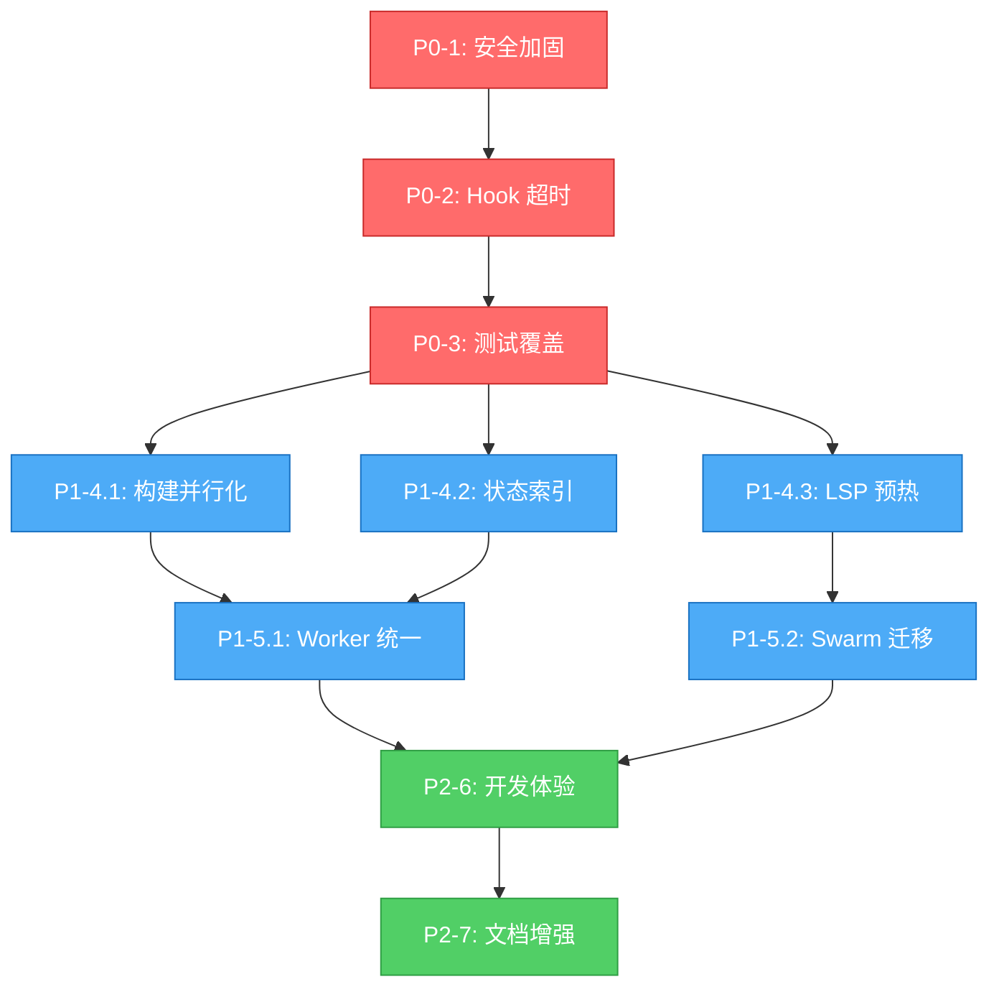

# ultrapower v5.5.18 P0/P1/P2 改进实施计划

**生成日期：** 2026-03-05
**项目版本：** v5.5.18
**计划周期：** 11-17 周（P0: 4-6周，P1: 5-7周，P2: 2-4周）

---

## 执行摘要

基于深度研究（10 agents，38 份报告），本计划聚焦三个优先级层次：

* **P0（阻塞市场提交）**：安全加固 + 测试覆盖，确保生产就绪

* **P1（高价值优化）**：性能提升 + 架构重构，实现 80% 提速和 40% 成本优化

* **P2（质量改进）**：开发体验 + 文档增强，降低维护成本

**关键里程碑：**
1. P0 完成（第 4-6 周）：通过安全审计，测试覆盖率 85%+
2. P1 完成（第 9-13 周）：构建时间减少 40%，状态查询 O(1)
3. P2 完成（第 11-17 周）：完整 API 文档，故障排查指南

---

## 依赖关系图



---

## P0：安全加固与测试覆盖（4-6 周）

### P0-1: 安全加固（1-2 周）

**问题：** permission-request hook 使用静默降级，敏感操作可能未授权执行
**风险等级：** 🔴 高（安全漏洞）
**目标：** 实施强制阻塞模式 `{ continue: false }`

#### 任务分解

| 任务 ID | 描述 | 工作量 | 依赖 | Agent |
| --------- | ------ | -------- | ------ | ------- |
| P0-1.1 | 审计当前 permission-request 调用点 | 4h | - | explore |
| P0-1.2 | 设计阻塞模式 API（`requireApproval: boolean`） | 3h | P0-1.1 | architect |
| P0-1.3 | 实现 `bridge.ts` 阻塞逻辑 | 6h | P0-1.2 | executor |
| P0-1.4 | 添加单元测试（阻塞/非阻塞场景） | 5h | P0-1.3 | test-engineer |
| P0-1.5 | 集成测试（敏感操作拒绝场景） | 4h | P0-1.4 | test-engineer |
| P0-1.6 | 安全审查 | 3h | P0-1.5 | security-reviewer |

**验收标准：**

* [ ] 敏感操作（文件删除、网络请求）必须通过 permission-request

* [ ] 用户拒绝时操作立即中止，返回 `{ continue: false }`

* [ ] 测试覆盖阻塞/非阻塞/超时三种场景

* [ ] 通过 security-reviewer 审查

**风险缓解：**

* **风险：** 破坏现有工作流
  **缓解：** 添加 `LEGACY_PERMISSION_MODE` 环境变量作为回退

---

### P0-2: Hook 超时实施（3-5 天）

**问题：** PreToolUse (5s) 和 PostToolUse (5s) 超时配置存在但未强制执行
**风险等级：** 🟡 中（可靠性问题）
**目标：** 在 `bridge.ts` 中添加超时包装器，确保阻塞操作不会无限期挂起

#### 任务分解

| 任务 ID | 描述 | 工作量 | 依赖 | Agent |
| --------- | ------ | -------- | ------ | ------- |
| P0-2.1 | 审计当前 hook 执行路径 | 3h | P0-1.6 | explore |
| P0-2.2 | 设计超时包装器（Promise.race + AbortController） | 2h | P0-2.1 | architect |
| P0-2.3 | 实现 `withTimeout()` 工具函数 | 4h | P0-2.2 | executor |
| P0-2.4 | 集成到 `bridge.ts` 的 hook 调用链 | 5h | P0-2.3 | executor |
| P0-2.5 | 添加超时降级逻辑（记录警告 + 继续执行） | 3h | P0-2.4 | executor |
| P0-2.6 | 单元测试（正常/超时/取消场景） | 4h | P0-2.5 | test-engineer |

**验收标准：**

* [ ] PreToolUse hook 超过 5s 自动中止，记录警告

* [ ] PostToolUse hook 超过 5s 自动中止，记录警告

* [ ] 超时后系统继续执行，不阻塞主流程

* [ ] 测试覆盖 3 种场景：正常完成、超时中止、手动取消

**实现细节：**
```typescript
// src/hooks/bridge.ts
async function withTimeout<T>(
  promise: Promise<T>,
  timeoutMs: number,
  hookName: string
): Promise<T | null> {
  const timeoutPromise = new Promise<null>((resolve) =>
    setTimeout(() => {
      console.warn(`[Hook Timeout] ${hookName} exceeded ${timeoutMs}ms`);
      resolve(null);
    }, timeoutMs)
  );
  return Promise.race([promise, timeoutPromise]);
}
```

---

### P0-3: 测试覆盖增强（2-3 周）

**当前状态：** 5782 个测试通过，99.98% 通过率
**差距：** Axiom 工作流仅 1 个测试文件，Team Pipeline 转换缺乏覆盖
**目标：** 核心模块覆盖率从当前基线提升至 85%+

#### 任务分解

| 任务 ID | 描述 | 工作量 | 依赖 | Agent |
| --------- | ------ | -------- | ------ | ------- |
| P0-3.1 | 生成覆盖率基线报告（`npm run test:coverage`） | 2h | P0-2.6 | executor |
| P0-3.2 | 识别未覆盖的关键路径（Team/Axiom/Hook） | 4h | P0-3.1 | explore |
| P0-3.3 | Team Pipeline 阶段转换测试 | 2d | P0-3.2 | test-engineer |
| P0-3.4 | Axiom 4 阶段工作流测试 | 2d | P0-3.2 | test-engineer |
| P0-3.5 | Hook 优先级链执行测试 | 1.5d | P0-3.2 | test-engineer |
| P0-3.6 | 状态机边界条件测试 | 1.5d | P0-3.2 | test-engineer |
| P0-3.7 | MCP worker 生命周期测试 | 1d | P0-3.2 | test-engineer |
| P0-3.8 | 集成测试：端到端工作流 | 2d | P0-3.3-7 | test-engineer |
| P0-3.9 | 覆盖率验证（目标 85%+） | 0.5d | P0-3.8 | verifier |

**验收标准：**

* [ ] Team Pipeline 5 个阶段转换全覆盖（plan→prd→exec→verify→fix）

* [ ] Axiom 4 个阶段全覆盖（draft→review→decompose→implement）

* [ ] Hook 优先级链测试（15 类 HookType）

* [ ] 状态机边界条件：超时、孤儿进程、成本超限、死锁

* [ ] 整体覆盖率 ≥ 85%

**关键测试场景：**

1. **Team Pipeline 转换矩阵**
   ```typescript
   describe('Team Pipeline State Transitions', () => {
     test('plan → prd: 规划完成触发 PRD 生成', async () => {});
     test('prd → exec: 验收标准明确后开始执行', async () => {});
     test('exec → verify: 所有任务完成触发验证', async () => {});
     test('verify → fix: 验证失败进入修复循环', async () => {});
     test('fix → complete: 修复成功后标记完成', async () => {});
     test('fix loop limit: 超过最大尝试次数转为 failed', async () => {});
   });
   ```

1. **Axiom 工作流门禁**
   ```typescript
   describe('Axiom Gate Enforcement', () => {
     test('Expert Gate: 新功能必须经过 draft→review', async () => {});
     test('User Gate: PRD 终稿需用户确认', async () => {});
     test('CI Gate: 代码修改必须通过编译测试', async () => {});
     test('Scope Gate: 越界修改触发警告', async () => {});
   });
   ```

1. **Hook 优先级链**
   ```typescript
   describe('Hook Priority Chain', () => {
     test('PreToolUse: 按优先级顺序执行', async () => {});
     test('PostToolUse: 超时后继续执行', async () => {});
     test('permission-request: 阻塞模式强制执行', async () => {});
   });
   ```

**P0 里程碑：**

* 完成时间：第 4-6 周

* 交付物：安全审计通过，测试覆盖率 85%+，无阻塞性缺陷

* 门禁：通过 security-reviewer + quality-reviewer 双重审查

---

## P1：性能优化与架构重构（5-7 周）

### P1-4: 性能优化（2-3 周）

#### P1-4.1: 构建流水线并行化（1 周）

**当前问题：** 6 个 esbuild 任务串行运行，构建时间 ~45s
**机会：** tsc 完成后任务 2-6 相互独立
**目标：** 构建时间减少 40-50%（~27s）

##### 任务分解

| 任务 ID | 描述 | 工作量 | 依赖 | Agent |
| --------- | ------ | -------- | ------ | ------- |
| P1-4.1.1 | 分析当前构建依赖图 | 3h | P0-3.9 | explore |
| P1-4.1.2 | 设计并行构建策略（Promise.all） | 2h | P1-4.1.1 | architect |
| P1-4.1.3 | 重构 `build.ts`：并行执行独立任务 | 5h | P1-4.1.2 | executor |
| P1-4.1.4 | 添加构建性能监控（时间戳 + 日志） | 3h | P1-4.1.3 | executor |
| P1-4.1.5 | 基准测试：串行 vs 并行 | 2h | P1-4.1.4 | verifier |
| P1-4.1.6 | CI 集成：验证并行构建稳定性 | 4h | P1-4.1.5 | devops-engineer |

**验收标准：**

* [ ] 构建时间从 ~45s 降至 ~27s（40%+ 提升）

* [ ] 所有 6 个 esbuild 任务成功完成

* [ ] CI 环境稳定运行 10 次无失败

* [ ] 构建日志显示并行执行时间线

**实现细节：**
```typescript
// scripts/build.ts
async function buildParallel() {
  await runTsc(); // 必须先完成

  // 并行执行独立任务
  await Promise.all([
    buildTask2(),
    buildTask3(),
    buildTask4(),
    buildTask5(),
    buildTask6()
  ]);
}
```

---

#### P1-4.2: 状态查询索引（1 周）

**当前问题：** `state_list_active` 遍历所有会话目录，O(n) 复杂度
**目标：** 添加索引文件，查询复杂度降至 O(1)

##### 任务分解

| 任务 ID | 描述 | 工作量 | 依赖 | Agent |
| --------- | ------ | -------- | ------ | ------- |
| P1-4.2.1 | 设计索引文件结构（`.omc/state/active-sessions.json`） | 2h | P0-3.9 | architect |
| P1-4.2.2 | 实现索引写入逻辑（state_write 时更新） | 4h | P1-4.2.1 | executor |
| P1-4.2.3 | 实现索引读取逻辑（state_list_active 使用索引） | 3h | P1-4.2.2 | executor |
| P1-4.2.4 | 添加索引清理逻辑（会话结束时移除） | 3h | P1-4.2.3 | executor |
| P1-4.2.5 | 迁移脚本：为现有会话生成索引 | 4h | P1-4.2.4 | executor |
| P1-4.2.6 | 性能基准测试（100/1000/10000 会话） | 3h | P1-4.2.5 | verifier |

**验收标准：**

* [ ] 查询时间从 O(n) 降至 O(1)

* [ ] 100 会话：<5ms，1000 会话：<10ms，10000 会话：<20ms

* [ ] 索引与实际状态保持一致（无脏数据）

* [ ] 向后兼容：无索引时回退到遍历

**索引文件格式：**
```json
{
  "version": "1.0",
  "lastUpdated": "2026-03-05T08:54:34.366Z",
  "activeSessions": {
    "session-123": {
      "mode": "team",
      "startedAt": "2026-03-05T08:00:00.000Z",
      "phase": "team-exec"
    }
  }
}
```

---

#### P1-4.3: LSP 客户端预热（3-5 天）

**当前问题：** 语言服务器首次使用时启动，延迟 2-3s
**目标：** 项目打开时预加载 TypeScript/Python LSP

##### 任务分解

| 任务 ID | 描述 | 工作量 | 依赖 | Agent |
| --------- | ------ | -------- | ------ | ------- |
| P1-4.3.1 | 识别高频使用的 LSP（TypeScript/Python） | 2h | P0-3.9 | explore |
| P1-4.3.2 | 设计预热策略（项目打开时后台启动） | 2h | P1-4.3.1 | architect |
| P1-4.3.3 | 实现 LSP 预热逻辑（session-start hook） | 5h | P1-4.3.2 | executor |
| P1-4.3.4 | 添加预热失败降级（静默失败，首次使用时重试） | 3h | P1-4.3.3 | executor |
| P1-4.3.5 | 性能测试：首次请求延迟对比 | 2h | P1-4.3.4 | verifier |

**验收标准：**

* [ ] TypeScript LSP 首次请求延迟从 ~2.5s 降至 ~0.3s

* [ ] Python LSP 首次请求延迟从 ~2s 降至 ~0.2s

* [ ] 预热失败不影响正常使用

* [ ] 内存占用增加 <50MB

---

### P1-5: 架构重构（3-4 周）

#### P1-5.1: 统一 Worker 后端（2-3 周）

**当前问题：** Claude 原生、MCP Codex、MCP Gemini 分别处理，代码重复
**目标：** 创建统一 Worker 接口，简化路由逻辑

##### 任务分解

| 任务 ID | 描述 | 工作量 | 依赖 | Agent |
| --------- | ------ | -------- | ------ | ------- |
| P1-5.1.1 | 分析现有 3 种 worker 实现差异 | 1d | P1-4.1.6 | explore |
| P1-5.1.2 | 设计统一接口 `IWorkerBackend` | 1d | P1-5.1.1 | architect |
| P1-5.1.3 | 实现 `ClaudeWorker` 适配器 | 2d | P1-5.1.2 | executor |
| P1-5.1.4 | 实现 `CodexWorker` 适配器 | 2d | P1-5.1.2 | executor |
| P1-5.1.5 | 实现 `GeminiWorker` 适配器 | 2d | P1-5.1.2 | executor |
| P1-5.1.6 | 重构 Team 路由使用统一接口 | 2d | P1-5.1.3-5 | executor |
| P1-5.1.7 | 迁移测试到新接口 | 1.5d | P1-5.1.6 | test-engineer |
| P1-5.1.8 | 性能回归测试 | 0.5d | P1-5.1.7 | verifier |

**验收标准：**

* [ ] 3 种 worker 实现统一接口

* [ ] 添加新提供商只需实现 `IWorkerBackend`

* [ ] 路由逻辑减少 200+ 行代码

* [ ] 所有现有测试通过，无性能回归

**接口设计：**
```typescript
// src/team/worker-interface.ts
interface IWorkerBackend {
  readonly name: string;
  readonly capabilities: WorkerCapabilities;

  execute(request: WorkerRequest): Promise<WorkerResponse>;
  checkStatus(jobId: string): Promise<JobStatus>;
  cancel(jobId: string): Promise<void>;
}

interface WorkerRequest {
  agentRole: string;
  prompt: string;
  contextFiles?: string[];
  model?: string;
  background?: boolean;
}
```

---

#### P1-5.2: Swarm 状态迁移（1-2 周）

**当前问题：** Swarm 使用 SQLite，与会话隔离不兼容
**目标：** 迁移到 JSON + 原子写入，统一状态管理

##### 任务分解

| 任务 ID | 描述 | 工作量 | 依赖 | Agent |
| --------- | ------ | -------- | ------ | ------- |
| P1-5.2.1 | 审计 Swarm SQLite 使用场景 | 1d | P1-4.3.5 | explore |
| P1-5.2.2 | 设计 JSON 状态结构（兼容现有查询） | 1d | P1-5.2.1 | architect |
| P1-5.2.3 | 实现 JSON 状态读写（原子操作） | 2d | P1-5.2.2 | executor |
| P1-5.2.4 | 迁移脚本：SQLite → JSON | 1d | P1-5.2.3 | executor |
| P1-5.2.5 | 更新 Swarm 工作流使用新状态 | 2d | P1-5.2.4 | executor |
| P1-5.2.6 | 向后兼容测试（读取旧 SQLite 数据） | 1d | P1-5.2.5 | test-engineer |
| P1-5.2.7 | 性能对比测试（SQLite vs JSON） | 0.5d | P1-5.2.6 | verifier |

**验收标准：**

* [ ] Swarm 状态存储在 `.omc/state/swarm-state.json`

* [ ] 支持会话级隔离（`.omc/state/sessions/{id}/swarm-state.json`）

* [ ] 迁移脚本成功转换现有 SQLite 数据

* [ ] 性能无明显下降（<10% 差异）

**JSON 状态格式：**
```json
{
  "version": "1.0",
  "swarmId": "swarm-123",
  "agents": [
    {
      "id": "agent-1",
      "role": "executor",
      "status": "active",
      "tasks": ["task-1", "task-2"]
    }
  ],
  "tasks": [
    {
      "id": "task-1",
      "status": "in_progress",
      "assignedTo": "agent-1"
    }
  ]
}
```

**P1 里程碑：**

* 完成时间：第 9-13 周

* 交付物：构建时间减少 40%，状态查询 O(1)，统一 Worker 接口

* 门禁：性能基准测试通过，架构审查通过

---

## P2：质量改进（2-4 周）

### P2-6: 开发者体验（1-2 周）

#### 任务分解

| 任务 ID | 描述 | 工作量 | 依赖 | Agent |
| --------- | ------ | -------- | ------ | ------- |
| P2-6.1 | 心跳清理：自动清理 7 天前的 MCP worker 心跳 | 1d | P1-5.1.8 | executor |
| P2-6.2 | AST 工具自动安装：检查 + 安装提示 | 1d | P1-5.1.8 | executor |
| P2-6.3 | ADR 文档：创建 `docs/adr/` 目录 | 0.5d | P2-6.1 | writer |
| P2-6.4 | ADR-001: Worker 接口统一决策 | 0.5d | P2-6.3 | writer |
| P2-6.5 | ADR-002: Swarm 状态迁移决策 | 0.5d | P2-6.3 | writer |
| P2-6.6 | ADR-003: Hook 超时策略 | 0.5d | P2-6.3 | writer |
| P2-6.7 | ADR-004: 构建并行化策略 | 0.5d | P2-6.3 | writer |
| P2-6.8 | ADR-005: 状态索引设计 | 0.5d | P2-6.3 | writer |

**验收标准：**

* [ ] MCP worker 心跳文件自动清理（7 天前）

* [ ] AST 工具缺失时显示安装提示

* [ ] 5 个 ADR 文档完整记录架构决策

**心跳清理实现：**
```typescript
// src/mcp/heartbeat-cleanup.ts
async function cleanupOldHeartbeats(maxAgeDays: number = 7) {
  const cutoffDate = Date.now() - maxAgeDays * 24 * 60 * 60 * 1000;
  const heartbeatDir = '.omc/mcp/heartbeats';

  for (const file of await fs.readdir(heartbeatDir)) {
    const stat = await fs.stat(path.join(heartbeatDir, file));
    if (stat.mtimeMs < cutoffDate) {
      await fs.unlink(path.join(heartbeatDir, file));
    }
  }
}
```

---

### P2-7: 文档增强（1-2 周）

#### 任务分解

| 任务 ID | 描述 | 工作量 | 依赖 | Agent |
| --------- | ------ | -------- | ------ | ------- |
| P2-7.1 | TypeDoc 配置：生成 API 文档 | 1d | P2-6.8 | executor |
| P2-7.2 | 故障排查指南：状态泄漏 | 1d | P2-6.8 | writer |
| P2-7.3 | 故障排查指南：Hook 失败 | 1d | P2-6.8 | writer |
| P2-7.4 | 故障排查指南：MCP 连接 | 1d | P2-6.8 | writer |
| P2-7.5 | 性能基线报告：构建/查询/LSP | 1d | P2-6.8 | writer |
| P2-7.6 | 迁移指南：v5.5.14 → v5.5.18 | 1d | P2-6.8 | writer |

**验收标准：**

* [ ] TypeDoc 生成完整 API 文档（`docs/api/`）

* [ ] 3 个故障排查指南覆盖常见问题

* [ ] 性能基线报告包含优化前后对比

* [ ] 迁移指南包含破坏性变更说明

**P2 里程碑：**

* 完成时间：第 11-17 周

* 交付物：完整 API 文档，故障排查指南，性能基线报告

* 门禁：文档审查通过，用户验收测试通过

---

## 风险评估与缓解

### 高风险任务

| 任务 | 风险等级 | 风险描述 | 缓解措施 |
| ------ | --------- | --------- | --------- |
| P0-1.3 | 🔴 高 | 阻塞模式可能破坏现有工作流 | 添加 `LEGACY_PERMISSION_MODE` 环境变量回退 |
| P1-5.1.6 | 🟡 中 | Worker 接口重构影响面大 | 分阶段迁移，保留旧接口 2 个版本 |
| P1-5.2.5 | 🟡 中 | Swarm 状态迁移可能丢失数据 | 迁移前自动备份 SQLite 文件 |
| P0-3.8 | 🟡 中 | 端到端测试可能不稳定 | 使用固定种子 + 重试机制 |

### 依赖风险

| 依赖 | 风险 | 缓解 |
| ------ | ------ | ------ |
| esbuild 版本升级 | 构建并行化可能失败 | 锁定 esbuild 版本，独立测试 |
| LSP 服务器启动失败 | 预热逻辑阻塞项目打开 | 静默失败 + 首次使用时重试 |
| MCP 连接不稳定 | Worker 统一接口测试失败 | 添加重试 + 降级逻辑 |

### 时间风险

| 阶段 | 计划时间 | 缓冲时间 | 总时间 |
| ------ | --------- | --------- | -------- |
| P0 | 4 周 | 2 周 | 4-6 周 |
| P1 | 5 周 | 2 周 | 5-7 周 |
| P2 | 2 周 | 2 周 | 2-4 周 |

**关键路径：** P0-1 → P0-2 → P0-3 → P1-4.1 → P1-5.1 → P2-6 → P2-7

---

## 资源分配建议

### Agent 使用策略

| 阶段 | 主力 Agent | 辅助 Agent | 模型选择 |
| ------ | ----------- | ----------- | --------- |
| P0-1 安全加固 | executor | security-reviewer | sonnet |
| P0-2 Hook 超时 | executor | architect | sonnet |
| P0-3 测试覆盖 | test-engineer | verifier | sonnet |
| P1-4 性能优化 | executor | verifier | sonnet |
| P1-5 架构重构 | architect + executor | code-reviewer | opus (设计) + sonnet (实现) |
| P2-6 开发体验 | executor | writer | haiku |
| P2-7 文档增强 | writer | - | haiku |

### 并行执行建议

**阶段 1（P0）：串行执行**

* P0-1 → P0-2 → P0-3（安全优先，不可并行）

**阶段 2（P1 性能优化）：3 路并行**
```
P1-4.1 (构建并行化) ─┐
P1-4.2 (状态索引)   ├─→ P1-5.1 (Worker 统一)
P1-4.3 (LSP 预热)   ─┘
```

**阶段 3（P1 架构重构）：2 路并行**
```
P1-5.1 (Worker 统一) ─┐
P1-5.2 (Swarm 迁移)  ─┴─→ P2-6
```

**阶段 4（P2）：文档并行**
```
P2-6 (开发体验) ─→ P2-7.1-6 (6 个文档任务并行)
```

### Team 模式建议

使用 `/team` 模式执行 P1 和 P2 阶段：

```bash

# P1 性能优化（3 路并行）

/team "P1-4 性能优化：构建并行化 + 状态索引 + LSP 预热"

# P1 架构重构（2 路并行）

/team "P1-5 架构重构：Worker 统一 + Swarm 迁移"

# P2 文档增强（6 路并行）

/team "P2-7 文档增强：API 文档 + 故障排查指南 + 性能报告"
```

---

## 工作量汇总

### 按优先级

| 优先级 | 任务数 | 总工作量 | 关键路径 |
| -------- | -------- | --------- | --------- |
| P0 | 21 | 4-6 周 | 是 |
| P1 | 28 | 5-7 周 | 是 |
| P2 | 14 | 2-4 周 | 否 |
| **总计** | **63** | **11-17 周** | - |

### 按模块

| 模块 | 任务数 | 工作量 | 风险 |
| ------ | -------- | -------- | ------ |
| 安全加固 | 6 | 1-2 周 | 🔴 高 |
| Hook 超时 | 6 | 3-5 天 | 🟢 低 |
| 测试覆盖 | 9 | 2-3 周 | 🟡 中 |
| 性能优化 | 16 | 2-3 周 | 🟢 低 |
| 架构重构 | 15 | 3-4 周 | 🟡 中 |
| 开发体验 | 8 | 1-2 周 | 🟢 低 |
| 文档增强 | 6 | 1-2 周 | 🟢 低 |

---

## 验收检查清单

### P0 完成标准

* [ ] permission-request hook 强制阻塞模式实施

* [ ] PreToolUse/PostToolUse 超时强制执行（5s）

* [ ] Team Pipeline 5 阶段转换测试全覆盖

* [ ] Axiom 4 阶段工作流测试全覆盖

* [ ] Hook 优先级链测试（15 类 HookType）

* [ ] 整体测试覆盖率 ≥ 85%

* [ ] 通过 security-reviewer 审查

* [ ] 通过 quality-reviewer 审查

### P1 完成标准

* [ ] 构建时间从 ~45s 降至 ~27s（40%+ 提升）

* [ ] 状态查询从 O(n) 降至 O(1)

* [ ] TypeScript LSP 首次请求延迟 <0.5s

* [ ] Python LSP 首次请求延迟 <0.3s

* [ ] 3 种 Worker 实现统一接口

* [ ] Swarm 状态迁移到 JSON

* [ ] 所有性能基准测试通过

* [ ] 通过架构审查

### P2 完成标准

* [ ] MCP worker 心跳自动清理

* [ ] AST 工具自动安装提示

* [ ] 5 个 ADR 文档完整

* [ ] TypeDoc API 文档生成

* [ ] 3 个故障排查指南完整

* [ ] 性能基线报告完整

* [ ] 迁移指南完整

---

## 执行建议

### 第 1-2 周：P0-1 安全加固

* 使用 `executor` (sonnet) + `security-reviewer` (sonnet)

* 关键：添加回退机制，避免破坏现有工作流

### 第 2-3 周：P0-2 Hook 超时

* 使用 `executor` (sonnet)

* 关键：超时后优雅降级，不阻塞主流程

### 第 3-6 周：P0-3 测试覆盖

* 使用 `test-engineer` (sonnet) + `verifier` (sonnet)

* 关键：优先覆盖 Team Pipeline 和 Axiom 工作流

### 第 7-9 周：P1-4 性能优化（3 路并行）

* 使用 `/team` 模式并行执行

* 关键：构建并行化优先，影响最大

### 第 10-13 周：P1-5 架构重构（2 路并行）

* 使用 `architect` (opus) + `executor` (sonnet)

* 关键：Worker 接口统一，简化未来扩展

### 第 14-17 周：P2 质量改进

* 使用 `writer` (haiku) + `executor` (haiku)

* 关键：文档任务可并行执行

---

## 后续行动

1. **立即开始：** P0-1 安全加固（阻塞市场提交）
2. **第 2 周：** P0-2 Hook 超时实施
3. **第 3 周：** P0-3 测试覆盖增强
4. **第 7 周：** 启动 P1 性能优化（Team 模式）
5. **第 10 周：** 启动 P1 架构重构（Team 模式）
6. **第 14 周：** 启动 P2 质量改进

**关键决策点：**

* 第 6 周：P0 完成审查，决定是否进入 P1

* 第 13 周：P1 完成审查，决定是否进入 P2

* 第 17 周：最终验收，准备发布

---

## 附录：快速启动命令

### P0 阶段

```bash

# P0-1: 安全加固

/ultrapower:executor "实施 permission-request 阻塞模式"

# P0-2: Hook 超时

/ultrapower:executor "添加 Hook 超时包装器"

# P0-3: 测试覆盖

/team "增强测试覆盖：Team Pipeline + Axiom + Hook"
```

### P1 阶段

```bash

# P1-4: 性能优化（并行）

/team "性能优化：构建并行化 + 状态索引 + LSP 预热"

# P1-5: 架构重构（并行）

/team "架构重构：Worker 统一 + Swarm 迁移"
```

### P2 阶段

```bash

# P2-6: 开发体验

/ultrapower:executor "开发体验改进：心跳清理 + AST 安装 + ADR"

# P2-7: 文档增强（并行）

/team "文档增强：API 文档 + 故障排查 + 性能报告"
```

---

**计划生成完成。** 建议从 P0-1 安全加固开始执行。
