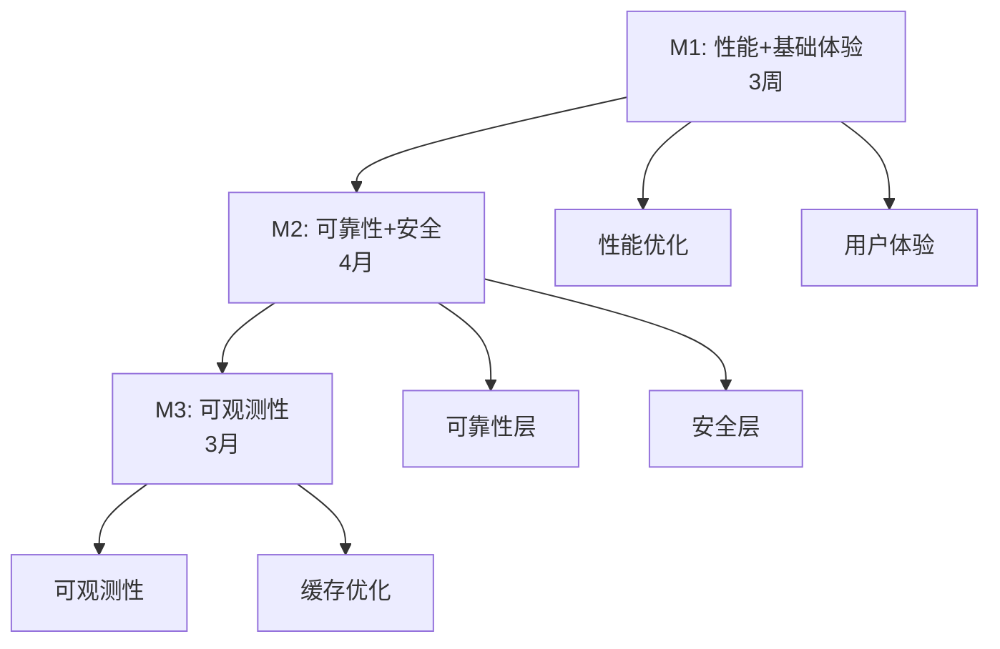

# ultrapower v7.0.1 任务清单（Manifest）

**版本**: v7.0.1
**制定日期**: 2026-03-10
**负责人**: Axiom System Architect
**状态**: 待确认
**总工期**: 10 个月

---

## 1. 架构图（全局上下文）



---

## 2. M1 任务列表（3 周，8 个任务）

### 性能优化

- [ ] **T-001: 测试套件优化**
  - 路径: `docs/tasks/v7.0.1/sub_prds/T-001-test-optimization.md`
  - 上下文: 快速测试 <5s，完整测试 <15s，测试并行化
  - 依赖: None
  - 工期: 3 天
  - 影响范围: `tests/`, `vitest.config.ts`

- [ ] **T-002: hooks 模块拆分**
  - 路径: `docs/tasks/v7.0.1/sub_prds/T-002-hooks-refactor.md`
  - 上下文: bridge.ts <200 行，启动时间 -30-50%
  - 依赖: None
  - 工期: 7 天
  - 影响范围: `src/hooks/bridge.ts`, `src/hooks/handlers/`

- [ ] **T-003: CLI 命令懒加载**
  - 路径: `docs/tasks/v7.0.1/sub_prds/T-003-cli-lazy-loading.md`
  - 上下文: CLI 启动 -40%，懒加载命令注册器
  - 依赖: T-002
  - 工期: 1 天
  - 影响范围: `src/cli/commands/`, `src/cli/loader.ts`

### 用户体验

- [ ] **T-004: 实时进度显示**
  - 路径: `docs/tasks/v7.0.1/sub_prds/T-004-progress-display.md`
  - 上下文: CLI 进度条 + Agent 状态指示器
  - 依赖: T-001, T-002
  - 工期: 2 天
  - 影响范围: `src/cli/progress/`, `src/agents/status.ts`

- [ ] **T-005: 用户友好错误系统**
  - 路径: `docs/tasks/v7.0.1/sub_prds/T-005-friendly-errors.md`
  - 上下文: 错误分类 + 恢复步骤 + 拼写纠正
  - 依赖: T-004
  - 工期: 3 天
  - 影响范围: `src/errors/`, `src/cli/error-handler.ts`

- [ ] **T-006: 快速上手文档**
  - 路径: `docs/tasks/v7.0.1/sub_prds/T-006-quick-start-docs.md`
  - 上下文: 15 分钟教程 + 核心概念图解
  - 依赖: T-005
  - 工期: 3 天
  - 影响范围: `docs/quick-start.md`, `docs/concepts/`

- [ ] **T-007: 命令自动补全**
  - 路径: `docs/tasks/v7.0.1/sub_prds/T-007-autocomplete.md`
  - 上下文: Tab 补全 Agent/Skill 名称，输入效率 +50%
  - 依赖: T-003
  - 工期: 2 天
  - 影响范围: `src/cli/autocomplete.ts`

- [ ] **T-008: 交互式教程**
  - 路径: `docs/tasks/v7.0.1/sub_prds/T-008-interactive-tutorial.md`
  - 上下文: 首次运行引导 + 示例项目
  - 依赖: T-006
  - 工期: 1 周
  - 影响范围: `src/cli/tutorial/`, `templates/`

---

## 3. M2 任务列表（4 月，17 个任务）

### 可靠性层

- [ ] **T-009: 自动重试机制**
  - 路径: `docs/tasks/v7.0.1/sub_prds/T-009-auto-retry.md`
  - 上下文: 指数退避，最大 3 次
  - 依赖: T-008
  - 工期: 1 周
  - 影响范围: `src/reliability/retry-manager.ts`

- [ ] **T-010: 熔断器模式**
  - 路径: `docs/tasks/v7.0.1/sub_prds/T-010-circuit-breaker.md`
  - 上下文: 三态管理，连续失败 5 次触发
  - 依赖: None
  - 工期: 1 周
  - 影响范围: `src/reliability/circuit-breaker.ts`

- [ ] **T-011: 统一状态管理层**
  - 路径: `docs/tasks/v7.0.1/sub_prds/T-011-unified-state.md`
  - 上下文: 分 4 阶段迁移，双写模式
  - 依赖: None
  - 工期: 4 周
  - 影响范围: `src/state/`, `src/state/migration/`

- [ ] **T-012: 模型自动降级**
  - 路径: `docs/tasks/v7.0.1/sub_prds/T-012-model-fallback.md`
  - 上下文: Opus → Sonnet → Haiku
  - 依赖: T-009, T-010
  - 工期: 3 天
  - 影响范围: `src/reliability/model-fallback.ts`

### 安全层

- [ ] **T-013: 成本预算控制**
  - 路径: `docs/tasks/v7.0.1/sub_prds/T-013-budget-control.md`
  - 上下文: maxTokens/maxCost，超限自动停止
  - 依赖: None
  - 工期: 3 天
  - 影响范围: `src/security/budget-controller.ts`

- [ ] **T-014: 重试机制安全分类**
  - 路径: `docs/tasks/v7.0.1/sub_prds/T-014-retry-safety.md`
  - 上下文: 非幂等操作禁止重试
  - 依赖: T-009
  - 工期: 3 天
  - 影响范围: `src/reliability/retry-classifier.ts`

- [ ] **T-015: 状态迁移完整性保障**
  - 路径: `docs/tasks/v7.0.1/sub_prds/T-015-migration-integrity.md`
  - 上下文: 备份 + 回滚 + 完整性验证
  - 依赖: T-011
  - 工期: 1 周
  - 影响范围: `src/state/migration/integrity.ts`

- [ ] **T-016: 缓存系统安全边界**
  - 路径: `docs/tasks/v7.0.1/sub_prds/T-016-cache-security.md`
  - 上下文: 用户隔离 + 权限验证
  - 依赖: T-013
  - 工期: 1 周
  - 影响范围: `src/cache/security.ts`

- [ ] **T-019: 并发控制机制**
  - 路径: `docs/tasks/v7.0.1/sub_prds/T-019-concurrency-control.md`
  - 上下文: 版本检查 + 冲突重试 + 死锁检测
  - 依赖: T-011
  - 工期: 1 周
  - 影响范围: `src/security/concurrency-control.ts`

- [ ] **T-020: 资源耗尽防护**
  - 路径: `docs/tasks/v7.0.1/sub_prds/T-020-resource-guard.md`
  - 上下文: 速率限制 + 并发限制 + 磁盘配额
  - 依赖: T-016
  - 工期: 1 周
  - 影响范围: `src/security/resource-guard.ts`

- [ ] **T-021: 多租户资源隔离**
  - 路径: `docs/tasks/v7.0.1/sub_prds/T-021-tenant-isolation.md`
  - 上下文: ResourceQuota（maxMemory/maxCPU/maxDisk per user）
  - 依赖: T-019, T-020
  - 工期: 1 周
  - 影响范围: `src/security/tenant-isolator.ts`

- [ ] **T-022: 审计日志系统**
  - 路径: `docs/tasks/v7.0.1/sub_prds/T-022-audit-logger.md`
  - 上下文: AuditLogger + 不可篡改日志
  - 依赖: T-021
  - 工期: 1 周
  - 影响范围: `src/security/audit-logger.ts`

- [ ] **T-023: 灾难恢复机制**
  - 路径: `docs/tasks/v7.0.1/sub_prds/T-023-disaster-recovery.md`
  - 上下文: 定期自动备份 + restore 命令
  - 依赖: T-011
  - 工期: 1 周
  - 影响范围: `src/state/backup-manager.ts`

- [ ] **T-024: 备份恢复测试**
  - 路径: `docs/tasks/v7.0.1/sub_prds/T-024-backup-testing.md`
  - 上下文: 备份恢复测试套件 + 灾难演练
  - 依赖: T-023
  - 工期: 3 天
  - 影响范围: `tests/backup/`

- [ ] **T-025: 并发测试增强**
  - 路径: `docs/tasks/v7.0.1/sub_prds/T-025-concurrency-tests.md`
  - 上下文: 缓存并发写入 + 熔断器竞态 + 状态冲突
  - 依赖: T-019
  - 工期: 1 周
  - 影响范围: `tests/concurrency/`

---

## 4. M3 任务列表（3 月，5 个任务）

### 可观测性

- [ ] **T-026: OpenTelemetry 追踪**
  - 路径: `docs/tasks/v7.0.1/sub_prds/T-026-opentelemetry.md`
  - 上下文: 标准化追踪，采样率 10%
  - 依赖: T-015, T-025
  - 工期: 3 周
  - 影响范围: `src/observability/tracer.ts`

- [ ] **T-027: 性能监控面板**
  - 路径: `docs/tasks/v7.0.1/sub_prds/T-027-performance-monitor.md`
  - 上下文: P50/P95/P99 延迟 + 吞吐量 + 成本
  - 依赖: T-026
  - 工期: 2 周
  - 影响范围: `src/observability/monitor.ts`

- [ ] **T-028: 结果缓存系统**
  - 路径: `docs/tasks/v7.0.1/sub_prds/T-028-result-cache.md`
  - 上下文: LRU + TTL + 安全边界，命中率 >40%
  - 依赖: T-027
  - 工期: 2 周
  - 影响范围: `src/cache/result-cache.ts`

- [ ] **T-029: LSP 默认启用**
  - 路径: `docs/tasks/v7.0.1/sub_prds/T-029-lsp-default.md`
  - 上下文: executor 自动调用，错误发现率 +70%
  - 依赖: T-028
  - 工期: 3 天
  - 影响范围: `src/agents/executor.ts`

- [ ] **T-030: 追踪数据脱敏**
  - 路径: `docs/tasks/v7.0.1/sub_prds/T-030-data-masking.md`
  - 上下文: 敏感信息自动脱敏，零信息泄露
  - 依赖: T-026
  - 工期: 1 周
  - 影响范围: `src/observability/masker.ts`

---

## 5. 执行策略

### 5.1 并行执行建议

**M1 阶段**:
- 并行组 1: T-001, T-002（独立）
- 并行组 2: T-003, T-004（T-002 完成后）
- 串行: T-005 → T-006 → T-008

**M2 阶段**:
- 并行组 1: T-009, T-010, T-011, T-013（独立）
- 并行组 2: T-014, T-015, T-016（依赖组 1）
- 并行组 3: T-019, T-020, T-023（依赖 T-011）
- 串行: T-021 → T-022

**M3 阶段**:
- 串行: T-026 → T-027 → T-028 → T-029
- 并行: T-030（与 T-027 并行）

### 5.2 关键路径

```
T-002 → T-003 → T-007
T-006 → T-008 → T-009 → T-012
T-011 → T-015 → T-026 → T-027 → T-028 → T-029
```

**总工期**: 10 个月

---

## 6. 验收标准汇总

### M1 验收
- [ ] 快速测试 <5s
- [ ] CLI 启动 <120ms
- [ ] 首次成功时间 <30 分钟

### M2 验收
- [ ] 任务成功率 >98%
- [ ] 并发冲突率 <5%
- [ ] 零 P0 安全漏洞

### M3 验收
- [ ] 可观测性 +100%
- [ ] 成本 -30%
- [ ] 缓存命中率 >40%

---

**下一步**: 用户确认后，调用 `/ax-implement` 开始实施
