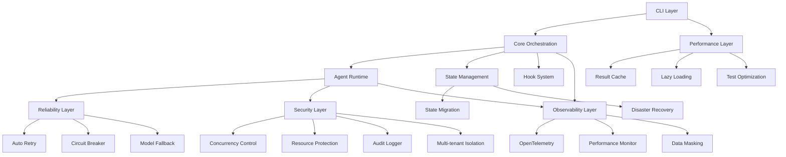
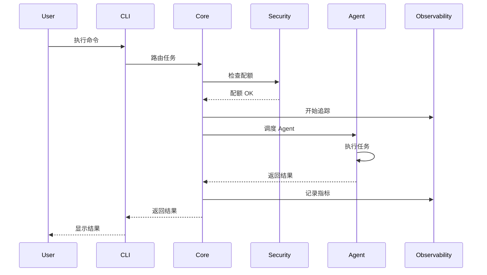
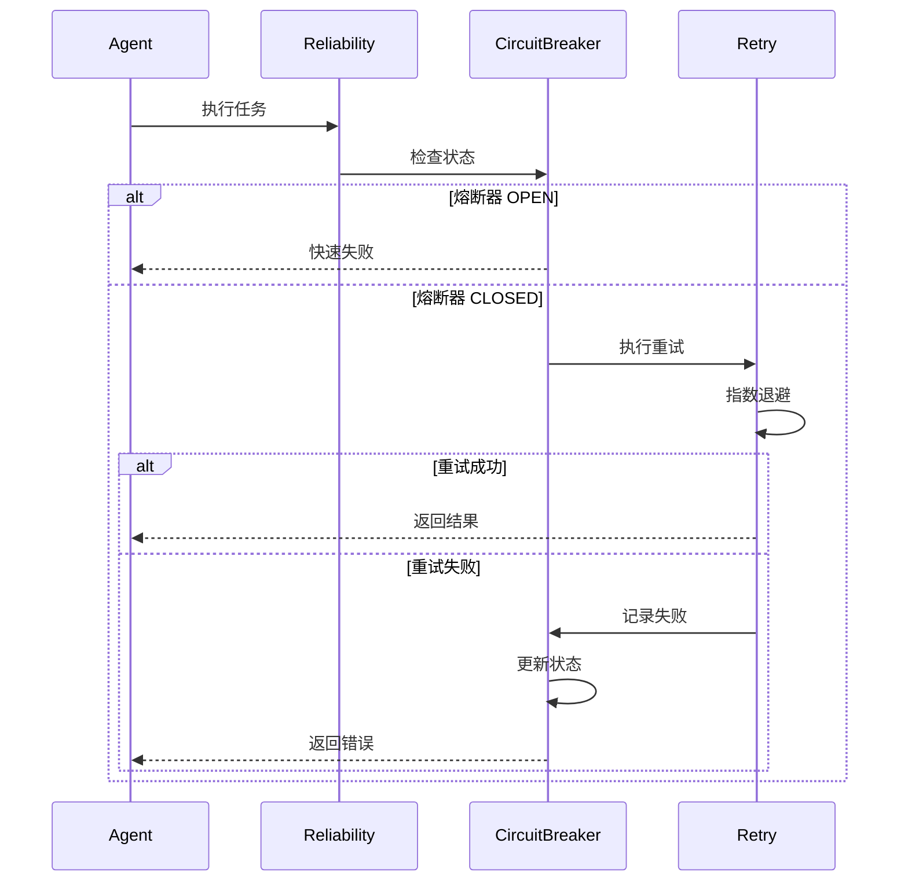
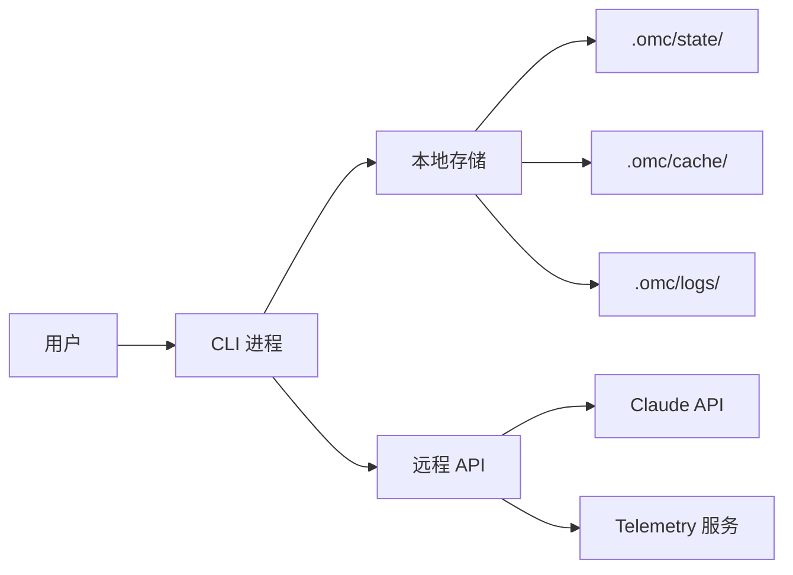

# ultrapower v7.0.1 系统架构设计

**版本**: v7.0.1
**制定日期**: 2026-03-10
**负责人**: Axiom System Architect
**状态**: 待确认

---

## 1. 架构全景图



---

## 2. 分层架构

### 2.1 CLI Layer（用户交互层）
**职责**: 命令解析、进度显示、错误友好化

**组件**:
- `cli/commands/` - 懒加载命令模块
- `cli/progress/` - 实时进度显示
- `cli/errors/` - 用户友好错误系统
- `cli/autocomplete/` - 命令自动补全
- `cli/tutorial/` - 交互式教程

**接口**:
```typescript
interface CLICommand {
  name: string;
  load: () => Promise<CommandHandler>;
  autocomplete?: (partial: string) => string[];
}

interface ProgressReporter {
  start(task: string): void;
  update(progress: number, status: string): void;
  complete(): void;
}
```

---

### 2.2 Core Orchestration（核心编排层）
**职责**: Agent 调度、Hook 执行、状态协调

**组件**:
- `core/agent-router.ts` - Agent 路由与调度
- `core/hook-bridge.ts` - Hook 事件桥接（<200 行）
- `core/state-coordinator.ts` - 状态协调器
- `core/task-executor.ts` - 任务执行引擎

**接口**:
```typescript
interface AgentRouter {
  route(task: Task): Promise<Agent>;
  dispatch(agent: Agent, context: Context): Promise<Result>;
}

interface HookBridge {
  emit(event: HookEvent): Promise<void>;
  register(hook: Hook): void;
}
```

---

### 2.3 Reliability Layer（可靠性层）
**职责**: 自动重试、熔断保护、模型降级

**组件**:
- `reliability/retry-manager.ts` - 重试管理器
- `reliability/circuit-breaker.ts` - 熔断器
- `reliability/model-fallback.ts` - 模型降级策略

**接口**:
```typescript
interface RetryManager {
  execute<T>(fn: () => Promise<T>, policy: RetryPolicy): Promise<T>;
}

interface CircuitBreaker {
  call<T>(fn: () => Promise<T>): Promise<T>;
  getState(): 'CLOSED' | 'OPEN' | 'HALF_OPEN';
}

interface ModelFallback {
  selectModel(preferred: Model, context: Context): Model;
}
```

**重试策略**:
- 指数退避: 1s → 2s → 4s
- 最大重试: 3 次
- 安全分类: 非幂等操作禁止重试

**熔断器状态机**:
```
CLOSED --[5 failures]--> OPEN --[30s timeout]--> HALF_OPEN --[success]--> CLOSED
                                                      |--[failure]--> OPEN
```

---

### 2.4 Security Layer（安全层）
**职责**: 并发控制、资源防护、审计日志、多租户隔离

**组件**:
- `security/concurrency-control.ts` - 并发控制
- `security/resource-guard.ts` - 资源防护
- `security/audit-logger.ts` - 审计日志
- `security/tenant-isolator.ts` - 多租户隔离

**接口**:
```typescript
interface ConcurrencyControl {
  acquireLock(resource: string, version: number): Promise<Lock>;
  releaseLock(lock: Lock): Promise<void>;
  detectDeadlock(): Promise<DeadlockInfo[]>;
}

interface ResourceGuard {
  checkQuota(user: string, resource: ResourceType): Promise<boolean>;
  enforceLimit(user: string, usage: ResourceUsage): Promise<void>;
}

interface AuditLogger {
  log(event: AuditEvent): Promise<void>;
  query(filter: AuditFilter): Promise<AuditEvent[]>;
}

interface TenantIsolator {
  getQuota(userId: string): ResourceQuota;
  enforceIsolation(userId: string, operation: Operation): Promise<void>;
}
```

**资源配额**:
```typescript
interface ResourceQuota {
  maxMemory: number;    // MB
  maxCPU: number;       // cores
  maxDisk: number;      // MB
  maxConcurrent: number; // tasks
  rateLimit: number;    // req/min
}
```

---

### 2.5 State Management（状态管理层）
**职责**: 统一状态存储、迁移、备份恢复

**组件**:
- `state/unified-store.ts` - 统一状态存储
- `state/migration-engine.ts` - 迁移引擎
- `state/backup-manager.ts` - 备份管理器

**接口**:
```typescript
interface UnifiedStore {
  read(key: string): Promise<StateData>;
  write(key: string, data: StateData): Promise<void>;
  transaction(fn: (tx: Transaction) => Promise<void>): Promise<void>;
}

interface MigrationEngine {
  migrate(from: string, to: string): Promise<MigrationResult>;
  rollback(migrationId: string): Promise<void>;
}

interface BackupManager {
  backup(): Promise<BackupId>;
  restore(backupId: BackupId): Promise<void>;
  listBackups(): Promise<BackupInfo[]>;
}
```

**迁移策略**（4 阶段）:
1. **Phase 1**: 新 API 实现（双写模式）
2. **Phase 2**: 数据迁移（后台批量）
3. **Phase 3**: 切换读取（新 API 优先）
4. **Phase 4**: 清理旧代码

---

### 2.6 Observability Layer（可观测性层）
**职责**: 追踪、监控、性能分析、数据脱敏

**组件**:
- `observability/tracer.ts` - OpenTelemetry 追踪
- `observability/monitor.ts` - 性能监控
- `observability/masker.ts` - 数据脱敏

**接口**:
```typescript
interface Tracer {
  startSpan(name: string, attributes?: Record<string, any>): Span;
  endSpan(span: Span): void;
}

interface PerformanceMonitor {
  recordMetric(name: string, value: number, tags?: Record<string, string>): void;
  getMetrics(filter: MetricFilter): Promise<Metric[]>;
}

interface DataMasker {
  mask(data: any): any;
  isSensitive(key: string): boolean;
}
```

---

### 2.7 Performance Layer（性能层）
**职责**: 缓存、懒加载、测试优化

**组件**:
- `performance/cache-manager.ts` - 结果缓存
- `performance/lazy-loader.ts` - 懒加载器
- `performance/test-optimizer.ts` - 测试优化器

**接口**:
```typescript
interface CacheManager {
  get(key: string): Promise<CachedResult | null>;
  set(key: string, value: any, ttl: number): Promise<void>;
  invalidate(pattern: string): Promise<void>;
}

interface LazyLoader {
  register(module: string, loader: () => Promise<any>): void;
  load(module: string): Promise<any>;
}
```

**缓存策略**:
- LRU 淘汰
- TTL: 24 小时
- 用户隔离
- 命中率目标: >40%

---

## 3. 数据流

### 3.1 任务执行流


### 3.2 错误恢复流


---

## 4. 关键技术决策

### 4.1 并发控制
**方案**: 乐观锁 + 版本检查

**理由**:
- 读多写少场景
- 避免死锁
- 性能优于悲观锁

**实现**:
```typescript
interface VersionedState {
  version: number;
  data: any;
  updatedAt: number;
}

async function updateWithVersionCheck(key: string, updater: (data: any) => any) {
  const state = await store.read(key);
  const newData = updater(state.data);

  try {
    await store.write(key, {
      version: state.version + 1,
      data: newData,
      updatedAt: Date.now()
    }, { expectedVersion: state.version });
  } catch (e) {
    if (e.code === 'VERSION_CONFLICT') {
      // 重试或报错
    }
  }
}
```

### 4.2 状态迁移
**方案**: 双写模式 + 分阶段迁移

**理由**:
- 零停机
- 可回滚
- 数据完整性保障

### 4.3 审计日志
**方案**: 追加式日志 + 不可篡改

**理由**:
- 合规性要求
- 性能优化（追加写）
- 防篡改

**存储格式**:
```typescript
interface AuditEvent {
  id: string;
  timestamp: number;
  userId: string;
  action: string;
  resource: string;
  result: 'success' | 'failure';
  metadata: Record<string, any>;
  signature: string; // HMAC 签名
}
```

---

## 5. 非功能性需求

### 5.1 性能
- CLI 启动: <120ms
- Agent 启动: <300ms
- 快速测试: <5s
- 完整测试: <15s

### 5.2 可靠性
- 任务成功率: >98%
- 错误自动恢复率: >80%
- 并发冲突率: <5%

### 5.3 安全
- P0 漏洞: 0
- 缓存隔离率: 100%
- 数据损坏率: 0%

### 5.4 可扩展性
- 支持 100+ 并发任务
- 支持 1000+ 用户
- 支持 10TB+ 审计日志

---

## 6. 技术栈

### 6.1 核心
- TypeScript 5.x
- Node.js 20+
- SQLite（状态存储）

### 6.2 可观测性
- OpenTelemetry
- Prometheus（指标）
- Jaeger（追踪）

### 6.3 测试
- Vitest（单元测试）
- Playwright（E2E 测试）

---

## 7. 部署架构



---

**下一步**: 生成任务 DAG 和 Manifest 清单
