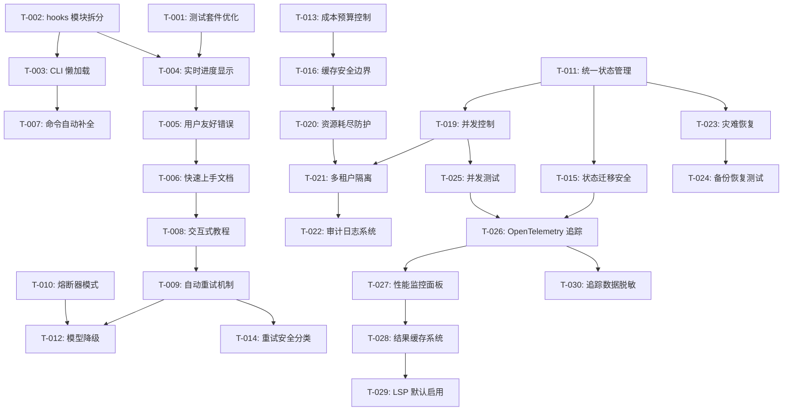

# ultrapower v7.0.1 任务依赖图（DAG）

**版本**: v7.0.1
**制定日期**: 2026-03-10
**负责人**: Axiom System Architect
**状态**: 待确认

---

## 1. 全局依赖图



---

## 2. M1 任务详情（3 周）

### T-001: 测试套件优化
**工期**: 3 天
**依赖**: 无
**产出**:
- 快速测试套件 <5s
- 完整测试套件 <15s
- 测试并行化配置

**验收**:
- [ ] 快速测试执行时间 <5s
- [ ] 完整测试执行时间 <15s
- [ ] 测试覆盖率 >80%

---

### T-002: hooks 模块拆分
**工期**: 7 天
**依赖**: 无
**产出**:
- `bridge.ts` <200 行
- 模块化 hook 处理器
- 启动时间 -30-50%

**验收**:
- [ ] `bridge.ts` 行数 <200
- [ ] CLI 启动时间减少 30%+
- [ ] 所有 hook 测试通过

---

### T-003: CLI 命令懒加载
**工期**: 1 天
**依赖**: T-002
**产出**:
- 懒加载命令注册器
- CLI 启动 -40%

**验收**:
- [ ] CLI 启动时间 <120ms
- [ ] 命令加载延迟 <50ms

---

### T-004: 实时进度显示
**工期**: 2 天
**依赖**: T-001, T-002
**产出**:
- CLI 进度条组件
- Agent 状态指示器

**验收**:
- [ ] 进度条实时更新
- [ ] Agent 状态可见

---

### T-005: 用户友好错误系统
**工期**: 3 天
**依赖**: T-004
**产出**:
- 错误分类器
- 恢复步骤生成器
- 拼写纠正器

**验收**:
- [ ] 错误理解率 >80%
- [ ] 恢复建议准确率 >70%

---

### T-006: 快速上手文档
**工期**: 3 天
**依赖**: T-005
**产出**:
- 15 分钟教程
- 核心概念图解

**验收**:
- [ ] 首次成功时间 <30 分钟
- [ ] 文档完整性 100%

---

### T-007: 命令自动补全
**工期**: 2 天
**依赖**: T-003
**产出**:
- Tab 补全引擎
- Agent/Skill 名称补全

**验收**:
- [ ] 补全准确率 >90%
- [ ] 输入效率 +50%

---

### T-008: 交互式教程
**工期**: 1 周
**依赖**: T-006
**产出**:
- 首次运行引导
- 示例项目模板

**验收**:
- [ ] 教程完成率 >70%
- [ ] 用户满意度 >4.5/5

---

## 3. M2 任务详情（4 月）

### 可靠性任务

### T-009: 自动重试机制
**工期**: 1 周
**依赖**: T-008
**产出**:
- 重试管理器
- 指数退避策略
- 最大重试 3 次

**验收**:
- [ ] 重试成功率 >80%
- [ ] 退避时间准确

---

### T-010: 熔断器模式
**工期**: 1 周
**依赖**: 无
**产出**:
- 三态熔断器
- 连续失败 5 次触发

**验收**:
- [ ] 状态转换正确
- [ ] 快速失败 <10ms

---

### T-011: 统一状态管理层
**工期**: 4 周
**依赖**: 无
**产出**:
- 统一状态存储 API
- 双写模式实现
- 迁移工具

**验收**:
- [ ] 4 阶段迁移完成
- [ ] 数据完整性 100%

---

### T-012: 模型自动降级
**工期**: 3 天
**依赖**: T-009, T-010
**产出**:
- 降级策略: Opus → Sonnet → Haiku
- 成本优化逻辑

**验收**:
- [ ] 降级触发准确
- [ ] 成本降低 >20%

---

### 安全任务

### T-013: 成本预算控制
**工期**: 3 天
**依赖**: 无
**产出**:
- maxTokens/maxCost 限制
- 超限自动停止

**验收**:
- [ ] 预算控制准确率 100%
- [ ] 超限停止延迟 <1s

---

### T-014: 重试机制安全分类
**工期**: 3 天
**依赖**: T-009
**产出**:
- 幂等性检测器
- 非幂等操作禁止重试

**验收**:
- [ ] 分类准确率 >95%
- [ ] 零数据损坏

---

### T-015: 状态迁移完整性保障
**工期**: 1 周
**依赖**: T-011
**产出**:
- 备份机制
- 回滚机制
- 完整性验证

**验收**:
- [ ] 迁移成功率 100%
- [ ] 回滚时间 <5s

---

### T-016: 缓存系统安全边界
**工期**: 1 周
**依赖**: T-013
**产出**:
- 用户隔离机制
- 权限验证

**验收**:
- [ ] 隔离率 100%
- [ ] 零跨用户泄露

---

### T-019: 并发控制机制
**工期**: 1 周
**依赖**: T-011
**产出**:
- 版本检查
- 冲突重试
- 死锁检测

**验收**:
- [ ] 并发冲突率 <5%
- [ ] 死锁检测准确率 >95%

---

### T-020: 资源耗尽防护
**工期**: 1 周
**依赖**: T-016
**产出**:
- 速率限制
- 并发限制
- 磁盘配额

**验收**:
- [ ] 资源耗尽自动恢复
- [ ] 限流准确率 >99%

---

### T-021: 多租户资源隔离
**工期**: 1 周
**依赖**: T-019, T-020
**产出**:
- ResourceQuota 实现
- maxMemory/maxCPU/maxDisk per user

**验收**:
- [ ] 隔离率 100%
- [ ] 配额执行准确率 >99%

---

### T-022: 审计日志系统
**工期**: 1 周
**依赖**: T-021
**产出**:
- AuditLogger
- 不可篡改日志
- HMAC 签名

**验收**:
- [ ] 日志完整性 100%
- [ ] 零篡改事件

---

### T-023: 灾难恢复机制
**工期**: 1 周
**依赖**: T-011
**产出**:
- 定期自动备份
- restore 命令
- 备份验证

**验收**:
- [ ] 备份成功率 >99%
- [ ] 恢复时间 <5 分钟

---

### T-024: 备份恢复测试
**工期**: 3 天
**依赖**: T-023
**产出**:
- 备份恢复测试套件
- 灾难演练脚本

**验收**:
- [ ] 恢复成功率 100%
- [ ] 数据完整性验证通过

---

### T-025: 并发测试增强
**工期**: 1 周
**依赖**: T-019
**产出**:
- 缓存并发写入测试
- 熔断器竞态测试
- 状态冲突测试

**验收**:
- [ ] 并发测试覆盖率 >90%
- [ ] 零竞态条件

---

## 4. M3 任务详情（3 月）

### T-026: OpenTelemetry 追踪
**工期**: 3 周
**依赖**: T-015, T-025
**产出**:
- 标准化追踪
- 采样率 10%
- Jaeger 集成

**验收**:
- [ ] 追踪覆盖率 >80%
- [ ] 性能开销 <5%

---

### T-027: 性能监控面板
**工期**: 2 周
**依赖**: T-026
**产出**:
- P50/P95/P99 延迟
- 吞吐量监控
- 成本监控

**验收**:
- [ ] 指标准确率 >95%
- [ ] 面板响应时间 <2s

---

### T-028: 结果缓存系统
**工期**: 2 周
**依赖**: T-027
**产出**:
- LRU + TTL 缓存
- 安全边界
- 命中率 >40%

**验收**:
- [ ] 缓存命中率 >40%
- [ ] 成本降低 >30%

---

### T-029: LSP 默认启用
**工期**: 3 天
**依赖**: T-028
**产出**:
- executor 自动调用 LSP
- 错误发现率 +70%

**验收**:
- [ ] LSP 调用成功率 >95%
- [ ] 错误发现率提升 >70%

---

### T-030: 追踪数据脱敏
**工期**: 1 周
**依赖**: T-026
**产出**:
- 敏感信息检测器
- 自动脱敏器
- 零信息泄露

**验收**:
- [ ] 脱敏准确率 100%
- [ ] 零敏感信息泄露

---

## 5. 关键路径分析

**关键路径**（最长路径）:
```
T-002 → T-003 → T-007 → (等待 T-006) → T-008 → T-009 → T-012 → (等待 M2) → T-026 → T-027 → T-028 → T-029
```

**总工期**: 10 个月
- M1: 3 周
- M2: 4 月
- M3: 3 月

**并行度**:
- M1: 最多 3 个任务并行
- M2: 最多 5 个任务并行
- M3: 最多 2 个任务并行

---

## 6. 风险任务

| 任务 | 风险等级 | 风险原因 | 缓解措施 |
|------|---------|---------|---------|
| T-011 | 🟡 中 | 状态迁移复杂 | 分 4 阶段，双写模式 |
| T-019 | 🟡 中 | 并发控制难度高 | 乐观锁 + 充分测试 |
| T-021 | 🟡 中 | 多租户隔离复杂 | 参考成熟方案 |
| T-026 | 🟡 中 | OpenTelemetry 集成 | 使用官方 SDK |

---

**下一步**: 生成 Manifest 清单
