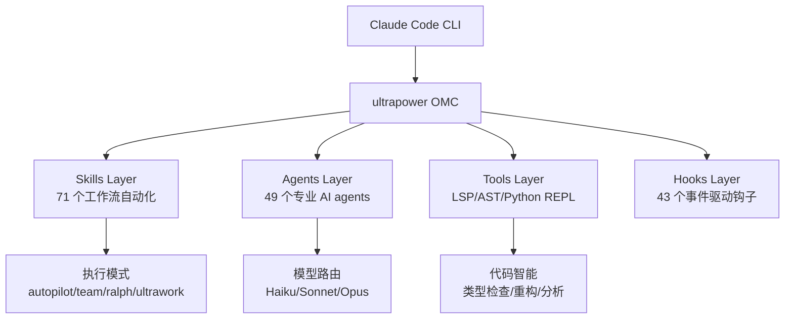
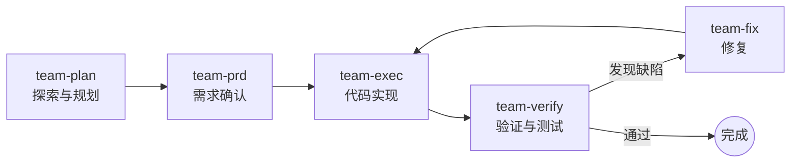
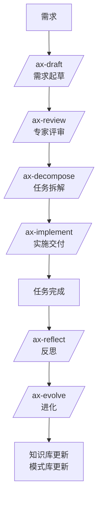

# ultrapower v7.7.2

ultrapower 是 Claude Code 的智能多 Agent 编排层（OMC），在 superpowers 工作流基础上深度融合了 Axiom 框架，提供 **49 个专业 agents**、**71 个 skills** 和完整的 TypeScript hooks 系统。

## 核心能力

* **多 Agent 编排**：Team、ultrawork、ralph、autopilot 等多种执行模式

* **Axiom 框架集成**：LSP/AST 代码智能、持久记忆、MCP 路由

* **完整工作流**：从头脑风暴到代码审查的端到端开发流程

* **自动触发**：Skills 根据上下文自动激活，无需手动调用

## 架构概览



**核心理念**：Superpowers 的严格工作流纪律 + OMC 的并行执行能力

## 快速开始（15 分钟上手）

**新用户？** 查看 [📖 15 分钟快速上手指南](docs/getting-started/quickstart.md) | [核心概念图解](docs/getting-started/concepts.md) | [快速参考卡片](docs/getting-started/quick-reference.md)

### 前置条件

* Node.js >= 18

* Claude Code >= v1.0.0

* Git（用于插件安装）

### 安装步骤

在 Claude Code 会话中运行：

```bash
# 1. 添加 marketplace 并安装
/plugin marketplace add https://github.com/liangjie559567/ultrapower
/plugin install omc@ultrapower

# 2. 运行安装向导
/ultrapower:omc-setup
```

> **Windows 用户注意**：如果安装后 HUD 不显示，运行 `/ultrapower:omc-doctor` 检查路径格式。Claude Code 要求配置文件中使用正斜杠（`C:/Users/...`）而非反斜杠。

### 验证安装

```bash

# 验证安装

/ultrapower:omc-doctor
```

### 第一个示例

```bash

# 使用 autopilot 模式构建一个简单功能

autopilot "创建一个 hello world 函数"
```

### 故障排查

遇到问题？查看 [故障排查指南](docs/TROUBLESHOOTING.md)

### 安全加固

ultrapower v7.7.2 包含全面的安全加固（2026-03-18）：

- **状态文件保护**：原子写入 + 文件锁 + 并发队列，防止竞态条件（BUG-001）
- **输入验证**：递归 10 层原型污染检测，拒绝 `__proto__`/`constructor`/`prototype`（BUG-002）
- **ReDoS 防护**：50KB 输入限制，优化正则表达式（无回溯）（BUG-003）
- **审计日志**：所有安全事件记录到 `.omc/audit.log`，支持事件追踪
- **自动清理**：24 小时后清理陈旧会话状态，防止状态泄漏（BUG-004）
- **关键词冲突解决**：显式模式优先，避免 skill 触发冲突（BUG-005）
- **用户反馈机制**：收集用户反馈，持续改进系统体验

详见 [安全文档](docs/standards/runtime-protection.md)

---

## 基础工作流

> **🛡️ 工作流门禁系统**：ultrapower 自动强制执行 superpowers 工作流纪律。尝试跳过必要步骤时，系统会自动注入对应 skill 并显示警告。

1. **brainstorming** — 代码前必须先设计。通过对话细化需求，探索 2-3 种方案，呈现设计并获批准，保存设计文档。

1. **using-git-worktrees** — 设计批准后创建隔离工作区，新建分支，运行项目初始化，验证测试基线。

1. **writing-plans** — 将工作拆解为 2-5 分钟的原子任务。每个任务包含精确文件路径、完整代码、验证步骤。

1. **subagent-driven-development** / **executing-plans** — 每个任务派发独立 subagent，两阶段审查（规格合规 + 代码质量），或批量执行带检查点。

1. **test-driven-development** — RED-GREEN-REFACTOR：先写失败测试，再写最小实现，再重构。

1. **requesting-code-review** — 任务间审查，按严重程度报告问题，关键问题阻塞进度。

1. **finishing-a-development-branch** — 验证测试，呈现选项（merge/PR/保留/丢弃），清理 worktree。

---

## Agents（49 个）

完整列表请查看 [Agent 参考手册](docs/reference/AGENTS.md)

**核心 Agents**：

* **构建通道**：`explore` (haiku)、`planner` (opus)、`executor` (sonnet)、`architect` (opus)
* **审查通道**：`code-reviewer` (opus)、`security-reviewer` (sonnet)、`quality-reviewer` (sonnet)
* **领域专家**：`designer` (sonnet)、`test-engineer` (sonnet)、`debugger` (sonnet)

---

## Skills（71 个）

完整列表请查看 [Skills 参考手册](docs/reference/SKILLS.md)

**核心 Skills**：

* **工作流**：`autopilot`、`team`、`ralph`、`ultrawork`、`plan`
* **开发**：`brainstorming`、`writing-plans`、`test-driven-development`
* **Axiom**：`ax-draft`、`ax-review`、`ax-decompose`、`ax-implement`

---
| `executing-plans` | 带检查点的批量执行 |
| `subagent-driven-development` | 每任务独立 subagent + 两阶段审查 |
| `test-driven-development` | RED-GREEN-REFACTOR 循环 |
| `systematic-debugging` | 4 阶段根因分析 |
| `verification-before-completion` | 完成前验证 |
| `requesting-code-review` | 代码审查前检查清单 |
| `receiving-code-review` | 响应审查反馈 |
| `using-git-worktrees` | 并行开发分支 |
| `finishing-a-development-branch` | 合并/PR 决策工作流 |
| `next-step-router` | 关键节点推荐最优下一步 |

### Axiom Skills

| Skill | 用途 |
| ------- | ------ |
| `ax-draft` | 需求澄清 → Draft PRD → 用户确认 |
| `ax-review` | 5 专家并行评审 → 聚合 → Rough PRD |
| `ax-decompose` | Rough PRD → 系统架构 → 原子任务 DAG |
| `ax-implement` | 按 Manifest 执行任务，CI 门禁，自动修复 |
| `ax-analyze-error` | 根因诊断 → 自动修复 → 知识队列 |
| `ax-reflect` | 会话反思 → 经验提取 → Action Items |
| `ax-evolve` | 处理学习队列 → 更新知识库 → 模式检测 |
| `ax-status` | 完整系统状态仪表盘 |
| `ax-rollback` | 回滚到最近检查点（需用户确认） |
| `ax-suspend` | 保存会话状态，安全退出 |
| `ax-context` | 直接操作 Axiom 记忆系统 |
| `ax-evolution` | 进化引擎统一入口（evolve/reflect/knowledge/patterns） |
| `ax-knowledge` | 查询 Axiom 知识库 |
| `ax-export` | 导出 Axiom 工作流产物 |

### 增强 Skills

| Skill | 用途 |
| ------- | ------ |
| `deepinit` | 分层 AGENTS.md 代码库文档化 |
| `deepsearch` | 多策略深度代码库搜索 |
| `analyze` | 深度分析与调查（debugger 别名） |
| `sciomc` | 并行 scientist 编排 |
| `external-context` | 并行 document-specialist 网络搜索 |
| `ccg` | Claude-Codex-Gemini 三模型并行编排 |
| `frontend-ui-ux` | UI/UX 专业能力（静默激活） |
| `git-master` | Git 专家，原子提交和历史管理（静默激活） |
| `build-fix` | 修复构建和 TypeScript 错误 |
| `code-review` | 全面代码审查 |
| `security-review` | 安全漏洞检测 |
| `trace` | 显示 agent 流程追踪时间线 |
| `learn-about-omc` | 了解 OMC 使用模式并获取建议 |
| `dispatching-parallel-agents` | 并行分发独立任务给多个 agents |

### 工具类 Skills

| Skill | 用途 |
| ------- | ------ |
| `cancel` | 统一取消所有执行模式 |
| `note` | 保存笔记到抗压缩 notepad |
| `learner` | 从会话中提取可复用 skill |
| `omc-setup` | 一次性安装向导 |
| `mcp-setup` | 配置 MCP 服务器 |
| `hud` | 配置 HUD 状态栏 |
| `omc-doctor` | 诊断并修复安装问题 |
| `omc-help` | 显示 OMC 使用指南 |
| `release` | 自动化发布工作流 |
| `ralph-init` | 初始化 PRD 以进行结构化任务跟踪 |
| `review` | 用 critic 审查工作计划 |
| `writer-memory` | 面向写作者的 agent 记忆系统 |
| `project-session-manager` | 管理隔离开发环境（git worktrees + tmux） |
| `psm` | project-session-manager 别名 |
| `skill` | 管理本地 skills（列出、添加、删除、搜索、编辑） |
| `wizard` | 交互式配置向导 |
| `writing-skills` | 创建/编辑/验证 skills |
| `configure-discord` | 配置 Discord webhook/bot 通知 |
| `configure-telegram` | 配置 Telegram bot 通知 |
| `using-superpowers` | 建立 skill 使用规则 |

---

## 执行模式

### Team 流水线（默认多 Agent 编排器）



* **team-plan**：`explore` + `planner`，可选 `analyst`/`architect`
* **team-prd**：`analyst`，可选 `product-manager`/`critic`
* **team-exec**：`executor` + 任务适配专家
* **team-verify**：`verifier` + 按需审查 agents
* **team-fix**：根据缺陷类型路由到 `executor`/`build-fixer`/`debugger`

**配置要求**：Team 模式需要在 `~/.claude/settings.json` 中启用：
```json
{
  "env": {
    "CLAUDE_CODE_EXPERIMENTAL_AGENT_TEAMS": "1"
  }
}
```

运行 `/ultrapower:omc-setup` 会自动配置此项。

### MCP 路由

对只读分析任务优先使用 MCP 工具（更快更经济）：

* **Codex**（`mcp__x__ask_codex`）：架构审查、规划验证、代码审查

* **Gemini**（`mcp__g__ask_gemini`）：UI/UX 设计、大上下文任务（1M tokens）

### Axiom 代码智能

* **LSP**：hover、goto definition、find references、diagnostics、rename

* **AST**：`ast_grep_search`（结构化模式搜索）、`ast_grep_replace`（结构化转换）

* **Python REPL**：持久数据分析环境

---

## Axiom 自我进化系统

ultrapower 内置 Axiom 自我进化引擎，让 AI 工作流随使用不断优化。

### 核心机制

| 机制 | 说明 |
| ------ | ------ |
| 知识收割 | 每次任务完成后自动提取经验教训，存入知识库 |
| 模式检测 | 识别重复代码模式，达到阈值（出现 ≥3 次）后提升为最佳实践 |
| 工作流优化 | 分析执行指标，发现瓶颈并生成优化建议 |
| 跨会话记忆 | 知识库和模式库跨会话持久化，越用越聪明 |

### Axiom 进化工作流



详细文档请参阅 [docs/EVOLUTION.md](docs/EVOLUTION.md)。

---

## MCP 服务器

ultrapower 提供完整的 MCP（Model Context Protocol）服务器，暴露 35 个自定义工具供 Claude Desktop 和 Cursor 使用。

### 快速开始

```bash

# 启动 MCP 服务器

node bridge/mcp-server.cjs

# 或使用 npm

npm run mcp:start
```

### 配置 Claude Desktop

编辑 `~/.claude/claude_desktop_config.json`：

```json
{
  "mcpServers": {
    "ultrapower": {
      "command": "node",
      "args": ["/path/to/ultrapower/bridge/mcp-server.cjs"],
      "env": {
        "OMC_LOG_LEVEL": "info"
      }
    }
  }
}
```

### 配置 Cursor

在项目根目录创建 `.cursor/mcp.json`：

```json
{
  "mcpServers": {
    "ultrapower": {
      "command": "node",
      "args": ["/path/to/ultrapower/bridge/mcp-server.cjs"],
      "env": {
        "OMC_LOG_LEVEL": "info"
      }
    }
  }
}
```

### 可用工具（35 个）

* **LSP 工具（12 个）**：代码导航、诊断、重构

* **AST 工具（2 个）**：结构化模式匹配和替换

* **Python REPL（1 个）**：持久数据分析环境

* **Notepad 工具（6 个）**：会话记忆管理

* **State 工具（5 个）**：模式状态管理

* **Project Memory 工具（4 个）**：项目级持久记忆

* **Trace 工具（2 个）**：Agent 流程追踪分析

* **Skills 工具（3 个）**：Skill 加载和管理

详见 [docs/guides/mcp-server-usage.md](docs/guides/mcp-server-usage.md)。

---

## 哲学

* **测试驱动开发** — 始终先写测试

* **系统化而非临时** — 流程优于猜测

* **复杂度降低** — 简洁是首要目标

* **证据优于声明** — 声明成功前先验证

---

## 赞助

如果 ultrapower 帮助你完成了有价值的工作，欢迎[赞助开源工作](https://github.com/sponsors/liangjie559567)。

## 贡献

Skills 直接存放在本仓库中。贡献方式：

1. Fork 仓库
2. 为你的 skill 创建分支
3. 遵循 `writing-skills` skill 创建和测试新 skill
4. 提交 PR

详见 `skills/writing-skills/SKILL.md`。

## 更新

```bash
/plugin update omc@ultrapower
```

## 许可证

MIT License — 详见 LICENSE 文件

## 支持

* **Issues**: <<https://github.com/liangjie559567/ultrapower/issues>>

* **Marketplace**: <<https://github.com/liangjie559567/ultrapower>>

* **安装部署教程**: [docs/INSTALL.md](docs/INSTALL.md)

* **完整参考文档**: [docs/REFERENCE.md](docs/REFERENCE.md)

* **进化系统文档**: [docs/EVOLUTION.md](docs/EVOLUTION.md)

* **主动进化系统**: [docs/NEXUS.md](docs/NEXUS.md)

* **迁移指南**: [docs/MIGRATION.md](docs/MIGRATION.md)
