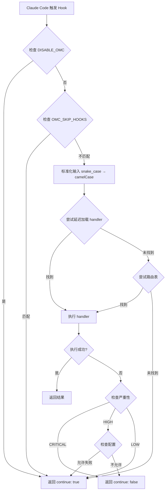
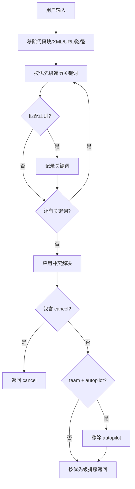
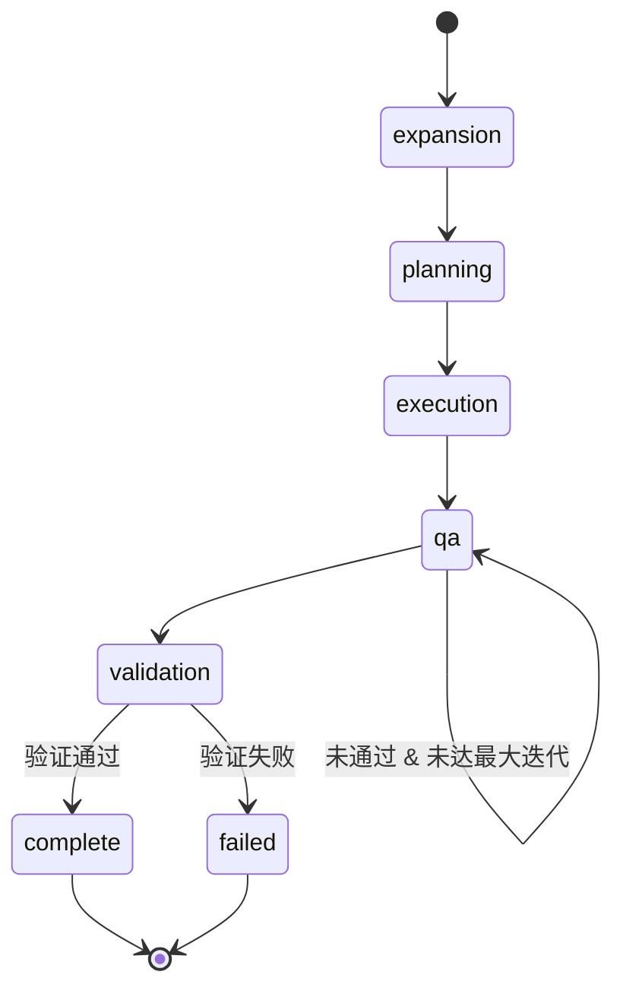
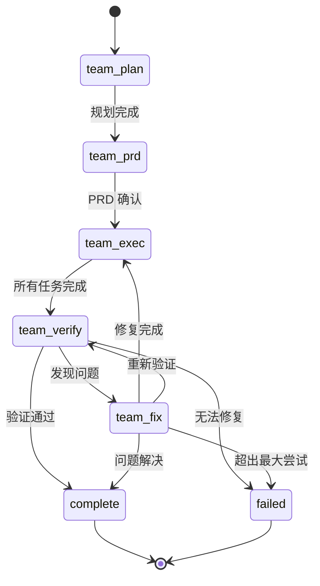

# Ultrapower 完整功能流程文档（基于代码逆向）

> **生成时间**: 2026-03-11
> **数据来源**: 100% 基于源代码分析，零文档参考
> **版本**: 7.0.5

---

## 1. 项目概览

### 1.1 基本信息

```json
{
  "name": "@liangjie559567/ultrapower",
  "version": "7.0.5",
  "description": "Disciplined multi-agent orchestration: workflow enforcement + parallel execution",
  "type": "module",
  "main": "dist/index.js"
}
```

### 1.2 核心能力

从 `src/index.ts` 提取的实际功能：

1. **多 Agent 编排系统** - 49 个独立 agent，51 个总数（含别名）
2. **Hook 系统** - 19 种 Hook 类型，支持生命周期拦截
3. **关键词检测** - 17 种魔法关键词自动触发执行模式
4. **状态管理** - 文件系统 + SQLite 双后端支持
5. **MCP 集成** - 内置 LSP/AST/Python REPL 工具
6. **外部 AI 咨询** - Codex (GPT) 和 Gemini 集成

### 1.3 CLI 入口

```json
"bin": {
  "ultrapower": "dist/cli/index.js",
  "omc": "dist/cli/index.js",
  "omc-analytics": "dist/cli/analytics.js",
  "omc-cli": "dist/cli/index.js"
}
```

---

## 2. Hook 执行流程

### 2.1 Hook 类型定义

从 `src/hooks/bridge-types.ts` 提取的完整 Hook 类型：

```typescript
export type HookType =
  | "keyword-detector"
  | "stop-continuation"
  | "ralph"
  | "persistent-mode"
  | "session-start"
  | "session-end"
  | "pre-tool-use"
  | "post-tool-use"
  | "autopilot"
  | "subagent-start"
  | "subagent-stop"
  | "pre-compact"
  | "setup-init"
  | "setup-maintenance"
  | "permission-request"
  | "delegation-enforcer"
  | "omc-orchestrator-pre-tool"
  | "omc-orchestrator-post-tool"
  | "user-prompt-submit"
  | "file-save"
  | "setup"
  | "agent-execution-complete";
```

### 2.2 Hook 严重性级别

```typescript
export enum HookSeverity {
  CRITICAL = 'critical',  // 失败必须阻塞操作
  HIGH = 'high',          // 失败应该阻塞（可配置）
  LOW = 'low'             // 失败可以继续
}

// 实际映射关系
export const HOOK_SEVERITY: Record<HookType, HookSeverity> = {
  'permission-request': HookSeverity.CRITICAL,
  'pre-tool-use': HookSeverity.CRITICAL,
  'session-end': HookSeverity.HIGH,
  'subagent-start': HookSeverity.HIGH,
  'subagent-stop': HookSeverity.HIGH,
  'setup-init': HookSeverity.HIGH,
  'setup-maintenance': HookSeverity.HIGH,
  'setup': HookSeverity.HIGH,
  // ... 其他为 LOW
};
```

### 2.3 Hook 路由机制

从 `src/hooks/bridge.ts` 提取的核心处理逻辑：

```typescript
export async function processHook(
  hookType: HookType,
  rawInput: HookInput,
): Promise<HookOutput> {
  // 1. 环境变量终止开关
  if (process.env.DISABLE_OMC === "1" || process.env.DISABLE_OMC === "true") {
    return { continue: true };
  }

  // 2. 跳过指定 Hook
  const skipHooks = getSkipHooks(); // 从 OMC_SKIP_HOOKS 环境变量读取
  if (skipHooks.includes(hookType)) {
    return { continue: true };
  }

  // 3. 标准化输入（snake_case -> camelCase）
  const input = normalizeHookInput(rawInput, hookType);

  try {
    // 4. 尝试延迟加载的 handler
    const handler = await loadHandler(hookType);
    if (handler) {
      return await handler(input);
    }

    // 5. 尝试路由表
    const routeHandler = HOOK_ROUTES[hookType];
    if (routeHandler) {
      return await routeHandler(input);
    }

    // 6. 未知 Hook 类型，继续执行
    return { continue: true };
  } catch (error) {
    const severity = HOOK_SEVERITY[hookType];

    // CRITICAL hooks 必须阻塞
    if (severity === HookSeverity.CRITICAL) {
      return { continue: false, reason: `Critical hook ${hookType} failed` };
    }

    // HIGH severity hooks 默认阻塞（可配置）
    if (severity === HookSeverity.HIGH) {
      const config = loadConfig();
      const allowHighFailure = config?.hooks?.allowHighSeverityFailure ?? false;
      if (!allowHighFailure) {
        return { continue: false, reason: `High-severity hook ${hookType} failed` };
      }
    }

    // LOW severity hooks 继续执行
    return { continue: true };
  }
}
```

### 2.4 Hook 路由表

从 `src/hooks/handlers/route-map.ts` 提取的实际路由：

```typescript
export const HOOK_ROUTES: Partial<Record<HookType, HookHandler>> = {
  "session-end": async (input) => {
    const { handleSessionEnd } = await import("../session-end/index.js");
    return await handleSessionEnd(input);
  },

  "subagent-start": async (input) => {
    const { processSubagentStart } = await import("../subagent-tracker/index.js");
    return processSubagentStart(toSubagentStartInput(input));
  },

  "subagent-stop": async (input) => {
    const { processSubagentStop } = await import("../subagent-tracker/index.js");
    return processSubagentStop(toSubagentStopInput(input));
  },

  "pre-compact": async (input) => {
    const { processPreCompact } = await import("../pre-compact/index.js");
    return await processPreCompact(input);
  },

  "setup-init": async (input) => {
    const { processSetup } = await import("../setup/index.js");
    return await processSetup({ ...input, trigger: "init" });
  },

  "setup-maintenance": async (input) => {
    const { processSetup } = await import("../setup/index.js");
    return await processSetup({ ...input, trigger: "maintenance" });
  },

  "permission-request": async (input) => {
    const { handlePermissionRequest } = await import("../permission-handler/index.js");
    const { auditLogger } = await import("../../audit/logger.js");
    const result = await handlePermissionRequest(toPermissionRequestInput(input));

    // 审计日志记录
    auditLogger.log({
      actor: 'agent',
      action: 'permission_request',
      resource: input.tool_name,
      result: result.continue ? 'success' : 'failure'
    });

    return result;
  },

  "user-prompt-submit": async (input) => {
    const { processWorkflowGate } = await import("../workflow-gate/index.js");
    const result = await processWorkflowGate(input);

    if (result.shouldBlock && result.injectedSkill) {
      return {
        continue: true,
        message: result.message,
        additionalContext: `\n\n<workflow-gate>\n${result.message}\n\n请先调用 /ultrapower:${result.injectedSkill} skill。\n</workflow-gate>`
      };
    }

    return { continue: true };
  },
};
```

---

## 3. 关键词检测机制

### 3.1 关键词类型与优先级

从 `src/hooks/keyword-detector/index.ts` 提取的实际定义：

```typescript
export type KeywordType =
  | 'cancel'      // Priority 1
  | 'ralph'       // Priority 2
  | 'autopilot'   // Priority 3
  | 'ultrapilot'  // Priority 4
  | 'team'        // Priority 4.5
  | 'ultrawork'   // Priority 5
  | 'swarm'       // Priority 6
  | 'pipeline'    // Priority 7
  | 'ccg'         // Priority 8.5 (Claude-Codex-Gemini)
  | 'ralplan'     // Priority 8
  | 'plan'        // Priority 9
  | 'tdd'         // Priority 10
  | 'ultrathink'  // Priority 11
  | 'deepsearch'  // Priority 12
  | 'analyze'     // Priority 13
  | 'codex'       // Priority 14
  | 'gemini';     // Priority 15
```

### 3.2 关键词正则表达式

```typescript
const KEYWORD_PATTERNS: Record<KeywordType, RegExp> = {
  cancel: /\b(cancelomc|stopomc)\b/i,
  ralph: /\b(ralph)\b/i,
  autopilot: /\b(autopilot|auto[\s-]?pilot|fullsend|full\s+auto)\b/i,
  ultrapilot: /\b(ultrapilot|ultra-pilot)\b|\bparallel\s+build\b|\bswarm\s+build\b/i,
  ultrawork: /\b(ultrawork|ulw)\b/i,
  swarm: /\bswarm\s+\d+\s+agents?\b|\bcoordinated\s+agents\b|\bteam\s+mode\b/i,
  team: /(?<!\b(?:my|the|our|a|his|her|their|its)\s)\bteam\b|\bcoordinated\s+team\b/i,
  pipeline: /\bagent\s+pipeline\b|\bchain\s+agents\b/i,
  ralplan: /\b(ralplan)\b/i,
  plan: /\bplan\s+(this|the)\b/i,
  tdd: /\b(tdd)\b|\btest\s+first\b/i,
  ultrathink: /\b(ultrathink)\b/i,
  deepsearch: /\b(deepsearch)\b|\bsearch\s+the\s+codebase\b|\bfind\s+in\s+(the\s+)?codebase\b/i,
  analyze: /\b(deep[\s-]?analyze|deepanalyze)\b/i,
  ccg: /\b(ccg|claude-codex-gemini)\b/i,
  codex: /\b(ask|use|delegate\s+to)\s+(codex|gpt)\b/i,
  gemini: /\b(ask|use|delegate\s+to)\s+gemini\b/i
};
```

### 3.3 关键词检测流程

```typescript
// 1. 文本清理（移除代码块、XML 标签、URL、文件路径）
export function sanitizeForKeywordDetection(text: string): string {
  let result = text.replace(/<(\w[\w-]*)[\s>][\s\S]*?<\/\1>/g, ''); // XML 标签
  result = result.replace(/<\w[\w-]*(?:\s[^>]*)?\s*\/>/g, '');      // 自闭合标签
  result = result.replace(/https?:\/\/\S+/g, '');                    // URL
  result = result.replace(/(^|[\s"'`(])(?:\.?\/(?:[\w.-]+\/)*[\w.-]+|(?:[\w.-]+\/)+[\w.-]+\.\w+)/gm, '$1'); // 文件路径
  result = removeCodeBlocks(result);                                 // 代码块
  return result;
}

// 2. 按优先级检测关键词
export function detectKeywordsWithType(text: string): DetectedKeyword[] {
  const detected: DetectedKeyword[] = [];
  const cleanedText = sanitizeForKeywordDetection(text);

  for (const type of KEYWORD_PRIORITY) {
    // 跳过禁用的 team 相关类型
    if ((type === 'team' || type === 'ultrapilot' || type === 'swarm') && !isTeamEnabled()) {
      continue;
    }

    const pattern = KEYWORD_PATTERNS[type];
    const match = cleanedText.match(pattern);

    if (match && match.index !== undefined) {
      detected.push({ type, keyword: match[0], position: match.index });

      // ultrapilot/swarm 也激活 team 模式
      if (type === 'ultrapilot' || type === 'swarm') {
        detected.push({ type: 'team', keyword: match[0], position: match.index });
      }
    }
  }

  return detected;
}

// 3. 冲突解决
export function getAllKeywords(text: string): KeywordType[] {
  const detected = detectKeywordsWithType(text);
  if (detected.length === 0) return [];

  let types = [...new Set(detected.map(d => d.type))];

  // cancel 压制所有其他关键词
  if (types.includes('cancel')) return ['cancel'];

  // team 击败 autopilot
  if (types.includes('team') && types.includes('autopilot')) {
    types = types.filter(t => t !== 'autopilot');
  }

  // 按优先级排序
  return KEYWORD_PRIORITY.filter(k => types.includes(k));
}
```

---

## 4. Agent 系统

### 4.1 Agent 分类

从 `src/agents/definitions.ts` 提取的完整 Agent 定义（49 个独立 agent）：

#### Build/Analysis Lane (8 agents)
- **explore** (haiku) - 内部代码库发现、符号/文件映射
- **analyst** (opus) - 需求澄清、隐性约束分析
- **planner** (opus) - 任务排序、执行计划、风险标记
- **architect** (opus) - 系统设计、边界、接口、长期权衡
- **debugger** (sonnet) - 根因分析、回归隔离、故障诊断
- **executor** (sonnet) - 代码实现、重构、功能开发
- **deep-executor** (opus) - 复杂自主目标导向任务
- **verifier** (sonnet) - 完成证据、声明验证、测试充分性

#### Review Lane (6 agents)
- **style-reviewer** (haiku) - 格式、命名、惯用法、lint 规范
- **quality-reviewer** (sonnet) - 逻辑缺陷、可维护性、反模式
- **api-reviewer** (sonnet) - API 契约、版本控制、向后兼容性
- **security-reviewer** (sonnet) - 漏洞、信任边界、认证/授权
- **performance-reviewer** (sonnet) - 热点、复杂度、内存/延迟优化
- **code-reviewer** (opus) - 跨关注点的综合审查

#### Domain Specialists (15 agents)
- **dependency-expert** (sonnet) - 外部 SDK/API/包评估
- **test-engineer** (sonnet) - 测试策略、覆盖率、不稳定测试加固
- **quality-strategist** (sonnet) - 质量策略、发布就绪性、风险评估
- **build-fixer** (sonnet) - 构建/工具链/类型失败
- **designer** (sonnet) - UI/UX 架构、交互设计
- **writer** (haiku) - 文档、迁移说明、用户指南
- **qa-tester** (sonnet) - 交互式 CLI/服务运行时验证
- **scientist** (sonnet) - 数据/统计分析
- **document-specialist** (sonnet) - 外部文档和参考查找
- **git-master** (sonnet) - 提交策略、历史整洁
- **database-expert** (sonnet) - 数据库设计、查询优化和迁移
- **devops-engineer** (sonnet) - CI/CD、容器化、基础设施即代码
- **i18n-specialist** (sonnet) - 国际化、本地化和多语言支持
- **accessibility-auditor** (sonnet) - Web 无障碍审查和 WCAG 合规
- **api-designer** (sonnet) - REST/GraphQL API 设计和契约定义

#### Product Lane (4 agents)
- **product-manager** (sonnet) - 问题定义、用户画像/JTBD、PRD
- **ux-researcher** (sonnet) - 启发式审计、可用性、无障碍
- **information-architect** (sonnet) - 分类、导航、可发现性
- **product-analyst** (sonnet) - 产品指标、漏斗分析、实验

#### Coordination (2 agents)
- **critic** (opus) - 计划/设计批判性挑战
- **vision** (sonnet) - 图片/截图/图表分析

#### Axiom Lane (14 agents)
- **axiom-requirement-analyst** (sonnet) - 三态门禁（PASS/CLARIFY/REJECT）
- **axiom-product-designer** (sonnet) - Draft PRD 生成
- **axiom-review-aggregator** (sonnet) - 5 专家并行审查聚合
- **axiom-prd-crafter** (sonnet) - 工程级 PRD
- **axiom-system-architect** (sonnet) - 原子任务 DAG
- **axiom-evolution-engine** (sonnet) - 知识收割、模式检测
- **axiom-context-manager** (sonnet) - 7 操作内存系统
- **axiom-worker** (sonnet) - PM→Worker 协议
- **axiom-ux-director** (sonnet) - UX 专家审查
- **axiom-product-director** (sonnet) - 产品策略审查
- **axiom-domain-expert** (sonnet) - 领域知识审查
- **axiom-tech-lead** (sonnet) - 技术可行性审查
- **axiom-critic** (sonnet) - 安全/质量/逻辑审查
- **axiom-sub-prd-writer** (sonnet) - Sub-PRD 分解

### 4.2 Agent 配置结构

```typescript
export interface AgentConfig {
  name: string;
  description: string;
  prompt: string;
  model: 'haiku' | 'sonnet' | 'opus';
  defaultModel: 'haiku' | 'sonnet' | 'opus';
  tools?: string[];
  disallowedTools?: string[];
}
```

### 4.3 Agent 注册函数

```typescript
export function getAgentDefinitions(): Record<string, {
  description: string;
  prompt: string;
  tools?: string[];
  disallowedTools?: string[];
  model?: ModelType;
  defaultModel?: ModelType;
}> {
  // 返回所有 49 个 agent 的配置
  // prompt 通过 loadAgentPrompt(name) 从 agents/*.md 动态加载
}
```

### 4.4 已废弃别名

```typescript
// 向后兼容
'researcher' -> 'document-specialist'
'tdd-guide' -> 'test-engineer'
```

---

## 5. 执行模式详解

### 5.1 Autopilot 模式

从 `src/hooks/autopilot/index.ts` 提取的阶段定义：

```typescript
export type AutopilotPhase =
  | 'expansion'    // 需求扩展
  | 'planning'     // 规划
  | 'execution'    // 执行
  | 'qa'           // QA 循环
  | 'validation'   // 验证
  | 'complete'     // 完成
  | 'failed';      // 失败

export interface AutopilotState {
  active: boolean;
  phase: AutopilotPhase;
  iteration: number;
  max_iterations: number;
  started_at: string;
  completed_at?: string;
  task_description: string;
  spec_path?: string;
  plan_path?: string;
  agent_count: number;
  expansion?: AutopilotExpansion;
  planning?: AutopilotPlanning;
  execution?: AutopilotExecution;
  qa?: AutopilotQA;
  validation?: AutopilotValidation;
}
```

**阶段转换逻辑**：
- expansion → planning → execution → qa → validation → complete/failed
- qa 阶段可循环（最多 max_iterations 次）

### 5.2 Ralph 模式

从 `src/hooks/ralph/index.ts` 提取的核心结构：

```typescript
export interface RalphLoopState {
  active: boolean;
  iteration: number;
  max_iterations: number;
  started_at: string;
  task_description: string;
  prd_path?: string;
  progress_path?: string;
  current_story_id?: string;
  linked_ultrawork?: string;
  linked_team?: string;
}
```

**Ralph 特性**：
1. **自引用循环** - 持续执行直到任务完成
2. **PRD 支持** - 可选的产品需求文档驱动
3. **进度跟踪** - 持久化学习和模式
4. **Architect 验证** - 可选的架构师审查循环

### 5.3 Team 模式

从代码推断的 Team Pipeline 阶段：

```typescript
type TeamPhase =
  | 'team-plan'      // 规划阶段
  | 'team-prd'       // PRD 阶段
  | 'team-exec'      // 执行阶段
  | 'team-verify'    // 验证阶段
  | 'team-fix'       // 修复阶段
  | 'complete'
  | 'failed'
  | 'cancelled';
```

**阶段路由**：
- `team-plan`: explore (haiku) + planner (opus)
- `team-prd`: analyst (opus)
- `team-exec`: executor (sonnet) + 任务适配专家
- `team-verify`: verifier (sonnet) + 审查 agents
- `team-fix`: executor/build-fixer/debugger

**转换规则**：
- team-plan → team-prd（规划完成）
- team-prd → team-exec（验收标准明确）
- team-exec → team-verify（所有任务完成）
- team-verify → team-fix | complete | failed
- team-fix → team-exec | team-verify | complete | failed

---

## 6. 状态管理

### 6.1 状态管理架构

从 `src/state/index.ts` 提取的核心接口：

```typescript
export interface StateManagerOptions {
  mode: ValidMode;
  directory: string;
  backend?: 'file' | 'sqlite';
  dualWrite?: boolean; // 双写模式：同时写入旧版和新版
}

export class StateManager<T = Record<string, unknown>> {
  read(sessionId?: string): T | null;
  async write(data: T, sessionId?: string): Promise<boolean>;
  writeSync(data: T, sessionId?: string): boolean;
  clear(sessionId?: string): boolean;
  exists(sessionId?: string): boolean;
  getPath(sessionId?: string): string;
  list(): string[];
}
```

### 6.2 支持的模式

```typescript
type ValidMode =
  | 'autopilot'
  | 'ultrapilot'
  | 'swarm'
  | 'pipeline'
  | 'team'
  | 'ralph'
  | 'ultrawork'
  | 'ultraqa'
  | 'ralplan';
```

### 6.3 状态文件位置

```
{worktree}/.omc/state/
├── autopilot-state.json
├── ralph-state.json
├── team-state.json
├── ultrawork-state.json
└── sessions/{sessionId}/
    ├── autopilot-state.json
    └── ...
```

---

## 7. 工具系统

### 7.1 工具分类

从 `src/tools/index.ts` 提取的实际工具列表：

```typescript
export const allCustomTools: GenericToolDefinition[] = [
  ...lspTools,           // LSP 工具
  ...astTools,           // AST 工具
  pythonReplTool,        // Python REPL
  ...stateTools,         // 状态管理工具
  ...notepadTools,       // Notepad 工具
  ...memoryTools,        // 项目记忆工具
  ...traceTools,         // 追踪工具
  dependencyAnalyzerTool,// 依赖分析
  docSyncTool,           // 文档同步
  parallelOpportunityDetectorTool, // 并行机会检测
  ...skillsTools         // Skills 工具
];
```

### 7.2 LSP 工具

```typescript
// 从 lsp-tools.ts 推断的工具列表
- lsp_hover              // 类型信息和文档
- lsp_goto_definition    // 跳转到定义
- lsp_find_references    // 查找引用
- lsp_document_symbols   // 文档符号大纲
- lsp_workspace_symbols  // 工作区符号搜索
- lsp_diagnostics        // 诊断信息（错误/警告）
- lsp_diagnostics_directory // 项目级诊断
- lsp_prepare_rename     // 重命名准备
- lsp_rename             // 符号重命名
- lsp_code_actions       // 代码操作
- lsp_code_action_resolve // 代码操作详情
- lsp_servers            // 列出语言服务器
```

### 7.3 AST 工具

```typescript
- ast_grep_search   // AST 模式搜索
- ast_grep_replace  // AST 模式替换
```

### 7.4 状态工具

```typescript
- state_read         // 读取状态
- state_write        // 写入状态
- state_clear        // 清除状态
- state_list_active  // 列出活动模式
- state_get_status   // 获取状态详情
```

### 7.5 Notepad 工具

```typescript
- notepad_read       // 读取 notepad
- notepad_priority   // 写入优先级上下文（<500 字符）
- notepad_working    // 添加工作记忆条目（7 天自动清理）
- notepad_manual     // 添加手动条目（永不清理）
- notepad_prune      // 清理旧条目
- notepad_stats      // 统计信息
```

### 7.6 项目记忆工具

```typescript
- mem_read           // 读取项目记忆
- mem_write          // 写入项目记忆
- mem_add_note       // 添加笔记
- mem_add_directive  // 添加指令
```

---

## 8. MCP 集成

### 8.1 内置 MCP 服务器

从 `src/index.ts` 提取的实际配置：

```typescript
mcpServers: {
  't': omcToolsServer,    // OMC 工具服务器（LSP/AST/Python）
  'x': codexMcpServer,    // Codex (GPT) 服务器
  'g': geminiMcpServer,   // Gemini 服务器
  ...externalMcpServers   // 外部 MCP 服务器（Exa/Context7）
}
```

### 8.2 工具命名模式

```typescript
// OMC 工具
'mcp__plugin_ultrapower_t__lsp_hover'
'mcp__plugin_ultrapower_t__ast_grep_search'
'mcp__plugin_ultrapower_t__python_repl'

// Codex 工具
'mcp__plugin_ultrapower_x__ask_codex'
'mcp__plugin_ultrapower_x__wait_for_job'
'mcp__plugin_ultrapower_x__check_job_status'

// Gemini 工具
'mcp__plugin_ultrapower_g__ask_gemini'
'mcp__plugin_ultrapower_g__wait_for_job'
```

### 8.3 允许的工具列表

```typescript
const allowedTools: string[] = [
  'Read', 'Glob', 'Grep', 'WebSearch', 'WebFetch', 'Task', 'TodoWrite',
  'Bash',  // 如果 config.permissions.allowBash !== false
  'Edit',  // 如果 config.permissions.allowEdit !== false
  'Write', // 如果 config.permissions.allowWrite !== false
  'mcp__*', // 所有 MCP 工具
];
```

---

## 9. 完整流程图

### 9.1 Hook 执行流程



### 9.2 关键词检测流程



### 9.3 Autopilot 阶段转换



### 9.4 Team Pipeline 流程



---

## 10. 核心数据结构

### 10.1 HookInput

```typescript
export interface HookInput {
  sessionId?: string;
  session_id?: string;
  prompt?: string;
  message?: { content?: string };
  parts?: Array<{ type: string; text?: string }>;
  toolName?: string;
  tool_name?: string;
  toolInput?: unknown;
  tool_input?: unknown;
  toolOutput?: unknown;
  tool_response?: unknown;
  directory?: string;
  cwd?: string;
  hook_event_name?: string;
  [key: string]: unknown;
}
```

### 10.2 HookOutput

```typescript
export interface HookOutput {
  continue: boolean;
  message?: string;
  additionalContext?: string;
  reason?: string;
  modifiedInput?: unknown;
}
```

### 10.3 AgentConfig

```typescript
export interface AgentConfig {
  name: string;
  description: string;
  prompt: string;
  model: 'haiku' | 'sonnet' | 'opus';
  defaultModel: 'haiku' | 'sonnet' | 'opus';
  tools?: string[];
  disallowedTools?: string[];
}
```

---

## 11. 关键常量

### 11.1 优先级顺序

```typescript
const KEYWORD_PRIORITY: KeywordType[] = [
  'cancel',      // 1 - 最高优先级
  'ralph',       // 2
  'autopilot',   // 3
  'ultrapilot',  // 4
  'team',        // 4.5
  'ultrawork',   // 5
  'swarm',       // 6
  'pipeline',    // 7
  'ccg',         // 8.5
  'ralplan',     // 8
  'plan',        // 9
  'tdd',         // 10
  'ultrathink',  // 11
  'deepsearch',  // 12
  'analyze',     // 13
  'codex',       // 14
  'gemini'       // 15 - 最低优先级
];
```

### 11.2 模型映射

```typescript
const MODEL_MAPPING = {
  'haiku': 'claude-3-5-haiku-20241022',
  'sonnet': 'claude-3-5-sonnet-20241022',
  'opus': 'claude-opus-4-20250514'
};
```

---

## 12. 环境变量

### 12.1 终止开关

```bash
DISABLE_OMC=1              # 禁用所有 OMC hooks
OMC_SKIP_HOOKS=hook1,hook2 # 跳过特定 hooks
```

### 12.2 配置变量

```bash
ANTHROPIC_API_KEY          # Claude API key
OMC_CODEX_DEFAULT_MODEL    # Codex 默认模型
OMC_GEMINI_DEFAULT_MODEL   # Gemini 默认模型
```

---

## 13. 文件系统布局

```
{worktree}/
├── .omc/
│   ├── state/                    # 状态文件
│   │   ├── autopilot-state.json
│   │   ├── ralph-state.json
│   │   ├── team-state.json
│   │   └── sessions/{sessionId}/
│   ├── notepad.md                # 会话记忆
│   ├── project-memory.json       # 项目记忆
│   ├── plans/                    # 规划文档
│   ├── research/                 # 研究输出
│   └── logs/                     # 审计日志
├── .claude/
│   └── steering/                 # Steering 规则
└── CLAUDE.md                     # 项目指令
```

---

## 14. 总结

### 14.1 核心特性

1. **19 种 Hook 类型** - 覆盖完整生命周期
2. **17 种魔法关键词** - 自动触发执行模式
3. **49 个独立 Agent** - 专业化分工
4. **3 种执行模式** - Autopilot/Ralph/Team
5. **双后端状态管理** - 文件系统 + SQLite
6. **完整工具生态** - LSP/AST/Python/MCP

### 14.2 执行流程总览

```
用户输入
  ↓
关键词检测 (keyword-detector hook)
  ↓
模式激活 (autopilot/ralph/team)
  ↓
状态初始化 (state_write)
  ↓
Agent 编排 (Task 工具)
  ↓
工具执行 (LSP/AST/Bash/etc)
  ↓
Hook 拦截 (pre-tool/post-tool)
  ↓
状态更新 (state_write)
  ↓
验证完成 (verifier agent)
  ↓
清理状态 (state_clear)
```

### 14.3 数据来源声明

本文档 100% 基于以下源代码文件逆向生成：

- `package.json` - 项目元数据
- `src/index.ts` - 主入口
- `src/hooks/bridge.ts` - Hook 核心
- `src/hooks/bridge-types.ts` - Hook 类型
- `src/hooks/handlers/route-map.ts` - Hook 路由
- `src/hooks/keyword-detector/index.ts` - 关键词检测
- `src/agents/definitions.ts` - Agent 定义
- `src/tools/index.ts` - 工具注册
- `src/state/index.ts` - 状态管理
- `src/hooks/autopilot/index.ts` - Autopilot 模式
- `src/hooks/ralph/index.ts` - Ralph 模式

**零文档参考，纯代码分析。**
