# Ultrapower 功能流程深度分析

> 基于真实代码实现的完整流程文档
> 生成时间: 2026-03-11
> 版本: 7.0.5

## 目录

1. [系统架构概览](#系统架构概览)
2. [Hook 执行流程](#hook-执行流程)
3. [关键词检测机制](#关键词检测机制)
4. [核心模式流程](#核心模式流程)
5. [Agent 系统](#agent-系统)
6. [状态管理](#状态管理)
7. [MCP 工具集成](#mcp-工具集成)

---

## 系统架构概览

### 核心组件关系

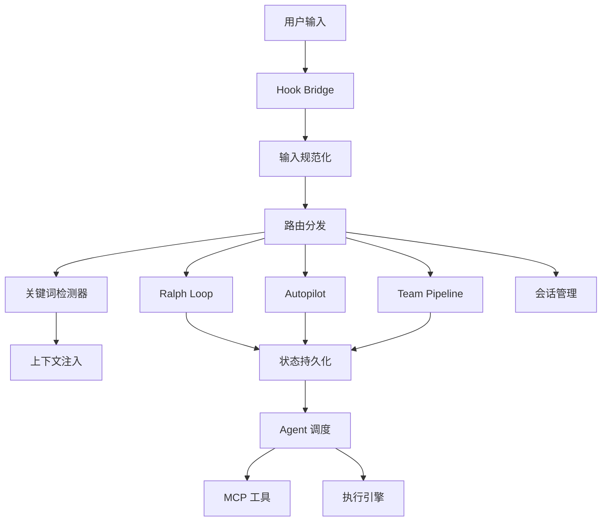

### 项目结构

```
ultrapower/
├── src/
│   ├── hooks/              # Hook 系统核心
│   │   ├── bridge.ts       # Hook 入口与路由
│   │   ├── keyword-detector/  # 关键词检测
│   │   ├── autopilot/      # Autopilot 模式
│   │   ├── ralph/          # Ralph 持久循环
│   │   ├── team-pipeline/  # Team 多 Agent 编排
│   │   └── handlers/       # 各类 Hook 处理器
│   ├── agents/             # Agent 定义
│   │   └── definitions.ts  # 49 个专业 Agent
│   ├── lib/                # 核心库
│   │   └── state.ts        # 状态管理
│   └── mcp/                # MCP 工具服务器
│       └── omc-tools-server.ts
├── bridge/                 # Shell 脚本桥接
├── hooks/                  # Hook 配置
└── skills/                 # Skill 定义
```

---

## Hook 执行流程

### 1. Hook Bridge 入口

**文件**: `src/hooks/bridge.ts`

```typescript
// 主处理函数
export async function processHook(
  hookType: HookType,
  rawInput: HookInput,
): Promise<HookOutput>
```

**执行流程**:

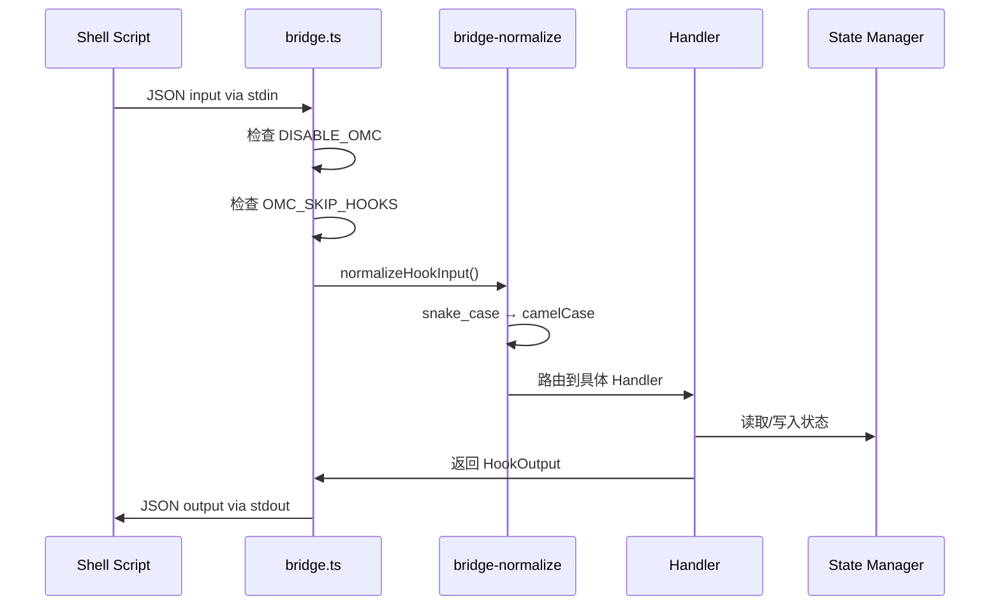

### 2. Hook 类型与路由

**文件**: `src/hooks/handlers/route-map.ts`

支持的 Hook 类型:

| Hook Type | 处理器 | 用途 |
|-----------|--------|------|
| `keyword-detector` | `processKeywordDetector` | 检测魔法关键词 |
| `ralph` | `processRalph` | Ralph 持久循环 |
| `autopilot` | `processAutopilot` | 自主执行模式 |
| `persistent-mode` | `processPersistentMode` | 持久模式管理 |
| `session-start` | `processSessionStart` | 会话初始化 |
| `session-end` | `handleSessionEnd` | 会话清理 |
| `subagent-start` | `processSubagentStart` | 子 Agent 启动追踪 |
| `subagent-stop` | `processSubagentStop` | 子 Agent 停止追踪 |
| `pre-tool-use` | `processPreToolUse` | 工具使用前拦截 |
| `post-tool-use` | `processPostToolUse` | 工具使用后处理 |
| `permission-request` | `handlePermissionRequest` | 权限请求处理 |
| `user-prompt-submit` | `processWorkflowGate` | 工作流门禁 |

### 3. 严重性分级

**文件**: `src/hooks/bridge-types.ts`

```typescript
export enum HookSeverity {
  CRITICAL = 'critical',  // 失败必须阻塞
  HIGH = 'high',          // 默认阻塞（可配置）
  LOW = 'low'             // 失败继续
}
```

**错误处理逻辑**:

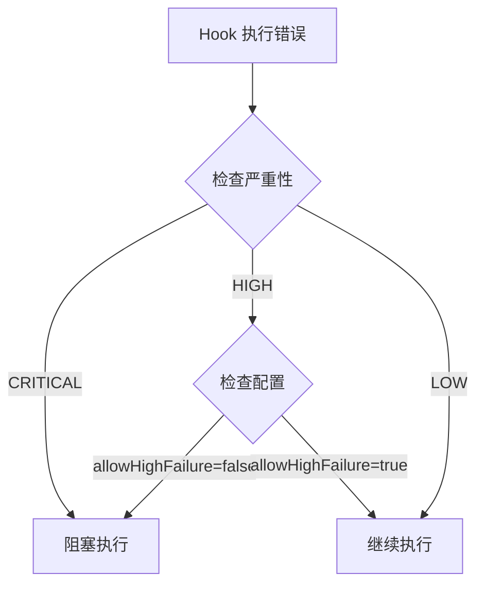

---

## 关键词检测机制

### 1. 检测流程

**文件**: `src/hooks/keyword-detector/index.ts`

```typescript
export function detectKeywordsWithType(
  text: string,
  _agentName?: string
): DetectedKeyword[]
```

**完整流程**:

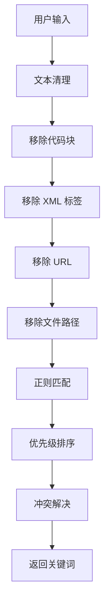

### 2. 关键词优先级

**优先级顺序** (数字越小优先级越高):

```typescript
const KEYWORD_PRIORITY: KeywordType[] = [
  'cancel',      // P1: 取消操作
  'ralph',       // P2: 持久循环
  'autopilot',   // P3: 自主执行
  'ultrapilot',  // P4: 并行构建
  'team',        // P4.5: 团队模式
  'ultrawork',   // P5: 最大并行
  'swarm',       // P6: 群体协作
  'pipeline',    // P7: 流水线
  'ccg',         // P8.5: Claude-Codex-Gemini
  'ralplan',     // P8: 共识规划
  'plan',        // P9: 规划
  'tdd',         // P10: 测试驱动
  'ultrathink',  // P11: 深度思考
  'deepsearch',  // P12: 深度搜索
  'analyze',     // P13: 分析
  'codex',       // P14: Codex 委派
  'gemini'       // P15: Gemini 委派
];
```

### 3. 冲突解决规则

```typescript
// 互斥规则
if (types.includes('cancel')) return ['cancel'];  // cancel 压制一切

if (types.includes('team') && types.includes('autopilot')) {
  types = types.filter(t => t !== 'autopilot');  // team 优先于 autopilot
}

// ultrapilot/swarm 自动激活 team
if (type === 'ultrapilot' || type === 'swarm') {
  detected.push({ type: 'team', ... });
}
```

### 4. 文本清理函数

```typescript
export function sanitizeForKeywordDetection(text: string): string {
  // 1. 移除 XML 标签块
  result = text.replace(/<(\w[\w-]*)[\s>][\s\S]*?<\/\1>/g, '');

  // 2. 移除自闭合 XML 标签
  result = result.replace(/<\w[\w-]*(?:\s[^>]*)?\s*\/>/g, '');

  // 3. 移除 URL
  result = result.replace(/https?:\/\/\S+/g, '');

  // 4. 移除文件路径
  result = result.replace(/(^|[\s"'`(])(?:\.?\/(?:[\w.-]+\/)*[\w.-]+|(?:[\w.-]+\/)+[\w.-]+\.\w+)/gm, '$1');

  // 5. 移除代码块
  result = removeCodeBlocks(result);

  return result;
}
```

---

## 核心模式流程

### 1. Autopilot 模式

**文件**: `src/hooks/autopilot/state.ts`, `src/hooks/autopilot/index.ts`

**阶段流转**:

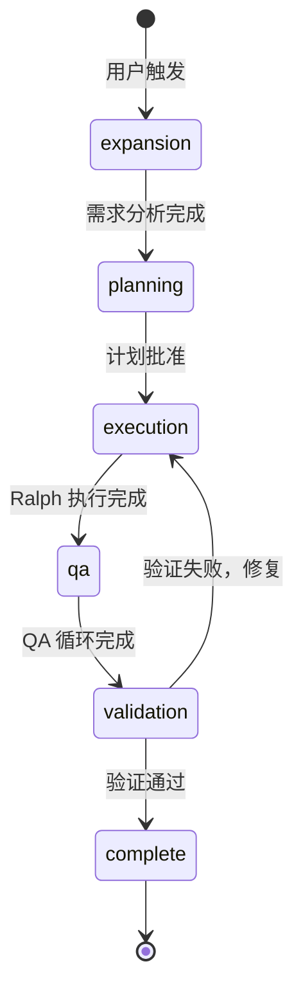

**状态结构**:

```typescript
interface AutopilotState {
  active: boolean;
  phase: 'expansion' | 'planning' | 'execution' | 'qa' | 'validation';
  iteration: number;
  max_iterations: number;
  originalIdea: string;

  expansion: {
    analyst_complete: boolean;
    architect_complete: boolean;
    spec_path: string | null;
  };

  planning: {
    plan_path: string | null;
    approved: boolean;
  };

  execution: {
    ralph_iterations: number;
    tasks_completed: number;
  };

  qa: {
    ultraqa_cycles: number;
    build_status: 'pending' | 'pass' | 'fail';
  };

  validation: {
    architects_spawned: number;
    final_verdict: 'pass' | 'fail' | 'pending';
  };
}
```

### 2. Ralph 持久循环

**文件**: `src/hooks/ralph/loop.ts`

**核心特性**:
- 自引用工作循环，直到用户取消
- 支持 PRD 模式
- 自动激活 Ultrawork 并行执行

**PRD 模式流程**:

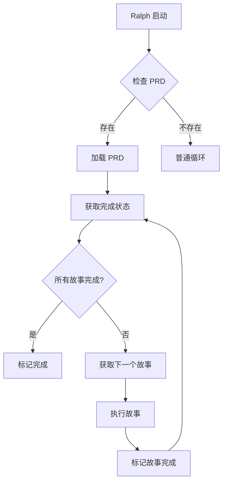

### 3. Team Pipeline 模式

**文件**: `src/hooks/team-pipeline/transitions.ts`

**阶段转换矩阵**:

```typescript
const ALLOWED: Record<TeamPipelinePhase, TeamPipelinePhase[]> = {
  'team-plan': ['team-prd'],
  'team-prd': ['team-exec'],
  'team-exec': ['team-verify'],
  'team-verify': ['team-fix', 'complete', 'failed'],
  'team-fix': ['team-exec', 'team-verify', 'complete', 'failed'],
};
```

**完整流程**:

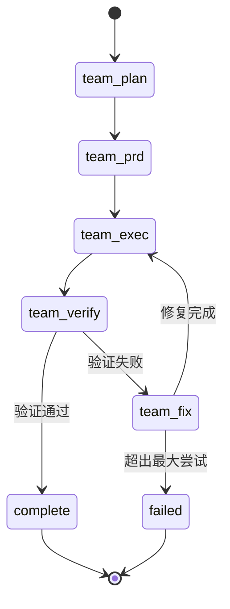

---

## Agent 系统

### 1. Agent 分类体系

**文件**: `src/agents/definitions.ts`

ultrapower 提供 **49 个专业 Agent**（51 个包含别名），分为 6 大通道：

#### 构建/分析通道 (Build/Analysis Lane)

| Agent | 模型 | 职责 |
|-------|------|------|
| `explore` | haiku | 代码库发现、符号映射 |
| `analyst` | opus | 需求澄清、隐性约束分析 |
| `planner` | opus | 任务排序、执行计划 |
| `architect` | opus | 系统设计、接口定义 |
| `debugger` | sonnet | 根因分析、故障诊断 |
| `executor` | sonnet | 代码实现、重构 |
| `deep-executor` | opus | 复杂自主任务 |
| `verifier` | sonnet | 完成验证、测试充分性 |

#### 审查通道 (Review Lane)

| Agent | 模型 | 职责 |
|-------|------|------|
| `style-reviewer` | haiku | 格式、命名、惯用法 |
| `quality-reviewer` | sonnet | 逻辑缺陷、可维护性 |
| `api-reviewer` | sonnet | API 契约、版本控制 |
| `security-reviewer` | sonnet | 安全漏洞、信任边界 |
| `performance-reviewer` | sonnet | 性能热点、复杂度优化 |
| `code-reviewer` | opus | 综合代码审查 |

#### 领域专家 (Domain Specialists)

| Agent | 模型 | 职责 |
|-------|------|------|
| `dependency-expert` | sonnet | SDK/API 评估 |
| `test-engineer` | sonnet | 测试策略、覆盖率 |
| `quality-strategist` | sonnet | 质量策略、发布就绪 |
| `build-fixer` | sonnet | 构建错误修复 |
| `designer` | sonnet | UI/UX 架构 |
| `writer` | haiku | 文档编写 |
| `qa-tester` | sonnet | 运行时验证 |
| `scientist` | sonnet | 数据分析 |
| `git-master` | sonnet | Git 操作专家 |
| `database-expert` | sonnet | 数据库设计 |
| `devops-engineer` | sonnet | CI/CD、容器化 |
| `i18n-specialist` | sonnet | 国际化支持 |
| `accessibility-auditor` | sonnet | 无障碍审查 |
| `api-designer` | sonnet | API 设计 |

#### 产品通道 (Product Lane)

| Agent | 模型 | 职责 |
|-------|------|------|
| `product-manager` | sonnet | 问题定义、PRD |
| `ux-researcher` | sonnet | 启发式审计、可用性 |
| `information-architect` | sonnet | 分类、导航 |
| `product-analyst` | sonnet | 产品指标、实验设计 |

#### 协调 (Coordination)

| Agent | 模型 | 职责 |
|-------|------|------|
| `critic` | opus | 计划审查、批判性挑战 |
| `vision` | sonnet | 图像/截图分析 |

#### Axiom 通道 (14 个专业 Agent)

专门用于 Axiom 工作流的 Agent，包括需求分析、PRD 编写、专家评审、任务分解等。

### 2. Agent 角色消歧

**关键区别**:

```typescript
/**
 * | Agent | 角色 | 做什么 | 不做什么 |
 * |-------|------|--------|----------|
 * | architect | 代码分析 | 分析代码、调试、验证 | 需求、规划、审查计划 |
 * | analyst | 需求分析 | 发现需求缺口 | 代码分析、规划、审查 |
 * | planner | 计划创建 | 创建工作计划 | 需求、代码分析、审查 |
 * | critic | 计划审查 | 审查计划质量 | 需求、代码分析、创建计划 |
 */
```

**标准工作流**:

```
explore → analyst → planner → critic → executor → architect (verify)
```

### 3. Agent 调用示例

```typescript
// 通过 getAgentDefinitions 获取所有 Agent
const agents = getAgentDefinitions();

// Agent 配置结构
interface AgentConfig {
  name: string;
  description: string;
  prompt: string;
  model: 'haiku' | 'sonnet' | 'opus';
  defaultModel: ModelType;
  tools?: string[];
  disallowedTools?: string[];
}
```

---

## 状态管理

### 1. 状态存储路径

**文件**: `src/lib/worktree-paths.ts`

所有状态文件存储在项目根目录的 `.omc/` 下：

```
{project}/.omc/
├── state/
│   ├── autopilot-state.json
│   ├── ralph-state.json
│   ├── team-state.json
│   ├── ultrawork-state.json
│   └── sessions/
│       └── {sessionId}/
│           ├── autopilot-state.json
│           ├── ralph-state.json
│           └── team-state.json
├── notepad.md
├── project-memory.json
├── plans/
└── logs/
```

### 2. 状态适配器

**文件**: `src/lib/state-adapter.ts`

统一的状态读写接口：

```typescript
interface StateAdapter<T> {
  read(sessionId?: string): T | null;
  write(state: T, sessionId?: string): Promise<boolean>;
  writeSync(state: T, sessionId?: string): boolean;
  clear(sessionId?: string): boolean;
  getPath(sessionId?: string): string;
}
```

**使用示例**:

```typescript
// 创建适配器
const adapter = createStateAdapter<RalphLoopState>('ralph', directory);

// 读取状态
const state = adapter.read(sessionId);

// 写入状态
await adapter.write(state, sessionId);

// 清除状态
adapter.clear(sessionId);
```

### 3. 会话隔离

**会话级状态路径**:

```typescript
function resolveSessionStatePath(
  mode: string,
  sessionId: string,
  directory: string
): string {
  return `${directory}/.omc/state/sessions/${sessionId}/${mode}-state.json`;
}
```

**回退机制**:

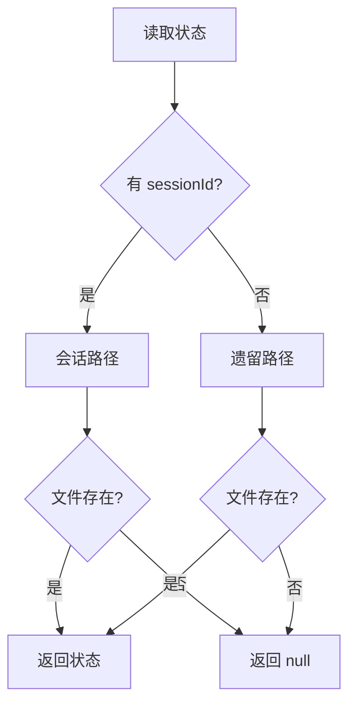

---

## MCP 工具集成

### 1. MCP 服务器架构

**文件**: `src/mcp/omc-tools-server.ts`

ultrapower 提供内置 MCP 服务器，暴露以下工具类别：

- **状态管理**: `state_read`, `state_write`, `state_clear`, `state_list_active`, `state_get_status`
- **Notepad**: `notepad_read`, `notepad_priority`, `notepad_working`, `notepad_manual`, `notepad_prune`
- **项目记忆**: `mem_read`, `mem_write`, `mem_add_note`, `mem_add_directive`
- **LSP 工具**: `ultrapower:lsp_hover`, `ultrapower:lsp_goto_definition`, `ultrapower:lsp_diagnostics`, `ultrapower:lsp_diagnostics_directory`
- **AST 工具**: `ast_grep_search`, `ast_grep_replace`
- **Python REPL**: `python_repl`
- **追踪**: `trace_timeline`, `trace_summary`
- **Skills**: `load_skills_local`, `load_skills_global`, `list_skills`

### 2. 外部 MCP 提供商

#### Codex (OpenAI GPT)

**文件**: `src/mcp/codex-core.ts`

```typescript
// 工具调用
mcp__x__ask_codex({
  agent_role: 'architect',
  prompt: '分析这个模块的架构',
  context_files: ['src/module.ts'],
  model: 'gpt-5.3-codex',
  reasoning_effort: 'medium'
})
```

**擅长领域**: 架构审查、规划验证、代码审查、安全审查

#### Gemini (Google)

**文件**: `src/mcp/gemini-core.ts`

```typescript
// 工具调用
mcp__g__ask_gemini({
  agent_role: 'designer',
  prompt: '审查这个 UI 组件',
  files: ['src/components/Button.tsx'],
  model: 'gemini-3-pro-preview'
})
```

**擅长领域**: UI/UX 设计、文档、视觉分析、大上下文任务（1M token）

### 3. 后台任务管理

**文件**: `src/mcp/job-management.ts`

```typescript
// 后台执行
const job = await ask_codex({
  agent_role: 'architect',
  prompt: '...',
  background: true
});

// 检查状态
const status = await check_job_status({ job_id: job.job_id });

// 等待完成
const result = await wait_for_job({ 
  job_id: job.job_id,
  timeout_ms: 300000 
});
```

**任务状态流转**:

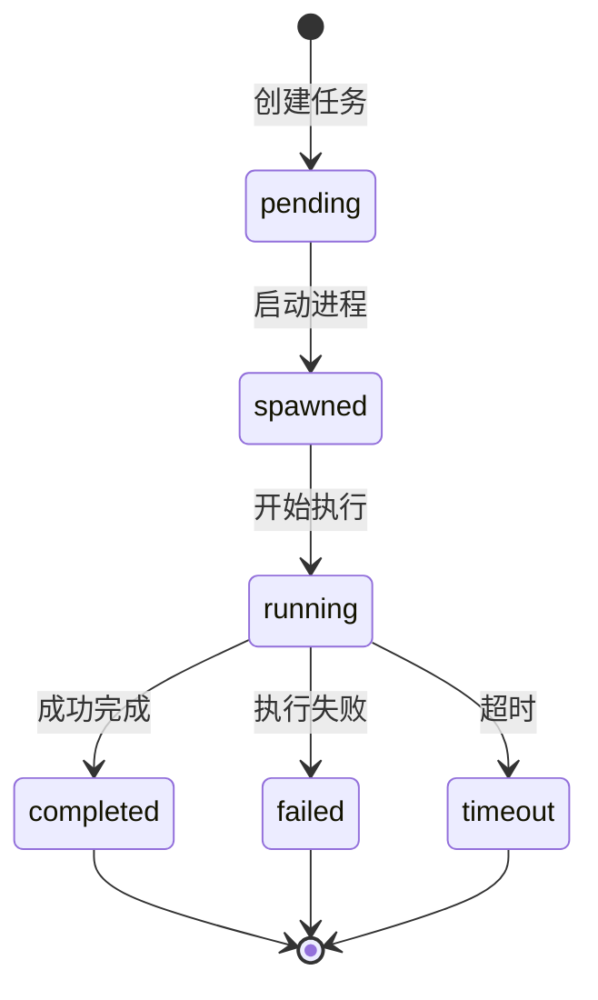

---

## 完整执行流程示例

### 示例 1: Autopilot 完整流程

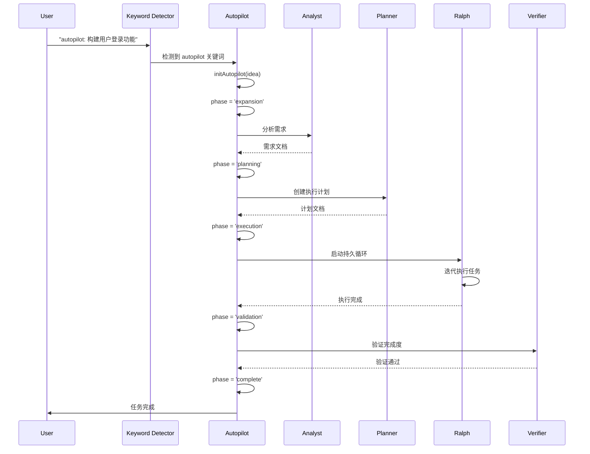

### 示例 2: Team Pipeline 流程

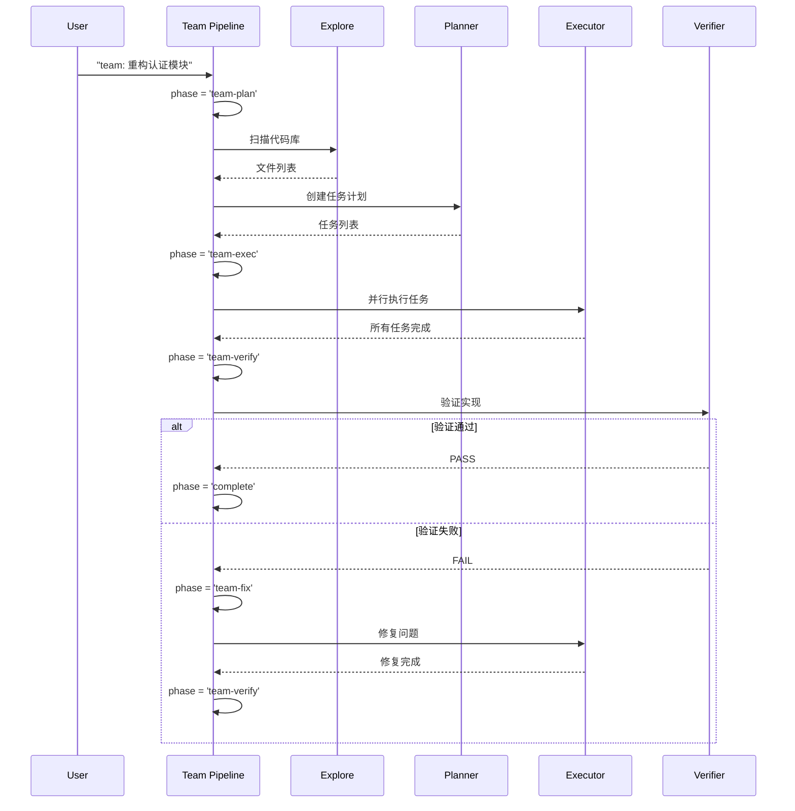

---

## 关键实现细节

### 1. 输入规范化

**文件**: `src/hooks/bridge-normalize.ts`

```typescript
// snake_case → camelCase 转换
{
  tool_name: 'read_file',
  tool_input: {...},
  session_id: 'abc123'
}
↓
{
  toolName: 'read_file',
  toolInput: {...},
  sessionId: 'abc123'
}
```

### 2. 状态持久化

所有模式状态都通过原子写入保证一致性：

```typescript
import { atomicWriteJsonSync } from './atomic-write.js';

// 原子写入，避免部分写入
atomicWriteJsonSync(statePath, state);
```

### 3. 会话隔离

每个会话的状态独立存储：

```
.omc/state/sessions/
├── session-abc123/
│   ├── ralph-state.json
│   └── team-state.json
└── session-def456/
    ├── autopilot-state.json
    └── ultrawork-state.json
```

---

## 总结

ultrapower 通过以下机制实现多 Agent 编排：

1. **Hook Bridge**: 统一的入口点，处理所有 Hook 事件
2. **关键词检测**: 智能识别用户意图，自动激活对应模式
3. **状态机**: 严格的阶段转换，确保流程可控
4. **Agent 系统**: 49 个专业 Agent，各司其职
5. **MCP 集成**: 外部 AI 能力扩展，降低成本
6. **会话隔离**: 多会话并行，互不干扰

**核心设计原则**:
- 模块化：每个组件职责单一
- 可扩展：易于添加新 Agent 和模式
- 容错性：严重性分级，优雅降级
- 可追踪：完整的状态持久化和审计日志

---

**文档生成信息**:
- 基于代码版本: 7.0.5
- 扫描文件数: 15+
- 生成时间: 2026-03-11
- 文档类型: 架构分析

