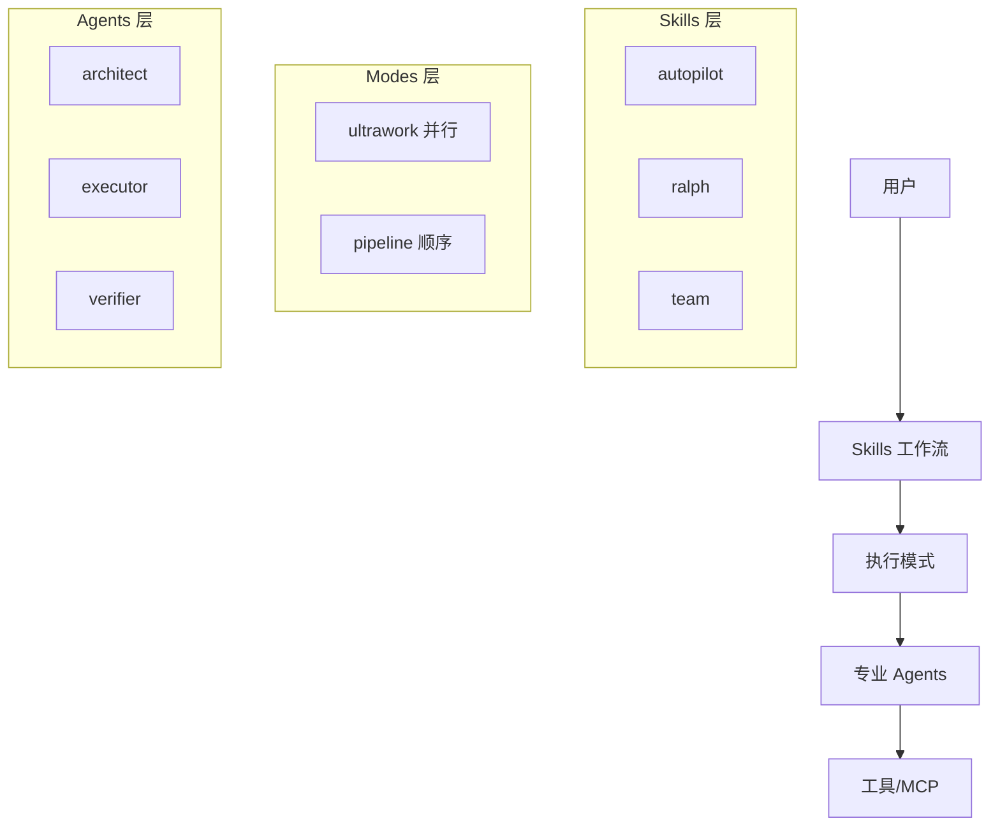

# 核心概念

ultrapower 的三大核心概念：Agents、Skills 和 Modes。

## 目录

- [Agents（专业助手）](./agents.md)
- [Skills（工作流）](./skills.md)
- [Modes（执行模式）](./modes.md)
- [Agent 选择指南](./agent-selection.md)
- [错误处理指南](./error-handling.md)

## 架构概览

## 快速对比

| 概念 | 用途 | 示例 |
|------|------|------|
| **Agent** | 单一专业任务 | `executor`, `debugger` |
| **Skill** | 完整工作流 | `autopilot`, `team` |
| **Mode** | 执行策略 | `ultrawork`, `ralph` |

## 何时使用什么？

### 使用 Agent（直接调用）
- 明确的单一任务
- 需要特定专业能力
- 快速执行

### 使用 Skill（工作流）
- 复杂多步骤任务
- 需要多个 agents 协作
- 自动化流程

### 使用 Mode（执行策略）
- 需要并行加速
- 需要持久执行
- 需要特定编排策略
