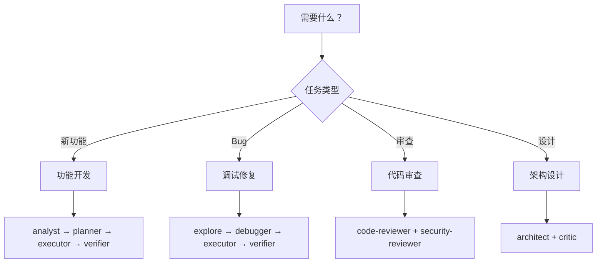

# Agent 选择指南

## 决策树



## 按场景选择

### 场景 1: 实现新功能
**推荐**: `team` skill 或 `executor` agent

```bash
# 简单功能
/ultrapower:executor "Add email validation"

# 复杂功能
/ultrapower:team "Build payment integration"
```

### 场景 2: 修复 Bug
**推荐**: `analyze` skill 或 `debugger` agent

```bash
# 快速分析
/ultrapower:analyze "Login timeout after 5 minutes"

# 深度调试
/ultrapower:debugger "Memory leak in WebSocket handler"
```

### 场景 3: 代码审查
**推荐**: `code-review` skill

```bash
/ultrapower:code-review "Review authentication module"
```

### 场景 4: 架构设计
**推荐**: `architect` agent

```bash
/ultrapower:architect "Design event-driven notification system"
```

### 场景 5: 测试编写
**推荐**: `test-engineer` agent

```bash
/ultrapower:test-engineer "Add unit tests for user service"
```

## 按复杂度选择模型

| 复杂度 | 推荐模型 | 适用场景 |
|--------|---------|---------|
| 简单 | haiku | 格式化、简单查询、文档 |
| 标准 | sonnet | 功能开发、调试、审查 |
| 复杂 | opus | 架构设计、深度分析、重构 |

**示例**:
```typescript
// 简单任务用 haiku
Task({ subagent_type: "ultrapower:writer", model: "haiku" })

// 标准任务用 sonnet（默认）
Task({ subagent_type: "ultrapower:executor" })

// 复杂任务用 opus
Task({ subagent_type: "ultrapower:architect", model: "opus" })
```
