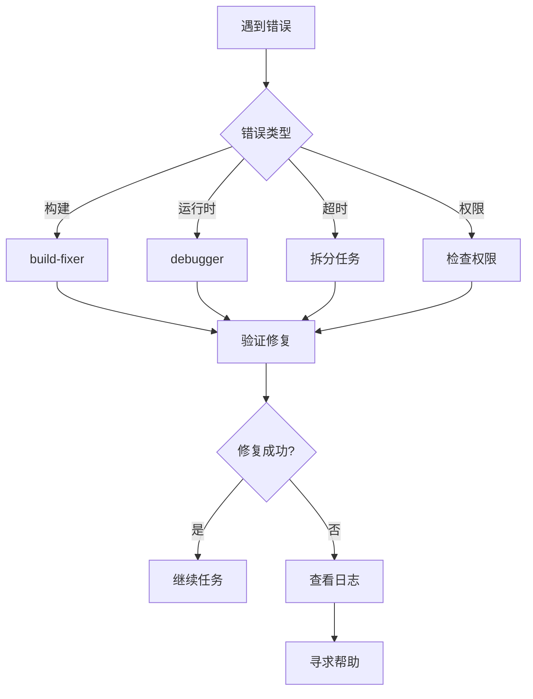

# 错误处理指南

## 常见错误类型

### 1. 构建错误

**症状**: TypeScript 编译失败、类型错误

**解决方案**:
```bash
# 使用 build-fixer agent
/ultrapower:build-fixer "Fix all TypeScript errors"

# 或使用 LSP 诊断
omc doctor conflicts
```

### 2. 运行时错误

**症状**: 代码执行失败、异常抛出

**解决方案**:
```bash
# 使用 debugger 分析
/ultrapower:debugger "Investigate runtime error in payment handler"

# 查看错误日志
omc sessions --limit 1
```

### 3. Agent 超时

**症状**: Agent 执行超过时间限制

**解决方案**:
- 拆分任务为更小的子任务
- 使用 `haiku` 模型加速简单任务
- 检查网络连接

```bash
# 拆分任务示例
/ultrapower:planner "Break down large refactoring task"
```

### 4. 权限错误

**症状**: 文件访问被拒绝、Git 操作失败

**解决方案**:
```bash
# 检查权限
ls -la .omc/
chmod -R 755 .omc/

# 检查 Git 配置
git config --list
```

### 5. MCP 工具错误

**症状**: MCP 服务器连接失败

**解决方案**:
```bash
# 检查 MCP 配置
cat .kiro/settings/mcp.json

# 重启 MCP 服务器
# 在 Kiro MCP Server 视图中点击重连
```

## 错误恢复流程



## 调试技巧

### 查看执行日志
```bash
# 查看最近会话
omc sessions --limit 5

# 查看统计信息
omc stats

# 查看执行轨迹
omc trace timeline
```

### 启用详细日志
```bash
# 设置环境变量
export OMC_LOG_LEVEL=debug
export OMC_VERBOSE=1
```

### 使用 doctor 命令
```bash
# 检查配置冲突
omc doctor conflicts

# 查看系统信息
omc info
```
