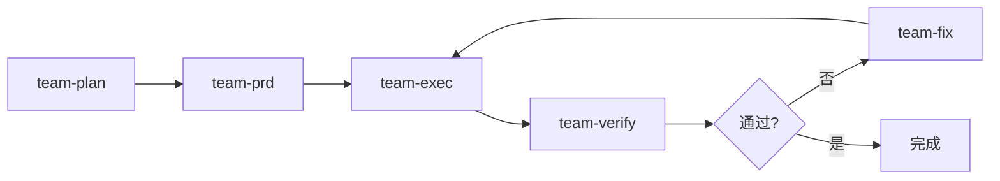

# 执行模式

## 模式对比

| 模式 | 特点 | 适用场景 |
|------|------|---------|
| **ultrawork** | 最大并行度 | 独立任务批量处理 |
| **pipeline** | 顺序执行 | 有依赖的任务链 |
| **ralph** | 持久循环 | 需要反复验证的任务 |
| **team** | 分阶段协作 | 复杂多步骤项目 |

## ultrawork（并行模式）

**特点**:
- 最多 20 个并发任务
- 自动检测依赖关系
- 适合独立任务

**示例**:
```bash
/ultrapower:ultrawork "Update all API documentation"
```

## pipeline（顺序模式）

**特点**:
- 顺序执行
- 数据在 agents 间传递
- 适合有依赖的任务链

**示例**:
```bash
/ultrapower:pipeline "analyze → design → implement → test"
```

## ralph（持久循环）

**特点**:
- 自引用循环
- 带 verifier 验证
- 不达目标不停止

**示例**:
```bash
/ultrapower:ralph "Achieve 100% test coverage"
```

## team（分阶段协作）

**阶段流程**:


**特点**:
- 专业 agents 路由
- 自动阶段转换
- 支持修复循环

**示例**:
```bash
/ultrapower:team "Build user management system"
```
