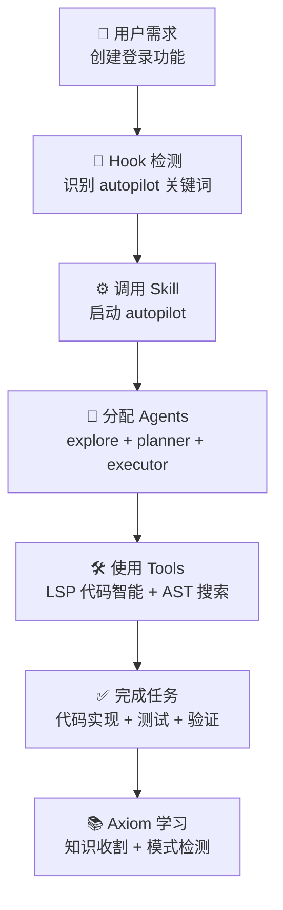

# 核心概念图解

理解 ultrapower 的四大核心组件及其交互方式。

---

## 1️⃣ Agents（智能体）

**定义**：专业的 AI 助手，每个 agent 专注于特定领域。

### 三层 Agent 体系

```
┌─────────────────────────────────────────────────┐
│           49 个专业 Agents                      │
├─────────────────────────────────────────────────┤
│ 构建通道          │ 审查通道        │ 领域专家  │
├──────────────────┼─────────────────┼──────────┤
│ • explore        │ • code-reviewer │ • designer
│ • planner        │ • security-rev  │ • debugger
│ • executor       │ • quality-rev   │ • test-eng
│ • architect      │ • perf-rev      │ • build-fix
└──────────────────┴─────────────────┴──────────┘
```

**常用 Agents**：
- `executor` (sonnet) - 代码实现
- `debugger` (sonnet) - 问题诊断
- `architect` (opus) - 系统设计
- `verifier` (sonnet) - 完成验证

---

## 2️⃣ Skills（技能）

**定义**：预定义的工作流，自动化复杂任务。

### 五大 Skill 类别

```
工作流 Skills          开发 Skills         Axiom Skills
├─ autopilot          ├─ brainstorming    ├─ ax-draft
├─ team               ├─ writing-plans    ├─ ax-review
├─ ralph              ├─ tdd              ├─ ax-decompose
├─ ultrawork          └─ code-review      ├─ ax-implement
└─ plan                                   └─ ax-reflect
```

**快速示例**：
```bash
# 全自主执行
/ultrapower:autopilot "创建 REST API"

# 多 agent 协作
/ultrapower:team "重构认证模块"

# 持续执行（带验证循环）
/ultrapower:ralph "完成整个功能"
```

---

## 3️⃣ Hooks（钩子）

**定义**：事件驱动的自动化触发器，根据上下文自动激活 Skills。

### Hook 触发流程

```
用户输入
    ↓
Hook 检测关键词
    ↓
匹配 Skill 触发规则
    ↓
自动调用对应 Skill
    ↓
Agent 执行任务
```

**常见 Hook 类型**：
- `UserPromptSubmit` - 用户输入时检测
- `ToolUse` - 工具调用时检测
- `ExecutionComplete` - 任务完成时触发

**示例**：输入 "autopilot" 关键词 → 自动激活 autopilot skill

---

## 4️⃣ Tools（工具）

**定义**：35 个扩展工具，赋予 Claude 代码智能和状态管理能力。

### 工具分类

```
LSP 工具 (12)          AST 工具 (2)         State 工具 (5)
├─ hover              ├─ search            ├─ read
├─ goto-def           └─ replace           ├─ write
├─ find-refs                               ├─ clear
├─ diagnostics                             ├─ list
└─ rename                                  └─ status

Notepad (6)           Project Memory (4)   Trace (2)
├─ read               ├─ read              ├─ timeline
├─ write              ├─ write             └─ summary
├─ priority           ├─ add-note
├─ working            └─ add-directive
├─ manual
└─ prune
```

---

## 🔄 完整工作流程



---

## 🎯 执行模式对比

| 模式 | 用途 | 特点 |
|------|------|------|
| **autopilot** | 简单功能 | 全自主，无需干预 |
| **team** | 复杂任务 | 多 agent 协作，分阶段 |
| **ralph** | 长期任务 | 持续执行，自动修复 |
| **ultrawork** | 并行工作 | 最大并行度 |
| **plan** | 规划阶段 | 战略规划，生成任务 |

---

## 📊 Axiom 进化系统

**定义**：自我改进的智能体系统，让 ultrapower 越用越聪明。

### 进化循环

```
任务执行
    ↓
知识收割 (自动提取经验)
    ↓
模式检测 (识别重复模式)
    ↓
工作流优化 (生成改进建议)
    ↓
知识库更新 (跨会话持久化)
    ↓
下次执行更聪明 ✨
```

---

## 💡 核心设计原则

| 原则 | 说明 |
|------|------|
| **自动化** | Hooks 自动检测，Skills 自动激活 |
| **专业化** | 每个 Agent 专注一个领域 |
| **可验证** | 所有输出都经过验证 |
| **可追踪** | 完整的执行历史和日志 |
| **自进化** | 系统从使用中不断学习 |

---

## 🚀 下一步

- [15 分钟快速上手](./quickstart.md)
- [49 个 Agents 完整列表](../reference/AGENTS.md)
- [71 个 Skills 完整列表](../reference/SKILLS.md)
- [Axiom 进化系统详解](../AXIOM.md)
