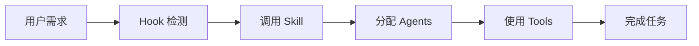

# 核心概念

理解 ultrapower 的四大核心组件。

---

## Agents（智能体）

**定义**: 专业的 AI 助手，每个 agent 专注于特定领域。

**示例**:

* `executor` - 代码实现

* `debugger` - 问题诊断

* `architect` - 系统设计

**使用方式**:
```
使用 executor agent 实现登录功能
```

[查看完整 Agents 列表 →](../features/agents.md)

---

## Skills（技能）

**定义**: 预定义的工作流，自动化复杂任务。

**示例**:

* `/ultrapower:autopilot` - 全自主执行

* `/ultrapower:team` - 多 agent 协作

* `/ultrapower:ralph` - 持续执行

**使用方式**:
```
/ultrapower:autopilot "创建 REST API"
```

[查看完整 Skills 列表 →](../features/skills.md)

---

## Hooks（钩子）

**定义**: 事件驱动的自动化触发器。

**示例**:

* `UserPromptSubmit` - 用户输入时触发

* `ToolUse` - 工具调用时触发

**工作原理**:
```
用户输入 → Hook 检测关键词 → 自动调用 Skill
```

[查看完整 Hooks 列表 →](../features/hooks.md)

---

## Tools（工具）

**定义**: 35 个自定义工具，扩展 Claude 能力。

**分类**:

* **LSP 工具** (12个): 代码智能分析

* **AST 工具** (2个): 结构化代码搜索

* **State 工具** (5个): 状态管理

* **Notepad 工具** (6个): 会话记忆

[查看完整 Tools 列表 →](../features/tools.md)

---

## Axiom 进化系统

**定义**: 自我改进的智能体系统。

**核心功能**:
1. **知识收割** - 从执行中学习
2. **模式检测** - 识别重复模式
3. **工作流优化** - 自动改进流程

[了解 Axiom →](../features/axiom.md)

---

## 工作流程图



---

## 下一步

* [查看实际使用场景](../guides/scenario-feature-dev.md)

* [探索高级功能](../architecture/state-machine.md)
