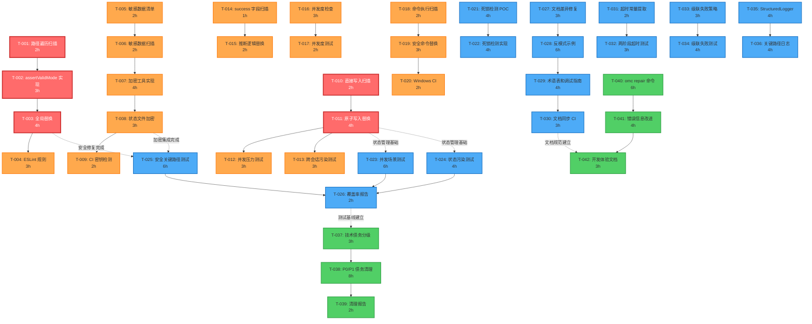
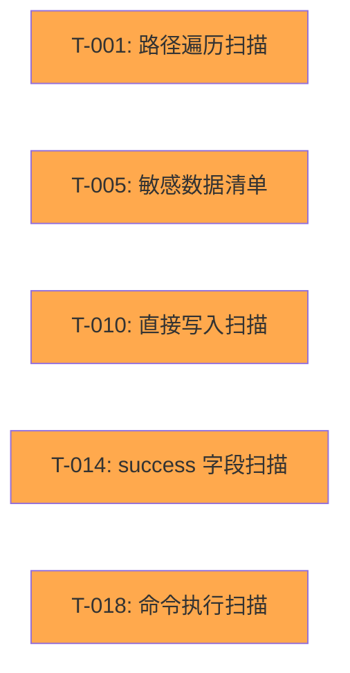
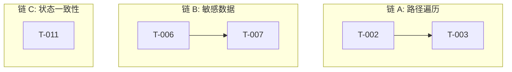
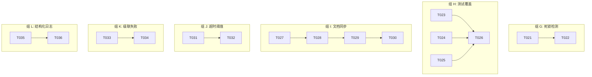

# DAG 依赖图: ultrapower v7.5.2 Bug 审计

> **状态**: ACTIVE
> **创建日期**: 2026-03-16
> **来源**: bugs-pain-points-audit-manifest.md
> **总任务数**: 42 个原子任务

---

## 全局依赖关系图



---

## 关键路径详解

### 🔴 Critical Path 1: 路径遍历防护 (12h)

```
T-001 (2h) → T-002 (3h) → T-003 (4h) → T-004 (3h)
```

**为什么是关键路径**:
- 阻塞所有安全测试 (T-025)
- 阻塞 ESLint CI 集成
- 影响 v7.5.3 发布时间

**优化建议**:
- T-001 和 T-002 可部分并行（边扫描边实现）
- T-003 可分批修复（按风险等级）

---

### 🔴 Critical Path 2: 状态一致性保护 (9h)

```
T-010 (2h) → T-011 (4h) → T-012/T-013 (3h 并行)
```

**为什么是关键路径**:
- 阻塞所有并发测试 (T-023, T-024)
- 影响状态管理模块稳定性
- 高风险修复（需充分测试）

**优化建议**:
- T-012 和 T-013 完全并行执行
- T-011 完成后立即启动测试

---

## 并行执行策略

### Phase 1 并行组 (Week 1)

**Day 1** - 启动 5 个独立扫描任务:


**Day 2-3** - 3 条并行实现链:


---

### Phase 2 并行组 (Week 1-2)

**完全独立的 6 条并行链**:


---

## 任务优先级矩阵

| 任务 ID | 优先级 | 工时 | 依赖数 | 被依赖数 | 关键路径 |
|---------|--------|------|--------|----------|----------|
| T-001 | P0 | 2h | 0 | 1 | ✅ |
| T-002 | P0 | 3h | 1 | 1 | ✅ |
| T-003 | P0 | 4h | 1 | 2 | ✅ |
| T-010 | P0 | 2h | 0 | 1 | ✅ |
| T-011 | P0 | 4h | 1 | 4 | ✅ |
| T-004 | P0 | 3h | 1 | 0 | ❌ |
| T-005 | P0 | 2h | 0 | 1 | ❌ |
| T-023 | P1 | 6h | 2 | 1 | ❌ |
| T-028 | P1 | 6h | 1 | 1 | ❌ |

---

## 风险依赖分析

### 高风险依赖

**T-011 (原子写入替换)** 被 4 个任务依赖:
- T-012 (并发压力测试)
- T-013 (跨会话污染测试)
- T-023 (并发场景测试)
- T-024 (状态污染测试)

**缓解措施**:
- 优先完成 T-011
- 增加 T-011 的测试覆盖
- 准备回滚方案

---

### 跨阶段依赖

**Phase 1 → Phase 2**:
```
T-003 (路径遍历修复) ──┐
                        ├──> T-025 (安全关键路径测试)
T-008 (敏感数据加密) ──┘

T-011 (原子写入) ──┬──> T-023 (并发场景测试)
                   └──> T-024 (状态污染测试)
```

**Phase 2 → Phase 3**:
```
T-026 (覆盖率报告) ───> T-037 (技术债务分级)
T-030 (文档同步 CI) ───> T-042 (开发体验文档)
```

---

## 执行时间线

### Phase 1 时间线 (10 天)

```
Day 1  |████████| T-001, T-005, T-010, T-014, T-018 (并行扫描)
Day 2  |████████| T-002, T-006, T-016 (工具实现)
Day 3  |████████| T-003, T-007, T-011, T-015, T-019 (核心修复)
Day 4  |████████| T-004, T-008, T-012, T-017 (集成测试)
Day 5  |████████| T-009, T-013, T-020 (CI 集成)
Day 6-8|████████| 回归测试 + Bug 修复
Day 9  |████████| 发布准备
Day 10 |████████| v7.5.3 发布
```

### Phase 2 时间线 (20 天)

```
Week 1-2 |████████████████| T-023, T-024, T-025, T-026 (测试覆盖)
Week 3   |████████| T-027→T-030 (文档), T-031→T-032 (超时)
Week 4   |████████| T-021→T-022, T-033→T-034, T-035→T-036
```

---

**生成时间**: 2026-03-16
**下一步**: 结合 Manifest 清单开始执行
