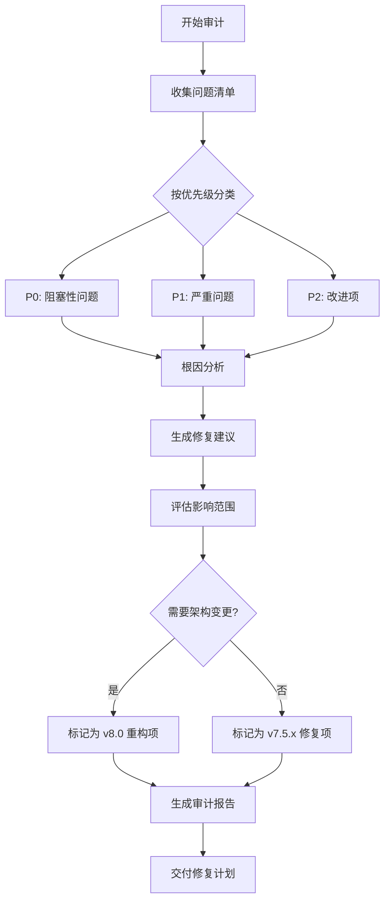

# PRD: ultrapower v7.5.2 BUG 与痛点审计 - Draft

> **状态**: DRAFT
> **作者**: Product Design Expert (Axiom)
> **版本**: 0.1
> **创建日期**: 2026-03-16
> **项目**: ultrapower v7.5.2 多 Agent 编排系统

---

## 1. 背景与目标

### 1.1 背景
ultrapower v7.5.2 是一个复杂的多 Agent 编排系统，包含：
- **规模**: 1198 个 TypeScript 源文件，49 agents，71 skills，43 hooks，35 tools
- **技术栈**: TypeScript + Node.js + Vitest + ESLint
- **核心功能**: 多模式编排（autopilot、ralph、team、pipeline 等）
- **已知技术债务**: 51 个 TODO/FIXME/HACK 标记

### 1.2 审计目标
- **全面性**: 覆盖代码质量、稳定性、开发体验、用户体验、架构五大维度
- **优先级**: 识别 P0（阻塞性）、P1（严重）、P2（改进）问题
- **可执行性**: 提供根因分析和具体修复建议

### 1.3 审计范围
- ✅ 安全漏洞（路径遍历、输入验证）
- ✅ 状态管理缺陷（并发、一致性）
- ✅ Agent 生命周期问题（超时、孤儿、死锁）
- ✅ 测试覆盖率和质量
- ✅ 文档与代码不一致
- ✅ 开发体验痛点

---

## 2. 用户故事

| 角色 | 目标 | 收益 |
| --- | --- | --- |
| 开发者 | 修复已知安全漏洞和反模式 | 提升系统安全性和稳定性 |
| 贡献者 | 清理技术债务，改善代码质量 | 降低维护成本，提升开发效率 |
| 用户 | 获得更稳定可靠的多 Agent 编排体验 | 减少运行时错误和意外行为 |
| 架构师 | 识别架构层面的设计缺陷 | 为 v8.0 重构提供决策依据 |

---

## 3. 高层需求（MVP）

### 3.1 P0 问题修复（阻塞性）
1. **安全加固**: 修复所有路径遍历漏洞和输入验证缺陷
2. **状态一致性**: 解决并发写入和跨会话状态污染问题
3. **Agent 生命周期**: 修复超时、孤儿检测和死锁处理逻辑

### 3.2 P1 问题修复（严重）
1. **测试质量**: 补充边界用例测试，提升覆盖率
2. **文档同步**: 修复文档与代码不一致的差异点
3. **错误处理**: 改善错误信息和异常处理机制

### 3.3 P2 改进（优化）
1. **开发体验**: 优化构建速度和调试工具
2. **代码质量**: 清理技术债务标记
3. **性能优化**: 识别并优化性能瓶颈

---

## 4. 业务流程

---

## 5. 暂不包含（v2 延期）

以下内容不在本次审计范围内：
- ❌ 新功能开发（仅修复现有问题）
- ❌ 大规模架构重构（留待 v8.0）
- ❌ 性能基准测试（需要独立专项）
- ❌ 用户体验调研（需要用户反馈数据）

---

## 6. 下一步行动

1. **专家评审**: 调用 `/ax-review` 进行 5 专家并行评审
2. **问题分类**: 生成结构化问题清单（按优先级和类别）
3. **修复计划**: 为每个问题生成可执行的修复任务
4. **验收标准**: 定义每个修复项的完成标准

---

## 附录 A: 已知问题快照

### A.1 安全反模式（来源: anti-patterns.md）
- **AP-S01**: 未校验 mode 参数直接拼接路径（路径遍历风险）
- **AP-S02**: 直接读取 SubagentStopInput.success（已废弃字段）
- **AP-S03**: 在状态文件中存储敏感信息

### A.2 状态管理反模式
- **AP-ST01**: 混淆 agent stale（5分钟）和 mode stale（1小时）阈值
- **AP-ST02**: 跨会话误清理状态文件
- **AP-ST03**: 在 ~/.claude/ 中存储 OMC 状态（应在 worktree）

### A.3 Agent 生命周期反模式
- **AP-AL01**: 向孤儿 Agent 发送 SHUTDOWN 信号（应批量清除）
- **AP-AL02**: 混淆超时阈值（5分钟警告 vs 10分钟自动终止）
- **AP-AL03**: 忽略 DEADLOCK_CHECK_THRESHOLD 常量

### A.4 并发反模式
- **AP-C01**: 绕过原子写入保护（已知技术债务 TD-4）
- **AP-C02**: 不使用防抖直接写入高频状态

### A.5 技术债务统计
- **TODO/FIXME/HACK 标记**: 51 个
- **源文件数量**: 1198 个 TypeScript 文件
- **测试文件**: 需要补充边界用例测试

---

## 附录 B: 参考文档

| 文档 | 路径 | 用途 |
| --- | --- | --- |
| 反模式清单 | docs/standards/anti-patterns.md | 已知反模式和正确替代方案 |
| Agent 生命周期 | docs/standards/agent-lifecycle.md | 边界情况矩阵和处理策略 |
| 运行时保护 | docs/standards/runtime-protection.md | 安全防护规范 |
| 状态机规范 | docs/standards/state-machine.md | 状态转换和阈值定义 |

---

**生成时间**: 2026-03-16T05:38:21.594Z
**下一步**: 调用 axiom-review-aggregator 进行专家评审
