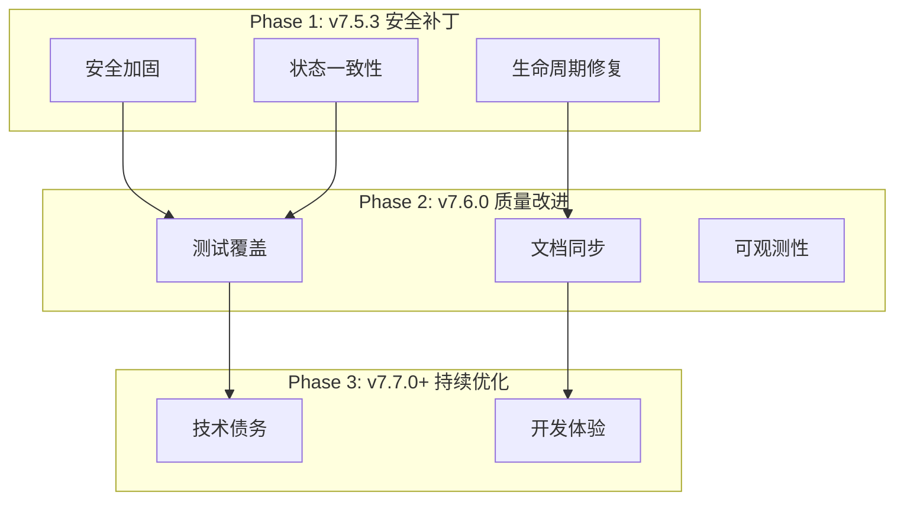
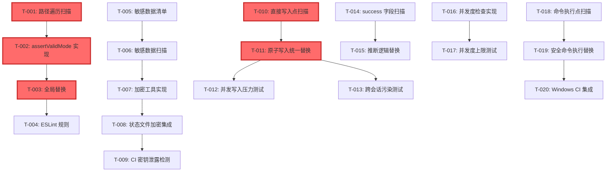
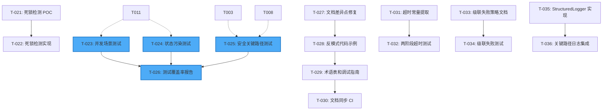
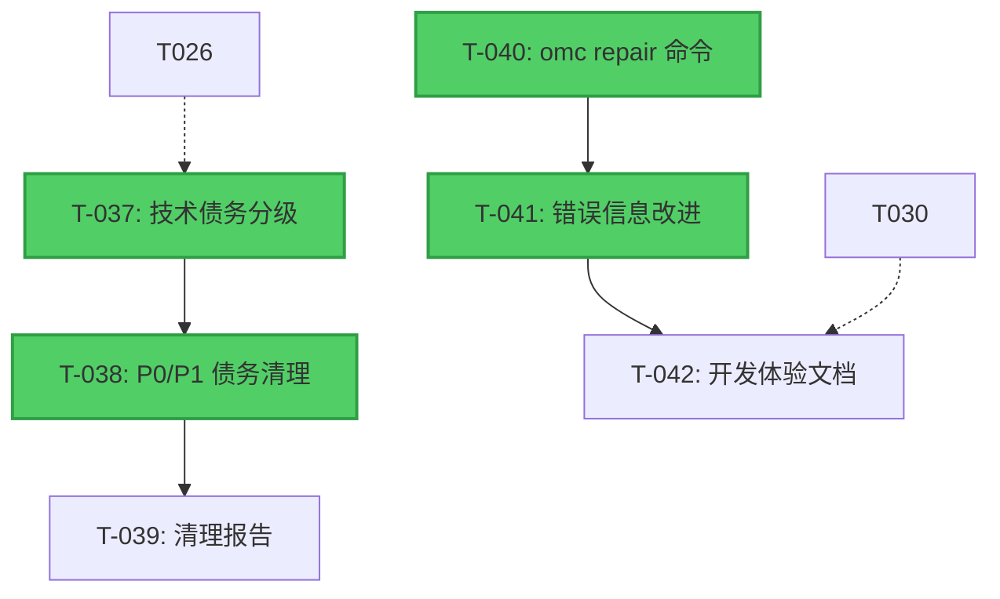

# Manifest: ultrapower v7.5.2 Bug 审计

> **状态**: ACTIVE
> **创建日期**: 2026-03-16
> **来源 PRD**: bugs-pain-points-audit-rough.md
> **总任务数**: 42 个原子任务
> **预估总工时**: 18-22 天

---

## 架构概览

本审计覆盖 4 大维度，分 3 个阶段交付：



---

## Phase 1: v7.5.3 安全补丁 (P0 任务)

### 🔒 FR-01: 路径遍历防护

#### T-001: 路径遍历漏洞扫描
- **优先级**: P0
- **预估工时**: 2h
- **依赖**: 无
- **负责模块**: 安全审计
- **输入**: 代码库所有 TypeScript 文件
- **输出**: `docs/security/path-traversal-scan-report.md`
- **验收标准**:
  - [ ] 扫描所有 `mode` 参数使用点（正则: `\$\{mode\}`）
  - [ ] 报告包含文件路径、行号、代码片段
  - [ ] 按风险等级分类（高/中/低）
  - [ ] 生成修复优先级清单

#### T-002: assertValidMode 工具函数实现
- **优先级**: P0
- **预估工时**: 3h
- **依赖**: T-001
- **负责模块**: `src/lib/validateMode.ts`
- **输入**: T-001 扫描报告
- **输出**:
  - `src/lib/validateMode.ts` (新增)
  - `src/lib/validateMode.test.ts` (单元测试)
- **验收标准**:
  - [ ] 实现 `assertValidMode(mode: string): ValidMode`
  - [ ] 白名单包含 8 个合法 mode
  - [ ] 非法输入抛出 `InvalidModeError`
  - [ ] 单元测试覆盖率 100%
  - [ ] 测试用例包含路径遍历攻击向量（`../`, `..\\`, `%2e%2e/`）

#### T-003: 全局替换未校验路径拼接
- **优先级**: P0
- **预估工时**: 4h
- **依赖**: T-002
- **负责模块**: 所有状态管理模块
- **输入**: T-001 扫描报告 + T-002 工具函数
- **输出**: 修复后的代码文件
- **验收标准**:
  - [ ] 所有路径拼接前调用 `assertValidMode(mode)`
  - [ ] 修复所有高风险点（T-001 报告）
  - [ ] 回归测试通过率 100%

#### T-004: ESLint 规则实现
- **优先级**: P0
- **预估工时**: 3h
- **依赖**: T-003
- **负责模块**: `.eslintrc.js`
- **输出**: 自定义 ESLint 规则
- **验收标准**:
  - [ ] 检测未校验的 `${mode}` 路径拼接
  - [ ] CI 集成 ESLint 检查
  - [ ] 违规时构建失败

---

### 🔐 FR-02: 敏感数据保护

#### T-005: 敏感数据清单定义
- **优先级**: P0
- **预估工时**: 2h
- **依赖**: 无
- **输出**: `docs/security/sensitive-data-inventory.md`
- **验收标准**:
  - [ ] 定义敏感字段白名单（apiKey, token, credential, password, secret）
  - [ ] 定义扫描规则（正则模式）
  - [ ] 文档说明加密策略

#### T-006: 敏感数据扫描
- **优先级**: P0
- **预估工时**: 2h
- **依赖**: T-005
- **输出**: `docs/security/sensitive-data-violations.md`
- **验收标准**:
  - [ ] 扫描所有状态文件和日志代码
  - [ ] 生成违规点统计报告
  - [ ] 按严重程度分级

#### T-007: 加密工具实现
- **优先级**: P0
- **预估工时**: 4h
- **依赖**: T-006
- **负责模块**: `src/lib/crypto.ts`
- **输出**:
  - `src/lib/crypto.ts` (新增)
  - `src/lib/crypto.test.ts`
- **验收标准**:
  - [ ] 实现 `encryptSensitiveFields()` (AES-256-GCM)
  - [ ] 实现 `decryptSensitiveFields()`
  - [ ] 密钥管理策略（环境变量 + 密钥轮换）
  - [ ] 单元测试覆盖率 100%

#### T-008: 状态文件加密集成
- **优先级**: P0
- **预估工时**: 3h
- **依赖**: T-007
- **输出**: 修复后的状态管理代码
- **验收标准**:
  - [ ] 所有状态写入前加密敏感字段
  - [ ] 状态读取后解密
  - [ ] 文件权限设置为 0o600
  - [ ] 集成测试通过

#### T-009: CI 密钥泄露检测
- **优先级**: P0
- **预估工时**: 2h
- **依赖**: T-008
- **输出**: `.github/workflows/security.yml`
- **验收标准**:
  - [ ] 集成 gitleaks 或 truffleHog
  - [ ] 检测到密钥时构建失败
  - [ ] 每日定时扫描

---

### 🔄 FR-03: 状态一致性保护

#### T-010: 直接写入点扫描
- **优先级**: P0
- **预估工时**: 2h
- **依赖**: 无
- **输出**: `docs/audit/direct-write-scan.md`
- **验收标准**:
  - [ ] 扫描所有 `writeFileSync` 调用
  - [ ] 识别绕过原子写入的代码路径
  - [ ] 生成修复清单

#### T-011: 原子写入统一替换
- **优先级**: P0
- **预估工时**: 4h
- **依赖**: T-010
- **输出**: 修复后的代码
- **验收标准**:
  - [ ] 替换所有直接写入为 `atomicWriteJsonSyncWithRetry`
  - [ ] 修复 `writeTrackingStateImmediate` 问题
  - [ ] 单元测试验证原子性

#### T-012: 并发写入压力测试
- **优先级**: P0
- **预估工时**: 3h
- **依赖**: T-011
- **输出**: `tests/integration/concurrent-write.test.ts`
- **验收标准**:
  - [ ] 10 个会话同时写入 `subagent-tracking.json`
  - [ ] 验证无数据丢失
  - [ ] 验证无 JSON 损坏
  - [ ] 文件锁超时降级策略验证

#### T-013: 跨会话污染测试
- **优先级**: P0
- **预估工时**: 3h
- **依赖**: T-011
- **输出**: `tests/integration/session-isolation.test.ts`
- **验收标准**:
  - [ ] 会话 A 异常终止，会话 B 读取状态
  - [ ] 验证 session_id 匹配逻辑
  - [ ] 验证旧版状态文件兼容性（session_id 为 null）

---

### 🐛 FR-04: SubagentStop 推断修复

#### T-014: success 字段使用点扫描
- **优先级**: P0
- **预估工时**: 1h
- **依赖**: 无
- **输出**: `docs/audit/subagent-stop-scan.md`
- **验收标准**:
  - [ ] 扫描所有 `input.success` 使用点
  - [ ] 生成修复清单

#### T-015: 推断逻辑统一替换
- **优先级**: P0
- **预估工时**: 2h
- **依赖**: T-014
- **输出**: 修复后的代码
- **验收标准**:
  - [ ] 替换为 `input.success !== false`
  - [ ] 补充单元测试（undefined/true/false 三种情况）
  - [ ] 文档澄清字段语义

---

### ⚡ FR-05: 并发度上限

#### T-016: 并发度检查实现
- **优先级**: P0
- **预估工时**: 3h
- **依赖**: 无
- **负责模块**: Agent 启动逻辑
- **输出**: 修复后的代码
- **验收标准**:
  - [ ] 定义 `MAX_CONCURRENT_AGENTS = 20`
  - [ ] Agent 启动前检查当前并发数
  - [ ] 超限返回明确错误信息
  - [ ] 提供配置项允许用户调整

#### T-017: 并发度上限测试
- **优先级**: P0
- **预估工时**: 2h
- **依赖**: T-016
- **输出**: `tests/integration/concurrent-limit.test.ts`
- **验收标准**:
  - [ ] 尝试启动 25 个 Agent
  - [ ] 验证第 21 个被拒绝
  - [ ] 验证错误信息准确性

---

### 🪟 FR-06: Windows 命令注入审计

#### T-018: 命令执行点扫描
- **优先级**: P0
- **预估工时**: 2h
- **依赖**: 无
- **输出**: `docs/security/command-injection-scan.md`
- **验收标准**:
  - [ ] 扫描所有 `execSync`/`exec`/`spawn` 调用
  - [ ] 识别 Windows 平台风险点
  - [ ] 生成修复建议

#### T-019: 安全命令执行替换
- **优先级**: P0
- **预估工时**: 3h
- **依赖**: T-018
- **输出**: 修复后的代码
- **验收标准**:
  - [ ] 使用 `execFile` 或参数数组形式
  - [ ] Windows 平台测试通过
  - [ ] 文档说明安全模式

#### T-020: Windows CI 集成
- **优先级**: P0
- **预估工时**: 2h
- **依赖**: T-019
- **输出**: `.github/workflows/windows.yml`
- **验收标准**:
  - [ ] 添加 Windows 平台 CI 测试
  - [ ] 测试通过率 100%

---

## Phase 2: v7.6.0 质量改进 (P1 任务)

### 🔍 FR-07: 死锁检测实现

#### T-021: 死锁检测 POC
- **优先级**: P1
- **预估工时**: 4h
- **依赖**: 无
- **输出**: `docs/research/deadlock-detection-poc.md`
- **验收标准**:
  - [ ] 实现循环依赖图分析算法
  - [ ] 验证检测准确性（无误报/漏报）
  - [ ] 性能测试（100 个 Agent 场景）

#### T-022: 死锁检测实现
- **优先级**: P1
- **预估工时**: 4h
- **依赖**: T-021
- **负责模块**: `src/lib/deadlock-detector.ts`
- **输出**:
  - `src/lib/deadlock-detector.ts`
  - `src/lib/deadlock-detector.test.ts`
- **验收标准**:
  - [ ] 实现 `DEADLOCK_CHECK_THRESHOLD = 3`
  - [ ] 检测到死锁时记录警告日志（不自动终止）
  - [ ] 单元测试覆盖 3 个死锁场景

---

### 🧪 FR-08: 测试覆盖补充

#### T-023: 并发场景测试套件
- **优先级**: P1
- **预估工时**: 6h
- **依赖**: T-011, T-012
- **输出**: `tests/integration/concurrent-scenarios.test.ts`
- **验收标准**:
  - [ ] 100 并发写入压力测试
  - [ ] JSON 文件部分写入恢复测试
  - [ ] 文件大小为 0 恢复测试
  - [ ] JSON 格式错误恢复测试

#### T-024: 状态污染测试套件
- **优先级**: P1
- **预估工时**: 4h
- **依赖**: T-013
- **输出**: `tests/integration/state-pollution.test.ts`
- **验收标准**:
  - [ ] 会话 A 异常终止，会话 B 读取脏状态
  - [ ] 两个会话同时清理同一 mode 状态
  - [ ] session_id 为 null/undefined 的旧版状态文件

#### T-025: 安全关键路径测试
- **优先级**: P1
- **预估工时**: 6h
- **依赖**: T-003, T-008
- **输出**: `tests/security/critical-paths.test.ts`
- **验收标准**:
  - [ ] 路径遍历攻击测试（5 个场景）
  - [ ] 敏感数据加密/解密测试
  - [ ] 测试覆盖率 100%

#### T-026: 测试覆盖率报告
- **优先级**: P1
- **预估工时**: 2h
- **依赖**: T-023, T-024, T-025
- **输出**: `docs/testing/coverage-report.md`
- **验收标准**:
  - [ ] 安全模块覆盖率 ≥100%
  - [ ] 状态管理模块覆盖率 ≥90%
  - [ ] 其他模块覆盖率 ≥80%
  - [ ] CI 集成覆盖率门禁

---

### 📚 FR-09: 文档同步

#### T-027: 文档差异点修复
- **优先级**: P1
- **预估工时**: 3h
- **依赖**: 无
- **输出**: 修复后的文档
- **验收标准**:
  - [ ] 修复 D-03: 合法 mode 数量（7 → 8）
  - [ ] 修复 D-04: 互斥模式范围（2 → 4）
  - [ ] 修复 D-09: stale 阈值双重含义澄清

#### T-028: 反模式代码示例补充
- **优先级**: P1
- **预估工时**: 6h
- **依赖**: T-027
- **输出**: `docs/standards/anti-patterns.md` (更新)
- **验收标准**:
  - [ ] 为 51 个反模式补充 Before/After 示例
  - [ ] 每个示例包含错误代码 + 正确代码 + 说明
  - [ ] 代码示例可直接运行

#### T-029: 术语表和调试指南
- **优先级**: P1
- **预估工时**: 4h
- **依赖**: T-028
- **输出**:
  - `docs/glossary.md` (新增)
  - `docs/troubleshooting.md` (新增)
- **验收标准**:
  - [ ] 术语表包含 ≥20 个核心术语
  - [ ] 调试指南覆盖常见错误场景
  - [ ] 每个错误包含恢复路径

#### T-030: 文档同步 CI 检查
- **优先级**: P1
- **预估工时**: 3h
- **依赖**: T-029
- **输出**: `.github/workflows/docs-sync.yml`
- **验收标准**:
  - [ ] 检测文档与代码不一致
  - [ ] 检测过期代码示例
  - [ ] 违规时构建失败

---

### ⏱️ FR-10: 超时阈值澄清

#### T-031: 超时常量提取
- **优先级**: P1
- **预估工时**: 2h
- **依赖**: 无
- **输出**: `src/config/timeouts.ts` (新增)
- **验收标准**:
  - [ ] 定义 `AGENT_STALE_WARNING_MS = 5 * 60 * 1000`
  - [ ] 定义 `AGENT_STALE_TERMINATE_MS = 10 * 60 * 1000`
  - [ ] 全局替换硬编码超时值

#### T-032: 两阶段超时测试
- **优先级**: P1
- **预估工时**: 3h
- **依赖**: T-031
- **输出**: `tests/integration/timeout-stages.test.ts`
- **验收标准**:
  - [ ] 5 分钟触发警告日志
  - [ ] 10 分钟触发自动终止
  - [ ] 文档明确说明两阶段语义

---

### 🔗 FR-11: Agent 级联失败处理

#### T-033: 级联失败策略文档
- **优先级**: P1
- **预估工时**: 3h
- **依赖**: 无
- **输出**: `docs/standards/cascade-failure.md` (新增)
- **验收标准**:
  - [ ] 定义失败传播策略（立即停止 vs 继续执行）
  - [ ] 说明依赖链中断处理
  - [ ] 提供决策树

#### T-034: 级联失败测试
- **优先级**: P1
- **预估工时**: 4h
- **依赖**: T-033
- **输出**: `tests/integration/cascade-failure.test.ts`
- **验收标准**:
  - [ ] planner Agent 失败，executor Agents 处理
  - [ ] 记录失败传播路径
  - [ ] 验证策略正确性

---

### 📊 FR-12: 结构化日志

#### T-035: StructuredLogger 实现
- **优先级**: P1
- **预估工时**: 4h
- **依赖**: 无
- **负责模块**: `src/lib/logger.ts`
- **输出**:
  - `src/lib/logger.ts` (重构)
  - `src/lib/logger.test.ts`
- **验收标准**:
  - [ ] 实现 JSON 格式日志
  - [ ] 支持日志级别（DEBUG/INFO/WARN/ERROR）
  - [ ] 包含 trace_id、session_id、agent_id
  - [ ] 支持日志级别过滤

#### T-036: 关键路径日志集成
- **优先级**: P1
- **预估工时**: 4h
- **依赖**: T-035
- **输出**: 修复后的代码
- **验收标准**:
  - [ ] 所有状态变更记录结构化日志
  - [ ] 所有 Agent 生命周期事件记录日志
  - [ ] 集成测试验证日志完整性

---

## Phase 3: v7.7.0+ 持续优化 (P2 任务)

### 🧹 FR-13: 技术债务清理

#### T-037: 技术债务分级
- **优先级**: P2
- **预估工时**: 3h
- **依赖**: 无
- **输出**: `docs/tech-debt/classification.md`
- **验收标准**:
  - [ ] 对 51 个 TODO/FIXME/HACK 标记分级（P0/P1/P2）
  - [ ] 识别过期标记
  - [ ] 生成清理优先级清单

#### T-038: P0/P1 技术债务清理
- **优先级**: P2
- **预估工时**: 8h
- **依赖**: T-037
- **输出**: 修复后的代码
- **验收标准**:
  - [ ] 清理所有 P0/P1 标记
  - [ ] 重构反模式代码
  - [ ] 技术债务标记数量 <20 个

#### T-039: 技术债务清理报告
- **优先级**: P2
- **预估工时**: 2h
- **依赖**: T-038
- **输出**: `docs/tech-debt/cleanup-report.md`
- **验收标准**:
  - [ ] 记录清理前后对比
  - [ ] 说明保留的技术债务原因
  - [ ] 提供后续清理建议

---

### 🛠️ FR-14: 开发体验改进

#### T-040: omc repair 命令实现
- **优先级**: P2
- **预估工时**: 6h
- **依赖**: 无
- **负责模块**: `src/cli/repair.ts`
- **输出**:
  - `src/cli/repair.ts` (新增)
  - `src/cli/repair.test.ts`
- **验收标准**:
  - [ ] 实现 `omc repair --fix-state-pollution`
  - [ ] 实现 `omc repair --fix-orphan-agents`
  - [ ] 实现 `omc repair --validate-state`
  - [ ] 提供交互式修复向导

#### T-041: 错误信息改进
- **优先级**: P2
- **预估工时**: 4h
- **依赖**: T-040
- **输出**: 修复后的错误处理代码
- **验收标准**:
  - [ ] 错误信息包含调试提示
  - [ ] 错误信息包含文档链接
  - [ ] 错误信息包含修复命令建议

#### T-042: 开发体验文档
- **优先级**: P2
- **预估工时**: 3h
- **依赖**: T-041
- **输出**: `docs/developer-experience.md` (新增)
- **验收标准**:
  - [ ] 说明常见错误和修复方法
  - [ ] 提供 omc repair 使用指南
  - [ ] 包含最佳实践建议

---

## 任务依赖关系图 (DAG)

### Phase 1 依赖图



### Phase 2 依赖图



### Phase 3 依赖图




---

## 关键路径分析

### 🔴 关键路径 (Critical Path)

**Phase 1 关键路径** (阻塞后续所有工作):
```
T-001 → T-002 → T-003 → T-004 (路径遍历防护: 11h)
T-010 → T-011 → T-012/T-013 (状态一致性: 9h)
```

**总关键路径工时**: 20h (约 2.5 天)

### 🟡 可并行任务组

**Phase 1 并行组**:
- 组 A: T-001→T-004 (路径遍历)
- 组 B: T-005→T-009 (敏感数据)
- 组 C: T-010→T-013 (状态一致性)
- 组 D: T-014→T-015 (SubagentStop)
- 组 E: T-016→T-017 (并发度)
- 组 F: T-018→T-020 (Windows)

**Phase 2 并行组**:
- 组 G: T-021→T-022 (死锁检测)
- 组 H: T-023→T-026 (测试覆盖)
- 组 I: T-027→T-030 (文档同步)
- 组 J: T-031→T-032 (超时阈值)
- 组 K: T-033→T-034 (级联失败)
- 组 L: T-035→T-036 (结构化日志)

---

## 执行计划

### Phase 1: v7.5.3 安全补丁 (2 周)

**Week 1** (Day 1-5):
- Day 1: T-001, T-005, T-010, T-014, T-018 (并行启动 5 个扫描任务)
- Day 2: T-002, T-006, T-016 (工具函数实现)
- Day 3: T-003, T-007, T-011, T-015, T-019 (核心修复)
- Day 4: T-004, T-008, T-012, T-017 (集成和测试)
- Day 5: T-009, T-013, T-020 (CI 集成)

**Week 2** (Day 6-10):
- Day 6-8: 回归测试 + Bug 修复
- Day 9: 发布准备 (Release Notes, 迁移指南)
- Day 10: v7.5.3 发布

**交付物**:
- ✅ 所有 P0 安全漏洞修复
- ✅ 状态一致性保护
- ✅ Windows CI 集成
- ✅ 回归测试通过率 ≥95%

---

### Phase 2: v7.6.0 质量改进 (4 周)

**Week 1-2** (测试覆盖):
- T-023, T-024, T-025 (并行执行)
- T-026 (覆盖率报告)

**Week 3** (文档和超时):
- T-027, T-028, T-029, T-030 (文档同步)
- T-031, T-032 (超时阈值)

**Week 4** (可观测性):
- T-021, T-022 (死锁检测)
- T-033, T-034 (级联失败)
- T-035, T-036 (结构化日志)

**交付物**:
- ✅ 测试覆盖率达标
- ✅ 文档-代码一致性 100%
- ✅ 结构化日志和可观测性

---

### Phase 3: v7.7.0+ 持续优化 (按需)

**按需执行**:
- T-037, T-038, T-039 (技术债务清理)
- T-040, T-041, T-042 (开发体验改进)

**交付物**:
- ✅ 技术债务标记 <20 个
- ✅ omc repair 命令
- ✅ 改进的错误信息

---

## 资源分配建议

### 人员配置

**Phase 1** (2 周, 需 2-3 人):
- 安全工程师 x1: T-001→T-009 (路径遍历 + 敏感数据)
- 后端工程师 x1: T-010→T-013 (状态一致性)
- 全栈工程师 x1: T-014→T-020 (其他 P0 修复)

**Phase 2** (4 周, 需 2 人):
- 测试工程师 x1: T-023→T-026 (测试覆盖)
- 技术作家 x1: T-027→T-030 (文档同步)
- 后端工程师 x1: T-021→T-036 (可观测性)

**Phase 3** (按需, 需 1 人):
- 维护工程师 x1: T-037→T-042 (优化)

### 风险缓解

| 风险 | 缓解措施 |
|------|----------|
| 并发测试不充分 | 增加压力测试场景，使用 chaos engineering |
| Windows 兼容性问题 | 提前集成 Windows CI，每日运行 |
| 回归引入 | 强制测试覆盖率门禁，分阶段发布 |
| 范围蔓延 | 严格限制 MVP 范围，P2 延后处理 |

---

## 验收门禁

### v7.5.3 发布门禁 (Phase 1)

**必须满足** (全部通过才能发布):
- [ ] 所有 P0 任务 (T-001 至 T-020) 完成
- [ ] 路径遍历攻击测试通过 (≥5 个场景)
- [ ] 并发压力测试通过 (10 个会话)
- [ ] 敏感数据扫描无违规
- [ ] Windows CI 测试通过
- [ ] 回归测试通过率 ≥95%
- [ ] 代码审查通过 (≥2 reviewers)
- [ ] ESLint 错误数 = 0
- [ ] TypeScript 编译错误 = 0

### v7.6.0 发布门禁 (Phase 2)

**必须满足**:
- [ ] 所有 P1 任务 (T-021 至 T-036) 完成
- [ ] 测试覆盖率达标 (安全 100%, 状态 90%, 其他 80%)
- [ ] 文档差异点全部修复
- [ ] 死锁检测 POC 验证通过
- [ ] 所有反模式有 Before/After 示例
- [ ] 结构化日志集成完成

### v7.7.0+ 发布门禁 (Phase 3)

**建议满足**:
- [ ] 技术债务标记 <20 个
- [ ] omc repair 命令可用
- [ ] 错误信息改进完成

---

## 成功指标追踪

| 指标 | 基线 | v7.5.3 目标 | v7.6.0 目标 | v7.7.0 目标 |
|------|------|------------|------------|------------|
| 安全漏洞数 | 3 类 | 0 | 0 | 0 |
| 状态管理缺陷 | 3 类 | 0 | 0 | 0 |
| Agent 生命周期问题 | 3 类 | 1 类 | 0 | 0 |
| 技术债务标记 | 51 个 | 40 个 | 30 个 | <20 个 |
| 测试覆盖率 | 未知 | 70% | 85% | 90% |
| 文档-代码一致性 | 未知 | 80% | 100% | 100% |

---

## 下一步行动

1. **用户确认**: 审查本 Manifest，确认任务拆解合理性
2. **启动 Phase 1**: 调用 `/ax-implement` 开始执行 T-001
3. **建立追踪**: 创建 GitHub Project 追踪 42 个任务进度
4. **每日站会**: 同步进度，识别阻塞点

---

**生成时间**: 2026-03-16
**下一步**: 用户确认后，开始执行 Phase 1 任务
