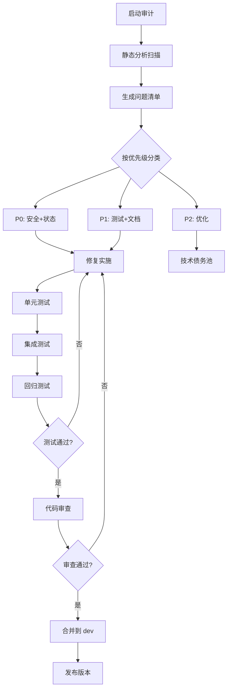

# PRD: ultrapower v7.5.2 BUG 与痛点审计 - Rough

> **状态**: ROUGH (专家评审完成)
> **作者**: Axiom Review Aggregator
> **版本**: 1.0
> **创建日期**: 2026-03-16
> **项目**: ultrapower v7.5.2 多 Agent 编排系统
> **评审轮次**: 5 专家并行评审（UX、Product、Domain、Tech、Critic）

---

## 执行摘要

本 PRD 定义 ultrapower v7.5.2 的全面质量审计和修复计划，覆盖安全、稳定性、测试、文档四大维度。经 5 专家评审后，采用**分阶段发布策略**，优先修复 P0 安全和状态一致性问题。

**关键决策**:
- 分 3 个版本交付：v7.5.3 (安全补丁) → v7.6.0 (质量改进) → v7.7.0+ (持续优化)
- 死锁检测降级为 P1（需 POC 验证）
- 测试覆盖率采用分层策略（安全 100%、状态 90%、其他 80%）
- 敏感数据扫描和加密存储升级为 P0

---

## 1. 背景与目标

### 1.1 项目背景

ultrapower v7.5.2 是一个复杂的多 Agent 编排系统：
- **规模**: 1198 个 TypeScript 源文件
- **组件**: 49 agents、71 skills、43 hooks、35 tools
- **技术栈**: TypeScript + Node.js + Vitest + ESLint
- **核心功能**: 多模式编排（autopilot、ralph、team、pipeline 等 8 种模式）
- **已知技术债务**: 51 个 TODO/FIXME/HACK 标记

### 1.2 审计目标

**主要目标**:
1. 修复所有 P0 安全漏洞（路径遍历、输入验证、敏感数据泄露）
2. 解决状态管理缺陷（并发写入、跨会话污染）
3. 修复 Agent 生命周期问题（超时、孤儿检测、死锁）
4. 提升测试覆盖率和质量
5. 同步文档与代码

**成功指标**:
- 安全漏洞数: 3 类反模式 → 0
- 状态管理缺陷: 3 类反模式 → 0
- 测试覆盖率: 未知 → 安全 100%、状态 90%、其他 80%
- 文档-代码一致性: 未量化 → 100%
- 技术债务标记: 51 个 → <20 个

### 1.3 审计范围

**包含**:
- ✅ 安全漏洞修复和验证
- ✅ 状态管理并发保护
- ✅ Agent 生命周期边界情况
- ✅ 测试覆盖补充（边界用例、并发场景）
- ✅ 文档同步和改进
- ✅ 敏感数据扫描和加密

**不包含**:
- ❌ 新功能开发
- ❌ 大规模架构重构（留待 v8.0）
- ❌ 性能基准测试（需独立专项）
- ❌ 用户体验调研（需用户反馈数据）

---

## 2. 用户故事与角色

### 2.1 核心角色定义

| 角色 | 定义 | 在审计中的参与点 |
|------|------|------------------|
| **核心维护者** | ultrapower 核心团队成员 | 执行审计、修复问题、审查 PR |
| **外部贡献者** | 社区开发者 | 报告问题、提交修复 PR |
| **终端用户** | 使用 ultrapower 的开发者 | 受益于稳定性和安全性提升 |
| **架构师** | 负责 v8.0 重构规划 | 使用审计结果作为重构输入 |

### 2.2 用户故事

**US-01: 安全加固** (P0)
- **作为** 核心维护者
- **我想要** 修复所有路径遍历和输入验证漏洞
- **以便** 防止生产环境安全事故

**US-02: 状态一致性** (P0)
- **作为** 终端用户
- **我想要** 系统在并发场景下保持状态一致
- **以便** 避免任务丢失和数据损坏

**US-03: Agent 生命周期** (P0)
- **作为** 终端用户
- **我想要** Agent 超时和孤儿检测正确工作
- **以便** 避免资源泄露和卡死现象

**US-04: 测试质量** (P1)
- **作为** 外部贡献者
- **我想要** 完善的测试覆盖和边界用例
- **以便** 安全地提交修复而不引入回归

**US-05: 文档同步** (P1)
- **作为** 外部贡献者
- **我想要** 文档与代码保持一致
- **以便** 快速理解系统行为和约束

**US-06: 架构洞察** (P1)
- **作为** 架构师
- **我想要** 识别架构层面的设计缺陷
- **以便** 为 v8.0 重构提供决策依据

---

## 3. 功能需求

### 3.1 P0 需求（阻塞性 - v7.5.3）

#### FR-01: 路径遍历防护
**优先级**: P0 | **来源**: Critic S-01, Domain AP-S01

**需求描述**:
- 所有使用 `mode` 参数拼接路径的代码必须通过 `assertValidMode()` 校验
- 建立 CI 门禁阻止未校验路径拼接
- 提供静态分析扫描报告

**验收标准**:
- [ ] 全局搜索所有 `mode` 参数使用点，生成扫描报告
- [ ] 所有路径拼接前调用 `assertValidMode(mode)`
- [ ] 补充路径遍历攻击测试用例（至少 5 个场景）
- [ ] ESLint 规则检测未校验的路径拼接
- [ ] CI 测试通过率 100%

**技术实现**:
```typescript
// ❌ 错误（Draft 中的反模式）
const path = `.omc/state/${mode}-state.json`;

// ✅ 正确
import { assertValidMode } from './src/lib/validateMode';
const validMode = assertValidMode(mode);
const path = `.omc/state/${validMode}-state.json`;
```

---

#### FR-02: 敏感数据保护
**优先级**: P0 | **来源**: Critic S-02, Domain AP-S03

**需求描述**:
- 建立敏感数据清单（API keys、tokens、credentials）
- 实现敏感数据扫描机制
- 状态文件中的敏感字段使用 AES-256-GCM 加密存储
- 集成密钥泄露检测工具到 CI

**验收标准**:
- [ ] 定义敏感数据白名单/黑名单
- [ ] 扫描当前代码库，生成违规点统计报告
- [ ] 实现 `encryptSensitiveFields()` 和 `decryptSensitiveFields()` 工具函数
- [ ] 状态文件权限设置为 0o600
- [ ] CI 集成 `gitleaks` 或等效工具
- [ ] 审计日志脱敏规则覆盖所有敏感字段

**技术实现**:
```typescript
// 敏感字段加密存储
import { encryptSensitiveFields } from './src/lib/crypto';

const state = {
  apiKey: 'sk-xxx',  // 将被加密
  sessionId: 'abc',  // 不加密
};

const encrypted = encryptSensitiveFields(state, ['apiKey']);
atomicWriteJsonSyncWithRetry(statePath, encrypted, 3, 0o600);
```

---

#### FR-03: 状态一致性保护
**优先级**: P0 | **来源**: Tech, Domain AP-C01

**需求描述**:
- 所有状态文件写入统一使用 `atomicWriteJsonSyncWithRetry`
- 修复 `writeTrackingStateImmediate` 绕过原子写入的问题
- 实现并发写入冲突检测和重试机制

**验收标准**:
- [ ] 替换所有直接 `writeFileSync` 调用为原子写入
- [ ] 并发压力测试通过（10 个会话同时写入 `subagent-tracking.json`）
- [ ] 文件锁超时后的降级策略验证
- [ ] 跨会话状态污染测试通过（session_id 匹配逻辑）

**技术实现**:
```typescript
// ❌ 错误（绕过原子写入）
writeFileSync(statePath, JSON.stringify(state, null, 2));

// ✅ 正确
import { atomicWriteJsonSyncWithRetry } from './src/lib/atomic-write';
atomicWriteJsonSyncWithRetry(statePath, state, 3);
```

---

#### FR-04: SubagentStop 推断修复
**优先级**: P0 | **来源**: Tech, Domain AP-S02

**需求描述**:
- 修复 `SubagentStopInput.success` 字段推断逻辑
- 统一使用 `success !== false` 而非直接读取 `input.success`

**验收标准**:
- [ ] 全局搜索所有 `input.success` 使用点
- [ ] 替换为 `input.success !== false`
- [ ] 补充单元测试验证 `undefined`、`true`、`false` 三种情况
- [ ] 文档澄清 `success` 字段语义

**技术实现**:
```typescript
// ❌ 错误（直接读取已废弃字段）
if (input.success) { /* ... */ }

// ✅ 正确（推断逻辑）
const isSuccess = input.success !== false;
if (isSuccess) { /* ... */ }
```

---

#### FR-05: 并发度上限
**优先级**: P0 | **来源**: Critic E-01, Domain

**需求描述**:
- 定义并发 Agent 数量上限（硬编码 20 个）
- 超出上限时拒绝新 Agent 启动，返回明确错误
- 提供配置项允许用户调整上限

**验收标准**:
- [ ] 实现 `MAX_CONCURRENT_AGENTS = 20` 常量
- [ ] Agent 启动前检查当前并发数
- [ ] 超限时返回错误: "Maximum concurrent agents (20) reached"
- [ ] 补充并发度上限测试（尝试启动 25 个 Agent）

---

#### FR-06: Windows 命令注入审计
**优先级**: P0 | **来源**: Critic S-03

**需求描述**:
- 审计所有 `execSync`/`exec`/`spawn` 调用
- 验证 Windows 平台命令执行安全性
- 确保所有命令执行使用 `execFile` 或参数数组形式

**验收标准**:
- [ ] 生成所有命令执行点的扫描报告
- [ ] 验证 Windows 平台无命令注入风险
- [ ] 补充 Windows 平台 CI 测试
- [ ] 文档说明安全的命令执行模式

---

### 3.2 P1 需求（严重 - v7.6.0）

#### FR-07: 死锁检测实现
**优先级**: P1 | **来源**: Domain AP-AL03, Critic L-02

**需求描述**:
- 实现 `DEADLOCK_CHECK_THRESHOLD = 3` 检测逻辑
- 检测 Agent 相互等待的循环依赖
- 先实现警告模式，不自动终止

**验收标准**:
- [ ] 完成 POC 验证检测算法准确性
- [ ] 实现循环依赖图分析
- [ ] 检测到死锁时记录警告日志
- [ ] 补充死锁场景测试用例（至少 3 个场景）

**技术实现**:
```typescript
// 死锁检测伪代码
function detectDeadlock(agents: Agent[]): boolean {
  const graph = buildDependencyGraph(agents);
  return hasCycle(graph);
}
```

---

#### FR-08: 测试覆盖补充
**优先级**: P1 | **来源**: Critic E-01/E-02/E-03, Tech

**需求描述**:
- 补充并发场景测试
- 补充状态文件损坏恢复测试
- 补充跨会话状态污染测试
- 达到分层覆盖率目标

**验收标准**:
- [ ] 安全关键路径测试覆盖率 100%
- [ ] 状态管理模块测试覆盖率 ≥90%
- [ ] 其他模块测试覆盖率 ≥80%
- [ ] 并发压力测试（100 并发写入）
- [ ] Windows 平台测试通过

**测试场景清单**:
1. 10 个并发会话同时写入 `subagent-tracking.json`
2. JSON 文件部分写入（进程被 kill）
3. 文件大小为 0
4. JSON 格式错误（手动编辑）
5. 会话 A 异常终止，会话 B 读取脏状态
6. 两个会话同时清理同一个 mode 状态文件
7. session_id 为 null/undefined 的旧版状态文件

---

#### FR-09: 文档同步
**优先级**: P1 | **来源**: Tech D-03/D-04/D-09, UX 问题 10/11

**需求描述**:
- 修复文档与代码不一致的差异点
- 为每个反模式提供 Before/After 代码示例
- 添加术语表和调试指南
- 建立文档同步 CI 检查

**验收标准**:
- [ ] 修复差异点 D-03: 合法 mode 数量（7 → 8）
- [ ] 修复差异点 D-04: 互斥模式范围（2 → 4）
- [ ] 修复差异点 D-09: stale 阈值双重含义澄清
- [ ] 为 51 个反模式补充 Before/After 示例
- [ ] 添加术语表（至少 20 个核心术语）
- [ ] 补充调试指南和错误恢复路径

---

#### FR-10: 超时阈值澄清
**优先级**: P1 | **来源**: Critic L-01, Domain AP-AL02

**需求描述**:
- 明确区分两种超时阈值：5 分钟警告 vs 10 分钟自动终止
- 提取超时常量到配置文件
- 补充测试验证两阶段超时行为

**验收标准**:
- [ ] 定义常量 `AGENT_STALE_WARNING_MS = 5 * 60 * 1000`
- [ ] 定义常量 `AGENT_STALE_TERMINATE_MS = 10 * 60 * 1000`
- [ ] 文档明确说明两阶段超时语义
- [ ] 补充测试：5 分钟触发警告，10 分钟触发终止

---

#### FR-11: Agent 级联失败处理
**优先级**: P1 | **来源**: Domain G-01

**需求描述**:
- 补充 Agent 级联失败处理文档
- 定义依赖链中断的处理策略
- 记录失败传播路径

**验收标准**:
- [ ] 文档说明：当 planner Agent 失败时，executor Agents 如何处理
- [ ] 定义失败传播策略（立即停止 vs 继续执行）
- [ ] 补充级联失败测试用例

---

#### FR-12: 结构化日志
**优先级**: P1 | **来源**: Domain G-02

**需求描述**:
- 实现结构化日志（JSON 格式）
- 支持日志级别（DEBUG/INFO/WARN/ERROR）
- 集成 OpenTelemetry 或自定义 Trace ID 传播

**验收标准**:
- [ ] 实现 `StructuredLogger` 类
- [ ] 所有关键路径使用结构化日志
- [ ] 日志包含 trace_id、session_id、agent_id
- [ ] 支持日志级别过滤

---

### 3.3 P2 需求（优化 - v7.7.0+）

#### FR-13: 技术债务清理
**优先级**: P2 | **来源**: Draft, Product Q-02

**需求描述**:
- 对 51 个 TODO/FIXME/HACK 标记进行分级
- 清理过期标记
- 重构反模式代码

**验收标准**:
- [ ] 技术债务标记数量 <20 个
- [ ] 所有 P0/P1 标记已处理
- [ ] 生成技术债务清理报告

---

#### FR-14: 开发体验改进
**优先级**: P2 | **来源**: UX 问题 7/13

**需求描述**:
- 提供自动修复命令（如 `omc repair --fix-state-pollution`）
- 改善错误信息可读性
- 在错误信息中包含修复提示

**验收标准**:
- [ ] 实现 `omc repair` 命令
- [ ] 错误信息包含调试提示和文档链接
- [ ] 提供交互式错误恢复向导

---

## 4. 业务流程

### 4.1 审计执行流程



### 4.2 分阶段发布流程

**Phase 1: v7.5.3 安全补丁 (2 周)**
```
Week 1:
  Day 1-2: FR-01 路径遍历防护
  Day 3-4: FR-02 敏感数据保护
  Day 5: FR-04 SubagentStop 推断修复

Week 2:
  Day 1-2: FR-03 状态一致性保护
  Day 3: FR-05 并发度上限
  Day 4: FR-06 Windows 命令注入审计
  Day 5: 回归测试 + 发布
```

**Phase 2: v7.6.0 质量改进 (4 周)**
```
Week 1-2: FR-08 测试覆盖补充
Week 3: FR-09 文档同步 + FR-10 超时阈值澄清
Week 4: FR-07 死锁检测 + FR-11 级联失败处理 + FR-12 结构化日志
```

**Phase 3: v7.7.0+ 持续优化**
```
按需处理: FR-13 技术债务清理 + FR-14 开发体验改进
```

---

## 5. 非功能需求

### 5.1 性能要求

| 指标 | 当前 | 目标 | 测量方式 |
|------|------|------|----------|
| 状态文件写入延迟 | 未测量 | <100ms (p95) | 性能测试 |
| 并发 Agent 启动时间 | 未测量 | <500ms (10 个并发) | 压力测试 |
| 文件锁获取超时 | 5s | 5s (保持) | 配置项 |

### 5.2 安全要求

- 所有路径拼接必须通过白名单校验
- 敏感数据必须加密存储（AES-256-GCM）
- 状态文件权限必须为 0o600
- CI 必须集成密钥泄露检测

### 5.3 兼容性要求

- Node.js: ≥18.0.0
- TypeScript: ≥5.0.0
- 操作系统: macOS、Linux、Windows
- 向后兼容: 状态文件格式不变，支持热回滚

### 5.4 可观测性要求

- 结构化日志（JSON 格式）
- 日志级别: DEBUG/INFO/WARN/ERROR
- 关键操作必须记录 trace_id
- 支持 OpenTelemetry 集成（可选）

---

## 6. 验收标准

### 6.1 P0 验收标准（v7.5.3 发布门禁）

**必须满足**:
- [ ] 所有 P0 功能需求（FR-01 至 FR-06）实施完成
- [ ] 路径遍历攻击测试通过（至少 5 个场景）
- [ ] 并发压力测试通过（10 个会话同时写入）
- [ ] 敏感数据扫描报告无违规点
- [ ] Windows CI 测试通过
- [ ] 回归测试通过率 ≥95%
- [ ] 代码审查通过（至少 2 名 reviewer）

### 6.2 P1 验收标准（v7.6.0 发布门禁）

**必须满足**:
- [ ] 所有 P1 功能需求（FR-07 至 FR-12）实施完成
- [ ] 测试覆盖率达标（安全 100%、状态 90%、其他 80%）
- [ ] 文档差异点全部修复
- [ ] 死锁检测 POC 验证通过
- [ ] 所有反模式补充 Before/After 示例

### 6.3 质量门禁

**代码质量**:
- ESLint 错误数: 0
- TypeScript 编译错误: 0
- 单元测试通过率: 100%

**文档质量**:
- 所有 API 变更有文档说明
- 所有反模式有代码示例
- 术语表覆盖核心概念

---

## 7. 风险与缓解

### 7.1 技术风险

| 风险 | 概率 | 影响 | 缓解措施 |
|------|------|------|----------|
| 原子写入性能回退 | 中 | 中 | 保留 debounce 层，仅修复即时写入 |
| Windows 平台兼容性 | 低 | 高 | 增加 Windows CI 测试 |
| 并发测试不充分 | 高 | 中 | 补充压力测试用例 |
| 死锁检测误报 | 中 | 低 | 先实现警告模式，不自动终止 |
| 回归引入 | 中 | 高 | 强制测试覆盖率门禁 + 分阶段发布 |

### 7.2 执行风险

| 风险 | 概率 | 影响 | 缓解措施 |
|------|------|------|----------|
| 范围蔓延 | 高 | 高 | 严格限制 MVP 范围，P2 延后处理 |
| 资源不足 | 中 | 中 | 优先 P0，P1/P2 按需调整 |
| 用户感知价值低 | 高 | 中 | 发布说明强调稳定性和安全性 |

### 7.3 战略风险

**关键风险**: 审计工作可能延迟新功能开发

**缓解措施**:
- 将审计工作拆分为 3 个 sprint
- P0 修复后立即发布 v7.5.3
- P1/P2 问题在后续版本逐步交付

---

## 8. 成功指标

### 8.1 Primary KPI

| 指标 | 当前基线 | v7.5.3 目标 | v7.6.0 目标 | 测量方式 |
|------|---------|------------|------------|----------|
| 安全漏洞数 | 3 类 | 0 | 0 | 安全审计 |
| 状态管理缺陷 | 3 类 | 0 | 0 | 并发测试 |
| Agent 生命周期问题 | 3 类 | 1 类 | 0 | 边界测试 |
| 技术债务标记 | 51 个 | 40 个 | <20 个 | 代码扫描 |
| 测试覆盖率 | 未知 | 70% | 80%+ | Coverage 报告 |

### 8.2 Secondary KPI

- 构建失败率: 降低 30%
- 用户报告的运行时错误: 降低 50%
- 文档-代码一致性: 100%
- PR 审查时间: 降低 20%

---

## 9. 暂不包含（Out of Scope）

以下内容明确不在本次审计范围内：

**延后至 v8.0.0**:
- Saga 模式补偿事务
- Redis/etcd 状态存储后端
- 自适应限流和熔断机制
- 大规模架构重构

**移至技术债务池**:
- 性能基准测试
- 用户体验调研
- UI/可视化改进

---

## 10. 附录

### 附录 A: 反模式清单

详见 `docs/standards/anti-patterns.md`

**安全反模式**:
- AP-S01: 未校验 mode 参数直接拼接路径
- AP-S02: 直接读取 SubagentStopInput.success
- AP-S03: 在状态文件中存储敏感信息

**状态管理反模式**:
- AP-ST01: 混淆 agent stale 和 mode stale 阈值
- AP-ST02: 跨会话误清理状态文件
- AP-ST03: 在 ~/.claude/ 中存储 OMC 状态

**Agent 生命周期反模式**:
- AP-AL01: 向孤儿 Agent 发送 SHUTDOWN 信号
- AP-AL02: 混淆超时阈值
- AP-AL03: 忽略 DEADLOCK_CHECK_THRESHOLD

**并发反模式**:
- AP-C01: 绕过原子写入保护
- AP-C02: 不使用防抖直接写入高频状态

### 附录 B: 参考文档

| 文档 | 路径 | 用途 |
|------|------|------|
| 反模式清单 | docs/standards/anti-patterns.md | 已知反模式和正确替代方案 |
| Agent 生命周期 | docs/standards/agent-lifecycle.md | 边界情况矩阵和处理策略 |
| 运行时保护 | docs/standards/runtime-protection.md | 安全防护规范 |
| 状态机规范 | docs/standards/state-machine.md | 状态转换和阈值定义 |
| 评审摘要 | docs/reviews/bugs-pain-points-audit/summary.md | 专家评审决策记录 |

---

**生成时间**: 2026-03-16
**下一步**: 用户确认后，调用 axiom-system-architect 进行任务拆解

