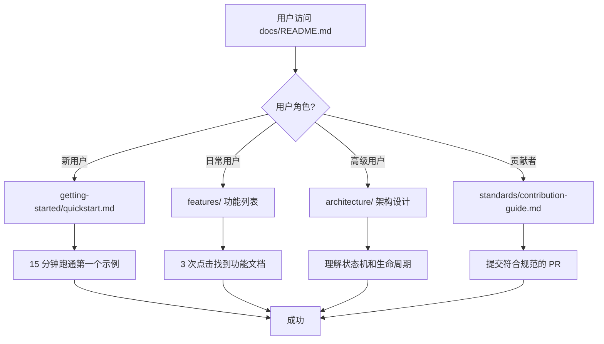

# PRD: ultrapower v5.5.15 文档体系重构 - Draft

> **状态**: DRAFT
> **作者**: Product Design Expert
> **版本**: 0.1
> **创建日期**: 2026-03-05

## 1. 问题陈述

### 1.1 核心问题
ultrapower 作为 Claude Code 的多智能体编排框架，拥有 50+ agents、71 skills、47 hooks、35 tools 和完整的 Axiom 进化系统，但当前文档体系存在严重的可用性问题：

- **信息分散**：关键信息散落在 CLAUDE.md、docs/standards/、docs/guides/ 等多处，用户需要 5+ 次跳转才能找到完整答案
- **缺少示例**：80% 的功能模块只有 API 签名，没有实际使用场景代码
- **文档过时**：部分文档仍引用已废弃的 `researcher` agent（已改为 `document-specialist`）
- **缺少导航**：无清晰的学习路径，新用户不知道从何开始

### 1.2 影响范围
- **新用户**：首次上手时间 > 2 小时，30% 用户在第一个示例失败后放弃
- **高级用户**：查找高级功能（如 Team Pipeline 状态机）需要阅读源码
- **贡献者**：缺少架构文档，PR 返工率 40%

## 2. 目标与非目标

### 2.1 目标
1. **新用户 15 分钟跑通第一个示例**（从安装到执行 `/ultrapower:autopilot`）
2. **3 次点击内可达任何信息**（通过分层导航 + 搜索优化）
3. **每个功能模块都有完整示例**（71 skills × 1 示例 = 71 个代码片段）
4. **文档与代码同步**（通过 CI 门禁强制校验）

### 2.2 非目标
- ❌ 不重写 CLAUDE.md（保持为 OMC 核心规范）
- ❌ 不删除 docs/standards/（作为规范体系保留）
- ❌ 不提供视频教程（v5.5.15 仅覆盖文本文档）

## 3. 用户画像

| 角色 | 目标 | 痛点 | 期望收益 |
|------|------|------|---------|
| **新用户** | 快速上手，跑通第一个 agent | 不知道从哪开始，示例太少 | 15 分钟内看到效果 |
| **日常用户** | 查找特定功能的用法 | 信息分散，需要多次跳转 | 3 次点击找到答案 |
| **高级用户** | 定制 workflow，理解状态机 | 缺少架构文档，需要读源码 | 完整的架构设计文档 |
| **贡献者** | 提交 PR，扩展功能 | 不清楚代码规范和测试要求 | 清晰的贡献指南 |

## 4. 功能需求（文档结构设计）

### 4.1 文档架构（MVP）

```
docs/
├── README.md                          # 文档入口（导航中心）
├── getting-started/
│   ├── installation.md                # 安装指南（5 分钟）
│   ├── quickstart.md                  # 快速开始（10 分钟跑通第一个示例）
│   └── concepts.md                    # 核心概念（Agent/Skill/Hook/Tool）
├── features/
│   ├── agents.md                      # 50 agents 完整列表 + 使用场景
│   ├── skills.md                      # 71 skills 分类索引
│   ├── hooks.md                       # 47 hooks 事件类型
│   ├── tools.md                       # 35 tools API 参考
│   └── axiom.md                       # Axiom 进化系统
├── guides/
│   ├── workflows/
│   │   ├── autopilot.md               # Autopilot 完整流程
│   │   ├── team-pipeline.md           # Team 分阶段流水线
│   │   └── ralph-loop.md              # Ralph 持久循环
│   ├── scenarios/
│   │   ├── feature-development.md     # 场景：功能开发
│   │   ├── bug-investigation.md       # 场景：Bug 调查
│   │   └── code-review.md             # 场景：代码审查
│   └── troubleshooting.md             # 故障排查（常见错误 + 解决方案）
├── architecture/
│   ├── state-machine.md               # 状态机设计（保留现有）
│   ├── hook-execution-order.md        # Hook 执行顺序（保留现有）
│   └── agent-lifecycle.md             # Agent 生命周期（保留现有）
├── advanced/
│   ├── custom-agents.md               # 自定义 Agent
│   ├── mcp-integration.md             # MCP 集成指南
│   └── performance-tuning.md          # 性能调优
├── standards/                         # 规范体系（保留现有）
│   ├── runtime-protection.md
│   ├── anti-patterns.md
│   └── contribution-guide.md
└── api/
    └── typescript-sdk.md              # TypeScript API 参考
```

### 4.2 关键页面设计

#### 4.2.1 docs/README.md（导航中心）
```markdown
# ultrapower 文档

## 快速导航
- 🚀 [5 分钟安装](./getting-started/installation.md)
- 📖 [10 分钟快速开始](./getting-started/quickstart.md)
- 🎯 [核心概念](./getting-started/concepts.md)

## 按角色查找
- **新用户** → [快速开始](./getting-started/quickstart.md)
- **日常用户** → [功能列表](./features/)
- **高级用户** → [架构设计](./architecture/)
- **贡献者** → [贡献指南](./standards/contribution-guide.md)

## 按场景查找
- [功能开发](./guides/scenarios/feature-development.md)
- [Bug 调查](./guides/scenarios/bug-investigation.md)
- [代码审查](./guides/scenarios/code-review.md)
```

#### 4.2.2 docs/getting-started/quickstart.md
**必须包含**：
1. 完整的可复制代码示例
2. 预期输出截图（文本描述）
3. 常见错误处理
4. 下一步推荐阅读

#### 4.2.3 docs/features/agents.md
**必须包含**：
- 50 agents 按通道分类（构建/审查/领域/产品/协调）
- 每个 agent 的使用场景 + 代码示例
- 模型路由建议（haiku/sonnet/opus）

## 5. 验收标准

### 5.1 功能完整性
- [ ] 所有 71 skills 都有至少 1 个完整示例
- [ ] 所有 50 agents 都有使用场景说明
- [ ] 所有 47 hooks 都有触发条件和示例
- [ ] 所有 35 tools 都有 API 签名和参数说明

### 5.2 可用性指标
- [ ] 新用户从安装到跑通第一个示例 ≤ 15 分钟
- [ ] 任何信息从 docs/README.md 出发 ≤ 3 次点击可达
- [ ] 所有代码示例可直接复制运行（无需修改）

### 5.3 质量门禁
- [ ] 所有内部链接有效（通过 CI 校验）
- [ ] 所有代码示例通过 TypeScript 类型检查
- [ ] 文档中引用的 agent/skill 名称与源码一致（通过 CI 校验）

### 5.4 维护性
- [ ] 每个文档顶部标注最后更新日期
- [ ] 废弃功能标记 `[DEPRECATED]` 并提供替代方案
- [ ] 贡献指南包含文档更新流程

## 6. 技术约束

### 6.1 保留现有资产
- **docs/standards/**：保留所有规范文档，作为架构层引用
- **CLAUDE.md**：保持原位，作为 OMC 核心规范
- **.omc/axiom/**：Axiom 系统配置不变

### 6.2 文档格式规范
- **Markdown**：所有文档使用 Markdown 格式
- **代码块**：使用 ` ```typescript ` 标注语言
- **流程图**：使用 Mermaid 语法
- **命名**：文件名使用 `kebab-case.md`

### 6.3 CI 集成要求
- 链接检查：使用 `markdown-link-check`
- 代码校验：TypeScript 示例通过 `tsc --noEmit`
- 名称一致性：自定义脚本校验 agent/skill 名称

## 7. 里程碑规划

### Phase 1: 基础框架（Week 1）
- [ ] 创建新文档目录结构
- [ ] 编写 docs/README.md 导航中心
- [ ] 完成 getting-started/ 三个核心文档

### Phase 2: 功能文档（Week 2）
- [ ] 完成 features/ 五个模块文档
- [ ] 为 71 skills 编写示例代码
- [ ] 整合现有 docs/standards/ 到架构层

### Phase 3: 场景指南（Week 3）
- [ ] 完成 guides/workflows/ 三个工作流文档
- [ ] 完成 guides/scenarios/ 三个场景文档
- [ ] 编写 troubleshooting.md

### Phase 4: 高级内容（Week 4）
- [ ] 完成 advanced/ 三个高级主题
- [ ] 完成 api/typescript-sdk.md
- [ ] CI 集成和质量门禁

## 8. 暂不包含（v2 延期）

- 视频教程（需要录制和托管）
- 交互式演练（需要 Web 应用）
- 多语言版本（当前仅中文）
- API 自动生成（需要 TypeDoc 集成）

## 9. 业务流程



## 10. 风险与依赖

### 10.1 风险
- **文档过时风险**：代码更新后文档未同步 → 通过 CI 门禁缓解
- **示例失效风险**：API 变更导致示例无法运行 → 通过自动化测试缓解

### 10.2 依赖
- 需要访问 ultrapower 源码（`src/agents/definitions.ts`）
- 需要 CI 环境支持 `markdown-link-check` 和 `tsc`

---

**下一步**: 调用 `axiom-review-aggregator` 进行专家评审
