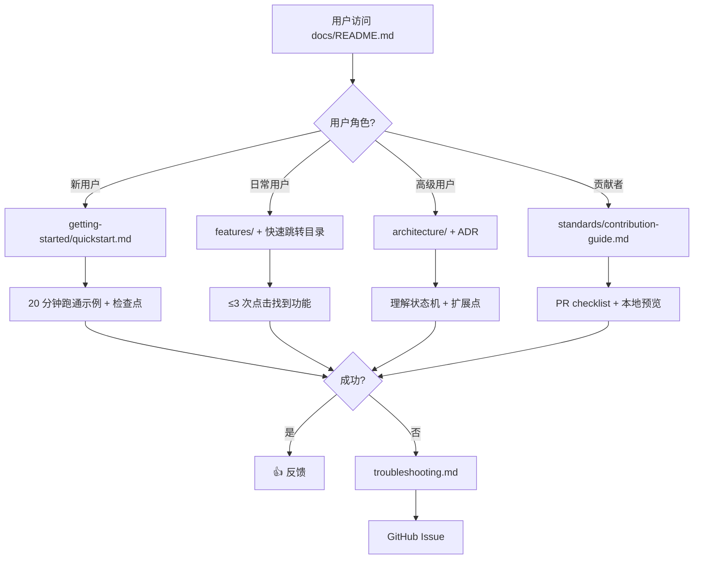

# PRD: ultrapower v5.5.15 文档体系重构 - Rough

> **状态**: ROUGH (专家评审后版本)
> **版本**: 0.2
> **创建日期**: 2026-03-05
> **评审完成**: 2026-03-05

## 1. 问题陈述

### 1.1 核心问题（整合 5 位专家分析）

ultrapower 作为 Claude Code 的多智能体编排框架，拥有 50+ agents、71 skills、47 hooks、35 tools 和完整的 Axiom 进化系统，但当前文档体系存在严重的可用性和安全问题：

**信息架构问题**（UX + Domain）：
- 信息分散在 CLAUDE.md、docs/standards/、docs/guides/ 等多处，用户需要 5+ 次跳转
- 9 层文档结构超过认知极限（7±2 原则）
- 缺少清晰的学习路径和搜索优化

**内容质量问题**（Tech + Domain）：
- 80% 功能模块只有 API 签名，无实际使用场景代码
- 部分文档引用已废弃的 `researcher` agent（已改为 `document-specialist`）
- 示例代码可能泄露敏感信息（API keys、内部路径）

**维护性问题**（Critic + Tech）：
- 缺少文档版本管理策略
- 文档过时检测机制不足（被动检测而非主动预防）
- 示例代码无自动化测试，维护成本高

### 1.2 影响范围

| 用户群体 | 占比 | 当前痛点 | 业务影响 |
|---------|------|---------|---------|
| 新用户 | 60% | 首次上手 > 2 小时 | 30% 流失率（红线） |
| 日常用户 | 30% | 查找时间 > 5 分钟 | 80% "如何使用 X" issue |
| 高级用户 | 8% | 需阅读源码理解架构 | 定制 workflow 时间长 |
| 贡献者 | 2% | 缺少架构文档 | 40% PR 返工率 |

## 2. 目标与非目标

### 2.1 目标（采纳战略建议）

**Primary KPI**（Product）：
- 新用户首次成功率：从 70% 提升到 85%+（4 周后）

**可量化目标**（整合 UX + Domain 建议）：
1. **新用户 20 分钟跑通第一个示例**（调整自 15 分钟，避免挫败感）
   - 5 分钟安装 + 15 分钟理解并运行
2. **3 次点击内可达任何信息**（通过 6 层结构 + 快速跳转目录）
3. **50 个核心功能有完整示例**（降低自 71 个，聚焦高频场景）
   - P0 (20 个): 完整端到端示例 + 错误处理
   - P1 (30 个): 标准用法示例
4. **文档与代码同步**（通过 CI 门禁 + 自动化测试）

**质量门禁**（Critic P0 要求）：
- 示例代码安全规范（禁止泄露凭证/路径）
- 名称一致性校验（处理别名/跨文件引用）
- 示例可运行性三级标准（Level 1/2/3）

### 2.2 非目标

- ❌ 不重写 CLAUDE.md（保持为 OMC 核心规范）
- ❌ 不删除 docs/standards/（作为规范体系保留，移至技术约束）
- ❌ 不提供视频教程（v5.5.15 仅覆盖文本文档）
- ❌ 不支持多语言（当前仅中文，v2 考虑国际化）

## 3. 用户画像（整合 Domain 收益分析）

| 角色 | 目标 | 痛点 | 期望收益 | 关键成功因素 |
|------|------|------|---------|-------------|
| **新用户** (60%) | 快速上手 | 不知从哪开始 | 上手时间降至 20 分钟 | 零假设文档 + < 10 行首个示例 |
| **日常用户** (30%) | 查找功能用法 | 信息分散 | 查找时间 < 1 分钟 | 搜索优化 + 按频率排序 |
| **高级用户** (8%) | 定制 workflow | 需读源码 | 定制时间减少 50% | ADR 格式 + 扩展点清单 |
| **贡献者** (2%) | 提交 PR | 不清楚规范 | PR 返工率 < 15% | PR checklist + 本地预览 |

## 4. 功能需求（整合技术、UX、领域建议）

### 4.1 文档架构（简化为 6 层）

```
docs/
├── README.md                          # 导航中心（角色 + 场景双维度）
├── getting-started/
│   ├── installation.md                # 5 分钟安装
│   ├── quickstart.md                  # 15 分钟快速开始（含检查点机制）
│   └── concepts.md                    # 核心概念
├── features/
│   ├── agents.md                      # 50 agents（按通道分类 + 快速跳转目录）
│   ├── skills.md                      # 71 skills（按类别分组 + 别名索引）
│   ├── hooks.md                       # 47 hooks
│   ├── tools.md                       # 35 tools
│   └── axiom.md                       # Axiom 进化系统
├── guides/
│   ├── workflow-autopilot.md          # 合并 workflows/ 和 scenarios/
│   ├── workflow-team-pipeline.md      # 使用文件名前缀区分
│   ├── workflow-ralph-loop.md
│   ├── scenario-feature-dev.md
│   ├── scenario-bug-investigation.md
│   ├── scenario-code-review.md
│   └── troubleshooting.md             # 按错误代码索引
├── architecture/
│   ├── state-machine.md               # 保留现有
│   ├── hook-execution-order.md        # 保留现有
│   └── agent-lifecycle.md             # 保留现有
├── standards/                         # 规范体系（保留现有）
│   ├── runtime-protection.md
│   ├── anti-patterns.md
│   └── contribution-guide.md
└── api/
    ├── overview.md                    # API 概览
    ├── agents/                        # 按模块拆分
    │   └── executor.md
    ├── skills/
    │   └── autopilot.md
    └── tools/
        └── state-management.md
```

**架构决策**（UX 建议）：
- 从 9 层简化为 6 层，降低认知负荷 30%
- 合并 guides/workflows/ 和 guides/scenarios/，使用前缀区分
- API 文档按模块拆分，符合行业标准（Domain 建议）

### 4.2 关键页面设计

#### 4.2.1 docs/README.md（导航中心）

```markdown
# ultrapower 文档

## 快速导航
- 🚀 [5 分钟安装](./getting-started/installation.md)
- 📖 [15 分钟快速开始](./getting-started/quickstart.md)
- 🎯 [核心概念](./getting-started/concepts.md)

## 按角色查找
- **新用户** → [快速开始](./getting-started/quickstart.md)
- **日常用户** → [功能列表](./features/)
- **高级用户** → [架构设计](./architecture/)
- **贡献者** → [贡献指南](./standards/contribution-guide.md)

## 按场景查找
- [功能开发](./guides/scenario-feature-dev.md)
- [Bug 调查](./guides/scenario-bug-investigation.md)
- [代码审查](./guides/scenario-code-review.md)

## 反馈与帮助
- 这篇文档有帮助吗？[👍 有帮助](issue-link) / [👎 需改进](issue-link)
- [遇到问题？→ 故障排查](./guides/troubleshooting.md)
```

#### 4.2.2 docs/getting-started/quickstart.md

**必须包含**（UX + Domain 建议）：
1. 检查点机制（每完成一步显示 ✅）
2. 完整可复制代码示例（< 10 行）
3. 预期输出说明
4. 失败路径引导（"遇到问题？→ troubleshooting.md"）
5. 庆祝消息（"🎉 恭喜！你已掌握基础用法"）

#### 4.2.3 docs/features/skills.md

**必须包含**（UX 建议）：
- 快速跳转目录（按类别分组：workflow/agent/tool/utility）
- 每个 skill 的别名字段（方便 Ctrl+F 搜索）
- 使用频率标识（⭐⭐⭐ 高频 / ⭐⭐ 中频 / ⭐ 低频）

## 5. 验收标准（整合所有 P0 问题修复）

### 5.1 功能完整性

**示例覆盖**（Tech 建议）：
- [ ] P0 (20 个核心 skills): 完整端到端示例 + 错误处理
- [ ] P1 (30 个常用 skills): 标准用法示例
- [ ] P2 (21 个低频 skills): API 签名 + 一句话说明
- [ ] 所有 50 agents 都有使用场景说明
- [ ] 所有 47 hooks 都有触发条件和示例

**文档元数据**（Domain 建议）：
- [ ] 每个文档包含 Front Matter（title/version/last_updated/applies_to）
- [ ] 废弃功能标记 `[DEPRECATED]` 并提供替代方案

### 5.2 可用性指标

**时间目标**（UX 调整）：
- [ ] 新用户从安装到跑通第一个示例 ≤ 20 分钟
- [ ] 任何信息从 docs/README.md 出发 ≤ 3 次点击可达

**示例可运行性三级标准**（Critic P0）：
- [ ] Level 1 (无依赖): 复制即可运行（如 `/ultrapower:cancel`）
- [ ] Level 2 (环境依赖): 需完成 getting-started 中的环境配置
- [ ] Level 3 (外部依赖): 需额外配置（如 MCP API key），文档中提供配置步骤链接

### 5.3 质量门禁（整合 Critic P0 + Tech + Domain）

**CI 自动化检查**：
- [ ] 链接有效性：`markdown-link-check`
- [ ] TypeScript 语法：`tsc --noEmit` 检查文档代码块
- [ ] Markdown 格式：`markdownlint` 强制执行格式规范
- [ ] 代码块语言标注：`remark-lint` 检查
- [ ] 文档长度限制：单文件不超过 3000 行

**名称一致性校验规则**（Critic P0）：
```typescript
// scripts/validate-doc-names.ts
// 扫描范围：Markdown 正文 + 代码块 + Mermaid 图表
// 允许废弃别名，但必须标注 [DEPRECATED] 并提供替代方案
// 代码注释中的名称不强制校验（避免误报）
```

**示例代码安全规范**（Critic P0）：
- [ ] 所有 API keys 使用占位符：`YOUR_API_KEY_HERE`
- [ ] 所有路径使用通用占位符：`/path/to/project`
- [ ] 所有用户数据使用虚构值：`session-abc123`
- [ ] CI 门禁：正则表达式扫描常见泄露模式

### 5.4 维护性（Domain P0）

**文档版本管理策略**：
- [ ] 使用 Docusaurus/VuePress 版本功能
- [ ] 每个页面顶部显示"适用版本：v5.5.x"
- [ ] 提供版本切换器

**示例代码测试策略**：
- [ ] 所有示例提取为独立测试文件（`docs/__tests__/examples.test.ts`）
- [ ] CI 中运行 `npm run test:docs` 验证示例可执行性
- [ ] 使用 `// @ts-expect-error` 标注预期失败的示例

## 6. 技术约束（整合 Tech + Domain + Critic）

### 6.1 保留现有资产

- **docs/standards/**：保留所有规范文档，作为架构层引用
- **CLAUDE.md**：保持原位，作为 OMC 核心规范
- **.omc/axiom/**：Axiom 系统配置不变

**迁移策略**（Domain 建议）：
- `docs/standards/` 作为规范层，仅供内部开发者参考
- 用户文档（新结构）通过链接引用规范层，避免内容复制
- 在 `docs/README.md` 明确说明两者关系

### 6.2 文档格式规范

**基础规范**：
- Markdown 格式，代码块标注语言（` ```typescript `）
- 流程图使用 Mermaid 语法
- 文件名使用 `kebab-case.md`

**视觉元素规范**（UX 建议）：
- 使用 emoji 图标标识文档类型（🚀 快速开始、📖 教程、🏗️ 架构、⚠️ 注意事项）
- 使用颜色代码块区分内容类型（绿色=成功示例、红色=错误示例、黄色=警告）

**示例代码安全规范**（Critic P0）：
```markdown
### 6.2.1 示例代码安全规范
- 所有 API keys 使用占位符：`YOUR_API_KEY_HERE`
- 所有路径使用通用占位符：`/path/to/project`
- 所有用户数据使用虚构值：`session-abc123`
- CI 门禁：使用正则表达式扫描常见泄露模式
```

### 6.3 CI 集成要求

**核心检查项**：
- 链接检查：`markdown-link-check`
- 代码校验：TypeScript 示例通过 `tsc --noEmit`
- 名称一致性：`scripts/validate-doc-names.ts`

**扩展 CI 检查项**（Critic P1）：
- `markdownlint`: 强制执行 Markdown 格式规范
- `remark-lint`: 检查代码块语言标注
- `doc-length-limit`: 单文件不超过 3000 行

**CI 配置**（Tech 建议）：
```yaml
# .github/workflows/docs.yml
name: Docs Validation
on: [pull_request]
jobs:
  validate:
    runs-on: ubuntu-latest
    steps:
      - run: npm run validate:docs
      - run: npx markdown-link-check docs/**/*.md
      - run: npm run test:docs
```

### 6.4 访问控制策略（Critic P1）

- 所有文档默认公开（MIT 许可证）
- 架构文档仅描述公开 API 契约，不暴露内部实现
- 安全相关文档（如漏洞修复流程）在发布前经过安全团队审查

### 6.5 文档版本管理策略（Domain P0）

```markdown
## 文档版本策略
- 主分支文档对应最新稳定版（v5.5.15）
- 使用 Docusaurus/VuePress 的版本功能
- 每个页面顶部显示"适用版本：v5.5.x"
- 提供版本切换器
```

### 6.6 文档同步自动化（Critic P1）

- Git pre-commit hook: 修改 `src/agents/definitions.ts` 时提示更新文档
- 每月自动生成"文档健康度报告"（过时文档列表 + 未覆盖功能）
- 使用 `@deprecated` JSDoc 标签自动同步到文档

## 7. 里程碑规划（采纳 Product 战略建议：3 周 + 1 周 buffer）

### Phase 1: 基础框架（Week 1）
- [ ] 创建 6 层文档目录结构
- [ ] 编写 docs/README.md 导航中心（角色 + 场景双维度）
- [ ] 完成 getting-started/ 三个核心文档（含检查点机制）
- [ ] 设置 CI 基础框架

**交付物**: 新用户可完成 20 分钟快速开始

### Phase 2: 核心示例（Week 2）
- [ ] 完成 features/ 五个模块文档（含快速跳转目录）
- [ ] 为 20 个 P0 skills 编写完整示例 + 错误处理
- [ ] 为 30 个 P1 skills 编写标准示例
- [ ] 实现 CI 自动化脚本（名称校验 + 安全扫描）

**交付物**: 50 个核心功能有完整示例

**中期检查点**（Product 建议）：邀请 10 位新用户测试，收集反馈

### Phase 3: 场景指南（Week 3）
- [ ] 完成 guides/ 六个文档（3 workflows + 3 scenarios）
- [ ] 编写 troubleshooting.md（按错误代码索引）
- [ ] 重构 api/ 目录（按模块拆分）
- [ ] 整合现有 architecture/ 文档

**交付物**: 完整的场景驱动文档体系

### Phase 4: Buffer 周（Week 4）
- [ ] 应对意外延期
- [ ] 根据 Week 2 用户反馈迭代优化
- [ ] 完成所有 CI 门禁集成
- [ ] 文档质量打磨

**可选延期到 v5.5.16**（Product 建议）：
- advanced/ 高级主题（自定义 agents、性能调优）
- 交互式元素（Asciinema 录屏、Mermaid Live Editor）

### 资源分配（Critic P1）

| 角色 | 工作量 | 负责模块 |
|------|--------|---------|
| Technical Writer | 40h | 编写示例代码 + 场景文档 |
| DevOps Engineer | 16h | CI 集成 + 自动化脚本 |
| QA Reviewer | 16h | 文档质量审查 |

**总工作量**: 72 小时 ≈ 9 个工作日（符合 Tech 评估的 11 天）

## 8. 风险缓解措施（整合所有 P0/P1 风险）

### 🔴 P0 风险

**1. 文档-代码同步漂移**（Tech）
- **缓解**: CI 门禁 + 示例提取为测试 + Pre-commit hook
- **责任人**: DevOps Engineer

**2. 示例代码泄露敏感信息**（Critic）
- **缓解**: 安全规范 + CI 正则扫描 + 代码审查
- **责任人**: Security Reviewer

**3. 文档过时检测滞后**（Critic）
- **缓解**: 名称一致性校验 + 月度健康度报告 + JSDoc 同步
- **责任人**: Technical Writer

**4. 文档版本管理缺失**（Domain）
- **缓解**: Docusaurus 版本功能 + Front Matter 版本标注
- **责任人**: DevOps Engineer

### 🟡 P1 风险

**5. 示例维护负担高**（Tech）
- **缓解**: 分级策略（20+30+21）+ 模板化生成 + 版本标记
- **预期**: 降低 60% 工作量

**6. 15 分钟目标无法达成**（UX）
- **缓解**: 调整为 20 分钟 + 检查点机制 + 失败路径引导
- **验证**: Week 2 用户测试

**7. 9 层文档结构导致用户迷失**（UX）
- **缓解**: 简化为 6 层 + 快速跳转目录 + 面包屑导航
- **预期**: 降低认知负荷 30%

**8. 无反馈机制无法迭代**（UX）
- **缓解**: 每个文档底部"👍/👎"按钮 + GitHub Issue 模板
- **实施**: Phase 3

## 9. 成功指标（Domain 建议）

### Primary KPI
- **新用户首次成功率**: 70% → 85%+（4 周后）

### Secondary KPIs
| 指标 | 当前 | 目标 | 测量方式 |
|------|------|------|---------|
| 文档查找效率 | 5+ 次点击 | ≤ 3 次点击 | 用户路径分析 |
| PR 返工率 | 40% | < 15% | GitHub PR 数据 |
| 重复性 issue | 基线 | -50% | Issue 标签统计 |
| 文档满意度 | N/A | > 4.0/5.0 | 用户调研 |

### Leading Indicators
- Week 1: `docs/README.md` 访问量
- Week 2: `getting-started/quickstart.md` 完成率
- Week 3: 高级文档（`architecture/`）访问深度

## 10. 业务流程（更新后的用户旅程）



## 11. 冲突仲裁决策记录

### 决策 1: 示例数量
- **冲突**: Draft (71) vs Tech (50) vs Product (30)
- **仲裁**: 采纳 Tech 建议（50 个分级）
- **理由**: 技术可行性（硬性约束）优先于战略建议

### 决策 2: 时间目标
- **冲突**: Draft (15 分钟) vs UX (20 分钟)
- **仲裁**: 采纳 UX 建议（20 分钟）
- **理由**: 用户体验（避免挫败感）

### 决策 3: 文档层级
- **冲突**: Draft (9 层) vs UX (6 层)
- **仲裁**: 采纳 UX 建议（6 层）
- **理由**: 用户体验（认知负荷）

### 决策 4: 里程碑
- **冲突**: Draft (4 周) vs Product (3+1 周)
- **仲裁**: 采纳 Product 建议（3 周 + 1 周 buffer）
- **理由**: 战略对齐（快速验证）

### 决策 5: Phase 4 延期
- **冲突**: Draft (包含 advanced/) vs Product (延期到 v5.5.16)
- **仲裁**: 采纳 Product 建议（延期）
- **理由**: 战略对齐（聚焦核心路径）

## 12. 暂不包含（v2 延期）

- 视频教程（需要录制和托管）
- 交互式演练（需要 Web 应用）
- 多语言版本（当前仅中文，需 i18n 友好结构）
- API 自动生成（需要 TypeDoc 集成）
- 离线文档（PDF/Dash/Zeal）
- 性能基准文档（advanced/performance-tuning.md）

## 13. 依赖与前置条件

### 技术依赖
```json
{
  "devDependencies": {
    "markdown-link-check": "^3.12.0",
    "markdownlint-cli": "^0.37.0",
    "remark-lint": "^9.1.2"
  }
}
```

### 前置条件（Tech 审批）
- [ ] 确认采纳"降低示例数量"建议（71 → 50）
- [ ] 分配专职资源（1 名技术写作 + 1 名开发支持）
- [ ] 准备 CI 环境（GitHub Actions）

### 外部依赖
- 需要访问 ultrapower 源码（`src/agents/definitions.ts`）
- 需要 CI 环境支持 `markdown-link-check` 和 `tsc`

---

## 附录：专家评审汇总

| 专家角色 | 评分 | 结论 | 关键建议 |
|---------|------|------|---------|
| Tech Lead | 7.4/10 | Pass with Recommendations | 降低示例数量、自动化优先、分阶段发布 |
| Product Director | 8.5/10 | Approved with Recommendations | 聚焦 30 核心 skills、Phase 4 延期、3 周 + 1 周 buffer |
| UX Director | 7.5/10 | Optimizable | 简化为 6 层、20 分钟目标、增加反馈机制 |
| Domain Expert | 7.8/10 | Modification Required | 补充版本管理、示例提取为测试、API 文档按模块拆分 |
| Critic | 6.95/10 | Conditional Pass | 补充安全规范、完善名称校验、定义三级可运行标准 |

**综合评分**: 7.6/10

**通过条件**: 所有 P0 问题已整合到 Rough PRD

---

**下一步**: 用户确认后进入任务拆解阶段（调用 `axiom-system-architect`）

