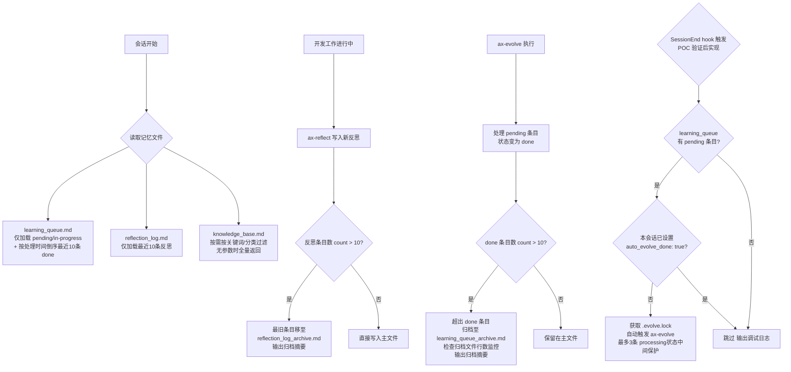
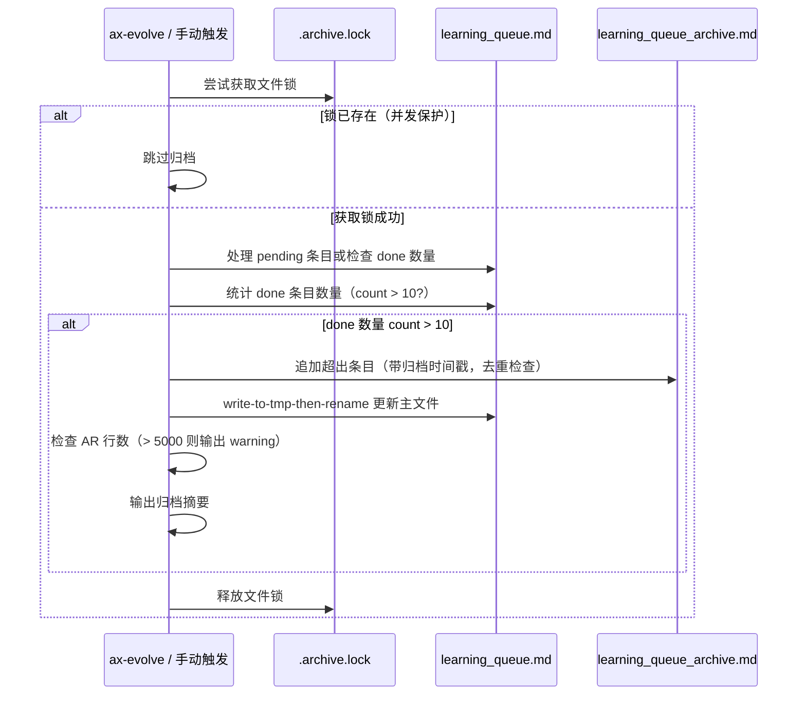
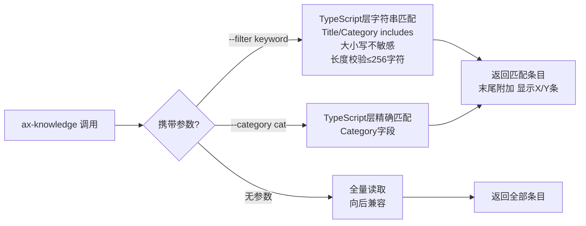

# Rough PRD: Axiom 记忆与进化系统 Token 使用效率优化

> **状态**: ROUGH PRD v1.0（专家评审聚合版）
> **来源**: Draft PRD v0.2 + 5 专家评审（UX Director / Product Director / Domain Expert / Tech Lead / Critic）
> **聚合时间**: 2026-03-02
> **仲裁结论**: 有条件通过（已修正全部 9 个阻断级问题，T3-v2 和 T4 调整范围）

---

## 1. 评审结论摘要

### 综合评分

| 评审者 | 评分 | 关键结论 |
|--------|------|---------|
| Critic（安全/逻辑） | 5/10 | 4 个阻断级问题：字段名自相矛盾、守卫无效、正则注入、数据一致性 |
| Tech Lead（技术可行性） | 6.5/10 | 4 个阻断级问题：格式不兼容、行数矛盾、content 字段未定义、30 秒未实测 |
| Product Director（战略） | 8/10 | T3 双方案需拆分、T4 降为 P1、归档增长需监控 |
| Domain Expert（领域逻辑） | 7.5/10 | 字段名不一致、T1 触发耦合过强、MiniSearch 规模过度设计 |
| UX Director（用户体验） | 5.5/10 | 归档静默无反馈、降级无通知、超时状态未定义 |

### 阻断级问题（已在本 Rough PRD 中全部修正）

| # | 来源 | 问题描述 | 修正方案 |
|---|------|---------|---------|
| 1 | Critic D-C01 | T4 字段名：写 `auto_evolve: true`，读 `auto_evolve_done: true` | 统一为 `auto_evolve_done: true` |
| 2 | Critic D-C02 | `stop_hook_active` 守卫在 SessionEnd hook 语境中无意义 | 删除该守卫，改为校验 `hook_event_name === 'SessionEnd'` |
| 3 | Critic D-C04 | T4 中途崩溃导致 LQ 条目重复处理，知识库产生重复条目 | 增加 `processing` 中间状态，崩溃恢复时跳过 done/去重检查 processing |
| 4 | Critic D-C05 | MiniSearch `--filter` 参数正则注入，降级路径无法捕获 RegExp 异常 | 引用 k-034 模式：正则转义 + 256 字符上限 |
| 5 | Tech Lead D-01 | `learning_queue.md` 块格式与 `learning-queue.ts` 表格解析器完全不兼容 | 选择路径 A：重写解析器支持多行块格式（`### LQ-XXX:` 结构） |
| 6 | Tech Lead D-02 | 保留 20 条反思（~800 行）与"优化后 ~400 行"目标自相矛盾 | 窗口降为 10 条（~350 行），与当前 681 行相比降幅 ~49% |
| 7 | Tech Lead D-03 | MiniSearch `content` 字段来源未定义，knowledge_base.md 无实体内容 | content = `Title + " " + Category`（索引组合），明确标注检索价值有限 |
| 8 | Domain Expert D-02 | T1 归档与 ax-evolve 强耦合，全 done 状态下归档永远不执行 | 新增独立触发入口 `--archive-queue`，解除强耦合 |
| 9 | Product Director D-01 + D-03 | T3 v1/v2 在同一任务并存无选择机制；归档文件无增长监控 | T3-v1 和 T3-v2 拆为独立任务；归档文件 > 5000 行时输出 warning |

### 核心共识

所有专家一致认可的内容（直接沿用）：
- T3 v1（TypeScript 层 grep 过滤）可直接实现，无争议
- T2（反思滚动窗口）风险最低，修正行数目标后可先实现
- SessionEnd hook 选择正确，Stop hook 风险已正确识别
- T1 归档机制方向正确（解决格式兼容后可实现）
- T3 v2（MiniSearch）延期，当前 62 条规模不需要 BM25（触发条件：知识库 > 200 条）
- T4 降为 P1-Should Have（Product Director HIGH，Tech Lead 建议 POC 验证后）

---

## 2. 背景与目标（沿用草稿，补充修正）

### 背景

Axiom 进化引擎通过三个核心 Markdown 文件维持跨会话记忆：`learning_queue.md`（学习队列）、`reflection_log.md`（反思日志）、`knowledge_base.md`（知识图谱索引）。随着系统持续运行，这三个文件因"只增不减"设计持续膨胀：

- `learning_queue.md`：327 行，LQ-001~LQ-030 全部 `done`，零 `pending`，仍全量载入
- `reflection_log.md`：681 行 / 46KB，含大量历史遗留空条目噪音（当前约 18 条有效反思，平均每条约 35-40 行）
- `knowledge_base.md`：177 行 / 8KB，62 条，每次 ax-evolve / ax-knowledge 全量读取

### 产品目标

通过自动归档、滚动窗口和按需读取机制，将 Axiom 进化系统的三个核心记忆文件的活跃内容体积控制在合理阈值内，在不损失知识完整性的前提下降低每会话 token 消耗。

**补充（基于 Product Director D-04 建议）**：让 Axiom 系统在项目持续演进 6 个月后，仍能保持与第 1 天相同的响应质量和上下文利用效率。

---

## 3. 用户故事（修订版）

| # | 角色 | 目标 | 收益 |
|---|------|------|------|
| U1 | Axiom 系统（自动化） | 当 learning_queue.md 中 done 条目数 > 10 时，自动将超出条目归档；并支持手动触发归档 | 主文件始终只保留需要关注的 pending/in-progress 条目，token 消耗与待处理量成正比 |
| U2 | Axiom 系统（自动化） | 清理 reflection_log.md 中的历史遗留空条目，并建立滚动窗口机制（10 条） | 反思日志保持可读性，旧噪音不再占据上下文 token |
| U3 | 开发者（调用 ax-knowledge） | 按关键词或类别查询知识库，只获取相关条目；降级时得到明确提示 | 不再加载全部 62 条，响应更快；降级时知情 |
| U4 | Axiom 系统（会话结束时） | 会话结束时自动触发小批量 ax-evolve 处理（P1，待 POC 验证后实现） | 避免队列积压导致的集中大量 token 消耗 |

---

## 4. 修订后的功能需求（MVP v1.0）

### T1: learning_queue.md done 条目自动归档（已修订）

**优先级**: P0-Must Have

**格式选择决定（Tech Lead D-01，路径 A）**：
`learning_queue.md` 使用多行块格式（`### LQ-XXX:` + 字段行），`learning-queue.ts` 现有解析器期望表格格式。**选择路径 A：重写解析器以支持多行块格式**。原因：路径 B 会破坏文件可读性，且已积累的 30 条历史数据需要重新迁移，代价更高。

**实现规格**：
1. 归档阈值：主文件中 `done` 状态条目数 `count > 10`（严格大于，done = 11 时触发，确保边界清晰；实现注释须标注 `count > 10`，验收测试使用 done = 11 作为边界用例）
2. 归档目标路径：`.omc/axiom/evolution/learning_queue_archive.md`（追加写入，带归档时间戳）
3. 归档动作：超出阈值的 `done` 条目从主文件移除，写入归档文件
4. 主文件只保留：文件头部（格式说明 + 优先级说明）、所有 `pending` 条目、所有 `in-progress` 条目、按**处理时间倒序**排列的最近 10 条 `done` 条目（缺失处理时间时使用添加时间作兜底）
5. 触发时机：
   - **自动触发**：ax-evolve 处理完一批条目后（状态变为 done 时）自动检查并执行
   - **手动触发（新增，解除强耦合）**：支持 `--archive-queue` 参数独立触发，无需 ax-evolve 执行；全 done 零 pending 状态下亦可通过手动触发执行归档
6. 归档前确保目录存在：`mkdirSync({ recursive: true })` 创建 `.omc/axiom/evolution/`
7. **原子写入**（Tech Lead D-06）：
   - 归档文件使用追加写（append）
   - 主文件更新使用 write-to-tmp-then-rename 模式（`fs.renameSync` 在同文件系统下原子）
   - 崩溃安全：若归档写入成功但主文件更新失败，通过条目 ID 去重检测（扫描归档文件的 `### LQ-XXX:` 标题）防止重复归档
8. **并发锁（Critic D-C07）**：归档操作入口使用进程级文件锁 `.omc/axiom/evolution/.archive.lock`，检测到 lock 文件则跳过（lock 文件含写入时间戳，超 30 秒自动视为陈旧锁）
9. **归档文件增长监控（Product Director D-03）**：归档操作完成后检查归档文件行数，超过 5000 行时输出一行 warning：`[警告] learning_queue_archive.md 已超过 5000 行，建议人工检视`
10. **用户反馈输出（UX Director D-01）**：每次归档触发时在命令行输出摘要：`[归档] learning_queue: 已移动 N 条 done 条目至 learning_queue_archive.md`

**不包含**：`--dry-run` 参数（延期至 v1.1）；跨归档文件联合查询（延期至 v2）

---

### T2: reflection_log.md 历史噪音清理 + 滚动窗口（已修订）

**优先级**: P0-Must Have（建议最先实现）

**行数目标修正（Tech Lead D-02）**：
- 草稿声称保留 20 条、主文件 ~400 行——矛盾（20 条 × 38 行均值 = ~760 行，反而比当前 681 行更大）
- **修正为保留 10 条**：10 条 × 38 行均值 = ~380 行，相比当前 681 行降幅约 44%，与目标区间一致
- 业务依据（补充，Product Director D-06）：10 条约覆盖最近 1-2 个迭代周期的反思记录，是 LLM Agent 上下文有效利用的合理窗口

**实现规格**：
1. **空条目判断精确规则（Domain Expert D-06）**：一个由 `## 反思` 开始的块，若以下三个核心小节（`### ✅ 做得好的` / `### ⚠️ 待改进` / `### 💡 学到了什么`）均无有效文字内容（内容为空行、`-` 占位符、HTML 注释），则判定为空条目
2. **一次性清理（人工触发单次操作）**：清理前备份整个文件至 `reflection_log_backup_YYYYMMDD.md`，输出将清理的空条目数量供人工确认
3. 滚动窗口：主文件保留最近 **10 条**完整反思记录（按 `## 反思 - 日期` 标题排序倒序）
4. 历史归档路径：`.omc/axiom/evolution/reflection_log_archive.md`（追加写入）
5. 触发时机：ax-reflect 写入新反思条目时，写入后检查条目数 `count > 10`，超出时将最旧的条目移至归档
6. **块边界处理**：`## 反思 - ...` 块的末尾以 `---` 分隔符结束；块切割时 `---` 分隔符归属当前块，保持归档文件格式一致性
7. **原子写入**：与 T1 相同，使用 write-to-tmp-then-rename 模式
8. **并发锁**：归档操作使用与 T1 共享的 `.archive.lock` 文件
9. **归档文件增长监控**：归档文件超过 5000 行时输出 warning
10. **用户反馈输出**：每次归档触发时输出：`[归档] reflection_log: 已移动 N 条反思至 reflection_log_archive.md`

**验收数字修正**：
- 优化后主文件上限：~380 行（10 条 × 38 行均值）
- 预期 token 降幅（典型场景）：~44%（相比当前 681 行）

---

### T3-v1: ax-knowledge 关键词过滤（基础方案，TypeScript 层实现）

**优先级**: P0-Must Have（与 T2 同期实现）

**实现层明确（Tech Lead D-08）**：
直接在 **TypeScript 层**实现关键词过滤（字符串 `includes` / `indexOf`），不依赖 LLM 执行 grep；SKILL.md 层只声明参数语法。

**实现规格**：
1. 支持关键词过滤：`ax-knowledge --filter <keyword>`，只返回 Title 或 Category 包含关键词的条目（字段精确包含，大小写不敏感）
2. 支持分类过滤：`ax-knowledge --category <category>`，按 Category 列精确过滤
3. 无参数时默认行为：返回全量索引（向后兼容）
4. **查询结果统计（UX Director D-08）**：过滤结果末尾附加 `显示 X/Y 条，使用无参数调用查看全部`
5. **参数校验**：`--filter` 参数长度上限 256 字符（防止超长输入）

**验收标准**：
- `ax-knowledge --filter typescript` 只返回 Title 或 Category 包含 "typescript" 的条目（字段精确包含，大小写不敏感）
- `ax-knowledge --category architecture` 只返回 Category = "architecture" 的条目
- `ax-knowledge`（无参数）返回全量 62 条，与优化前一致
- 查询结果末尾显示 `显示 X/Y 条` 统计

---

### T3-v2: ax-knowledge MiniSearch 全文搜索（延期至 v1.1，触发条件：知识库 > 200 条）

**优先级**: P1-Should Have（延期，**不纳入当前 MVP**）

**延期依据**：
- 当前知识库 62 条，Domain Expert、Product Director 均认为不需要 BM25，TypeScript Array.filter 在此规模下无感知差异
- Tech Lead 评估 T3-v2 工程难度 8/10、预估 3-5 天，成本/收益比偏低
- **触发条件**：知识库条目数 > 200 时重新评估

**当 v1.1 实现 T3-v2 时必须满足的约束（预留）**：

1. **正则转义（Critic D-C05，引用 k-034 模式，不可省略）**：在 TypeScript 层对 `--filter` / `--search` 参数做正则特殊字符转义：
   ```typescript
   keyword.replace(/[.*+?^${}()|[\]\\]/g, '\\$&')
   ```
   并设置 256 字符长度上限

2. **content 字段策略（Tech Lead D-03）**：
   - `content` = `Title + " " + Category`（索引字段组合）
   - 明确标注：当前阶段 content 为元信息组合，全文检索价值有限；实体内容填充留至 v3

3. **MiniSearch 降级通知（UX Director D-03）**：降级时输出警告：`[警告] MiniSearch 不可用，已切换至 grep 模式，结果精度可能降低`

4. **YAML 部分解析失败处理（Critic D-C09）**：宽松模式，跳过错误条目 + 记录警告日志；超过 10% 条目解析失败时触发全局降级

5. **v1/v2 验收标准分离（Critic D-C06）**：
   - v1（字段精确包含）：`--filter typescript` 只返回 Title 或 Category 含 "typescript" 的条目
   - v2（全文模糊匹配）：`--filter typescript` 返回 title/tags/content 中含 "typescript" 的条目（含模糊匹配）
   - 降级时允许结果集缩小（v2 降级至 v1 为 subset 行为，用户文档需声明）

6. **知识库迁移（Confidence vs Priority 映射）**：Confidence 保留为独立字段，priority 需人工或脚本补充；迁移前备份原文件

7. **MiniSearch 索引不持久化**：每次冷启动重建（62 条 < 5ms，500 条 < 50ms，持久化成本/收益不合理）

---

### T4: ax-evolve SessionEnd 自动小批量触发（降为 P1-Should Have，需 POC 验证）

**优先级**: P1-Should Have（**不纳入当前 MVP**，移至 v1.1 POC 验证后决定）

**降级依据**：
- Product Director D-02（HIGH）：T4 工程复杂度与 MVP 必要性不匹配，T1 实现后积压问题已大幅缓解
- Tech Lead D-04（HIGH）：30 秒时间预算基于估算，现有 session-end 链路 7+ 个异步操作，实测数据缺失

**当 v1.1 实现 T4 时必须满足的约束（预留）**：

1. **触发点**：仅使用 `SessionEnd` hook（不使用 Stop hook）
   - SessionEnd hook 脚本入口校验 `hook_event_name === 'SessionEnd'`（不是检查 `stop_hook_active` 环境变量）
   - **删除 `stop_hook_active` 守卫描述（Critic D-C02）**：SessionEnd hook 天然不会收到该字段，守卫在此语境无意义

2. **统一字段名（Critic D-C01，阻断级）**：
   - 跳过条件检查字段：`auto_evolve_done: true`
   - 完成后写入字段：`auto_evolve_done: true`
   - **两处必须使用同一字段名**，否则跳过逻辑永久失效

3. **processing 中间状态（Critic D-C04，阻断级）**：
   对每条 LQ 条目的处理顺序必须为：
   ```
   Step 1: 将 LQ 状态设为 processing（先写 learning_queue.md）
   Step 2: 写入 knowledge_base.md（知识条目）
   Step 3: 将 LQ 状态设为 done（更新 learning_queue.md）
   ```
   崩溃恢复：下次触发时跳过 `done` 条目；对 `processing` 状态条目先做知识库去重检查（通过 LQ-ID 比对），再决定是重新处理还是跳过

4. **文件锁互斥（Critic D-C03）**：SessionEnd ax-evolve 逻辑入口写 `.omc/axiom/evolution/.evolve.lock` 文件，完成后删除；检测到 lock 文件则跳过（TOCTOU 竞争条件防护）

5. **超时后条目状态（UX Director D-04）**：30 秒超时后，将 `processing` 状态的条目**回滚至 pending**（不保留半处理状态），下次会话重新处理；已完成的条目保持 `done`

6. **用户通知（UX Director 1.3）**：会话结束时输出轻量通知：`[Axiom] 会话结束，后台处理了 N 条学习队列条目`；skip 时输出调试日志：`[Axiom/SessionEnd] 跳过自动处理：本会话已执行手动 ax-evolve`

7. **POC 要求（Tech Lead D-04）**：实现前必须在真实环境中计时 3 条 LQ 条目端到端处理耗时，验证 30 秒预算充裕性

8. 批量限制：每次自动触发最多处理 **3 条** pending 条目（"最多"语义，允许少于 3 条）
9. 触发条件：learning_queue.md 中存在至少 1 条 `pending` 条目时才触发
10. 超时控制：在 ax-evolve 逻辑外单独套 30 秒 `Promise.race`（Tech Lead D-07），与现有超时机制隔离

---

## 5. 非功能需求（修订版）

### 5.1 Token 效率指标（修订后的量化目标）

| 文件 | 当前行数 | 优化后主文件上限 | 典型场景 token 降幅 |
|------|---------|-----------------|-------------------|
| learning_queue.md | ~327 行 | ~120 行（头部20行 + 最多10条done×10行 + pending区） | ~63%（有 pending 时的典型场景） |
| reflection_log.md | ~681 行 | ~380 行（最近10条完整反思） | ~44%（滚动窗口） |
| knowledge_base.md（T3-v1） | ~177 行 | 按需：平均返回 ~10 条 | ~85%（有效过滤场景；全量调用场景为 0%） |

**注意（Domain Expert D-03）**：以上为"典型场景"降幅估算。全量调用 `ax-knowledge`（无参数）或 pending 为 0 时，knowledge_base 降幅为 0%。三文件综合降幅取决于实际使用模式，不适合以单一百分比呈现。

### 5.2 安全性要求（新增）

- **正则注入防护**：T3-v1 `--filter` 参数长度上限 256 字符；T3-v2 实现时必须引用 k-034 模式进行正则特殊字符转义（`str.replace(/[.*+?^${}()|[\]\\]/g, '\\$&')`）
- **路径安全**：归档路径硬编码，不允许从文件内容动态构建路径；代码注释须标注"归档路径不可来自文件内容"
- **并发安全**：T1/T2 归档操作及 T4 触发均使用文件锁防止并发写入
- **目录初始化**：归档文件写入前必须调用 `mkdirSync({ recursive: true })` 确保目录存在

### 5.3 可靠性要求（修订版）

- 归档操作使用 write-to-tmp-then-rename 原子模式，防止主文件在操作中途损坏
- 归档文件使用追加写（append），崩溃时通过 ID 去重防止重复写入
- T4（当 v1.1 实现时）的 processing 中间状态确保 LQ 条目不重复处理
- 自动 ax-evolve 触发失败时，不阻断会话结束流程
- 归档文件 > 5000 行时输出 warning（非阻断）
- 滚动窗口阈值通过配置项控制，不硬编码（T1 阈值 10 条 done，T2 窗口 10 条反思，均在 SKILL.md 中声明默认值）

### 5.4 向后兼容性要求（沿用）

- 现有 ax-evolve、ax-knowledge、ax-reflect skill 调用语法不变
- ax-knowledge 无参数时行为与优化前完全一致
- 归档操作幂等（单进程语义，并发场景通过文件锁保障）
- 不修改已处理的 done 条目内容（仅移动位置）

---

## 6. 业务流程（修订版）

### 6.1 整体优化流程（修订后主视图）



### 6.2 T1 学习队列归档流程（修订版）



### 6.3 T3-v1 知识库按需读取流程



---

## 7. 验收标准（修订版）

### T1 验收标准

- [ ] 解析器重写：能正确解析 `### LQ-XXX:` 多行块格式，返回包含状态、优先级、添加时间等字段的对象数组
- [ ] `learning_queue.md` 主文件 done 条目数 `<= 10`（触发阈值为 count > 10，验收边界测试：done = 11 触发，done = 10 不触发）
- [ ] `learning_queue_archive.md` 存在且包含所有历史 done 条目（ID 无重复，无内容丢失）
- [ ] 归档操作有输出摘要：`[归档] learning_queue: 已移动 N 条 done 条目至 learning_queue_archive.md`
- [ ] 归档后条目仍按处理时间倒序排列（缺失处理时间时使用添加时间兜底）
- [ ] 手动触发 `--archive-queue` 在全 done / 零 pending 状态下正确执行归档
- [ ] 并发保护：两个进程并发执行时，第二个进程检测到 .archive.lock 直接跳过
- [ ] 归档文件超 5000 行时输出 warning

### T2 验收标准

- [ ] 空条目清理：执行一次性清理后，基于三核心小节均无有效内容的判断标准，无误清理有效反思（特别是格式异常的 2026-02-11 Codex Workflow 条目）
- [ ] 新写入反思后，主文件反思条目数恒保持 `<= 10`（以写入第 11 条后触发验证）
- [ ] `reflection_log_archive.md` 包含被滚出窗口的历史反思（无内容丢失）
- [ ] 主文件行数目标：`<= 400 行`（基于 10 条窗口的合理上限）
- [ ] ax-reflect 正常写入新反思，调用语法与优化前一致
- [ ] 归档有输出摘要：`[归档] reflection_log: 已移动 N 条反思至 reflection_log_archive.md`

### T3-v1 验收标准

- [ ] `ax-knowledge --filter typescript` 只返回 Title 或 Category 包含 "typescript" 的条目（大小写不敏感，字段精确包含）
- [ ] `ax-knowledge --category architecture` 只返回 Category 字段精确匹配 "architecture" 的条目
- [ ] `ax-knowledge`（无参数）返回全量 62 条，与优化前一致
- [ ] 查询结果末尾显示 `显示 X/Y 条，使用无参数调用查看全部` 统计
- [ ] `--filter` 参数超过 256 字符时返回错误提示而非崩溃
- [ ] 过滤逻辑在 TypeScript 层实现，不依赖 LLM 执行（可通过单元测试验证确定性）

### T4 验收标准（v1.1 实现时，在此预留）

- [ ] POC 验证：3 条 LQ 条目端到端处理实测耗时 < 25 秒（留 5 秒余量）
- [ ] 触发的是 SessionEnd hook（hook_event_name === 'SessionEnd' 校验通过）
- [ ] 若有 pending 条目且本会话未设置 `auto_evolve_done: true`，自动执行 ax-evolve（最多 3 条）
- [ ] LQ 条目处理遵循 pending → processing → done 三段状态机；中途崩溃后重启时 processing 状态条目触发去重检查
- [ ] 30 秒超时后，processing 状态条目回滚至 pending，下次会话可重新处理
- [ ] 两个会话并发时，第二个会话检测到 .evolve.lock 直接跳过
- [ ] 已设置 `auto_evolve_done: true` 的会话，结束时不重复触发（同一字段名读写，Critic D-C01 修正验证）
- [ ] 完成后在 active_context.md 写入 `auto_evolve_done: true`
- [ ] 会话结束时输出通知：`[Axiom] 会话结束，后台处理了 N 条学习队列条目`
- [ ] Skip 时输出：`[Axiom/SessionEnd] 跳过自动处理：本会话已执行手动 ax-evolve`
- [ ] 无 pending 条目时，会话结束不触发自动 ax-evolve

---

## 8. 实现顺序建议

基于 Tech Lead 建议并综合所有专家意见：

```
T2（反思滚动窗口）
  - 风险最低，主要是正则解析工作
  - 但行数估算已修正为 10 条窗口
  - 预估工时：1-2 天

  ↓

T3-v1（TypeScript 层关键词过滤）
  - 低风险，立即降低 knowledge_base token 消耗
  - 预估工时：1 天

  ↓

T1（learning_queue 归档）
  - 需先完成解析器重写（路径 A）
  - 预估工时：2-3 天（含格式决策实现）

  ↓

T4（SessionEnd 自动触发）[v1.1，需 POC 验证]
  - 先做 POC 验证 30 秒预算
  - 预估工时：1-2 天（POC 通过后）

  ↓

T3-v2（MiniSearch 全文搜索）[v1.1，触发条件：知识库 > 200 条]
  - 最高工程复杂度
  - 预估工时：3-5 天（含迁移脚本）
```

**MVP v1.0 交付范围**：T2 + T3-v1 + T1（按上述顺序）
**合计预估工时（MVP v1.0）**：4-6 个工作天

---

## 9. 解决的差异点清单

| 差异点ID | 来源专家 | 原始问题 | 仲裁层级 | 仲裁决定 | 修订内容摘要 |
|---------|---------|---------|---------|---------|------------|
| D-C01 | Critic | T4 字段名：write `auto_evolve: true`，read `auto_evolve_done: true` | 1-安全/逻辑 | 采纳 | 统一为 `auto_evolve_done: true`，T4 约束中明确两处字段名一致 |
| D-C02 | Critic | `stop_hook_active` 守卫在 SessionEnd hook 中无意义，且描述与实现不符 | 1-安全/逻辑 | 采纳 | 删除守卫描述，改为校验 `hook_event_name === 'SessionEnd'` |
| D-C03 | Critic | TOCTOU 竞争：多窗口并发导致同一 LQ 条目被处理两次 | 1-安全/逻辑 | 采纳 | T4 约束中增加 `.evolve.lock` 文件锁互斥机制 |
| D-C04 | Critic | T4 中途崩溃后 LQ 条目重复处理导致知识库重复条目 | 1-安全/逻辑 | 采纳 | T4 约束中增加 `processing` 中间状态，崩溃恢复时去重检查 |
| D-C05 | Critic | MiniSearch `--filter` 正则注入，现有降级路径无法捕获 RegExp 异常 | 1-安全/逻辑 | 采纳 | T3-v2 约束中强制引用 k-034 模式；T3-v1 增加 256 字符上限 |
| D-C06 | Critic | T3 v1/v2 `--filter` 语义不同，验收标准混用两套语义 | 1-安全/逻辑 | 采纳 | T3-v1 和 T3-v2 分拆为独立任务，各有独立验收标准 |
| D-C07 | Critic | T1/T2 归档操作无并发保护，多进程重复归档 | 1-安全/逻辑 | 采纳 | 归档操作使用 `.archive.lock` 文件锁 |
| D-C08 | Critic | `.omc/axiom/evolution/` 目录首次安装可能不存在 | 1-安全/逻辑 | 采纳 | T1/T2 归档前调用 `mkdirSync({ recursive: true })` |
| D-01（Tech） | Tech Lead | `learning_queue.md` 多行块格式与现有解析器表格格式完全不兼容 | 2-技术可行性 | 选择路径 A | 重写解析器支持多行块格式，不迁移文件格式 |
| D-02（Tech） | Tech Lead | 保留 20 条反思（~800 行）与"~400 行"目标矛盾 | 2-技术可行性 | 采纳修正 | 窗口降为 10 条（~380 行），修正降幅目标 |
| D-03（Tech） | Tech Lead | T3-v2 MiniSearch `content` 字段来源未定义 | 2-技术可行性 | 采纳 | content = `Title + " " + Category`，标注检索价值有限 |
| D-04（Tech） | Tech Lead | T4 30 秒预算无实测数据 | 2-技术可行性 | 采纳 | T4 降为 P1，v1.1 实现前必须做 POC 验证 |
| D-01（Product） | Product Director | T3 v1/v2 双方案并存无选择机制 | 3-战略对齐 | 采纳 | T3-v1 和 T3-v2 拆为独立任务，v2 延期至知识库 > 200 条 |
| D-02（Product） | Product Director | T4 进 MVP 必要性与工程复杂度不匹配 | 3-战略对齐 | 采纳 | T4 降为 P1-Should Have，移至 v1.1 |
| D-03（Product） | Product Director | 归档文件无增长策略 | 3-战略对齐 | 采纳（轻量版） | 归档文件 > 5000 行时输出 warning，不自动清理 |
| D-01（Domain） | Domain Expert | T4 字段名不一致（与 D-C01 同一问题） | 已由 Critic 覆盖 | Critic 优先 | 统一为 `auto_evolve_done: true` |
| D-02（Domain） | Domain Expert | T1 归档与 ax-evolve 强耦合，全 done 状态下永远不执行 | 4-业务逻辑 | 采纳 | 新增 `--archive-queue` 手动触发入口 |
| D-01（UX） | UX Director | 归档操作静默无任何用户输出 | 5-用户体验 | 采纳（轻量版） | 每次归档输出一行摘要 |
| D-02（UX） | UX Director | 归档操作原子性（与 Tech D-06 同一问题） | 已由 Tech 覆盖 | Tech 优先 | write-to-tmp-then-rename |
| D-03（UX） | UX Director | MiniSearch 降级时不通知用户 | 5-用户体验 | 采纳 | T3-v2 约束中增加降级通知输出 |
| D-04（UX） | UX Director | T4 超时后条目状态未定义 | 5-用户体验 | 采纳 | T4 约束中明确：超时后 processing 回滚至 pending |

---

## 10. 延期至 v1.1 的内容

| 内容 | 延期原因 | 触发条件 |
|------|---------|---------|
| T3-v2（MiniSearch 全文搜索） | 62 条规模过度设计；工程成本高（3-5天）；v1 grep 过滤已足够 | 知识库条目 > 200 条 |
| T4（SessionEnd 自动触发） | 工程复杂度与 MVP 必要性不匹配；30 秒预算未实测 | POC 验证通过（实测 < 25 秒） |
| --dry-run 模式 | MVP 阶段非必需，可接受一次性清理需人工确认 | v1.1 用户反馈后评估 |
| 跨主文件+归档的联合查询（--include-archive） | 复杂度超出 MVP 范围 | v2 |
| 文件头部状态元数据注释 | 轻量但非阻断需求 | v1.1 用户反馈后评估 |

## 11. 延期至 v2 的内容（沿用草稿）

- `workflow_metrics.md` 的类似优化（用户已明确排除）
- Python nexus daemon 的 token 追踪
- `knowledge_base.md` 内容重构（语义去重、质量评分等）
- 跨会话 token 预算追踪与报警
- 知识库条目的向量化检索（语义搜索）
- 归档文件的自动压缩或清理策略（归档 > 5000 行时 warning 已在 MVP 中占位）
- 知识类型区分（evergreen vs temporal 的时间衰减差异化）

---

## 12. 风险与约束（修订版）

| 风险 | 严重程度 | 缓解措施（已在需求中体现） |
|------|---------|---------|
| 解析器重写（路径A）的边界情况 | 高 | 必须覆盖：多行内容字段、缺失字段、特殊字符；单元测试覆盖边界 |
| T2 一次性清理误删有效反思 | 高 | 精确空条目判断规则；清理前备份；人工确认 |
| 并发归档写入 | 中 | 文件锁（.archive.lock）；已在 T1/T2 需求中强制要求 |
| T4 30 秒超时（v1.1） | 中 | POC 必须实测；超时后状态回滚 |
| 归档文件无限增长 | 中 | > 5000 行 warning 占位；自动清理推至 v2 |
| MiniSearch YAML 迁移（v1.1 T3-v2） | 中 | 迁移前备份；宽松解析模式；Confidence 字段保留 |

### 实现约束

- 所有操作在 TypeScript 层实现（hooks / skills），符合项目技术栈
- CI 门禁必须通过：`tsc --noEmit && npm run build && npm test`
- T1/T2 解析逻辑必须有单元测试（含边界情况）
- T3-v1 过滤逻辑必须有单元测试（确定性验证）
- T3-v2（v1.1）降级路径必须有单元测试
- 不引入新运行时依赖（T3-v2 引入 minisearch 延至 v1.1）
- 归档文件路径固定为 `.omc/axiom/evolution/` 目录下

---

## 13. 下一步

专家评审已完成。这是最终的粗设 PRD：`C:/Users/ljyih/Desktop/ultrapower/docs/prd/memory-evolution-optimize-rough.md`

**是否进入任务拆解阶段？**

若确认，下一步调用 `ax-decompose`，将 MVP v1.0（T2 + T3-v1 + T1）拆解为可执行子任务：
- T2 的一次性清理实现 + 滚动窗口实现
- T3-v1 的 TypeScript 关键词过滤实现
- T1 的解析器重写（路径 A）+ 归档逻辑实现
