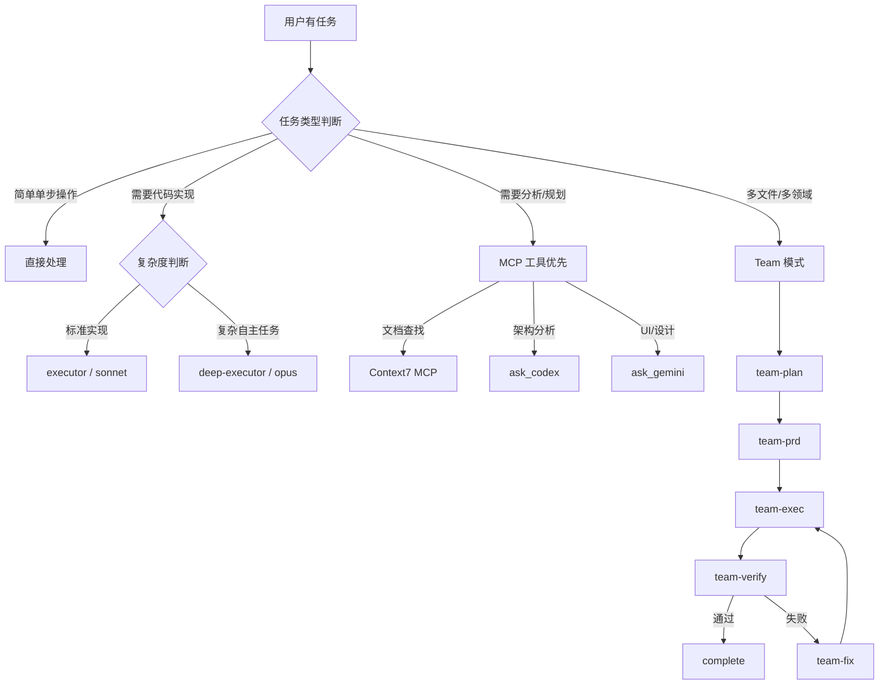
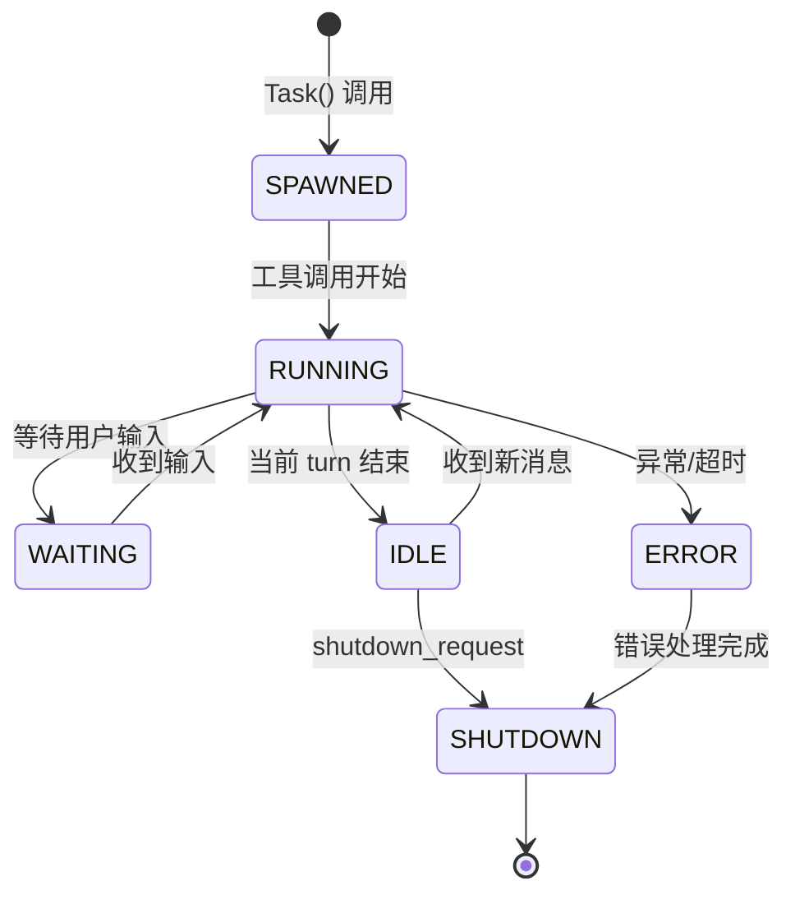
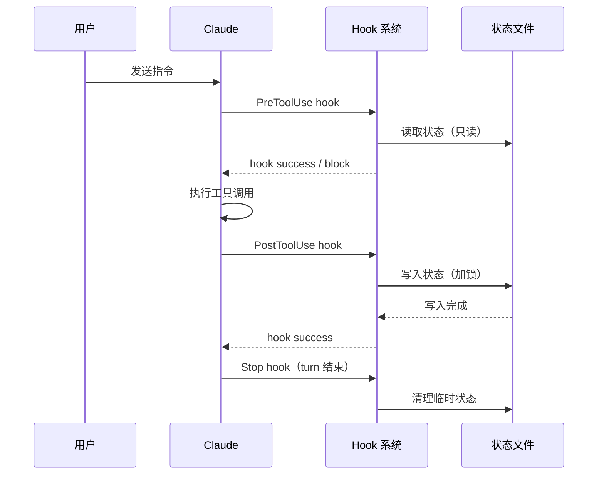

# PRD: ultrapower 全链路规范体系 - Draft

> **状态**: DRAFT
> **作者**: Product Design Expert (axiom-product-designer)
> **版本**: 0.1
> **日期**: 2026-02-26
> **项目**: ultrapower v5.0.21

---

## 1. 背景与目标

### 1.1 背景

ultrapower（OMC）是 Claude Code 的多 agent 编排框架，当前版本 v5.0.21 已具备完整的 agent 目录、skill 体系和 hook 机制。随着功能复杂度提升，三类系统性问题开始显现：

- **运行时 BUG**：Hook 执行顺序不确定、状态文件并发读写冲突、Agent 生命周期管理缺失（参考已知问题：2026-02-12 Race Condition）
- **使用混乱**：用户不清楚何时用 skill、何时用 agent、何时用 MCP，导致错误路由和资源浪费
- **贡献无序**：新增 skill/agent/hook 缺乏统一模板和检查清单，引入不一致的实现模式

### 1.2 目标

建立覆盖全链路的规范体系，使 ultrapower 从"能用"升级为"可靠、易用、可扩展"。

### 1.3 成功指标

| 指标 | 当前状态 | 目标 |
| --- | --- | --- |
| 并发场景有明确处理指引 | 无 | 100% 覆盖 |
| 新用户选出正确 skill 的时间 | 未知 | ≤ 5 分钟 |
| 新增 skill 有完整检查清单 | 无 | 100% 覆盖 |
| 三类 BUG 来源有对应规范 | 无 | 全覆盖 |

---

## 2. 用户故事

| 角色 | 目标 | 收益 |
| --- | --- | --- |
| 框架使用者（新用户） | 快速判断应该调用哪个 skill 或 agent | 5 分钟内做出正确决策，不走弯路 |
| 框架使用者（老用户） | 在并发/复杂场景下得到明确的操作指引 | 避免状态冲突和运行时错误 |
| 框架贡献者 | 按照统一模板新增 skill/agent/hook | 一次通过代码审查，不引入不一致模式 |
| 框架维护者 | 快速定位 BUG 根因并有规范可依 | 减少排查时间，修复有据可查 |

---

## 3. 高层需求（MVP）

### P0 - 运行时防护规范（必须交付）

1. **Hook 执行顺序规范**：定义 PreToolUse / PostToolUse / Stop 三类 hook 的触发时序、优先级和互斥规则
2. **状态文件读写规范**：明确 `.omc/state/` 下各文件的读写锁策略，禁止并发写入同一状态文件
3. **Agent 生命周期规范**：定义 agent 从 spawn 到 shutdown 的标准状态机，包含超时和异常退出处理

### P1 - 用户使用规范（核心体验）

4. **Skill 调用决策树**：提供可视化决策流程，帮助用户在 skill / agent / MCP 三者间做出正确选择
5. **Agent 路由规范**：明确各 agent 角色的适用场景边界，避免错误路由（如用 executor 做分析）
6. **常见反模式清单**：列举并解释 10 个最常见的错误用法，每条附正确替代方案

### P2 - 开发贡献规范（生态健康）

7. **Skill 标准模板**：包含触发词、约束、输出格式、测试用例的完整模板
8. **Agent 标准模板**：包含角色定义、工具权限、输入输出契约的标准结构
9. **Hook 标准模板**：包含事件类型、必需字段、错误处理的标准结构
10. **贡献检查清单**：新增任何组件前必须通过的 checklist（含测试要求和版本兼容性验证）

---

## 4. 业务流程

### 4.1 用户使用决策流程

### 4.2 运行时状态机（Agent 生命周期）

### 4.3 Hook 执行时序

---

## 5. 非功能需求

| 类别 | 要求 |
| --- | --- |
| 可读性 | 所有规范文档使用中文，代码示例使用英文 |
| 可维护性 | 规范文档与代码同仓库，随版本迭代更新 |
| 向后兼容 | P0/P1 规范不得破坏现有 v5.0.x 用户的使用习惯 |
| 可发现性 | 规范入口在 README 和 CLAUDE.md 中有明确链接 |

---

## 6. 验收标准

| 编号 | 验收项 | 验证方法 |
| --- | --- | --- |
| AC-01 | 并发场景有明确处理指引 | 检查 P0 规范是否覆盖：并行 agent 写同一状态文件的场景 |
| AC-02 | 新用户 5 分钟内选出正确 skill | 用户测试：给出 3 个典型场景，新用户按决策树选择，准确率 ≥ 80% |
| AC-03 | 新增 skill 有完整检查清单 | 检查 P2 checklist 是否包含：触发词、测试用例、版本兼容性三项 |
| AC-04 | 三类 BUG 来源均有对应规范 | 逐一映射：运行时 BUG → P0，使用混乱 → P1，贡献无序 → P2 |

---

## 7. Impact Scope（影响文件范围）

本 PRD 实现后，预期新增/修改的文件范围：

**新增文件（规范文档）：**
- `docs/standards/runtime-protection.md` — P0 运行时防护规范
- `docs/standards/user-guide.md` — P1 用户使用规范（含决策树）
- `docs/standards/contribution-guide.md` — P2 开发贡献规范
- `docs/standards/templates/skill-template.md` — Skill 标准模板
- `docs/standards/templates/agent-template.md` — Agent 标准模板
- `docs/standards/templates/hook-template.md` — Hook 标准模板

**修改文件（入口链接）：**
- `README.md` — 添加规范文档入口
- `CLAUDE.md` — 添加规范引用

**不在范围内（v2 延期）：**
- 自动化规范检查工具（lint 插件）
- 规范合规性 CI 检查
- 多语言版本（英文版）

---

## 8. 暂不包含（v2 延期）

- 自动化规范合规检查（需要额外工具链投入）
- 英文版规范文档（当前用户群以中文为主）
- 视频教程或交互式引导（超出文档范围）
- 规范覆盖率度量仪表盘
- 历史 BUG 的规范回溯标注

