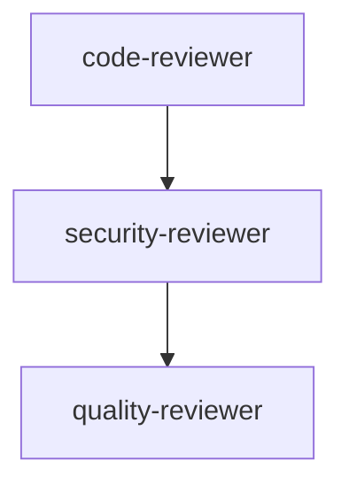

# 快速上手指南

> 15 分钟快速掌握 ultrapower 核心功能

## 目录

1. [安装](#安装)
2. [基础概念](#基础概念)
3. [第一个任务](#第一个任务)
4. [核心工作流](#核心工作流)
5. [常见问题](#常见问题)

---

## 安装

### 前置要求

- Node.js >= 18
- Claude Code CLI
- Git

### 快速安装

```bash
npm install -g @liangjie559567/ultrapower
omc install
```

### 验证安装

```bash
omc --version
omc doctor conflicts
```

---

## 基础概念

ultrapower 是 Claude Code 的多 agent 编排层，提供：

- **Agents**: 专业化 AI 助手（architect, executor, reviewer 等）
- **Skills**: 可复用工作流（autopilot, ralph, team 等）
- **Modes**: 执行模式（ultrawork 并行，ralph 持久循环）

详见：[核心概念](./concepts/README.md)

---

## 第一个任务

### 1. 初始化项目

```bash
cd your-project
omc init
```

### 2. 运行简单任务

```bash
# 使用 executor agent 实现功能
omc launch
# 在 Claude Code 中：
# /ultrapower:executor "Add input validation to login form"
```

### 3. 使用 autopilot 模式

```bash
# 全自主执行
# /ultrapower:autopilot "Build a REST API for user management"
```

---

## 核心工作流

### 工作流 1: 功能开发


**使用场景**: 新功能开发

```bash
/ultrapower:team "Implement user authentication"
```

### 工作流 2: Bug 修复


**使用场景**: 调试和修复

```bash
/ultrapower:analyze "Fix login timeout issue"
```

### 工作流 3: 代码审查



**使用场景**: PR 审查

```bash
/ultrapower:code-review "Review PR #123"
```

---

## 常见问题

### Q: 如何选择合适的 agent？

参考 [Agent 选择指南](./concepts/agent-selection.md)

### Q: 如何处理错误？

参考 [错误处理指南](./concepts/error-handling.md)

**快速解决**:
- 构建错误: `/ultrapower:build-fixer`
- 运行时错误: `/ultrapower:debugger`
- 查看日志: `omc sessions`

### Q: 如何优化性能？

- 使用 `ultrawork` 模式并行执行
- 使用 `haiku` 模型处理简单任务
- 启用 MCP 工具加速分析

### Q: 如何查看执行日志？

```bash
omc stats
omc sessions
omc trace timeline
```

---

## 下一步

- [核心概念详解](./concepts/README.md)
- [Agent 参考](./concepts/agents.md)
- [Skills 参考](./concepts/skills.md)
- [最佳实践](./best-practices.md)

---

**需要帮助？**

- GitHub Issues: <https://github.com/liangjie559567/ultrapower>/issues
- 文档: https://github.com/liangjie559567/ultrapower/tree/main/docs
