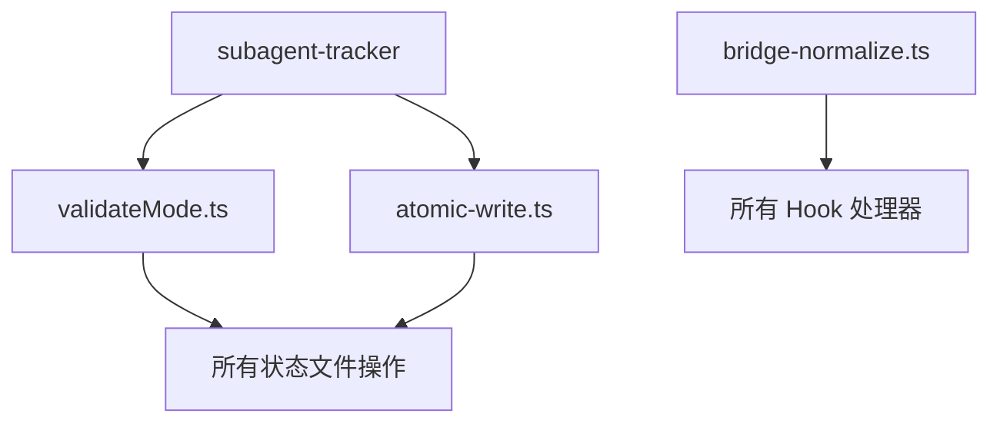

# Tech Feasibility Review: ultrapower v7.5.2 BUG 与痛点审计

## 评审概要

**评审人**: Tech Lead
**评审日期**: 2026-03-16
**PRD 版本**: Draft
**评审结论**: ✅ **通过 - 需分阶段实施**

---

## 1. 架构影响分析 (Architecture Impact)

### 1.1 Schema Changes
**状态**: ❌ 无 Schema 变更

本次审计为**纯修复性工作**，不涉及：
- 数据库 Schema 变更
- 状态文件格式变更
- API 接口变更

### 1.2 API Changes
**状态**: ❌ 无 API 变更

所有修复均为**内部实现优化**，对外接口保持向后兼容：
- Hook 接口不变（仅增强输入验证）
- Agent 生命周期接口不变（修复推断逻辑）
- 状态管理接口不变（增强并发保护）

### 1.3 架构完整性评估

| 维度 | 当前状态 | 修复后状态 | 影响评级 |
|------|----------|------------|----------|
| **安全边界** | 存在路径遍历漏洞 | 强制白名单校验 | 🔴 高影响 |
| **状态一致性** | 部分绕过原子写入 | 统一原子写入 + 重试 | 🟡 中影响 |
| **并发控制** | 四层保护不完整 | 补全 debounce + atomic | 🟡 中影响 |
| **生命周期管理** | 推断逻辑错误 | 修复 success !== false | 🟢 低影响 |

**架构风险**:
- ✅ 无破坏性变更
- ✅ 向后兼容
- ⚠️ 需要全面回归测试（状态管理路径变更）

---

## 2. 技术可行性评估 (Feasibility Assessment)

### 2.1 P0 问题修复（阻塞性）

#### 2.1.1 安全加固

**可行性**: ✅ 高（已有实现参考）

| 反模式 | 修复方案 | 实施难度 | 风险 |
|--------|----------|----------|------|
| AP-S01: 路径遍历 | 使用 `assertValidMode()` 强制校验 | 低 | 低（已有 validateMode.ts） |
| AP-S02: 废弃字段读取 | 统一使用 `success !== false` | 低 | 低（单点修改） |
| AP-S03: 敏感信息存储 | 文件权限 0o600 + 审计日志 | 中 | 低（已有 atomic-write.ts） |

**技术依赖**:
- ✅ `src/lib/validateMode.ts` 已存在
- ✅ `src/lib/atomic-write.ts` 已支持权限设置
- ✅ v6.0.0 已实现安全审计日志

**实施路径**:
```typescript
// 1. 全局搜索未校验的 mode 拼接
grep -r "\.omc/state/\${mode}" src/

// 2. 批量替换为安全模式
const validMode = assertValidMode(mode);
const path = `.omc/state/${validMode}-state.json`;
```

#### 2.1.2 状态一致性

**可行性**: ✅ 高（技术债务 TD-4 已识别）

| 问题 | 修复方案 | 实施难度 | 风险 |
|------|----------|----------|------|
| AP-C01: 绕过原子写入 | 统一使用 `atomicWriteJsonSyncWithRetry` | 中 | 中（需回归测试） |
| AP-ST02: 跨会话误清理 | 增强 session_id 匹配逻辑 | 低 | 低（已修复 #573） |

**技术依赖**:
- ✅ `atomicWriteJsonSyncWithRetry` 已在 v6.0.0 实现
- ✅ 指数退避重试机制已就绪

**实施路径**:
```typescript
// 替换 writeTrackingStateImmediate 中的直接写入
- writeFileSync(statePath, JSON.stringify(state, null, 2));
+ atomicWriteJsonSyncWithRetry(statePath, state, 3);
```

#### 2.1.3 Agent 生命周期

**可行性**: ✅ 高（已修复 Bug #1）

| 问题 | 修复方案 | 实施难度 | 风险 |
|------|----------|----------|------|
| AP-AL01: 孤儿 Agent 误发信号 | 批量清除（删除 tracking 文件） | 低 | 低（已实现） |
| AP-AL02: 超时阈值混淆 | 文档澄清 + 提取常量 | 低 | 低 |
| AP-AL03: 死锁检测缺失 | 实现 DEADLOCK_CHECK_THRESHOLD 逻辑 | 高 | 中（需设计检测算法） |

**技术挑战**:
- ⚠️ 死锁检测需要实现**循环依赖图分析**
- ⚠️ 需要定义"相互等待"的精确语义

### 2.2 P1 问题修复（严重）

#### 2.2.1 测试质量

**可行性**: ✅ 中（需补充边界用例）

**测试覆盖缺口**:
- 并发写入冲突场景（subagent-tracking.json）
- Windows 平台 rename 失败处理
- 状态文件损坏恢复流程
- 超时/孤儿/死锁边界情况

**实施成本**: 3-5 天（编写 + 验证）

#### 2.2.2 文档同步

**可行性**: ✅ 高（已有规范文档）

**差异点修复**:
- D-03: 合法 mode 数量（7 → 8）
- D-04: 互斥模式范围（2 → 4）
- D-09: stale 阈值双重含义澄清

**实施成本**: 1-2 天（文档更新 + 代码注释）

### 2.3 P2 改进（优化）

**可行性**: ✅ 低优先级（可延后至 v8.0）

**技术债务清理**:
- 51 个 TODO/FIXME/HACK 标记
- 需逐个评估是否仍然有效

---

## 3. 风险评估 (Risk Assessment)

### 3.1 技术风险

| 风险项 | 概率 | 影响 | 缓解措施 |
|--------|------|------|----------|
| 原子写入性能回退 | 中 | 中 | 保留 debounce 层，仅修复即时写入 |
| Windows 平台兼容性 | 低 | 高 | 增加 Windows CI 测试 |
| 并发测试不充分 | 高 | 中 | 补充压力测试用例 |
| 死锁检测误报 | 中 | 低 | 先实现警告模式，不自动终止 |

### 3.2 复杂度评分

**总体复杂度**: 6/10（中等）

| 维度 | 评分 | 说明 |
|------|------|------|
| 代码变更范围 | 7/10 | 涉及核心状态管理路径 |
| 测试复杂度 | 8/10 | 需要并发场景测试 |
| 回归风险 | 5/10 | 向后兼容，但需全面验证 |
| 文档工作量 | 3/10 | 主要是澄清现有差异点 |

### 3.3 POC 需求

**状态**: ⚠️ 部分需要

| 功能 | 是否需要 POC | 原因 |
|------|--------------|------|
| 原子写入统一 | ❌ 否 | 已有 v6.0.0 实现 |
| 死锁检测算法 | ✅ 是 | 需验证检测准确性 |
| Windows 命令注入防护 | ❌ 否 | 已在 v5.5.18 修复 |

---

## 4. 实施计划 (Implementation Plan)

### 4.1 分阶段策略

**Phase 1: P0 安全修复（1 周）**
```
Day 1-2: 路径遍历漏洞修复
  - 全局搜索未校验的 mode 拼接
  - 批量替换为 assertValidMode()
  - 补充单元测试

Day 3-4: 状态一致性修复
  - 替换 writeTrackingStateImmediate 为原子写入
  - 验证并发写入场景
  - 压力测试

Day 5: Agent 生命周期修复
  - 统一 success !== false 推断逻辑
  - 提取超时常量
  - 文档澄清
```

**Phase 2: P1 质量提升（1 周）**
```
Day 1-3: 测试覆盖补充
  - 并发场景测试
  - Windows 平台测试
  - 边界情况测试

Day 4-5: 文档同步
  - 修复差异点 D-03/D-04/D-09
  - 更新代码注释
  - 补充示例
```

**Phase 3: P2 优化（可选，2 周）**
```
Week 1: 技术债务清理
  - 评估 51 个 TODO/FIXME
  - 清理过期标记
  - 重构反模式代码

Week 2: 死锁检测 POC
  - 设计检测算法
  - 实现原型
  - 验证准确性
```

### 4.2 Backend 实施细节

**核心修改文件**:
```
src/lib/validateMode.ts          # 已存在，无需修改
src/lib/atomic-write.ts          # 已存在，无需修改
src/hooks/subagent-tracker/index.ts  # 修复原子写入
src/hooks/session-end/index.ts   # 已修复，验证即可
src/hooks/bridge-normalize.ts    # v6.0.0 已完成
```

**预计变更行数**: 200-300 行（主要是替换调用）

### 4.3 Frontend 实施细节

**状态**: ❌ 无 Frontend 变更

本次审计为纯后端修复，不涉及 UI 变更。

---

## 5. 成本估算 (Cost Estimation)

### 5.1 人力成本

| 阶段 | 工作量 | 人员配置 | 日历时间 |
|------|--------|----------|----------|
| Phase 1 (P0) | 5 人日 | 1 Senior Dev | 1 周 |
| Phase 2 (P1) | 5 人日 | 1 Mid Dev | 1 周 |
| Phase 3 (P2) | 10 人日 | 1 Mid Dev | 2 周（可选） |
| **总计** | **20 人日** | **1-2 人** | **2-4 周** |

### 5.2 技术成本

| 项目 | 成本 | 说明 |
|------|------|------|
| CI/CD 资源 | 低 | 复用现有 GitHub Actions |
| 测试环境 | 低 | 本地 + Windows CI |
| 文档工具 | 零 | Markdown + Git |
| **总计** | **低** | 无额外基础设施成本 |

### 5.3 机会成本

**延迟修复的风险**:
- 🔴 路径遍历漏洞可能被利用（安全风险）
- 🟡 状态文件损坏导致用户数据丢失（信任风险）
- 🟢 技术债务累积影响 v8.0 重构（开发效率）

**建议**: P0 问题应在 **v7.5.3** 中立即修复，不应延后。

---

## 6. 依赖关系分析 (Dependencies)

### 6.1 内部依赖



**关键路径**:
- `validateMode.ts` 是安全边界的基石
- `atomic-write.ts` 是状态一致性的保障
- 两者已在 v6.0.0 实现，修复工作为**应用层调用统一**

### 6.2 外部依赖

**状态**: ✅ 无新增外部依赖

所有修复均使用现有依赖：
- Node.js fs 模块
- TypeScript 类型系统
- Vitest 测试框架

### 6.3 版本兼容性

| 依赖 | 当前版本 | 最低要求 | 兼容性 |
|------|----------|----------|--------|
| Node.js | 18+ | 18.0.0 | ✅ |
| TypeScript | 5.x | 5.0.0 | ✅ |
| Vitest | 最新 | 1.0.0 | ✅ |

---

## 7. 实施建议 (Recommendations)

### 7.1 优先级排序

**立即执行（v7.5.3）**:
1. ✅ 路径遍历漏洞修复（AP-S01）
2. ✅ SubagentStopInput.success 推断修复（AP-S02）
3. ✅ 原子写入统一（AP-C01）

**短期执行（v7.6.0）**:
4. ⚠️ 测试覆盖补充
5. ⚠️ 文档差异点修复
6. ⚠️ 超时常量提取

**长期规划（v8.0）**:
7. 🔵 死锁检测实现
8. 🔵 技术债务清理
9. 🔵 性能优化

### 7.2 质量门禁

**发布前必须满足**:
- ✅ 所有 P0 问题修复完成
- ✅ 单元测试覆盖率 > 80%
- ✅ 并发压力测试通过（100 并发写入）
- ✅ Windows CI 测试通过
- ✅ 无新增 ESLint 错误

### 7.3 回滚计划

**风险缓解**:
- 保留 v7.5.2 分支作为回滚点
- 状态文件格式不变，支持热回滚
- 增量发布：先 beta 测试 1 周，再正式发布

---

## 8. 结论 (Conclusion)

### 8.1 总体评估

**可行性**: ✅ **高度可行**

- 技术方案成熟（v6.0.0 已验证）
- 实施风险可控（向后兼容）
- 成本合理（2-4 周）

### 8.2 推荐决策

**建议**: ✅ **批准实施，分阶段执行**

**理由**:
1. P0 安全问题不容延迟
2. 技术债务已影响开发效率
3. 修复成本远低于延迟风险

### 8.3 关键成功因素

1. **充分的回归测试**（尤其是并发场景）
2. **Windows 平台验证**（CI 覆盖）
3. **文档同步更新**（避免新的差异点）
4. **分阶段发布**（降低回滚成本）

---

**评审签名**: Tech Lead
**评审日期**: 2026-03-16
**下一步**: 提交 Product Manager 审批
