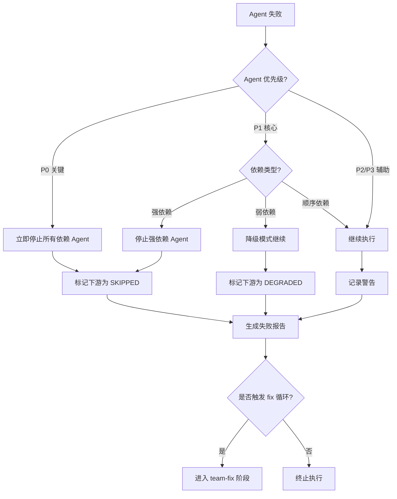
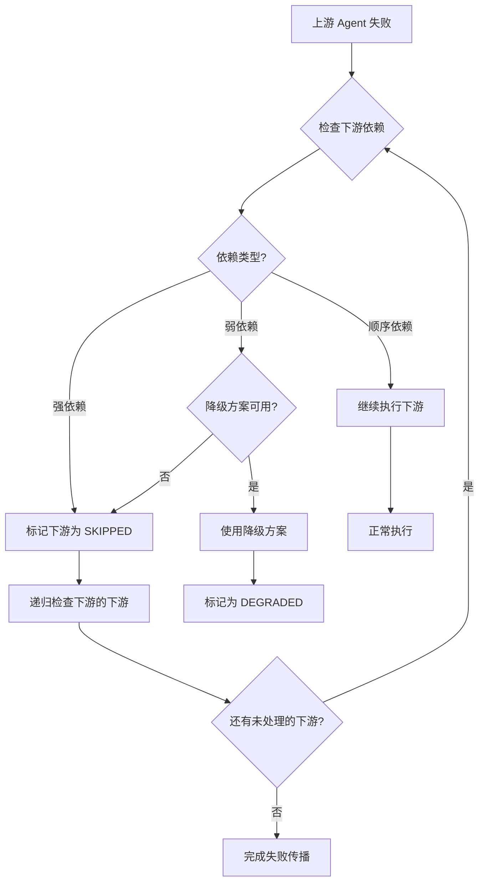

# 级联失败策略规范

> **ultrapower-version**: 7.5.2
> **优先级**: P0（必须遵守）
> **真理之源**: `docs/standards/agent-lifecycle.md`
> **覆盖范围**: T-035（级联失败策略文档）

---

## 目录

1. [失败传播策略](#1-失败传播策略)
2. [依赖链中断处理](#2-依赖链中断处理)
3. [决策树](#3-决策树)
4. [实现指南](#4-实现指南)

---

## 1. 失败传播策略

### 1.1 失败类型分类

| 失败类型 | 严重程度 | 默认传播策略 | 示例 |
| -------- | -------- | ------------ | ---- |
| `CRITICAL` | P0 | 立即停止所有依赖 Agent | 安全漏洞检测失败、数据损坏 |
| `BLOCKING` | P1 | 停止强依赖 Agent，继续弱依赖 | 编译失败、API 不可用 |
| `DEGRADED` | P2 | 继续执行（降级模式） | 性能优化失败、文档生成失败 |
| `WARNING` | P3 | 继续执行（记录警告） | 代码风格问题、非关键测试失败 |

### 1.2 Agent 优先级定义

基于 `agent-lifecycle.md` 的 Agent 分类：

| Agent 类型 | 优先级 | 失败影响 |
| ---------- | ------ | -------- |
| `architect`, `planner`, `analyst` | P0（关键） | 失败 → 停止所有下游 Agent |
| `executor`, `debugger`, `build-fixer` | P1（核心） | 失败 → 停止强依赖 Agent |
| `verifier`, `test-engineer` | P1（核心） | 失败 → 触发 fix 循环 |
| `code-reviewer`, `security-reviewer` | P2（重要） | 失败 → 降级继续或人工介入 |
| `style-reviewer`, `writer` | P3（辅助） | 失败 → 记录警告，继续执行 |

### 1.3 传播决策因素

**立即停止条件**（满足任一即触发）：

1. **关键 Agent 失败**：`architect`、`planner`、`analyst` 失败
2. **安全风险**：`security-reviewer` 检测到 P0 漏洞
3. **数据完整性**：状态文件损坏、依赖图循环
4. **资源耗尽**：成本超限（`COST_LIMIT_USD`）、超时（10 分钟自动终止）

**继续执行条件**（满足所有条件）：

1. **非关键 Agent**：P2/P3 优先级 Agent
2. **无强依赖**：下游 Agent 不依赖失败 Agent 的输出
3. **降级可行**：存在备用方案或默认行为

---

## 2. 依赖链中断处理

### 2.1 依赖类型定义

基于 `agent-lifecycle.md` 第 7 节（并行任务依赖管理）：

| 依赖类型 | 定义 | 上游失败处理 |
| -------- | ---- | ------------ |
| **强依赖**（Hard Dependency） | 下游 Agent 必须使用上游输出 | 上游失败 → 下游跳过（`SKIPPED` 状态） |
| **弱依赖**（Soft Dependency） | 下游 Agent 可选使用上游输出 | 上游失败 → 下游继续（降级模式） |
| **顺序依赖**（Sequential Dependency） | 仅要求执行顺序，无数据依赖 | 上游失败 → 下游继续 |

### 2.2 强依赖中断处理

**场景**：任务 2 强依赖任务 1 的输出

```typescript
// 任务依赖声明
TaskUpdate({ taskId: "2", addBlockedBy: ["1"] });
```

**失败处理流程**：

```
1. 任务 1 失败（status: "failed"）
2. 系统检测到任务 2 的 blockedBy 包含任务 1
3. 任务 2 自动标记为 SKIPPED
4. 任务 2 的下游任务递归检查依赖链
5. 记录失败原因：`skipped_reason: "Upstream task 1 failed"`
```

### 2.3 弱依赖降级处理

**场景**：任务 3 弱依赖任务 1 的优化结果

```typescript
// 弱依赖通过元数据标记
TaskCreate({
  taskId: "3",
  metadata: { weakDependencies: ["1"] }
});
```

**降级处理流程**：

```
1. 任务 1 失败（例如：性能优化失败）
2. 任务 3 检测到弱依赖失败
3. 任务 3 使用默认配置继续执行
4. 记录降级信息：`degraded: true, reason: "Weak dependency 1 failed"`
```

### 2.4 依赖链循环检测

基于 `agent-lifecycle.md` 第 1.4 节（死锁检测）：

```typescript
// 常量定义（来自 subagent-tracker/index.ts）
export const DEADLOCK_CHECK_THRESHOLD = 3;

// 循环依赖检测伪代码
function detectCircularDependency(tasks: Task[]): boolean {
  const visited = new Set<string>();
  const recursionStack = new Set<string>();

  for (const task of tasks) {
    if (hasCycle(task.taskId, visited, recursionStack, tasks)) {
      return true; // 检测到循环
    }
  }
  return false;
}
```

**循环依赖处理**：

1. 检测到循环 → 立即标记为 `CRITICAL` 失败
2. 停止所有涉及循环的 Agent
3. 生成 `AgentIntervention`：`type: "deadlock"`
4. 通知用户并提供依赖图可视化

---

## 3. 决策树

### 3.1 失败传播决策流程



### 3.2 依赖链中断决策流程



### 3.3 常见失败场景决策

| 场景 | Agent 类型 | 失败类型 | 决策 |
| ---- | ---------- | -------- | ---- |
| 架构设计失败 | `architect` | `CRITICAL` | 停止所有，通知用户 |
| 编译失败 | `build-fixer` | `BLOCKING` | 停止强依赖，触发 fix 循环 |
| 单元测试失败 | `test-engineer` | `BLOCKING` | 触发 fix 循环（最多 3 次） |
| 代码审查警告 | `code-reviewer` | `WARNING` | 继续执行，记录警告 |
| 文档生成失败 | `writer` | `DEGRADED` | 继续执行，跳过文档 |
| 性能优化失败 | `performance-reviewer` | `DEGRADED` | 降级为默认配置 |
| 超时（10 分钟） | 任意 Agent | `CRITICAL` | 自动终止（`auto_execute: true`） |
| 成本超限（$1.0） | 任意 Agent | `WARNING` | 警告但不终止（`auto_execute: false`） |

---

## 4. 实现指南

### 4.1 失败状态定义

```typescript
// 扩展 AgentIntervention 接口（基于 agent-lifecycle.md 第 5 节）
export interface AgentFailure extends AgentIntervention {
  type: "timeout" | "deadlock" | "excessive_cost" | "file_conflict" | "execution_error";
  severity: "CRITICAL" | "BLOCKING" | "DEGRADED" | "WARNING";
  propagation_strategy: "stop_all" | "stop_hard_deps" | "degrade" | "continue";
  affected_agents: string[]; // 受影响的下游 Agent ID
}
```

### 4.2 依赖链遍历算法

```typescript
// 递归标记下游 Agent
function propagateFailure(
  failedAgentId: string,
  tasks: Task[],
  strategy: "stop_all" | "stop_hard_deps" | "degrade"
): string[] {
  const affected: string[] = [];

  for (const task of tasks) {
    if (task.blockedBy?.includes(failedAgentId)) {
      // 检查依赖类型
      const isHardDep = !task.metadata?.weakDependencies?.includes(failedAgentId);

      if (strategy === "stop_all" || (strategy === "stop_hard_deps" && isHardDep)) {
        task.status = "skipped";
        task.metadata.skipped_reason = `Upstream agent ${failedAgentId} failed`;
        affected.push(task.taskId);

        // 递归处理下游
        affected.push(...propagateFailure(task.taskId, tasks, strategy));
      } else if (strategy === "degrade") {
        task.metadata.degraded = true;
        task.metadata.degraded_reason = `Weak dependency ${failedAgentId} failed`;
      }
    }
  }

  return affected;
}
```

### 4.3 Team Pipeline 集成

基于 `CLAUDE.md` 的 `<team_pipeline>` 规范：

```typescript
// team-verify 阶段失败处理
function handleVerificationFailure(
  verificationResult: VerificationResult,
  teamState: TeamState
): TeamPhase {
  if (verificationResult.severity === "CRITICAL") {
    // 关键失败 → 直接终止
    return "failed";
  } else if (verificationResult.severity === "BLOCKING") {
    // 阻塞失败 → 进入 fix 循环
    teamState.fix_loop_count++;
    if (teamState.fix_loop_count > MAX_FIX_ATTEMPTS) {
      return "failed"; // 超过最大尝试次数
    }
    return "team-fix";
  } else {
    // 降级/警告 → 继续完成
    teamState.metadata.degraded = true;
    return "complete";
  }
}
```

### 4.4 监控与日志

```typescript
// 失败事件记录
interface FailureEvent {
  timestamp: string;
  agent_id: string;
  agent_type: string;
  failure_type: string;
  severity: string;
  propagation_strategy: string;
  affected_agents: string[];
  recovery_action: "retry" | "skip" | "degrade" | "abort";
}

// 写入审计日志
function logFailureEvent(event: FailureEvent): void {
  const logPath = path.join(directory, ".omc", "logs", "cascade-failures.json");
  appendJsonLog(logPath, event);
}
```

---

## 5. 参考规范

| 规范文档 | 相关章节 |
| -------- | -------- |
| `agent-lifecycle.md` | 第 1 节（Agent 边界情况矩阵） |
| `agent-lifecycle.md` | 第 7 节（并行任务依赖管理） |
| `state-machine.md` | Team Pipeline 状态转换 |
| `CLAUDE.md` | `<team_pipeline>` 阶段路由 |

---

## 6. 版本历史

| 版本 | 日期 | 变更内容 |
| ---- | ---- | -------- |
| 1.0.0 | 2026-03-16 | 初始版本（T-035） |
