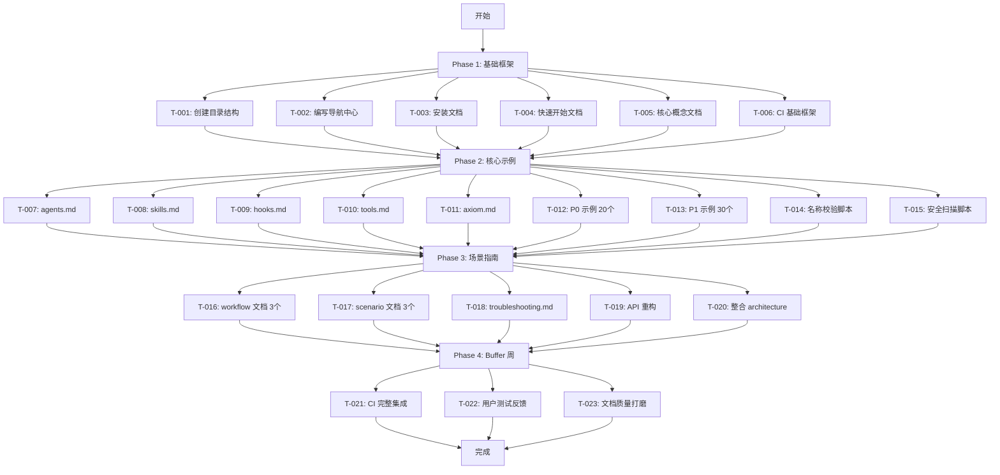

# 任务清单: 文档体系重构

## 1. 架构图（全局上下文）

## 2. 任务总览

* **总任务数**: 23

* **总工时**: 72 小时

* **交付周期**: 3 周 + 1 周 buffer

* **关键路径**: T-001 → T-006 → T-012 → T-016 → T-021

## 3. Phase 1: 基础框架（Week 1）

### T-001: 创建文档目录结构

* **优先级**: P0

* **工时**: 1h

* **负责人**: Technical Writer

* **依赖**: 无

* **交付物**: docs/ 6 层目录结构，所有目录包含 .gitkeep

* **验收标准**: 
  - [ ] 目录结构符合 PRD 4.1 节定义
  - [ ] 包含 getting-started/、features/、guides/、architecture/、standards/、api/

### T-002: 编写导航中心

* **优先级**: P0

* **工时**: 2h

* **负责人**: Technical Writer

* **依赖**: T-001

* **交付物**: docs/README.md

* **验收标准**:
  - [ ] 包含快速导航、按角色查找、按场景查找
  - [ ] 包含反馈机制（👍/👎 链接）

### T-003: 编写安装文档

* **优先级**: P0

* **工时**: 2h

* **负责人**: Technical Writer

* **依赖**: T-001

* **交付物**: docs/getting-started/installation.md

* **验收标准**:
  - [ ] 5 分钟内可完成安装
  - [ ] 使用检查点机制（✅ 标记）

### T-004: 编写快速开始文档

* **优先级**: P0

* **工时**: 4h

* **负责人**: Technical Writer

* **依赖**: T-003

* **交付物**: docs/getting-started/quickstart.md

* **验收标准**:
  - [ ] 15 分钟内跑通第一个示例
  - [ ] 包含检查点机制、完整可复制代码（< 10 行）
  - [ ] 包含预期输出、失败路径引导、庆祝消息

### T-005: 编写核心概念文档

* **优先级**: P0

* **工时**: 3h

* **负责人**: Technical Writer

* **依赖**: T-001

* **交付物**: docs/getting-started/concepts.md

* **验收标准**:
  - [ ] 解释 agents、skills、hooks、tools、Axiom 核心概念
  - [ ] 使用图表辅助理解

### T-006: 设置 CI 基础框架

* **优先级**: P0

* **工时**: 3h

* **负责人**: DevOps Engineer

* **依赖**: T-001

* **交付物**: .github/workflows/docs.yml、package.json 添加 validate:docs 脚本

* **验收标准**:
  - [ ] CI 在 PR 时自动运行
  - [ ] 包含 markdown-link-check、markdownlint 检查

## 4. Phase 2: 核心示例（Week 2）

### T-007: 编写 agents.md

* **优先级**: P0

* **工时**: 4h

* **负责人**: Technical Writer

* **依赖**: T-006

* **交付物**: docs/features/agents.md

* **验收标准**:
  - [ ] 50 agents 按通道分类（构建/审查/领域/产品/协调）
  - [ ] 包含快速跳转目录
  - [ ] 每个 agent 包含使用场景说明

### T-008: 编写 skills.md

* **优先级**: P0

* **工时**: 5h

* **负责人**: Technical Writer

* **依赖**: T-006

* **交付物**: docs/features/skills.md

* **验收标准**:
  - [ ] 71 skills 按类别分组（workflow/agent/tool/utility）
  - [ ] 包含别名字段和使用频率标识（⭐⭐⭐/⭐⭐/⭐）
  - [ ] 包含快速跳转目录

### T-009: 编写 hooks.md

* **优先级**: P0

* **工时**: 3h

* **负责人**: Technical Writer

* **依赖**: T-006

* **交付物**: docs/features/hooks.md

* **验收标准**:
  - [ ] 47 hooks 都有触发条件和示例
  - [ ] 包含 hook 执行顺序说明

### T-010: 编写 tools.md

* **优先级**: P0

* **工时**: 3h

* **负责人**: Technical Writer

* **依赖**: T-006

* **交付物**: docs/features/tools.md

* **验收标准**:
  - [ ] 35 tools 按类别分组（状态/团队/记忆/代码智能）
  - [ ] 每个 tool 包含参数说明和示例

### T-011: 编写 axiom.md

* **优先级**: P1

* **工时**: 4h

* **负责人**: Technical Writer

* **依赖**: T-006

* **交付物**: docs/features/axiom.md

* **验收标准**:
  - [ ] 解释 Axiom 进化系统工作原理
  - [ ] 包含配置示例和使用场景

### T-012: 编写 P0 示例（20 个核心 skills）

* **优先级**: P0

* **工时**: 12h

* **负责人**: Technical Writer

* **依赖**: T-007, T-008

* **交付物**: 20 个完整端到端示例

* **P0 Skills 列表**:
  - autopilot, ralph, team, ultrawork, plan
  - executor, debugger, verifier, explore, analyst
  - planner, architect, code-reviewer, security-reviewer
  - test-engineer, build-fixer, designer, writer
  - state_read, state_write

* **验收标准**:
  - [ ] 每个示例包含完整代码 + 错误处理
  - [ ] 标注可运行性级别（Level 1/2/3）
  - [ ] 所有敏感信息使用占位符

### T-013: 编写 P1 示例（30 个常用 skills）

* **优先级**: P1

* **工时**: 8h

* **负责人**: Technical Writer

* **依赖**: T-012

* **交付物**: 30 个标准用法示例

* **验收标准**:
  - [ ] 每个示例包含标准用法代码
  - [ ] 标注可运行性级别

### T-014: 实现名称校验脚本

* **优先级**: P0

* **工时**: 4h

* **负责人**: DevOps Engineer

* **依赖**: T-006

* **交付物**: scripts/validate-doc-names.ts

* **验收标准**:
  - [ ] 扫描 Markdown 正文、代码块、Mermaid 图表
  - [ ] 允许废弃别名但必须标注 [DEPRECATED]
  - [ ] 集成到 CI 流程

### T-015: 实现安全扫描脚本

* **优先级**: P0

* **工时**: 3h

* **负责人**: DevOps Engineer

* **依赖**: T-006

* **交付物**: scripts/validate-doc-security.ts

* **验收标准**:
  - [ ] 正则扫描 API keys、路径、用户数据泄露
  - [ ] 集成到 CI 流程
  - [ ] 提供修复建议

## 5. Phase 3: 场景指南（Week 3）

### T-016: 编写 workflow 文档（3 个）

* **优先级**: P0

* **工时**: 6h

* **负责人**: Technical Writer

* **依赖**: T-012, T-013

* **交付物**: 
  - docs/guides/workflow-autopilot.md
  - docs/guides/workflow-team-pipeline.md
  - docs/guides/workflow-ralph-loop.md

* **验收标准**:
  - [ ] 每个 workflow 包含完整使用流程
  - [ ] 包含适用场景和最佳实践

### T-017: 编写 scenario 文档（3 个）

* **优先级**: P0

* **工时**: 6h

* **负责人**: Technical Writer

* **依赖**: T-012, T-013

* **交付物**:
  - docs/guides/scenario-feature-dev.md
  - docs/guides/scenario-bug-investigation.md
  - docs/guides/scenario-code-review.md

* **验收标准**:
  - [ ] 每个场景包含端到端示例
  - [ ] 包含 agent 组合推荐

### T-018: 编写故障排查文档

* **优先级**: P0

* **工时**: 4h

* **负责人**: Technical Writer

* **依赖**: T-012, T-013

* **交付物**: docs/guides/troubleshooting.md

* **验收标准**:
  - [ ] 按错误代码索引
  - [ ] 包含常见问题和解决方案

### T-019: API 文档重构

* **优先级**: P1

* **工时**: 5h

* **负责人**: Technical Writer

* **依赖**: T-007, T-008, T-009, T-010

* **交付物**: 
  - docs/api/overview.md
  - docs/api/agents/executor.md
  - docs/api/skills/autopilot.md
  - docs/api/tools/state-management.md

* **验收标准**:
  - [ ] API 文档按模块拆分
  - [ ] 包含参数说明和返回值

### T-020: 整合 architecture 文档

* **优先级**: P1

* **工时**: 2h

* **负责人**: Technical Writer

* **依赖**: T-001

* **交付物**: 确认 docs/architecture/ 现有文档符合新结构

* **验收标准**:
  - [ ] state-machine.md、hook-execution-order.md、agent-lifecycle.md 保持原位
  - [ ] 从 docs/README.md 正确链接

## 6. Phase 4: Buffer 周（Week 4）

### T-021: CI 完整集成

* **优先级**: P0

* **工时**: 4h

* **负责人**: DevOps Engineer

* **依赖**: T-014, T-015

* **交付物**: 完整的 CI 流水线

* **验收标准**:
  - [ ] 集成 TypeScript 语法检查（tsc --noEmit）
  - [ ] 集成示例代码测试（npm run test:docs）
  - [ ] 集成文档长度限制检查

### T-022: 用户测试反馈迭代

* **优先级**: P0

* **工时**: 6h

* **负责人**: QA Reviewer

* **依赖**: T-004, T-012, T-016, T-017

* **交付物**: 用户测试报告和改进清单

* **验收标准**:
  - [ ] 邀请 10 位新用户测试
  - [ ] 收集反馈并优化文档

### T-023: 文档质量打磨

* **优先级**: P1

* **工时**: 4h

* **负责人**: QA Reviewer

* **依赖**: T-022

* **交付物**: 最终质量审查报告

* **验收标准**:
  - [ ] 所有链接有效
  - [ ] 所有示例可运行
  - [ ] 格式统一规范

## 7. 资源分配

| 角色 | 总工时 | 任务分配 |
| ------ | -------- | --------- |
| Technical Writer | 48h | T-002~T-005, T-007~T-013, T-016~T-020 |
| DevOps Engineer | 16h | T-006, T-014, T-015, T-021 |
| QA Reviewer | 10h | T-022, T-023 |

**并行执行建议**:

* Week 1: T-002~T-005 可并行，T-006 独立进行

* Week 2: T-007~T-011 可并行，T-012~T-015 顺序执行

* Week 3: T-016~T-020 可并行

## 8. 风险与缓解

| 风险 | 等级 | 缓解措施 | 责任人 |
| ------ | ------ | --------- | -------- |
| 文档-代码同步漂移 | P0 | CI 门禁 + 示例测试 | DevOps Engineer |
| 示例代码泄露敏感信息 | P0 | 安全扫描脚本 | DevOps Engineer |
| 20 分钟目标无法达成 | P1 | Week 2 用户测试验证 | QA Reviewer |
| 示例维护负担高 | P1 | 分级策略（20+30+21） | Technical Writer |

## 9. 验收标准（整体）

### 功能完整性

* [ ] P0 (20 个): 完整端到端示例 + 错误处理

* [ ] P1 (30 个): 标准用法示例

* [ ] P2 (21 个): API 签名 + 一句话说明

* [ ] 所有文档包含 Front Matter（version/last_updated）

### 可用性指标

* [ ] 新用户从安装到跑通第一个示例 ≤ 20 分钟

* [ ] 任何信息从 docs/README.md 出发 ≤ 3 次点击可达

### 质量门禁

* [ ] CI 自动化检查全部通过

* [ ] 名称一致性校验通过

* [ ] 安全扫描无泄露风险

## 10. 依赖关系矩阵

| 任务 | 前置依赖 | 后续任务 |
| ------ | --------- | --------- |
| T-001 | 无 | T-002~T-006 |
| T-002 | T-001 | Phase 2 所有任务 |
| T-003 | T-001 | T-004 |
| T-004 | T-003 | Phase 2 所有任务 |
| T-005 | T-001 | Phase 2 所有任务 |
| T-006 | T-001 | T-007~T-015 |
| T-012 | T-007, T-008 | T-013, T-016, T-017 |
| T-014 | T-006 | T-021 |
| T-015 | T-006 | T-021 |
| T-019 | T-007~T-010 | T-023 |
| T-021 | T-014, T-015 | T-023 |
| T-022 | T-004, T-012, T-016, T-017 | T-023 |

## 11. 里程碑检查点

### Week 1 结束

* **交付物**: 新用户可完成 20 分钟快速开始

* **检查项**: T-001~T-006 全部完成

### Week 2 结束（中期检查点）

* **交付物**: 50 个核心功能有完整示例

* **检查项**: T-007~T-015 全部完成

* **用户测试**: 邀请 10 位新用户测试

### Week 3 结束

* **交付物**: 完整的场景驱动文档体系

* **检查项**: T-016~T-020 全部完成

### Week 4 结束

* **交付物**: 生产就绪的文档系统

* **检查项**: T-021~T-023 全部完成

## 12. 下一步行动

1. **用户确认**: 确认任务拆解符合预期
2. **资源分配**: 指定 Technical Writer、DevOps Engineer、QA Reviewer
3. **启动开发**: 调用 `/ax-implement` 开始执行 T-001

---

**生成时间**: 2026-03-05  
**Axiom 状态**: 任务拆解完成，等待用户确认

