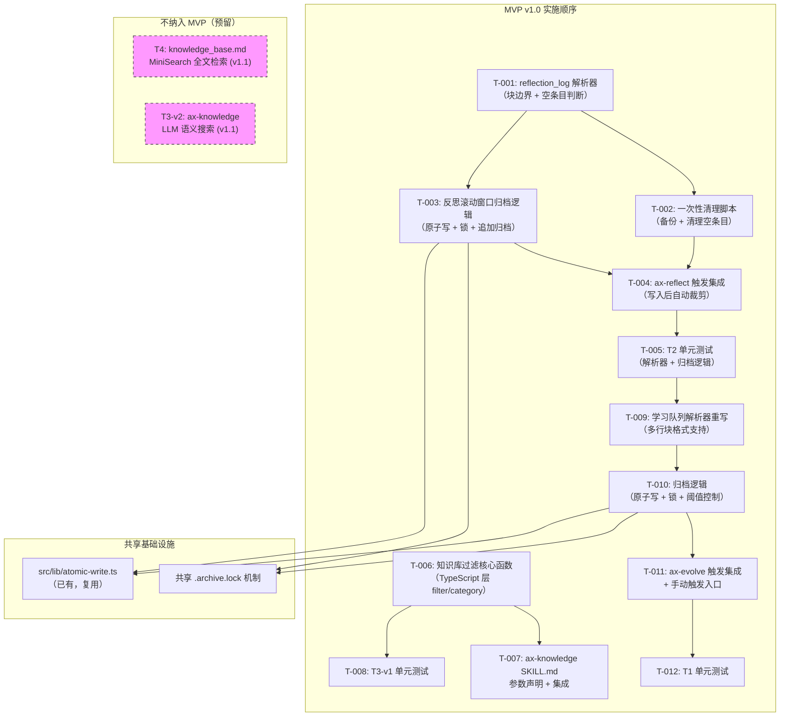

# Manifest: Axiom 记忆进化系统 Token 优化（MVP v1.0）

> 创建日期: 2026-02-26
> 状态: 待实施
> MVP 范围: T2 -> T3-v1 -> T1（严格顺序）
> T4 / T3-v2: 不纳入 MVP，仅预留说明

---

## 1. 全局架构图



---

## 2. 关键架构决策

| 决策项 | 选择 | 理由 |
| -------- | ------ | ------ |
| 原子写入 | 复用 `src/lib/atomic-write.ts` | 项目已有成熟实现（temp+rename），无需新增依赖 |
| 并发锁 | 新建 `src/lib/file-lock.ts` | 轻量文件锁（mkdir-based），30s 陈旧超时，T2/T1 共享 |
| 解析器位置 | 新建 `src/hooks/learner/reflection-parser.ts` | 独立解析模块，与现有 `reflection.ts` 分离，便于测试 |
| 知识库过滤 | 扩展 `src/hooks/learner/index-manager.ts` | `KnowledgeIndexManager.loadIndex()` 已解析表格，加 filter 方法最自然 |
| 学习队列解析器 | 重写 `src/hooks/learner/learning-queue.ts` 的 `loadItems()` | 当前为表格解析，需改为多行块格式解析 |
| 归档文件路径 | 硬编码常量 | PRD 要求不从文件内容动态构建 |

---

## 3. 任务列表（DAG）

### 阶段一：T2 — 反思滚动窗口（最先实施）

---

#### T-001: reflection_log 块解析器

* **所属功能**: T2

* **依赖**: 无

* **预估工时**: 4 小时

* **Impact Scope**:
  - `src/hooks/learner/reflection-parser.ts`（新建）

* **验收标准**:
  - 正确解析 `## 反思 - YYYY-MM-DD` 块边界（含末尾 `---` 分隔符归属当前块）
  - 空条目判断：三个核心小节（`### 做得好的` / `### 待改进` / `### 学到了什么`）均无有效内容时识别为空
  - 有效内容定义：排除空行、纯 `-` 占位、`(无)` 占位、HTML 注释后仍有文本
  - 返回结构化数组 `ReflectionBlock[]`，含 `isEmpty` 标记
  - 按 `## 反思 - 日期` 倒序排列

* **实现要点**:
  - 新建 `src/hooks/learner/reflection-parser.ts`
  - 导出 `parseReflectionLog(text: string): ReflectionBlock[]`
  - 导出 `interface ReflectionBlock { header: string; rawContent: string; date: string; isEmpty: boolean }`
  - 块边界拆分正则：`/^## 反思/m`；`---` 分隔符归属前一块
  - 空条目判断逻辑：提取三个核心小节的内容行，过滤 `(无)` / `-` / 空行 / `<!-- -->` 后检查是否为空
  - 注意：现有 `reflection.ts` 中 `getRecentReflections()` 使用 `### ` 做分割——本模块使用 `## 反思` 做分割，层级不同，不冲突

---

#### T-002: 一次性清理脚本（空条目移除 + 备份）

* **所属功能**: T2

* **依赖**: T-001

* **预估工时**: 3 小时

* **Impact Scope**:
  - `src/hooks/learner/reflection-cleanup.ts`（新建）
  - `.omc/axiom/reflection_log.md`（运行时修改）
  - `.omc/axiom/reflection_log_backup_YYYYMMDD.md`（运行时创建）

* **验收标准**:
  - 备份原文件至 `reflection_log_backup_YYYYMMDD.md`
  - 清理所有 `isEmpty === true` 的条目
  - 输出清理摘要：`[清理] 已移除 X 条空条目，保留 Y 条有效反思`
  - 有效反思无误删
  - 人工触发（非自动）

* **实现要点**:
  - 新建 `src/hooks/learner/reflection-cleanup.ts`
  - 导出 `cleanupReflectionLog(baseDir: string): Promise<{ removed: number; kept: number; backupPath: string }>`
  - 调用 T-001 的 `parseReflectionLog()` 获取块列表
  - 备份：`fs.copyFile(reflectionLog, backupPath)`
  - 过滤 `isEmpty === true` 的块
  - 保留头部（`# Reflection Log` 标题行）+ 所有非空块
  - 使用 `atomicWriteFileSync` 写回主文件

---

#### T-003: 反思滚动窗口归档逻辑

* **所属功能**: T2

* **依赖**: T-001

* **预估工时**: 5 小时

* **Impact Scope**:
  - `src/hooks/learner/reflection-archiver.ts`（新建）
  - `src/lib/file-lock.ts`（新建）
  - `.omc/axiom/evolution/reflection_log_archive.md`（运行时创建/追加）

* **验收标准**:
  - 保留最近 10 条完整反思（按日期倒序）
  - 超出 10 条的最旧条目追加至归档文件
  - 原子写入：主文件使用 write-to-tmp-then-rename
  - 并发锁：`.omc/axiom/evolution/.archive.lock`，30s 超时视为陈旧
  - 归档文件 > 5000 行输出 warning
  - 用户反馈：`[归档] reflection_log: 已移动 N 条反思至 reflection_log_archive.md`

* **实现要点**:
  - 新建 `src/hooks/learner/reflection-archiver.ts`
  - 导出 `archiveReflections(baseDir: string): Promise<{ archived: number; kept: number; warning?: string }>`
  - 新建 `src/lib/file-lock.ts`（T2/T1 共享）
  - 导出 `acquireLock(lockPath: string, staleMs?: number): Promise<() => Promise<void>>`
  - 锁实现：`fs.mkdir(lockPath)` + 写入 PID/时间戳文件；unlock = `fs.rm(lockPath, { recursive: true })`
  - 陈旧锁检测：读取锁文件时间戳，> 30s 则强制移除
  - 归档流程：加锁 -> 解析主文件 -> 按日期倒序排序 -> 前10条保留 -> 剩余追加归档 -> 原子写回主文件 -> 释放锁
  - 归档文件追加：`fs.appendFile(archivePath, archivedContent)`
  - 行数 warning：读取归档文件行数，> 5000 时在输出中包含 warning

---

#### T-004: ax-reflect 触发集成

* **所属功能**: T2

* **依赖**: T-002, T-003

* **预估工时**: 3 小时

* **Impact Scope**:
  - `src/hooks/learner/reflection.ts`（修改）
  - `src/hooks/learner/orchestrator.ts`（修改）
  - `skills/ax-reflect/SKILL.md`（修改）

* **验收标准**:
  - `ReflectionEngine.appendToLog()` 写入新条目后，自动检查条目数，`count > 10` 时调用归档
  - `ax-reflect` 调用语法不变（向后兼容）
  - 不改变 `reflect()` 方法签名
  - 归档结果包含在 reflect 返回信息中

* **实现要点**:
  - 修改 `src/hooks/learner/reflection.ts`：
    - 在 `appendToLog()` 末尾调用 `archiveReflections()`（条件：解析后 count > 10）
    - import `archiveReflections` from `./reflection-archiver.js`
    - import `parseReflectionLog` from `./reflection-parser.js`
  - 修改 `src/hooks/learner/orchestrator.ts`：
    - `reflect()` 方法返回值增加 `archiveResult` 可选字段
  - 修改 `skills/ax-reflect/SKILL.md`：
    - 在 Step 3（持久化）后增加说明：写入后超过 10 条时自动归档

---

#### T-005: T2 单元测试

* **所属功能**: T2

* **依赖**: T-004

* **预估工时**: 4 小时

* **Impact Scope**:
  - `src/hooks/learner/__tests__/reflection-parser.test.ts`（新建）
  - `src/hooks/learner/__tests__/reflection-archiver.test.ts`（新建）
  - `src/lib/__tests__/file-lock.test.ts`（新建）

* **验收标准**:
  - 解析器测试：正常块、空条目、混合块、边界 `---` 归属
  - 归档测试：10 条边界（11 条触发，10 条不触发）、归档文件追加、原子写入
  - 锁测试：正常加锁/解锁、陈旧锁超时、并发竞争
  - 清理测试：备份生成、空条目移除、有效条目保留
  - 所有测试通过 `npm test`

* **实现要点**:
  - 使用 `tmp` 目录（`os.tmpdir()`）模拟文件系统
  - 测试数据：构造含空条目和有效条目的 reflection_log 内容
  - 边界测试：恰好 10 条（不触发）、11 条（触发归档 1 条）
  - 锁测试：创建 > 30s 的锁文件验证陈旧检测

---

### 阶段二：T3-v1 — 知识库关键词过滤

---

#### T-006: 知识库过滤核心函数

* **所属功能**: T3-v1

* **依赖**: 无（与 T2 并行安全，但建议在 T005 后开始）

* **预估工时**: 3 小时

* **Impact Scope**:
  - `src/hooks/learner/index-manager.ts`（修改）

* **验收标准**:
  - `--filter <keyword>`：Title 或 Category 包含关键词（includes，大小写不敏感）
  - `--category <category>`：Category 字段精确匹配（大小写不敏感）
  - 无参数：全量返回（向后兼容）
  - 结果末尾包含统计：`显示 X/Y 条`
  - `--filter` 长度上限 256 字符，超出返回错误
  - 纯 TypeScript 实现，不依赖 LLM

* **实现要点**:
  - 在 `KnowledgeIndexManager` 中新增方法：
    - `filterByKeyword(keyword: string): Promise<{ entries: IndexEntry[]; total: number }>`
    - `filterByCategory(category: string): Promise<{ entries: IndexEntry[]; total: number }>`
  - 内部调用 `loadIndex()` 获取全量数据后过滤
  - keyword 过滤：`entry.title.toLowerCase().includes(kw) | | entry.category.toLowerCase().includes(kw)`
  - category 过滤：`entry.category.toLowerCase() === cat.toLowerCase()`
  - 参数校验：keyword 长度 > 256 时 throw Error

---

#### T-007: ax-knowledge SKILL.md 参数声明 + 集成

* **所属功能**: T3-v1

* **依赖**: T-006

* **预估工时**: 2 小时

* **Impact Scope**:
  - `skills/ax-knowledge/SKILL.md`（修改）
  - `skills/ax-knowledge/AGENTS.md`（修改）

* **验收标准**:
  - `ax-knowledge --filter typescript` 只返回匹配条目
  - `ax-knowledge --category architecture` 只返回 Category 精确匹配条目
  - 无参数时行为不变（全量查询）
  - 结果末尾显示 `显示 X/Y 条，使用无参数调用查看全部`

* **实现要点**:
  - 修改 `skills/ax-knowledge/SKILL.md`：
    - 在"触发词"部分增加参数说明：`ax-knowledge [--filter <keyword>] [--category <category>]`
    - 在 Step 2 增加过滤逻辑说明
    - 在 Step 4 输出模板增加统计行
  - 修改 `skills/ax-knowledge/AGENTS.md`：
    - 增加参数解析指引

---

#### T-008: T3-v1 单元测试

* **所属功能**: T3-v1

* **依赖**: T-006

* **预估工时**: 2 小时

* **Impact Scope**:
  - `src/hooks/learner/__tests__/index-manager-filter.test.ts`（新建）

* **验收标准**:
  - `--filter typescript` 只返回 Title/Category 含 "typescript" 的条目
  - `--category architecture` 只返回 Category="architecture" 的条目
  - 无参数返回全量 62 条
  - 结果统计正确
  - 超 256 字符返回错误
  - 大小写不敏感验证

* **实现要点**:
  - 构造 mock knowledge_base.md 内容（含多种 category 和 title）
  - 测试用例：关键词匹配、Category 精确匹配、空结果、全量返回、边界（256 字符）、大小写混合

---

### 阶段三：T1 — 学习队列归档（最后实施）

---

#### T-009: 学习队列解析器重写（多行块格式）

* **所属功能**: T1

* **依赖**: T-005（需要 T2 完成后才开始）

* **预估工时**: 5 小时

* **Impact Scope**:
  - `src/hooks/learner/learning-queue.ts`（修改）

* **验收标准**:
  - 正确解析多行块格式（`### LQ-XXX:` + 字段行）
  - 向后兼容：如遇旧表格格式仍能解析（降级路径）
  - `loadItems()` 返回与现有 `QueueItem` 接口一致的数据
  - `appendItem()` 以多行块格式写入
  - `updateStatus()` 在多行块格式中正确更新状态字段

* **实现要点**:
  - 重写 `LearningQueue.loadItems()`：
    - 检测格式：如果包含 `### LQ-` 则使用块解析；否则回退表格解析
    - 块解析：以 `### LQ-XXX:` 为块起始，提取字段行（`- 优先级:`, `- 状态:` 等）
    - 字段映射：`优先级` -> priority, `来源类型` -> sourceType, `状态` -> status, `添加时间` -> created, `内容` -> description
  - 重写 `LearningQueue.appendItem()`：
    - 以 `### LQ-XXX: title` + 字段行格式写入
    - 插入位置：`## 待处理队列` 标记之后
  - 重写 `LearningQueue.updateStatus()`：
    - 在块格式中定位 `- 状态:` 行并替换
    - 如果更新为 done，追加 `- 处理时间:` 行

---

#### T-010: 学习队列归档逻辑

* **所属功能**: T1

* **依赖**: T-009

* **预估工时**: 5 小时

* **Impact Scope**:
  - `src/hooks/learner/queue-archiver.ts`（新建）
  - `.omc/axiom/evolution/learning_queue_archive.md`（运行时创建/追加）

* **验收标准**:
  - 归档阈值：`done 条目数 > 10`（严格大于；done=11 触发，done=10 不触发）
  - 主文件保留：头部 + 所有 pending + 所有 in-progress + 按处理时间倒序最近 10 条 done
  - 归档目标：`.omc/axiom/evolution/learning_queue_archive.md`（追加写入）
  - 原子写入：主文件 write-to-tmp-then-rename
  - 并发锁：复用 `src/lib/file-lock.ts`（`.omc/axiom/evolution/.archive.lock`）
  - 归档前：`mkdirSync({ recursive: true })`
  - 归档文件 > 5000 行输出 warning
  - 归档文件 ID 无重复
  - 用户反馈：`[归档] learning_queue: 已移动 N 条 done 条目至 learning_queue_archive.md`

* **实现要点**:
  - 新建 `src/hooks/learner/queue-archiver.ts`
  - 导出 `archiveQueueItems(baseDir: string): Promise<{ archived: number; kept: number; warning?: string }>`
  - 复用 T-003 的 `acquireLock()` / `releaseLock()` 锁机制
  - 归档流程：
    1. 加锁
    2. 调用 `loadItems()` 获取全部条目
    3. 分类：pending / in-progress / done
    4. done 按处理时间倒序排序
    5. 保留前 10 条 done + 全部 pending + 全部 in-progress
    6. 其余 done 追加到归档文件
    7. 重建主文件（头部 + 保留条目）
    8. 原子写回主文件
    9. 释放锁
  - 复用 `atomicWriteFileSync` 或 `atomicWriteJson` 写主文件

---

#### T-011: ax-evolve 触发集成 + 手动触发入口

* **所属功能**: T1

* **依赖**: T-010

* **预估工时**: 3 小时

* **Impact Scope**:
  - `src/hooks/learner/orchestrator.ts`（修改）
  - `skills/ax-evolve/SKILL.md`（修改）

* **验收标准**:
  - `evolve()` 处理完一批条目后，自动检查 done 数量并触发归档
  - `--archive-queue` 参数可独立触发归档（不执行 evolve 其他步骤）
  - 归档结果包含在 evolve 返回信息中
  - 不改变 `evolve()` 基本流程

* **实现要点**:
  - 修改 `src/hooks/learner/orchestrator.ts`：
    - 在 `evolve()` 方法的 step 9（清理队列）之后，调用 `archiveQueueItems()`
    - 新增 `archiveQueue()` 公开方法，用于手动触发
    - `EvolveResult` 增加 `archiveResult` 可选字段
  - 修改 `skills/ax-evolve/SKILL.md`：
    - 在触发时机部分增加：`--archive-queue` 手动触发归档
    - 在 Step 6 增加归档说明

---

#### T-012: T1 单元测试

* **所属功能**: T1

* **依赖**: T-011

* **预估工时**: 4 小时

* **Impact Scope**:
  - `src/hooks/learner/__tests__/learning-queue-parser.test.ts`（新建）
  - `src/hooks/learner/__tests__/queue-archiver.test.ts`（新建）

* **验收标准**:
  - 解析器测试：多行块格式解析、旧表格格式兼容、字段映射正确
  - 归档测试：done=11 触发 / done=10 不触发、保留最近 10 条 done、pending/in-progress 不受影响
  - 归档文件 ID 无重复
  - 手动触发 (`archiveQueue()`) 正常工作
  - 并发锁复用验证
  - 归档 > 5000 行 warning
  - 所有测试通过 `npm test`

* **实现要点**:
  - 构造多行块格式和旧表格格式的测试数据
  - 边界测试：done=10（不触发）、done=11（归档 1 条）、done=20（归档 10 条）
  - 保留顺序验证：按处理时间倒序最近 10 条
  - 模拟并发场景（两个 archiver 同时运行）

---

## 4. 预留说明（不纳入 MVP）

### T4: knowledge_base.md MiniSearch 全文检索（v1.1）

* **描述**: 引入 MiniSearch 库，为知识库提供全文检索能力

* **原因**: 需引入新运行时依赖，延至 v1.1

* **前置条件**: T3-v1 完成

### T3-v2: ax-knowledge LLM 语义搜索（v1.1）

* **描述**: 利用 LLM 进行语义级知识查询

* **原因**: 需 LLM 集成，复杂度高，延至 v1.1

* **前置条件**: T3-v1 + T4 完成

---

## 5. 文件索引（全 Manifest 涉及的文件）

### 新建文件

| 文件路径 | 所属任务 | 说明 |
| --------- | --------- | ------ |
| `src/hooks/learner/reflection-parser.ts` | T-001 | reflection_log 块解析器 |
| `src/hooks/learner/reflection-cleanup.ts` | T-002 | 一次性清理脚本 |
| `src/hooks/learner/reflection-archiver.ts` | T-003 | 反思滚动窗口归档 |
| `src/lib/file-lock.ts` | T-003 | 共享文件锁（T2/T1 复用） |
| `src/hooks/learner/queue-archiver.ts` | T-010 | 学习队列归档 |
| `src/hooks/learner/__tests__/reflection-parser.test.ts` | T-005 | T2 解析器测试 |
| `src/hooks/learner/__tests__/reflection-archiver.test.ts` | T-005 | T2 归档测试 |
| `src/lib/__tests__/file-lock.test.ts` | T-005 | 文件锁测试 |
| `src/hooks/learner/__tests__/index-manager-filter.test.ts` | T-008 | T3-v1 过滤测试 |
| `src/hooks/learner/__tests__/learning-queue-parser.test.ts` | T-012 | T1 解析器测试 |
| `src/hooks/learner/__tests__/queue-archiver.test.ts` | T-012 | T1 归档测试 |

### 修改文件

| 文件路径 | 所属任务 | 说明 |
| --------- | --------- | ------ |
| `src/hooks/learner/reflection.ts` | T-004 | appendToLog 后触发归档 |
| `src/hooks/learner/orchestrator.ts` | T-004, T-011 | reflect/evolve 返回值扩展 |
| `src/hooks/learner/index-manager.ts` | T-006 | 新增 filterByKeyword/filterByCategory |
| `src/hooks/learner/learning-queue.ts` | T-009 | 解析器重写为多行块格式 |
| `skills/ax-reflect/SKILL.md` | T-004 | 增加归档说明 |
| `skills/ax-knowledge/SKILL.md` | T-007 | 增加 --filter/--category 参数 |
| `skills/ax-knowledge/AGENTS.md` | T-007 | 增加参数解析指引 |
| `skills/ax-evolve/SKILL.md` | T-011 | 增加 --archive-queue + 归档说明 |

### 参考文件（只读）

| 文件路径 | 用途 |
| --------- | ------ |
| `src/lib/atomic-write.ts` | 复用原子写入函数 |
| `src/config/axiom-config.ts` | 理解 EvolutionConfig 结构 |
| `.omc/axiom/evolution/learning_queue.md` | 理解当前队列格式 |
| `.omc/axiom/reflection_log.md` | 理解当前反思格式 |
| `.omc/axiom/evolution/knowledge_base.md` | 理解知识库索引格式 |

---

## 6. CI 门禁

每个任务完成后必须通过：

```bash
tsc --noEmit && npm run build && npm test
```

---

## 7. 工时汇总

| 阶段 | 任务 | 预估工时 |
| ------ | ------ | --------- |
| T2 - 反思滚动窗口 | T-001 ~ T-005 | 19 小时 |
| T3-v1 - 知识库过滤 | T-006 ~ T-008 | 7 小时 |
| T1 - 学习队列归档 | T-009 ~ T-012 | 17 小时 |
| **合计** | **12 个任务** | **43 小时** |

> 注意：T-003（5小时）和 T-009（5小时）标记为需关注，接近单任务上限。
