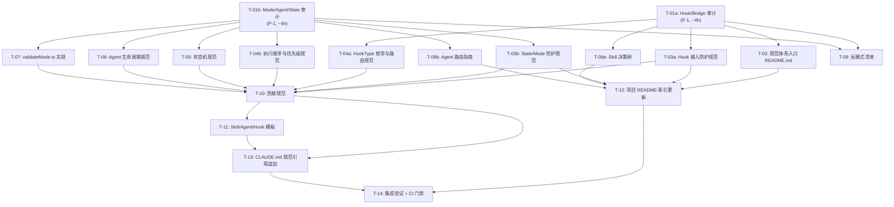

# 任务清单: ultrapower 全链路规范体系

> 生成时间: 2026-02-26
> 真理之源: Rough PRD (ultrapower 全链路规范体系)
> 状态: 待执行（已拆分大任务）
> 拆分时间: 2026-02-26

---

## 1. 架构图（全局上下文）



---

## 2. 任务总览表

| ID | 标题 | 优先级 | 工作量 | 依赖 | 涉及文件数 | 标记 |
|----|------|--------|--------|------|-----------|------|
| T-01a | Hook/Bridge 审计 | P-1 | ~4h | None | 3 (只读) | - |
| T-01b | Mode/Agent/State 审计 | P-1 | ~4h | None | 4 (只读) | - |
| T-02 | 规范体系入口 README.md | P0 | ~2h | T-01a | 1 | - |
| T-03a | Hook 输入防护规范 | P0 | ~3h | T-01a | 1 | - |
| T-03b | State/Mode 防护规范 | P0 | ~3h | T-01b | 1 | - |
| T-04a | HookType 枚举与路由规范 | P0 | ~3h | T-01a | 1 | - |
| T-04b | 执行顺序与优先级规范 | P0 | ~3h | T-01a | 1 | - |
| T-05 | 状态机规范 | P0 | ~4h | T-01b | 1 | - |
| T-06 | Agent 生命周期规范 | P0 | ~4h | T-01b | 1 | - |
| T-07 | validateMode.ts 实现 | P0 | ~3h | T-01b | 2 | - |
| T-08a | Skill 决策树 | P0-并行 | ~3h | T-01a | 1 | - |
| T-08b | Agent 路由指南 | P0-并行 | ~3h | T-01b | 1 | - |
| T-09 | 反模式清单 | P1 | ~3h | T-01a,T-01b | 1 | - |
| T-10 | 贡献规范 | P1 | ~3h | T-03a,T-03b,T-04a,T-04b,T-05,T-06,T-07 | 1 | - |
| T-11 | Skill/Agent/Hook 模板 | P2 | ~4h | T-10 | 3 | - |
| T-12 | 项目 README 索引更新 | P2 | ~1h | T-02,T-03a,T-03b,T-08a,T-08b | 1 | - |
| T-13 | CLAUDE.md 规范引用追加 | P2 | ~2h | T-10,T-11 | 1 | - |
| T-14 | 集成验证 + CI 门禁 | P2 | ~4h | T-12,T-13 | 2+ | - |

---

## 3. 任务详细描述（DAG 顺序）


### T-01a: Hook/Bridge 审计（P-1，前置）

**目标**：审计 `src/hooks/bridge.ts` 和相关 hook 文件，提取完整 HookType 定义和执行规则。

**输入文件（只读）**：
- `src/hooks/bridge.ts`：提取全部 HookType 枚举（已知 15 类）
- `src/hooks/guards/pre-tool.ts`、`post-tool.ts`：提取 hook 执行顺序
- `src/hooks/persistent-mode/index.ts`：提取 Stop 阶段优先级规则

**产出**：`docs/standards/audit-report.md`（T-01a 部分）

**验收条件**：
- 列出全部 15 个 HookType，与 bridge.ts 定义一一对应
- 记录 Stop 阶段优先级链：Ralph > Ultrawork > Todo-Continuation
- 记录 hook 失败降级策略（静默 vs 阻塞）
- 记录 bridge-normalize.ts 当前白名单覆盖范围

---

### T-01b: Mode/Agent/State 审计（P-1，前置）

**目标**：审计状态机、Agent 生命周期和并发保护机制，提取实现细节。

**输入文件（只读）**：
- `src/hooks/mode-registry/index.ts`：状态机转换规则、stale marker 阈值
- `src/agents/definitions.ts`：AgentConfig 类型定义和生命周期约束
- `src/hooks/subagent-tracker/index.ts`：并发保护机制
- `src/lib/atomic-write.ts`：原子写入实现细节

**产出**：`docs/standards/audit-report.md`（T-01b 部分，与 T-01a 合并）

**验收条件**：
- 记录 STALE_THRESHOLD_MS（5 分钟）、COST_LIMIT_USD（1.0）、DEADLOCK_CHECK_THRESHOLD（3）
- 记录 SubagentStopInput.success 已废弃（@deprecated）
- 记录 Windows rename 语义差异
- 记录各状态文件并发保护级别不一致性

---

### T-02: 规范体系入口 README.md（P0）

**依赖**：T-01a 完成

**产出文件**：`docs/standards/README.md`

**内容要求**：
- 规范体系概述（一段话）
- 所有规范文档的索引表（文件名、优先级、说明）
- 快速导航：新用户 → user-guide.md，贡献者 → contribution-guide.md，维护者 → runtime-protection.md
- 版本声明：`ultrapower-version: 5.0.21`

**验收条件**：文件存在，索引覆盖全部 P0/P1/P2 规范文档，单一入口可从 README.md 和 CLAUDE.md 访问

---

### T-03a: Hook 输入防护规范（P0）

**依赖**：T-01a 完成

**产出文件**：`docs/standards/runtime-protection.md`（与 T-03b 合并为同一文件）

**内容要求**（基于 T-01a 审计结果）：
- 全部 15 类 HookType 的必需字段白名单
- bridge-normalize.ts 扩展要求（从 3 类扩展至 15 类）
- 未知字段丢弃规则
- permission-request 类型不可静默降级的强制要求

**验收条件**：规范覆盖全部 15 个 HookType，每类有明确的必需字段和禁止字段列表

---

### T-03b: State/Mode 防护规范（P0）

**依赖**：T-01b 完成

**产出文件**：`docs/standards/runtime-protection.md`（追加到 T-03a 产出）

**内容要求**（基于 T-01b 审计结果）：
- 原子写入强制要求（atomicWriteJsonSync / atomicWriteJson）
- 各状态文件并发保护级别对照表（含不一致性说明）
- Windows 平台 rename 语义差异说明
- 路径安全：mode 参数白名单校验（7 个合法值）
- 状态文件损坏恢复流程
- agent-replay-*.jsonl 敏感数据处理（权限 600，7 天清理）

**验收条件**：规范明确记录并发保护不一致性，Windows 差异有专门说明，路径安全规则可操作

---

### T-04a: HookType 枚举与路由规范（P0）

**依赖**：T-01a 完成

**产出文件**：`docs/standards/hook-execution-order.md`（与 T-04b 合并）

**内容要求**：
- 全部 15 个 HookType 的完整分类表（阶段、触发时机、必需字段）
- 每类 HookType 的路由规则
- HookType 完整性验证方法（自动化脚本对比 bridge.ts）

**验收条件**：HookType 数量与 bridge.ts 定义一致（15 个），分类覆盖六个阶段

---

### T-04b: 执行顺序与优先级规范（P0）

**依赖**：T-01a 完成

**产出文件**：`docs/standards/hook-execution-order.md`（追加到 T-04a 产出）

**内容要求**：
- Stop 阶段优先级链：Ralph(最高) > Ultrawork > Todo-Continuation(最低)
- 高优先级 hook 处理后低优先级不得重复处理的互斥规则
- hook 失败降级策略：大多数静默降级，permission-request 例外
- hook 超时处理：PreToolUse 超时 5s 继续执行，PostToolUse 超时标记"待重试"

**验收条件**：Stop 阶段优先级规则可执行，超时处理有明确数值，降级策略有例外清单

---

### T-05: 状态机规范（P0）

**依赖**：T-01b 完成

**产出文件**：`docs/standards/state-machine.md`

**内容要求**（基于 T-01b 审计结果）：
- Agent 完整状态机（含 TIMEOUT、ZOMBIE 死状态）
- Team Pipeline 状态转换矩阵
- 各模式状态文件路径
- stale marker 阈值：1 小时
- 互斥模式检测规则（autopilot 与 ultrapilot 互斥）

**验收条件**：状态机覆盖所有已知边界情况，TIMEOUT（5 分钟）和 ZOMBIE（30 秒）有明确数值

---

### T-06: Agent 生命周期规范（P0）

**依赖**：T-01b 完成

**产出文件**：`docs/standards/agent-lifecycle.md`

**内容要求**（基于 T-01b 审计结果）：
- Agent 边界情况矩阵（超时/孤儿状态/成本超限/死锁检测）
- SubagentStopInput.success 废弃说明及推断机制替代方案
- 孤儿 agent 检测：session-end hook 触发强制 SHUTDOWN
- 成本限制：COST_LIMIT_USD = 1.0
- 死锁检测：DEADLOCK_CHECK_THRESHOLD = 3

**验收条件**：边界情况矩阵覆盖 4 种情况，每种有触发条件和处理策略

---

### T-07: validateMode.ts 实现（P0）

**依赖**：T-01b 完成

**产出文件**：`src/lib/validateMode.ts`（新增）+ 测试文件

**实现要求**：
```typescript
const VALID_MODES = ['autopilot', 'ultrapilot', 'team', 'pipeline', 'ralph', 'ultrawork', 'ultraqa'] as const;
export type ValidMode = typeof VALID_MODES[number];
export function validateMode(mode: string): mode is ValidMode
export function assertValidMode(mode: string): ValidMode
```

**验收条件**：
- 通过 `tsc --noEmit`
- 单元测试覆盖 7 个合法值 + 非法值（路径遍历）
- 所有状态文件路径构建调用此函数

---

### T-08a: Skill 决策树（P0-并行）

**依赖**：T-01a 完成

**产出文件**：`docs/standards/user-guide.md`（与 T-08b 合并）

**内容要求**：
- 3 层决策树（第一层：5 个用户意图分支）
- 意图关键词 → skill 名称对照表
- 每个 skill 附示例命令（至少 1 条）
- autopilot vs ultrapilot 互斥说明
- 歧义输入处理规则

**验收条件**：决策树覆盖 5 个意图分支，关键词对照表可直接使用

---

### T-08b: Agent 路由指南（P0-并行）

**依赖**：T-01b 完成

**产出文件**：`docs/standards/user-guide.md`（追加到 T-08a 产出）

**内容要求**：
- 四个路由选项：直接处理 / skill / agent / MCP 工具
- 各 agent 角色适用场景边界
- 系统反馈标准化格式（进度/成功/错误/等待四种）

**验收条件**：四个路由选项有明确边界，系统反馈格式有可复用模板

---

### T-09: 反模式清单（P1）

**依赖**：T-01a、T-01b 均完成

**产出文件**：`docs/standards/anti-patterns.md`

**内容要求**：10 条反模式，每条格式：错误现象 + 根因 + 正确做法 + Bad/Good 示例

覆盖：
1. 用 executor 做分析任务
2. 用 autopilot 做简单单步操作
3. 并发写入同一状态文件
4. mode 参数未校验直接拼接路径
5. 忽略 hook 失败直接继续
6. 假设 SubagentStopInput.success 可用
7. 在 Windows 上假设 rename 是原子操作
8. 修改 CLAUDE.md 不做回归验证
9. 新增 skill 不写触发词
10. Team 模式跳过 team-prd 阶段

**验收条件**：10 条全部覆盖，每条有 Bad/Good 示例，根因可追溯到具体规范文档

---

### T-10: 贡献规范（P1）

**依赖**：T-03a、T-03b、T-04a、T-04b、T-05、T-06、T-07 均完成

**产出文件**：`docs/standards/contribution-guide.md`

**内容要求**：
- 贡献者旅程（3 步流程）
- 必须项检查清单（5 条，CI 自动验证）：
  1. 触发词已在 CLAUDE.md 中注册
  2. 有至少 1 个测试用例
  3. 版本兼容性已声明
  4. 使用了对应标准模板
  5. Impact Scope 已在 manifest.md 中声明
- CI 门禁说明
- 规范版本化策略

**验收条件**：必须项恰好 5 条，CI 门禁说明可操作

---

### T-11: Skill/Agent/Hook 模板（P2）

**依赖**：T-10 完成

**产出文件**：
- `docs/standards/templates/skill-template.md`
- `docs/standards/templates/agent-template.md`
- `docs/standards/templates/hook-template.md`

**内容要求**：
- Skill 模板：触发词列表、约束条件、输出格式、测试用例（≥2）、版本兼容性声明
- Agent 模板：角色定义、工具权限列表、输入契约、输出契约、错误处理策略
- Hook 模板：HookType 声明、必需字段、可选字段、失败降级策略

**验收条件**：3 个模板文件存在，每个有完整占位符，可直接复制使用

---

### T-12: 项目 README 索引更新（P2）

**依赖**：T-02、T-03a、T-03b、T-08a、T-08b 均完成

**产出文件**：`README.md`（修改）

**修改内容**：添加"规范文档"章节，链接到 `docs/standards/README.md`

**验收条件**：README.md 包含规范文档链接，链接有效，说明简洁（≤3 句话）

---

### T-13: CLAUDE.md 规范引用追加（P2）

**依赖**：T-10、T-11 均完成

**产出文件**：`docs/CLAUDE.md`（修改，仅追加）

**修改内容**：追加 `<standards>` 章节，引用规范文档入口和贡献检查清单 5 个必须项

**风险说明**：高风险（影响所有 agent 运行时行为），修改后必须进行集成测试回归验证

**验收条件**：仅追加内容，现有内容完整保留，集成测试通过

---

### T-14: 集成验证 + CI 门禁（P2）

**依赖**：T-12、T-13 均完成

**产出文件**：CI 配置文件 + 验证脚本（新增）

**CI 门禁内容**：
1. 新增 skill/agent/hook 的 PR 必须包含触发词注册、测试用例、版本声明
2. 静态分析：检查未经 validateMode 校验的 mode 参数路径拼接
3. 验证 .gitignore 包含 .omc/ 目录
4. 自动对比 bridge.ts 中的 HookType 定义与规范文档，检测遗漏

**人工验证**：用新模板创建 demo skill，确认模板可用；验证 CLAUDE.md 修改未破坏现有 agent 行为

**验收条件**：CI 门禁覆盖 4 项自动检查，demo skill 创建成功，集成测试通过

---

## 4. 执行阶段映射

| 阶段 | 任务 | 可并行 | 预计工时 |
|------|------|--------|---------|
| 阶段 0（前置审计） | T-01a、T-01b | 是 | ~8h |
| 阶段 1（P0 规范） | T-02、T-03a、T-03b、T-04a、T-04b、T-05、T-06、T-07、T-08a、T-08b | 部分并行 | ~24h |
| 阶段 2（P1） | T-09、T-10 | T-09 可与 T-10 并行 | ~6h |
| 阶段 3（P2） | T-11、T-12、T-13 | T-11/T-12 可并行 | ~7h |
| 阶段 4（验证） | T-14 | 否 | ~4h |

**总估算**：~49h（含并行优化后实际约 35h）

---

## 5. 验收标准追溯矩阵

| AC 编号 | 验收项 | 覆盖任务 |
|---------|--------|---------|
| AC-01 | P0 规范覆盖已知 BUG 场景 | T-03a、T-03b、T-04a、T-04b、T-05、T-06 |
| AC-02 | 新用户首次选出正确 skill 的时间 | T-08a、T-08b |
| AC-03 | 新增 skill 检查清单覆盖率 | T-10、T-14 |
| AC-04 | Hook 类型规范完整性 | T-01a、T-04a |
| AC-05 | 系统反馈标准化 | T-08b |
| AC-06 | 规范执行机制（CI 门禁） | T-14 |
