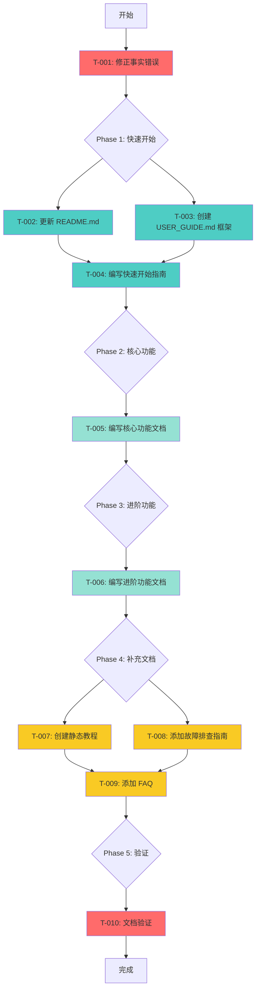

# 任务清单: ultrapower 用户使用指南

**PRD**: docs/prd/user_guide-rough.md
**评审摘要**: docs/reviews/user_guide/summary.md
**生成时间**: 2026-03-05T13:56:00Z
**预估总工时**: 23-30 小时（5-6 个工作日）

---

## 1. 架构图（全局上下文）

---

## 2. 任务列表（DAG）

### Phase 0: 事实修正（P0 - 阻塞所有后续任务）

#### T-001: 修正 4 个 P0 事实错误

* **描述**: 修正 Domain Expert 指出的事实性错误

* **交付物**:
  - `docs/REFERENCE.md`: Skills 数量 71→70
  - `docs/REFERENCE.md`: Domain Experts 数量 15→16（新增协调 2 个）
  - `README.md`: 修正安装步骤（插件命令）
  - `docs/REFERENCE.md`: 补充 MCP 集成和 Axiom 系统说明

* **验收标准**:
  - [ ] Skills 数量准确（70 个）
  - [ ] Domain Experts 分类准确（15 个领域专家 + 2 个协调）
  - [ ] 安装步骤可执行（经过测试）
  - [ ] MCP 和 Axiom 功能完整描述

* **预估工时**: 2-3 小时

* **依赖**: 无

* **阻塞**: T-002, T-003（所有后续任务）

* **优先级**: P0

---

### Phase 1: 快速开始（P0）

#### T-002: 更新 README.md 快速开始部分

* **描述**: 添加 10 分钟快速上手指南

* **交付物**:
  - `README.md`: 新增"快速开始"章节
  - 包含：前置检查、两种安装方式、验证、第一个示例

* **验收标准**:
  - [ ] 新用户可在 10 分钟内完成安装
  - [ ] 包含前置检查（Node.js >= 18, Claude Code >= v1.0.0）
  - [ ] 两种安装方式（插件 + npm）
  - [ ] 包含验证命令（/ultrapower:omc-doctor）
  - [ ] 链接到故障排查文档

* **预估工时**: 2 小时

* **依赖**: T-001

* **阻塞**: T-004

* **优先级**: P0

#### T-003: 创建 USER_GUIDE.md 文档框架

* **描述**: 创建完整用户手册的目录结构

* **交付物**:
  - `docs/USER_GUIDE.md`: 包含所有章节标题和占位符

* **章节**:
  1. 简介
  2. 安装与配置
  3. 核心概念（Agent vs Skill vs Hook vs Tool）
  4. 快速开始
  5. 核心功能（Team/autopilot/ralph/ultrawork）
  6. 进阶功能（50 agents + 70 skills + 35 hooks）
  7. 配置指南（MCP/Hooks/Steering/Axiom）
  8. 故障排查
  9. FAQ
  10. 版本更新指南

* **验收标准**:
  - [ ] 目录结构完整
  - [ ] 每个章节有简短说明
  - [ ] 链接到相关文档（REFERENCE.md、CLAUDE.md）

* **预估工时**: 1 小时

* **依赖**: T-001

* **阻塞**: T-005

* **优先级**: P0

#### T-004: 编写快速开始指南

* **描述**: 在 USER_GUIDE.md 中编写详细的快速开始章节

* **交付物**:
  - `docs/USER_GUIDE.md`: 第 4 章完整内容

* **内容**:
  - 前置条件检查清单
  - 详细安装步骤（两种方式）
  - 第一个示例（autopilot 模式）
  - 常见安装问题

* **验收标准**:
  - [ ] 包含前置检查清单
  - [ ] 安装步骤可执行
  - [ ] 示例代码可运行
  - [ ] 覆盖 3 个最常见安装问题

* **预估工时**: 2 小时

* **依赖**: T-002, T-003

* **阻塞**: T-007

* **优先级**: P0

---

### Phase 2: 核心功能文档（P1）

#### T-005: 编写核心功能文档

* **描述**: 在 USER_GUIDE.md 中编写核心功能章节

* **交付物**:
  - `docs/USER_GUIDE.md`: 第 5 章完整内容

* **内容**:
  - Agent 编排模式（Team/autopilot/ralph/ultrawork）
  - Team 流水线（team-plan → team-prd → team-exec → team-verify → team-fix）
  - 核心 agents 使用指南（executor/debugger/verifier）
  - Hook 系统配置
  - MCP 集成指南
  - Axiom 自我进化系统说明

* **验收标准**:
  - [ ] 覆盖 4 种执行模式
  - [ ] 每种模式包含代码示例
  - [ ] 包含决策树（何时用哪种模式）
  - [ ] Hook 配置示例可运行
  - [ ] MCP 和 Axiom 功能完整说明

* **预估工时**: 4 小时

* **依赖**: T-003

* **阻塞**: T-006

* **优先级**: P1

---

### Phase 3: 进阶功能文档（P1）

#### T-006: 编写进阶功能文档

* **描述**: 在 USER_GUIDE.md 中编写进阶功能章节

* **交付物**:
  - `docs/USER_GUIDE.md`: 第 6 章完整内容

* **内容**:
  - 完整 agent 参考（50 agents）
  - 完整 skill 参考（70 skills）
  - Hook 类型参考（15 types）
  - 自定义扩展指南

* **验收标准**:
  - [ ] 覆盖所有 50 agents（每个有使用示例）
  - [ ] 覆盖所有 70 skills（每个有触发条件）
  - [ ] 覆盖所有 15 hook types（每个有配置示例）
  - [ ] 包含自定义 agent 创建指南

* **预估工时**: 6 小时

* **依赖**: T-005

* **阻塞**: T-007

* **优先级**: P1

---

### Phase 4: 补充文档（P2）

#### T-007: 创建静态教程

* **描述**: 创建交互式教程文档

* **交付物**:
  - `docs/TUTORIAL.md`: 5 个场景脚本

* **场景**:
  1. 环境验证与配置
  2. 使用第一个 agent（executor）
  3. 创建自定义 skill
  4. 配置 hook 自动化
  5. 团队协作模式（team）

* **验收标准**:
  - [ ] 5 个场景全部可执行
  - [ ] 每个场景有代码示例和预期输出
  - [ ] 教程可独立运行（无需外部依赖）

* **预估工时**: 4 小时

* **依赖**: T-004, T-006

* **阻塞**: T-008

* **优先级**: P2

#### T-008: 添加故障排查指南

* **描述**: 在 USER_GUIDE.md 中编写故障排查章节

* **交付物**:
  - `docs/USER_GUIDE.md`: 第 8 章完整内容
  - `docs/TROUBLESHOOTING.md`: 独立故障排查文档

* **内容**:
  - 常见错误代码和解决方案
  - 日志查看指南
  - 调试工具使用说明
  - 概念澄清（Agent vs Skill）

* **验收标准**:
  - [ ] 覆盖 10 个最常见错误
  - [ ] 每个错误有症状、原因、解决方案
  - [ ] 包含日志查看命令
  - [ ] 包含概念关系图

* **预估工时**: 2 小时

* **依赖**: T-007

* **阻塞**: T-009

* **优先级**: P2

#### T-009: 添加 FAQ

* **描述**: 在 USER_GUIDE.md 中编写 FAQ 章节

* **交付物**:
  - `docs/USER_GUIDE.md`: 第 9 章完整内容
  - `docs/FAQ.md`: 独立 FAQ 文档

* **内容**:
  - 安装问题（5 个）
  - 使用问题（10 个）
  - 配置问题（5 个）
  - 性能问题（3 个）

* **验收标准**:
  - [ ] 覆盖 23 个常见问题
  - [ ] 每个问题有简洁答案
  - [ ] 链接到详细文档

* **预估工时**: 2 小时

* **依赖**: T-008

* **阻塞**: T-010

* **优先级**: P2

---

### Phase 5: 验证与发布（P0）

#### T-010: 文档验证

* **描述**: 验证所有文档的准确性和完整性

* **交付物**:
  - 验证报告
  - 修复清单

* **验证项**:
  - [ ] 所有代码示例可运行
  - [ ] 所有链接有效
  - [ ] 文档覆盖率 ≥ 90%
  - [ ] 3 个独立测试者验证快速开始指南
  - [ ] 无拼写错误
  - [ ] 无事实错误

* **预估工时**: 3 小时

* **依赖**: T-009

* **阻塞**: 无（最终任务）

* **优先级**: P0

---

## 3. 并行任务组

**组 1**（Phase 0 完成后并行）:

* T-002: 更新 README.md

* T-003: 创建 USER_GUIDE.md 框架

**组 2**（T-003 完成后并行）:

* T-004: 编写快速开始指南

* T-005: 编写核心功能文档

**组 3**（T-008 完成后并行）:

* T-009: 添加 FAQ

* （可选）添加视频教程

---

## 4. 风险与缓解

| 风险 | 影响 | 缓解措施 |
| ------ | ------ | --------- |
| 事实错误未完全修正 | 高 | T-001 完成后由 Domain Expert 复审 |
| 安装步骤在不同环境失败 | 高 | 3 个独立测试者验证（macOS/Linux/Windows） |
| 文档与代码不同步 | 中 | 添加 CI 验证脚本（检查 agent/skill 数量） |
| 示例代码过时 | 中 | 添加 E2E 测试覆盖示例 |
| 教程过于复杂 | 低 | 用户测试，收集反馈 |

---

## 5. 成功指标

* [ ] 新用户在 10 分钟内完成安装并运行第一个示例

* [ ] 文档覆盖率 ≥ 90%（50 agents + 70 skills + 15 hook types）

* [ ] GitHub Issues 中"文档相关"问题减少 50%（从 20/月 → 10/月）

* [ ] 30 天留存率 ≥ 40%

---

## 6. 时间线

* **Phase 0**: 2-3 小时（T-001）

* **Phase 1**: 5 小时（T-002, T-003, T-004 部分并行）

* **Phase 2**: 4 小时（T-005）

* **Phase 3**: 6 小时（T-006）

* **Phase 4**: 8 小时（T-007, T-008, T-009 顺序）

* **Phase 5**: 3 小时（T-010）

**总计**: 28 小时（约 5-6 个工作日）

---

## 7. 下一步行动

**Manifest 已生成**。下一步：

1. **用户确认**: 确认任务拆解是否合理
2. **开始实施**: 调用 `/ax-implement` 进入实施阶段
3. **任务分配**: 按优先级分配任务给团队成员

**状态**: 等待用户确认
**生成时间**: 2026-03-05T13:56:00Z

