# ultrapower 完整功能流程文档

> **版本**: v7.0.3
> **生成日期**: 2026-03-12
> **基于**: 代码库扫描 + 规范文档分析

---

## 目录

1. [系统架构概览](#1-系统架构概览)
2. [核心处理流程](#2-核心处理流程)
3. [执行模式流程](#3-执行模式流程)
4. [Team 协调流程](#4-team-协调流程)
5. [Axiom 工作流](#5-axiom-工作流)
6. [安全与验证流程](#6-安全与验证流程)
7. [状态管理流程](#7-状态管理流程)
8. [关键决策点](#8-关键决策点)

---

## 1. 系统架构概览

### 1.1 架构层次

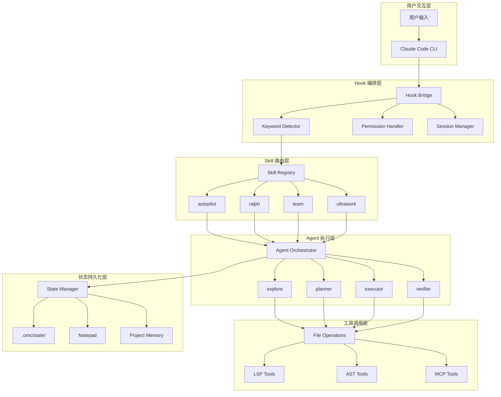
```mermaid
graph TB
    subgraph "用户交互层"
        A[用户输入] --> B[Claude Code CLI]
    end

    subgraph "Hook 编排层"
        B --> C[Hook Bridge]
        C --> D[Keyword Detector]
        C --> E[Permission Handler]
        C --> F[Session Manager]
    end

    subgraph "Skill 路由层"
        D --> G[Skill Registry]
        G --> H[autopilot]
        G --> I[ralph]
        G --> J[team]
        G --> K[ultrawork]
    end

    subgraph "Agent 执行层"
        H --> L[Agent Orchestrator]
        I --> L
        J --> L
        K --> L
        L --> M[explore]
        L --> N[planner]
        L --> O[executor]
        L --> P[verifier]
    end

    subgraph "工具调用层"
        M --> Q[File Operations]
        N --> Q
        O --> Q
        P --> Q
        Q --> R[LSP Tools]
        Q --> S[AST Tools]
        Q --> T[MCP Tools]
    end

    subgraph "状态持久化层"
        L --> U[State Manager]
        U --> V[.omc/state/]
        U --> W[Notepad]
        U --> X[Project Memory]
    end
```

### 1.2 核心组件职责

| 层次 | 组件 | 职责 | 关键文件 |
|------|------|------|----------|
| Hook 编排层 | Hook Bridge | 路由 15 类 Hook 事件到对应处理器 | `src/hooks/bridge.ts` |
| Hook 编排层 | Keyword Detector | 检测用户输入中的魔法关键词 | `src/hooks/keyword-detector/` |
| Hook 编排层 | Permission Handler | 处理工具权限请求（安全边界） | `src/hooks/permission-handler/` |
| Skill 路由层 | Skill Registry | 管理 40+ skills 的注册和触发 | `src/skills/` |
| Agent 执行层 | Agent Orchestrator | 协调多 agent 并行/串行执行 | `src/agents/` |
| 工具调用层 | LSP Tools | 提供代码智能（hover/定义/引用） | `src/tools/lsp/` |
| 工具调用层 | MCP Tools | 委派给外部 AI（Codex/Gemini） | `src/mcp/` |
| 状态持久化层 | State Manager | 管理 8 种模式状态文件 | `src/lib/state.ts` |

### 1.3 数据流概览

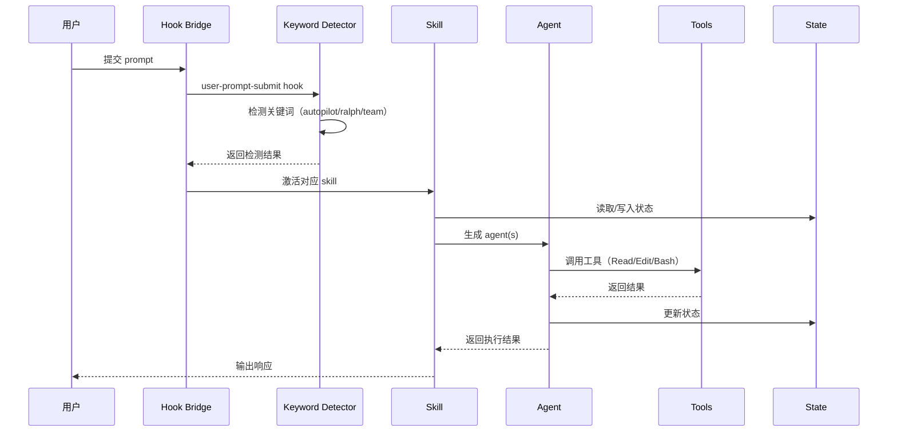
```mermaid
sequenceDiagram
    participant U as 用户
    participant H as Hook Bridge
    participant K as Keyword Detector
    participant S as Skill
    participant A as Agent
    participant T as Tools
    participant ST as State

    U->>H: 提交 prompt
    H->>K: user-prompt-submit hook
    K->>K: 检测关键词（autopilot/ralph/team）
    K-->>H: 返回检测结果
    H->>S: 激活对应 skill
    S->>ST: 读取/写入状态
    S->>A: 生成 agent(s)
    A->>T: 调用工具（Read/Edit/Bash）
    T-->>A: 返回结果
    A->>ST: 更新状态
    A-->>S: 返回执行结果
    S-->>U: 输出响应
```

---

## 2. 核心处理流程

### 2.1 用户请求处理流程

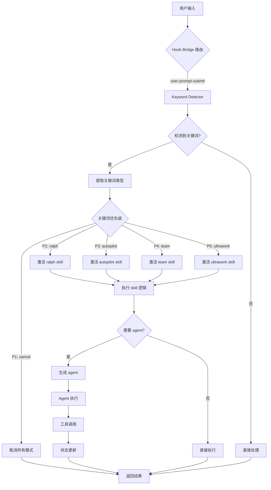
```mermaid
flowchart TD
    A[用户输入] --> B{Hook Bridge 路由}
    B -->|user-prompt-submit| C[Keyword Detector]
    C --> D{检测到关键词?}
    D -->|是| E[提取关键词类型]
    D -->|否| F[直接处理]

    E --> G{关键词优先级}
    G -->|P1: cancel| H[取消所有模式]
    G -->|P2: ralph| I[激活 ralph skill]
    G -->|P3: autopilot| J[激活 autopilot skill]
    G -->|P4: team| K[激活 team skill]
    G -->|P5: ultrawork| L[激活 ultrawork skill]

    I --> M[执行 skill 逻辑]
    J --> M
    K --> M
    L --> M

    M --> N{需要 agent?}
    N -->|是| O[生成 agent]
    N -->|否| P[直接执行]

    O --> Q[Agent 执行]
    Q --> R[工具调用]
    R --> S[状态更新]
    S --> T[返回结果]

    P --> T
    F --> T
    H --> T
```

**关键文件**:
- `src/hooks/bridge.ts` - Hook 路由入口
- `src/hooks/keyword-detector/index.ts` - 关键词检测逻辑
- `src/skills/index.ts` - Skill 注册表

### 2.2 Hook 执行顺序

ultrapower 定义了 **15 类 HookType**，按阶段分类：

| 阶段 | HookType | 触发时机 | 优先级 |
|------|----------|----------|--------|
| UserPromptSubmit | `keyword-detector` | 用户提交 prompt | - |
| Stop | `ralph` | Stop 事件 + ralph 激活 | P1（最高） |
| Stop | `persistent-mode` | Stop 事件 + autopilot/ultrawork 激活 | P1.5 |
| Stop | `stop-continuation` | Stop 事件兜底 | P2（最低） |
| Session | `session-start` | 会话启动 | - |
| Session | `session-end` | 会话结束 | - |
| Tool | `pre-tool-use` | 工具调用前 | - |
| Tool | `post-tool-use` | 工具调用后 | - |
| Agent | `subagent-start` | Agent 启动 | - |
| Agent | `subagent-stop` | Agent 停止 | - |
| Maintenance | `pre-compact` | 上下文压缩前 | - |
| Maintenance | `setup-init` | 系统初始化 | - |
| Maintenance | `setup-maintenance` | 系统维护 | - |
| Maintenance | `permission-request` | 权限请求（安全边界） | - |

**Stop 阶段优先级链**:
```
Ralph (P1) → Autopilot (P1.5) → Ultrawork (P2) → Stop-Continuation (P3)
```

高优先级 hook 处理后，低优先级 hook 自动跳过（互斥规则）。

---

## 3. 执行模式流程

### 3.1 模式分类

ultrapower 支持 **8 种执行模式**：

| 模式 | 关键词 | 特点 | 状态文件 |
|------|--------|------|----------|
| `autopilot` | "autopilot", "build me" | 全自主执行，从想法到代码 | `.omc/state/autopilot-state.json` |
| `ralph` | "ralph", "don't stop" | 自引用循环 + verifier 验证 | `.omc/state/ralph-state.json` |
| `team` | "team", "coordinated team" | 多 agent 协调（分阶段流水线） | `.omc/state/team-state.json` |
| `ultrawork` | "ultrawork", "ulw" | 最大并行度 agent 编排 | `.omc/state/ultrawork-state.json` |
| `pipeline` | "pipeline", "chain agents" | 顺序 agent 链式执行 | `.omc/state/pipeline-state.json` |
| `ultrapilot` | "ultrapilot", "parallel build" | Team 兼容外观（已废弃） | `.omc/state/ultrapilot-state.json` |
| `swarm` | "swarm" | Team 兼容外观（已废弃） | `.omc/state/swarm-state.json` |
| `ultraqa` | 由 autopilot 激活 | QA 循环（测试-验证-修复） | `.omc/state/ultraqa-state.json` |

**互斥模式**: `autopilot`, `ultrapilot`, `swarm`, `pipeline` 不能同时激活。

**可组合模式**: `ralph` + `team` 可组合为 `team ralph`（持久团队执行）。

### 3.2 Autopilot 模式流程

```mermaid
flowchart TD
    A[检测到 autopilot 关键词] --> B[写入 autopilot-state.json]
    B --> C{读取现有状态}
    C -->|首次启动| D[初始化状态]
    C -->|恢复执行| E[读取 iteration/phase]

    D --> F[Phase: PLANNING]
    E --> F

    F --> G[生成 explore agent]
    G --> H[生成 planner agent]
    H --> I[Phase: EXECUTION]

    I --> J[生成 executor agent(s)]
    J --> K{执行成功?}
    K -->|是| L[Phase: VERIFICATION]
    K -->|否| M[Phase: ERROR_HANDLING]

    L --> N[生成 verifier agent]
    N --> O{验证通过?}
    O -->|是| P[Phase: COMPLETE]
    O -->|否| Q{iteration < max?}

    Q -->|是| R[iteration++]
    R --> I
    Q -->|否| S[Phase: FAILED]

    M --> T[生成 debugger agent]
    T --> U{修复成功?}
    U -->|是| I
    U -->|否| S

    P --> V[清理状态文件]
    S --> V
```

**关键决策点**:
1. **最大迭代次数**: 默认 10 次（可配置）
2. **转换到 ultraqa**: 验证失败 3 次后自动激活 QA 循环
3. **转换到 ralph**: 用户可手动升级为持久循环

**状态字段**:
```typescript
{
  active: boolean,
  iteration: number,
  max_iterations: number,
  current_phase: "PLANNING" | "EXECUTION" | "VERIFICATION" | "ERROR_HANDLING" | "COMPLETE" | "FAILED",
  started_at: string,
  task_description: string
}
```

### 3.3 Ralph 模式流程

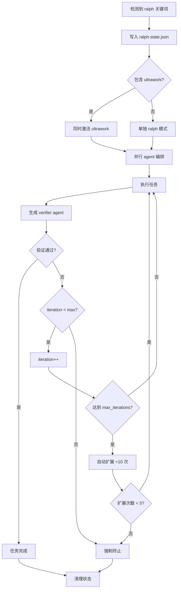
```mermaid
flowchart TD
    A[检测到 ralph 关键词] --> B[写入 ralph-state.json]
    B --> C{包含 ultrawork?}
    C -->|是| D[同时激活 ultrawork]
    C -->|否| E[单独 ralph 模式]

    D --> F[并行 agent 编排]
    E --> F

    F --> G[执行任务]
    G --> H[生成 verifier agent]
    H --> I{验证通过?}

    I -->|是| J[任务完成]
    I -->|否| K{iteration < max?}

    K -->|是| L[iteration++]
    L --> M{达到 max_iterations?}
    M -->|是| N[自动扩展 +10 次]
    M -->|否| G

    N --> O{扩展次数 < 5?}
    O -->|是| G
    O -->|否| P[强制终止]

    K -->|否| P
    J --> Q[清理状态]
    P --> Q
```

**Ralph 特性**:
1. **自引用循环**: 持续执行直到验证通过
2. **自动扩展**: 达到 max_iterations 后自动 +10 次（最多扩展 5 次）
3. **Verifier 强制**: 每次迭代必须经过 verifier 验证
4. **Stop Hook 最高优先级**: P1 级别，优先于其他模式

**状态字段**:
```typescript
{
  active: boolean,
  iteration: number,
  max_iterations: number,
  extension_count: number,  // 扩展次数
  linked_ultrawork: string | null,  // 关联的 ultrawork 状态
  verifier_results: Array<{iteration: number, passed: boolean}>
}
```

---

## 4. Team 协调流程

### 4.1 Team Pipeline 阶段

Team 模式使用**分阶段流水线**，共 5 个阶段 + 3 个终态：

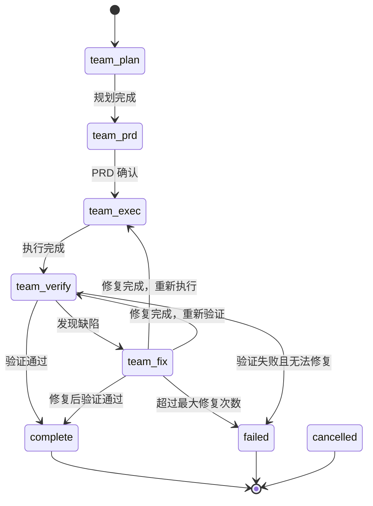
```mermaid
stateDiagram-v2
    [*] --> team_plan
    team_plan --> team_prd: 规划完成
    team_prd --> team_exec: PRD 确认
    team_exec --> team_verify: 执行完成
    team_verify --> complete: 验证通过
    team_verify --> team_fix: 发现缺陷
    team_fix --> team_exec: 修复完成，重新执行
    team_fix --> team_verify: 修复完成，重新验证
    team_fix --> complete: 修复后验证通过
    team_fix --> failed: 超过最大修复次数
    team_verify --> failed: 验证失败且无法修复
    complete --> [*]
    failed --> [*]
    cancelled --> [*]
```

**阶段详情**:

| 阶段 | 职责 | 使用的 Agents | 转换条件 |
|------|------|---------------|----------|
| `team-plan` | 规划与任务分解 | `explore` (haiku) + `planner` (opus) | 任务列表生成完成 |
| `team-prd` | 验收标准确认 | `analyst` (opus) | 用户确认 PRD |
| `team-exec` | 任务执行 | `executor` (sonnet) + 专家 agents | 所有任务达到终态 |
| `team-verify` | 验证与质量检查 | `verifier` (sonnet) + 审查 agents | 验证结果确定 |
| `team-fix` | 缺陷修复（循环） | `executor`/`build-fixer`/`debugger` | 修复完成或超限 |

### 4.2 Team 任务协调流程

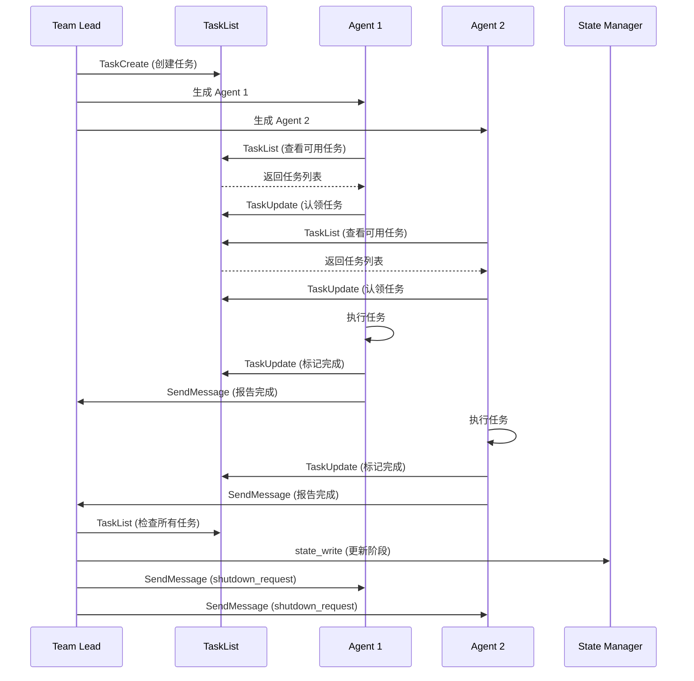
```mermaid
sequenceDiagram
    participant L as Team Lead
    participant T as TaskList
    participant A1 as Agent 1
    participant A2 as Agent 2
    participant S as State Manager

    L->>T: TaskCreate (创建任务)
    L->>A1: 生成 Agent 1
    L->>A2: 生成 Agent 2

    A1->>T: TaskList (查看可用任务)
    T-->>A1: 返回任务列表
    A1->>T: TaskUpdate (认领任务 #1)

    A2->>T: TaskList (查看可用任务)
    T-->>A2: 返回任务列表
    A2->>T: TaskUpdate (认领任务 #2)

    A1->>A1: 执行任务 #1
    A1->>T: TaskUpdate (标记完成)
    A1->>L: SendMessage (报告完成)

    A2->>A2: 执行任务 #2
    A2->>T: TaskUpdate (标记完成)
    A2->>L: SendMessage (报告完成)

    L->>T: TaskList (检查所有任务)
    L->>S: state_write (更新阶段)
    L->>A1: SendMessage (shutdown_request)
    L->>A2: SendMessage (shutdown_request)
```

**关键机制**:
1. **任务认领**: Agent 通过 `TaskUpdate(owner="agent-name")` 认领任务
2. **任务优先级**: 优先处理低 ID 任务（早期任务通常是后续任务的基础）
3. **消息路由**: 使用 `SendMessage` 进行 agent 间通信
4. **状态同步**: 所有 agents 共享 `~/.claude/tasks/{team-name}/` 目录

### 4.3 Team + Ralph 组合模式

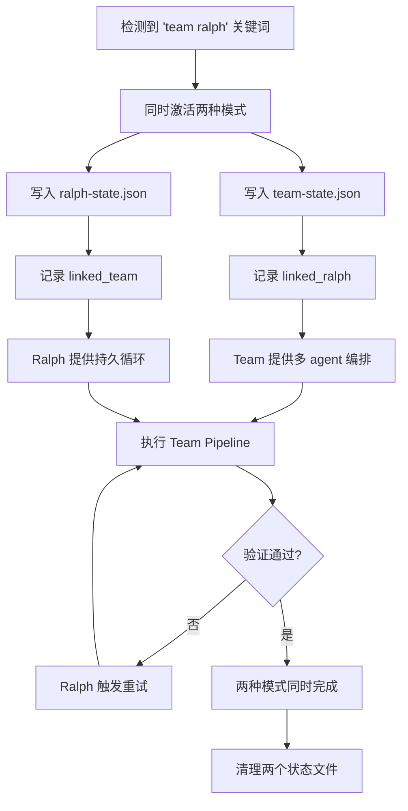
```mermaid
flowchart TD
    A[检测到 'team ralph' 关键词] --> B[同时激活两种模式]
    B --> C[写入 team-state.json]
    B --> D[写入 ralph-state.json]

    C --> E[记录 linked_ralph]
    D --> F[记录 linked_team]

    E --> G[Team 提供多 agent 编排]
    F --> H[Ralph 提供持久循环]

    G --> I[执行 Team Pipeline]
    H --> I

    I --> J{验证通过?}
    J -->|否| K[Ralph 触发重试]
    K --> I
    J -->|是| L[两种模式同时完成]

    L --> M[清理两个状态文件]
```

**组合优势**:
- Team 提供结构化的阶段管理和多 agent 协调
- Ralph 提供持久性和自动重试机制
- 取消任一模式会同时取消两者（通过 `linked_*` 字段）

---

## 5. Axiom 工作流

### 5.1 Axiom 启动协议

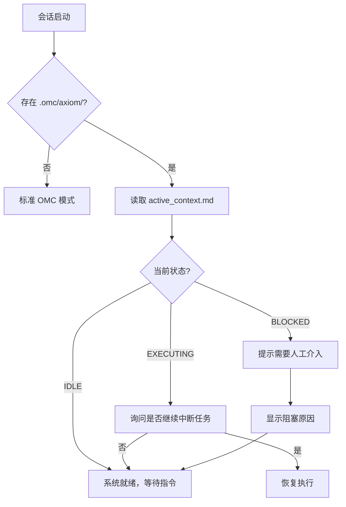
```mermaid
flowchart TD
    A[会话启动] --> B{存在 .omc/axiom/?}
    B -->|否| C[标准 OMC 模式]
    B -->|是| D[读取 active_context.md]

    D --> E{当前状态?}
    E -->|IDLE| F[系统就绪，等待指令]
    E -->|EXECUTING| G[询问是否继续中断任务]
    E -->|BLOCKED| H[提示需要人工介入]

    G -->|是| I[恢复执行]
    G -->|否| F

    H --> J[显示阻塞原因]
    J --> F
```

**Axiom 状态文件**:
- `.omc/axiom/active_context.md` - 当前状态和上下文
- `.omc/axiom/project_decisions.md` - 架构约束和决策
- `.omc/axiom/user_preferences.md` - 用户偏好
- `.omc/axiom/evolution/learning_queue.md` - 学习队列
- `.omc/axiom/evolution/usage_metrics.json` - 使用指标

### 5.2 Axiom 完整工作流

```mermaid
flowchart TD
    A[用户提出需求] --> B[/ax-draft]
    B --> C[生成初稿 PRD]
    C --> D[/ax-review]

    D --> E{Expert Gate 通过?}
    E -->|否| F[修订 PRD]
    F --> D
    E -->|是| G[生成终稿 PRD]

    G --> H{User Gate: 用户确认?}
    H -->|否| I[返回修改]
    I --> B
    H -->|是| J[/ax-decompose]

    J --> K[拆解为子任务]
    K --> L[生成 manifest.md]
    L --> M[/ax-implement]

    M --> N[执行开发流水线]
    N --> O{Scope Gate: 在范围内?}
    O -->|否| P[警告并请求确认]
    P -->|确认| Q[继续修改]
    P -->|拒绝| R[回滚]
    O -->|是| Q

    Q --> S{CI Gate: 编译通过?}
    S -->|否| T[/ax-analyze-error]
    T --> U[修复错误]
    U --> S
    S -->|是| V[任务完成]

    V --> W[/ax-reflect]
    W --> X[更新学习队列]
    X --> Y[归档到知识库]

### 5.3 Axiom 门禁规则

| 门禁 | 触发条件 | 检查内容 | 通过条件 |
|------|----------|----------|----------|
| **Expert Gate** | 所有新功能需求 | PRD 质量、技术可行性 | 专家评审通过 |
| **User Gate** | PRD 终稿生成 | 用户确认需求 | 用户明确确认 |
| **Scope Gate** | 修改文件时 | 是否在 manifest.md 定义范围内 | 在范围内或用户确认越界 |
| **CI Gate** | 代码修改完成 | `tsc --noEmit && npm run build && npm test` | 无错误 |

### 5.4 Axiom 进化引擎

```mermaid
flowchart LR
    A[触发事件] --> B{事件类型}
    B -->|任务完成| C[代码变更加入学习队列]
    B -->|错误修复成功| D[修复模式加入队列 P1]
    B -->|工作流完成| E[更新 workflow_metrics.md]
    B -->|状态→ARCHIVING| F[自动触发 /ax-reflect]
    B -->|状态→IDLE| G[处理学习队列 P0/P1]

    C --> H[learning_queue.md]
    D --> H
    E --> I[usage_metrics.json]
    F --> J[reflection_log.md]
    G --> K[知识库更新]
```

---

## 6. 安全与验证流程

### 6.1 输入消毒流程

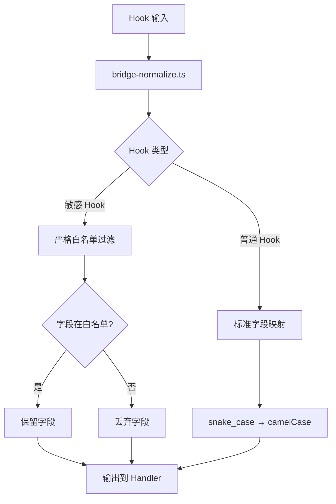
```mermaid
flowchart TD
    A[Hook 输入] --> B[bridge-normalize.ts]
    B --> C{Hook 类型}

    C -->|敏感 Hook| D[严格白名单过滤]
    C -->|普通 Hook| E[标准字段映射]

    D --> F{字段在白名单?}
    F -->|是| G[保留字段]
    F -->|否| H[丢弃字段]

    E --> I[snake_case → camelCase]

    G --> J[输出到 Handler]
    H --> J
    I --> J
```

**敏感 Hook 白名单**:
- `permission-request`: `["sessionId", "directory", "toolName", "toolUseId", "permissionMode"]`
- `setup-init`: `["sessionId", "directory", "trigger"]`
- `setup-maintenance`: `["sessionId", "directory", "trigger"]`
- `session-end`: `["sessionId", "directory"]`

**关键文件**: `src/hooks/bridge-normalize.ts`

### 6.2 路径遍历防护

```mermaid
flowchart TD
    A[接收 mode 参数] --> B[assertValidMode]
    B --> C{mode 在白名单?}

    C -->|是| D[返回 validMode]
    C -->|否| E[抛出异常]

    D --> F[拼接路径]
    F --> G[.omc/state/{validMode}-state.json]

    E --> H[阻止执行]
```

**白名单模式**:
```typescript
const VALID_MODES = [
  'autopilot', 'ultrapilot', 'team', 'pipeline',
  'ralph', 'ultrawork', 'ultraqa', 'ralplan'
];
```

**关键文件**: `src/lib/validateMode.ts`

### 6.3 验证系统流程

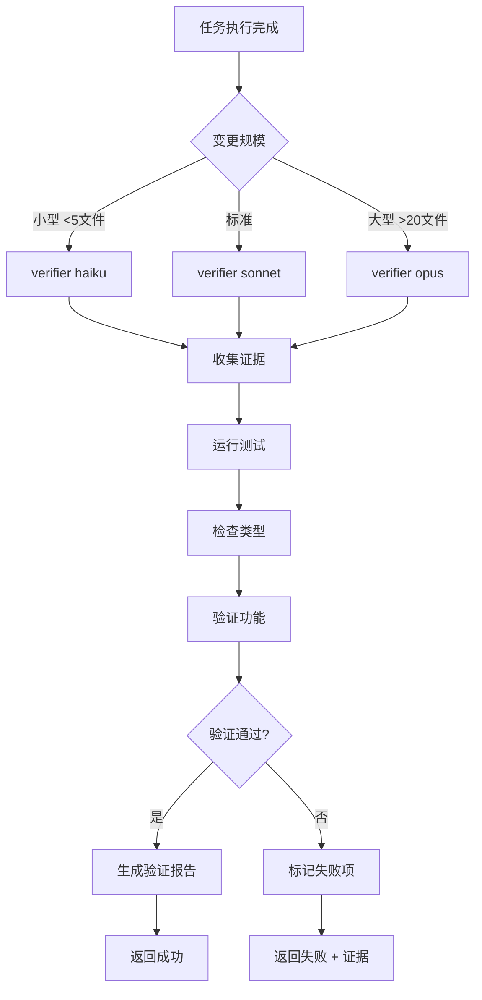
```mermaid
flowchart TD
    A[任务执行完成] --> B{变更规模}
    B -->|小型 <5文件| C[verifier haiku]
    B -->|标准| D[verifier sonnet]
    B -->|大型 >20文件| E[verifier opus]

    C --> F[收集证据]
    D --> F
    E --> F

    F --> G[运行测试]
    G --> H[检查类型]
    H --> I[验证功能]

    I --> J{验证通过?}
    J -->|是| K[生成验证报告]
    J -->|否| L[标记失败项]

    K --> M[返回成功]
    L --> N[返回失败 + 证据]
```

**验证清单**:
1. 所有测试通过
2. 类型检查无错误
3. 功能符合需求
4. 无明显性能问题
5. 代码风格一致
6. 文档已更新
7. 无安全漏洞

---

## 7. 状态管理流程

### 7.1 状态文件结构

```
.omc/
├── state/
│   ├── autopilot-state.json
│   ├── ralph-state.json
│   ├── team-state.json
│   ├── ultrawork-state.json
│   ├── pipeline-state.json
│   ├── ultrapilot-state.json
│   ├── swarm-state.json
│   ├── ultraqa-state.json
│   ├── subagent-tracking.json
│   ├── last-tool-error.json
│   └── sessions/
│       └── {sessionId}/
│           └── {mode}-state.json
├── notepad.md
├── project-memory.json
├── plans/
├── research/
└── logs/
```

### 7.2 状态读写流程

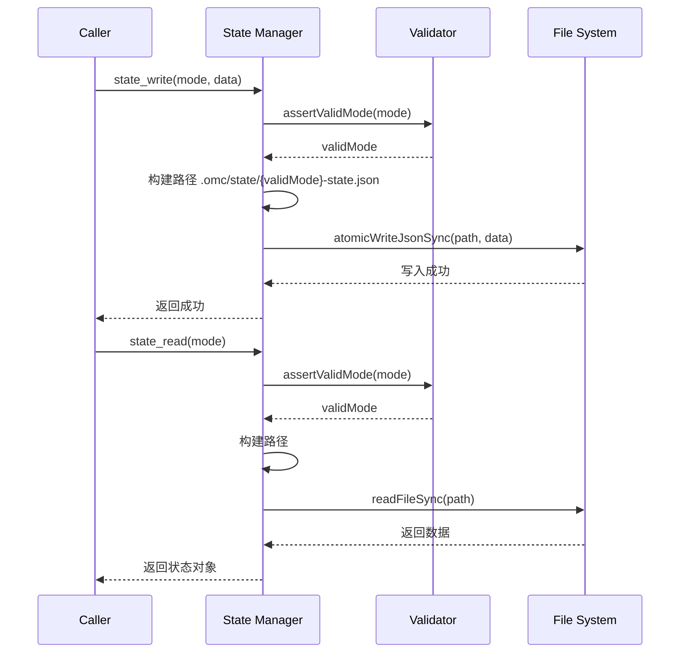
```mermaid
sequenceDiagram
    participant C as Caller
    participant S as State Manager
    participant V as Validator
    participant F as File System

    C->>S: state_write(mode, data)
    S->>V: assertValidMode(mode)
    V-->>S: validMode
    S->>S: 构建路径 .omc/state/{validMode}-state.json
    S->>F: atomicWriteJsonSync(path, data)
    F-->>S: 写入成功
    S-->>C: 返回成功

    C->>S: state_read(mode)
    S->>V: assertValidMode(mode)
    V-->>S: validMode
    S->>S: 构建路径
    S->>F: readFileSync(path)
    F-->>S: 返回数据
    S-->>C: 返回状态对象
```

**并发保护**:
- 使用 `atomicWriteJsonSync` 确保写入原子性
- `subagent-tracking.json` 有四层保护（最高级别）
- 其他状态文件使用中等级别保护

### 7.3 状态恢复流程

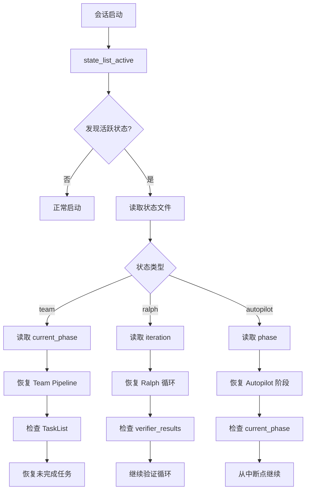
```mermaid
flowchart TD
    A[会话启动] --> B[state_list_active]
    B --> C{发现活跃状态?}

    C -->|否| D[正常启动]
    C -->|是| E[读取状态文件]

    E --> F{状态类型}
    F -->|team| G[读取 current_phase]
    F -->|ralph| H[读取 iteration]
    F -->|autopilot| I[读取 phase]

    G --> J[恢复 Team Pipeline]
    H --> K[恢复 Ralph 循环]
    I --> L[恢复 Autopilot 阶段]

    J --> M[检查 TaskList]
    M --> N[恢复未完成任务]

    K --> O[检查 verifier_results]
    O --> P[继续验证循环]

    L --> Q[检查 current_phase]
    Q --> R[从中断点继续]
```

### 7.4 Agent 状态机

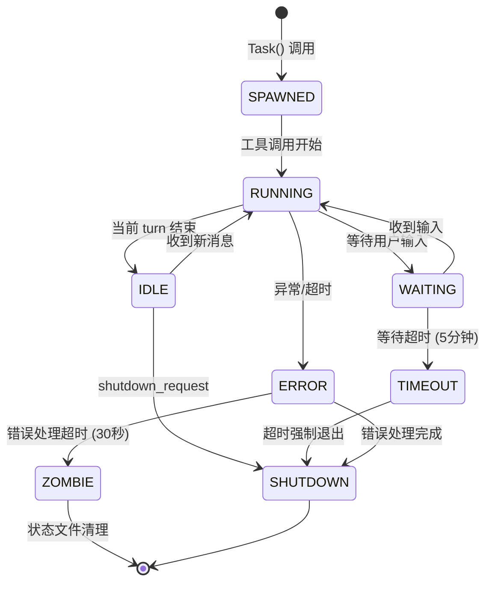
```mermaid
stateDiagram-v2
    [*] --> SPAWNED: Task() 调用
    SPAWNED --> RUNNING: 工具调用开始
    RUNNING --> WAITING: 等待用户输入
    RUNNING --> IDLE: 当前 turn 结束
    RUNNING --> ERROR: 异常/超时
    WAITING --> RUNNING: 收到输入
    WAITING --> TIMEOUT: 等待超时 (5分钟)
    IDLE --> RUNNING: 收到新消息
    IDLE --> SHUTDOWN: shutdown_request
    TIMEOUT --> SHUTDOWN: 超时强制退出
    ERROR --> SHUTDOWN: 错误处理完成
    ERROR --> ZOMBIE: 错误处理超时 (30秒)
    ZOMBIE --> [*]: 状态文件清理
    SHUTDOWN --> [*]
```

**关键阈值**:
- **Agent Stale**: 5 分钟（WAITING 状态超时）
- **Zombie Timeout**: 30 秒（ERROR 状态超时）
- **Mode Stale Marker**: 1 小时（状态文件过期）

---

## 8. 关键决策点

### 8.1 Skill 激活决策树

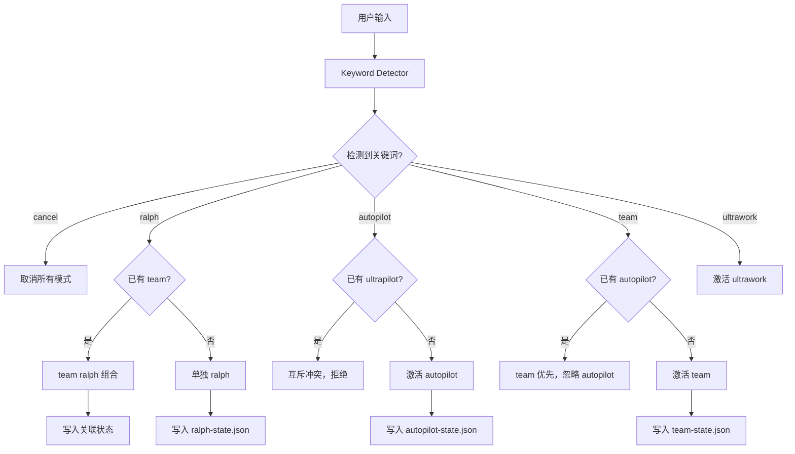
```mermaid
flowchart TD
    A[用户输入] --> B[Keyword Detector]
    B --> C{检测到关键词?}

    C -->|cancel| D[取消所有模式]
    C -->|ralph| E{已有 team?}
    C -->|autopilot| F{已有 ultrapilot?}
    C -->|team| G{已有 autopilot?}
    C -->|ultrawork| H[激活 ultrawork]

    E -->|是| I[team ralph 组合]
    E -->|否| J[单独 ralph]

    F -->|是| K[互斥冲突，拒绝]
    F -->|否| L[激活 autopilot]

    G -->|是| M[team 优先，忽略 autopilot]
    G -->|否| N[激活 team]

    I --> O[写入关联状态]
    J --> P[写入 ralph-state.json]
    L --> Q[写入 autopilot-state.json]
    N --> R[写入 team-state.json]
```

### 8.2 Agent 选择决策

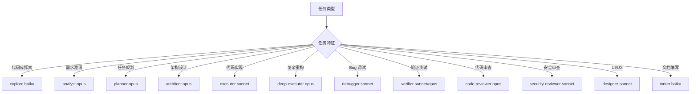
```mermaid
flowchart TD
    A[任务类型] --> B{任务特征}

    B -->|代码库探索| C[explore haiku]
    B -->|需求澄清| D[analyst opus]
    B -->|任务规划| E[planner opus]
    B -->|架构设计| F[architect opus]
    B -->|代码实现| G[executor sonnet]
    B -->|复杂重构| H[deep-executor opus]
    B -->|Bug 调试| I[debugger sonnet]
    B -->|验证测试| J[verifier sonnet/opus]
    B -->|代码审查| K[code-reviewer opus]
    B -->|安全审查| L[security-reviewer sonnet]
    B -->|UI/UX| M[designer sonnet]
    B -->|文档编写| N[writer haiku]
```

### 8.3 MCP 委派决策

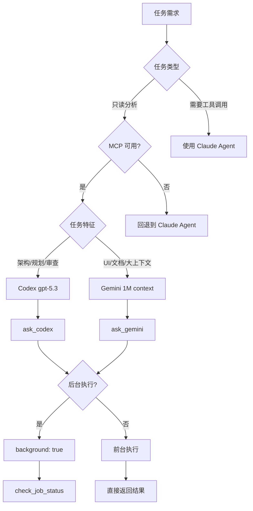
```mermaid
flowchart TD
    A[任务需求] --> B{任务类型}

    B -->|只读分析| C{MCP 可用?}
    B -->|需要工具调用| D[使用 Claude Agent]

    C -->|是| E{任务特征}
    C -->|否| F[回退到 Claude Agent]

    E -->|架构/规划/审查| G[Codex gpt-5.3]
    E -->|UI/文档/大上下文| H[Gemini 1M context]

    G --> I[ask_codex]
    H --> J[ask_gemini]

    I --> K{后台执行?}
    J --> K

    K -->|是| L[background: true]
    K -->|否| M[前台执行]

    L --> N[check_job_status]
    M --> O[直接返回结果]
```

### 8.4 验证策略决策

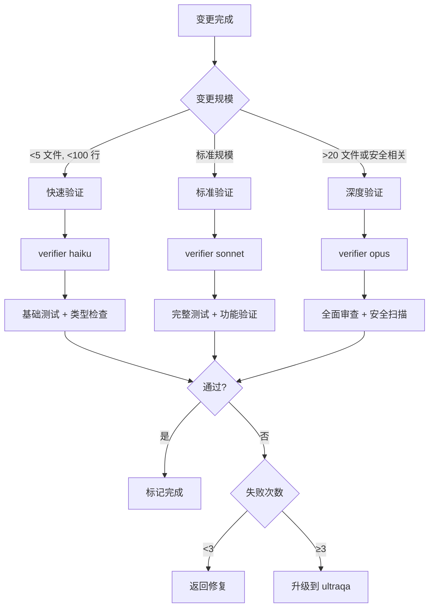
```mermaid
flowchart TD
    A[变更完成] --> B{变更规模}

    B -->|<5 文件, <100 行| C[快速验证]
    B -->|标准规模| D[标准验证]
    B -->|>20 文件或安全相关| E[深度验证]

    C --> F[verifier haiku]
    F --> G[基础测试 + 类型检查]

    D --> H[verifier sonnet]
    H --> I[完整测试 + 功能验证]

    E --> J[verifier opus]
    J --> K[全面审查 + 安全扫描]

    G --> L{通过?}
    I --> L
    K --> L

    L -->|是| M[标记完成]
    L -->|否| N{失败次数}

    N -->|<3| O[返回修复]
    N -->|≥3| P[升级到 ultraqa]
```

### 8.5 错误处理决策

```mermaid
flowchart TD
    A[错误发生] --> B{错误类型}

    B -->|工具调用失败| C[记录到 last-tool-error.json]
    B -->|Agent 超时| D[标记 TIMEOUT 状态]
    B -->|验证失败| E[触发修复流程]
    B -->|权限拒绝| F[阻止执行]

    C --> G{重试次数}
    G -->|<3| H[自动重试]
    G -->|≥3| I[人工介入]

    D --> J[强制 SHUTDOWN]
    J --> K[清理状态文件]

    E --> L{在 team-fix 阶段?}
    L -->|是| M[fix_loop_count++]
    L -->|否| N[转到 ERROR_HANDLING]

    M --> O{超过最大次数?}
    O -->|是| P[标记 failed]
    O -->|否| Q[继续修复]

    F --> R[返回错误消息]
```

---

## 9. 总结

### 9.1 核心流程总览

ultrapower 的完整功能流程可以概括为：

1. **输入处理**: Hook Bridge 接收用户输入 → Keyword Detector 检测关键词
2. **Skill 激活**: 根据关键词优先级激活对应 skill
3. **模式执行**: Skill 初始化状态 → 生成 agents → 执行任务
4. **状态管理**: 持久化状态到 `.omc/state/` → 支持恢复和取消
5. **验证循环**: Verifier 验证结果 → 失败则重试或升级
6. **安全边界**: 输入消毒 + 路径验证 + 权限检查

### 9.2 关键文件索引

| 功能模块 | 关键文件 |
|----------|----------|
| Hook 路由 | `src/hooks/bridge.ts`, `src/hooks/handlers/route-map.ts` |
| 关键词检测 | `src/hooks/keyword-detector/index.ts` |
| Skill 注册 | `src/skills/index.ts` |
| Agent 定义 | `src/agents/*.ts` |
| 状态管理 | `src/lib/state.ts`, `src/hooks/mode-registry/` |
| Team 协调 | `src/lib/team/` |
| 安全防护 | `src/hooks/bridge-normalize.ts`, `src/lib/validateMode.ts` |
| 规范文档 | `docs/standards/*.md` |

---

**文档结束**
```
