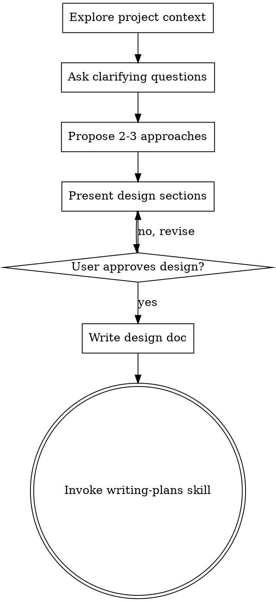

# 将想法转化为设计

## 概述

通过自然的协作对话，帮助将想法转化为完整的设计和规格说明。

首先了解当前项目上下文，然后逐一提问以细化想法。一旦理解了要构建的内容，呈现设计并获得用户批准。

<HARD-GATE>
在呈现设计并获得用户批准之前，不得调用任何实现 skill、编写任何代码、搭建任何项目或采取任何实现行动。这适用于每个项目，无论其表面上多么简单。
</HARD-GATE>

## 反模式："这太简单了，不需要设计"

每个项目都要经历这个过程。待办事项列表、单函数工具、配置变更 —— 全部如此。"简单"项目恰恰是未经审视的假设造成最多浪费工作的地方。设计可以很短（对于真正简单的项目只需几句话），但必须呈现并获得批准。

## 强制前置：代码库探索

<HARD-GATE>
在开始任何设计对话之前，必须先完成代码库探索。不允许跳过此步骤。
</HARD-GATE>

### 触发时立即执行

1. 调用 `notepad_read` 检查是否已有 `codebase_summary`
   - 若已有：直接使用，不重复调用 explore
   - 若无：调用 `explore` agent（model: haiku）扫描代码库

2. explore 扫描内容：项目结构、相关文件、近期5个 commit、现有约定

3. 将探索结果写入 notepad（`notepad_write_working`，key: codebase_summary）

4. 探索完成后，才进入"理解想法"阶段

### 探索完成标准
- [ ] 已识别与任务相关的主要文件（≥3个）
- [ ] 已了解现有架构模式
- [ ] 已检查近期相关提交

## 检查清单

必须为以下每个项目创建任务并按顺序完成：

1. **探索项目上下文** —— 检查文件、文档、最近的提交
2. **提出澄清问题** —— 每次一个，了解目的/约束/成功标准
3. **提出 2-3 种方案** —— 附带权衡分析和推荐意见
4. **呈现设计** —— 按复杂度分节呈现，每节后获得用户批准
5. **编写设计文档** —— 保存到 `docs/plans/YYYY-MM-DD-<topic>-design.md` 并提交
6. **过渡到实现** —— 调用 writing-plans skill 创建实现计划

## 流程图

**终止状态是调用 writing-plans。** 不得调用 frontend-design、mcp-builder 或任何其他实现 skill。头脑风暴后唯一调用的 skill 是 writing-plans。

## 流程

**理解想法：**
- 首先了解当前项目状态（文件、文档、最近提交）
- 逐一提问以细化想法
- 尽可能使用多选题，开放式问题也可以
- 每条消息只问一个问题 —— 若某个话题需要更多探索，拆分为多个问题
- 专注于理解：目的、约束、成功标准

**探索方案：**
- 提出 2-3 种不同方案及其权衡分析
- 以对话方式呈现选项，附上推荐意见和理由
- 以推荐选项开头并解释原因

**呈现设计：**
- 一旦理解了要构建的内容，呈现设计
- 根据复杂度调整每节篇幅：简单的几句话，复杂的最多 200-300 字
- 每节后询问是否看起来正确
- 涵盖：架构、组件、数据流、错误处理、测试
- 准备好在某些内容不清晰时回头澄清

## 设计完成后

**文档：**
- 将验证后的设计写入 `docs/plans/YYYY-MM-DD-<topic>-design.md`
- 如果可用，使用 elements-of-style:writing-clearly-and-concisely skill
- 将设计文档提交到 git

**实现：**
- 调用 writing-plans skill 创建详细实现计划
- 不得调用任何其他 skill。writing-plans 是下一步。

## 核心原则

- **每次一个问题** —— 不要用多个问题压倒用户
- **优先多选题** —— 比开放式问题更容易回答
- **彻底 YAGNI** —— 从所有设计中删除不必要的功能
- **探索替代方案** —— 在确定方案前始终提出 2-3 种方法
- **增量验证** —— 呈现设计，在继续前获得批准
- **保持灵活** —— 当某些内容不清晰时回头澄清

## 路由触发（设计批准后）

设计文档提交到 git 后，调用 `next-step-router`：
- current_skill: "brainstorming"
- stage: "design_approved"
- output_summary: 设计涉及的文件数、模块数、是否有架构/安全/性能变更
- full_context: { doc_paths: [设计文档路径], key_decisions: [...], codebase_summary: [...] }

## Axiom PRD 起草流程（增强）

当需要生成结构化 PRD 时，执行以下步骤：

1. **需求澄清循环**
   - 对用户输入运行需求分析
   - 若置信度 < 90%：向用户询问澄清问题，等待回复后重复
   - 若置信度 > 90%：进入下一步

2. **生成 PRD 初稿**
   - 使用通过验证的需求上下文生成 PRD
   - 输出到 `docs/prd/[name]-draft.md`

3. **用户评审门禁**
   - 向用户展示 PRD 初稿路径
   - 询问："PRD 初稿已就绪。是否进入专家评审阶段？"
   - 是 → 触发 5 专家并行评审（ux_director、product_director、domain_expert、tech_lead、critic）
   - 否 → 停止
