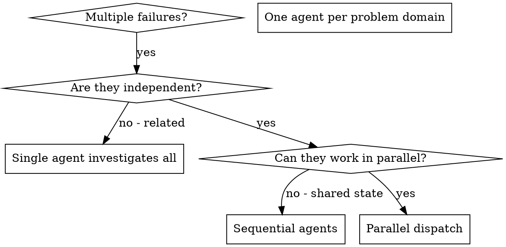

# 分发并行 Agent

## 概述

当存在多个不相关的故障（不同测试文件、不同子系统、不同 bug）时，逐一排查会浪费时间。每项排查都是独立的，可以并行进行。

**核心原则：** 每个独立问题域分发一个 agent，让它们并发工作。

## 使用时机



**适用场景：**
- 3 个以上测试文件因不同根因失败
- 多个子系统独立损坏
- 每个问题无需其他问题的上下文即可理解
- 排查之间无共享状态

**不适用场景：**
- 故障相互关联（修复一个可能修复其他）
- 需要了解完整系统状态
- Agent 之间会相互干扰

## 模式

### 1. 识别独立域

按损坏内容对故障分组：
- 文件 A 测试：Tool approval 流程
- 文件 B 测试：Batch completion 行为
- 文件 C 测试：Abort 功能

每个域是独立的——修复 tool approval 不影响 abort 测试。

### 2. 创建专注的 Agent 任务

每个 agent 获得：
- **具体范围：** 一个测试文件或子系统
- **明确目标：** 使这些测试通过
- **约束条件：** 不修改其他代码
- **预期输出：** 发现和修复内容的摘要

### 3. 并行分发

```typescript
// In Claude Code / AI environment
Task("Fix agent-tool-abort.test.ts failures")
Task("Fix batch-completion-behavior.test.ts failures")
Task("Fix tool-approval-race-conditions.test.ts failures")
// All three run concurrently
```

### 4. 审查并整合

Agent 返回后：
- 阅读每份摘要
- 验证修复不冲突
- 运行完整测试套件
- 整合所有变更

## Agent 提示结构

好的 agent 提示应：
1. **专注** —— 一个明确的问题域
2. **自包含** —— 包含理解问题所需的所有上下文
3. **明确输出** —— agent 应返回什么？

```markdown
Fix the 3 failing tests in src/agents/agent-tool-abort.test.ts:

1. "should abort tool with partial output capture" - expects 'interrupted at' in message
2. "should handle mixed completed and aborted tools" - fast tool aborted instead of completed
3. "should properly track pendingToolCount" - expects 3 results but gets 0

These are timing/race condition issues. Your task:

1. Read the test file and understand what each test verifies
2. Identify root cause - timing issues or actual bugs?
3. Fix by:
   - Replacing arbitrary timeouts with event-based waiting
   - Fixing bugs in abort implementation if found
   - Adjusting test expectations if testing changed behavior

Do NOT just increase timeouts - find the real issue.

Return: Summary of what you found and what you fixed.
```

## 常见错误

**❌ 过于宽泛：** "修复所有测试" —— agent 会迷失方向
**✅ 具体：** "修复 agent-tool-abort.test.ts" —— 范围明确

**❌ 无上下文：** "修复竞态条件" —— agent 不知道在哪里
**✅ 有上下文：** 粘贴错误信息和测试名称

**❌ 无约束：** Agent 可能重构所有内容
**✅ 有约束：** "不修改生产代码" 或 "仅修复测试"

**❌ 模糊输出：** "修复它" —— 你不知道改了什么
**✅ 具体：** "返回根因和变更摘要"

## 不适用场景

**相关故障：** 修复一个可能修复其他 —— 先一起排查
**需要完整上下文：** 理解需要查看整个系统
**探索性调试：** 你还不知道什么损坏了
**共享状态：** Agent 会相互干扰（编辑相同文件、使用相同资源）

## 实际案例

**场景：** 大规模重构后 3 个文件中出现 6 个测试失败

**失败情况：**
- agent-tool-abort.test.ts：3 个失败（时序问题）
- batch-completion-behavior.test.ts：2 个失败（tool 未执行）
- tool-approval-race-conditions.test.ts：1 个失败（执行次数 = 0）

**决策：** 独立域 —— abort 逻辑与 batch completion 与竞态条件各自独立

**分发：**
```
Agent 1 → 修复 agent-tool-abort.test.ts
Agent 2 → 修复 batch-completion-behavior.test.ts
Agent 3 → 修复 tool-approval-race-conditions.test.ts
```

**结果：**
- Agent 1：用基于事件的等待替换超时
- Agent 2：修复事件结构 bug（threadId 位置错误）
- Agent 3：添加等待异步 tool 执行完成

**整合：** 所有修复独立，无冲突，完整套件通过

**节省时间：** 3 个问题并行解决，而非顺序解决

## 主要优势

1. **并行化** —— 多项排查同时进行
2. **专注** —— 每个 agent 范围窄，需跟踪的上下文少
3. **独立性** —— Agent 互不干扰
4. **速度** —— 1 个时间单位内解决 3 个问题

## 验证

Agent 返回后：
1. **审查每份摘要** —— 了解变更内容
2. **检查冲突** —— Agent 是否编辑了相同代码？
3. **运行完整套件** —— 验证所有修复协同工作
4. **抽查** —— Agent 可能犯系统性错误

## 实际影响

来自调试会话（2025-10-03）：
- 3 个文件中 6 个失败
- 3 个 agent 并行分发
- 所有排查并发完成
- 所有修复成功整合
- Agent 变更之间零冲突

## 路由触发

所有并行 agent 结果汇聚后调用 `next-step-router`：
- current_skill: "dispatching-parallel-agents"
- stage: "all_results_returned"
- output_summary: agent 数量、成功/失败数、汇总结果
