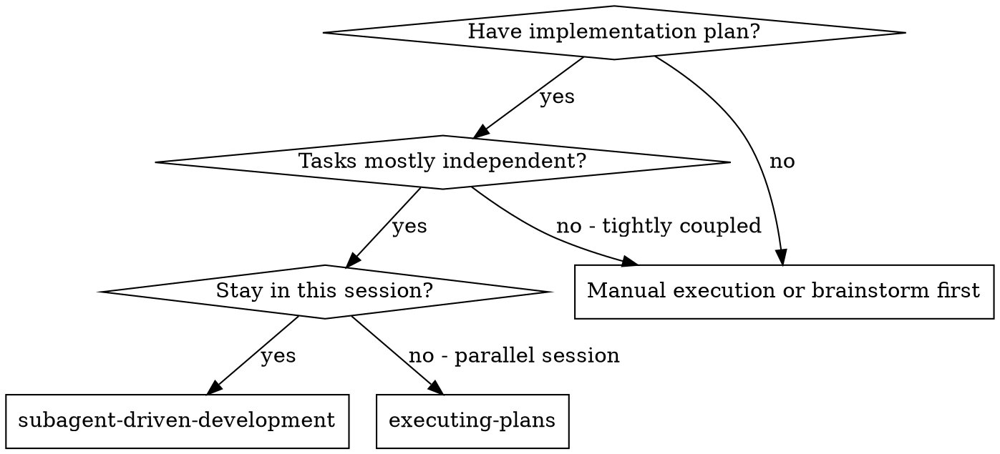
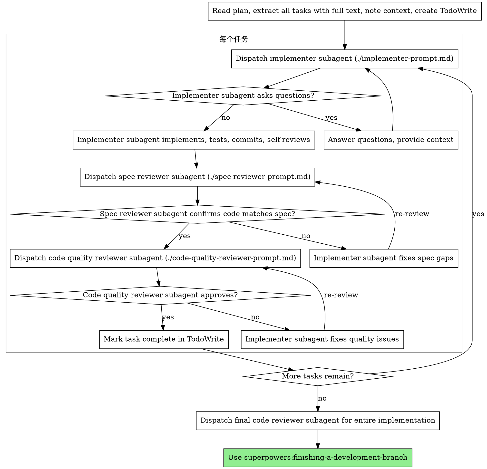

# Subagent 驱动开发

通过为每个任务派遣全新 subagent 来执行计划，每个任务完成后进行两阶段审查：先进行规格合规性审查，再进行代码质量审查。

**核心原则：** 每个任务使用全新 subagent + 两阶段审查（规格审查后质量审查）= 高质量、快速迭代

## 使用时机



**与 Executing Plans（并行 session）的对比：**
- 同一 session（无上下文切换）
- 每个任务使用全新 subagent（无上下文污染）
- 每个任务完成后进行两阶段审查：先规格合规性，后代码质量
- 更快迭代（任务间无需人工介入）

## 流程



## Prompt 模板

- `./implementer-prompt.md` - 派遣 implementer subagent
- `./spec-reviewer-prompt.md` - 派遣规格合规性审查 subagent
- `./code-quality-reviewer-prompt.md` - 派遣代码质量审查 subagent

## 示例工作流

```
You: I'm using Subagent-Driven Development to execute this plan.

[Read plan file once: docs/plans/feature-plan.md]
[Extract all 5 tasks with full text and context]
[Create TodoWrite with all tasks]

Task 1: Hook installation script

[Get Task 1 text and context (already extracted)]
[Dispatch implementation subagent with full task text + context]

Implementer: "Before I begin - should the hook be installed at user or system level?"

You: "User level (~/.config/superpowers/hooks/)"

Implementer: "Got it. Implementing now..."
[Later] Implementer:
  - Implemented install-hook command
  - Added tests, 5/5 passing
  - Self-review: Found I missed --force flag, added it
  - Committed

[Dispatch spec compliance reviewer]
Spec reviewer: ✅ Spec compliant - all requirements met, nothing extra

[Get git SHAs, dispatch code quality reviewer]
Code reviewer: Strengths: Good test coverage, clean. Issues: None. Approved.

[Mark Task 1 complete]

Task 2: Recovery modes

[Get Task 2 text and context (already extracted)]
[Dispatch implementation subagent with full task text + context]

Implementer: [No questions, proceeds]
Implementer:
  - Added verify/repair modes
  - 8/8 tests passing
  - Self-review: All good
  - Committed

[Dispatch spec compliance reviewer]
Spec reviewer: ❌ Issues:
  - Missing: Progress reporting (spec says "report every 100 items")
  - Extra: Added --json flag (not requested)

[Implementer fixes issues]
Implementer: Removed --json flag, added progress reporting

[Spec reviewer reviews again]
Spec reviewer: ✅ Spec compliant now

[Dispatch code quality reviewer]
Code reviewer: Strengths: Solid. Issues (Important): Magic number (100)

[Implementer fixes]
Implementer: Extracted PROGRESS_INTERVAL constant

[Code reviewer reviews again]
Code reviewer: ✅ Approved

[Mark Task 2 complete]

...

[After all tasks]
[Dispatch final code-reviewer]
Final reviewer: All requirements met, ready to merge

Done!
```

## 优势

**与手动执行相比：**
- Subagent 自然遵循 TDD
- 每个任务使用全新上下文（无混淆）
- 并行安全（subagent 互不干扰）
- Subagent 可以提问（工作前后均可）

**与 Executing Plans 相比：**
- 同一 session（无交接）
- 持续推进（无需等待）
- 审查检查点自动进行

**效率提升：**
- 无文件读取开销（控制器提供完整文本）
- 控制器精确筛选所需上下文
- Subagent 预先获得完整信息
- 问题在工作开始前（而非之后）浮现

**质量门控：**
- 自我审查在交接前捕获问题
- 两阶段审查：规格合规性，然后代码质量
- 审查循环确保修复真正有效
- 规格合规性防止过度/不足构建
- 代码质量确保实现质量良好

**成本：**
- 更多 subagent 调用（每个任务：implementer + 2 个审查者）
- 控制器需要更多准备工作（预先提取所有任务）
- 审查循环增加迭代次数
- 但能尽早发现问题（比后期调试更便宜）

## 红线

**绝不：**
- 未经用户明确同意就在 main/master 分支上开始实施
- 跳过审查（规格合规性或代码质量）
- 带着未修复的问题继续
- 并行派遣多个 implementation subagent（会产生冲突）
- 让 subagent 读取计划文件（改为提供完整文本）
- 跳过场景设置上下文（subagent 需要了解任务所处位置）
- 忽略 subagent 的问题（在让其继续前先回答）
- 接受规格合规性上的"差不多"（审查者发现问题 = 未完成）
- 跳过审查循环（审查者发现问题 = implementer 修复 = 再次审查）
- 让 implementer 自我审查替代实际审查（两者都需要）
- **在规格合规性通过 ✅ 之前开始代码质量审查**（顺序错误）
- 在任一审查有未解决问题时进入下一个任务

**如果 subagent 提问：**
- 清晰完整地回答
- 如需要提供额外上下文
- 不要催促其进入实施

**如果审查者发现问题：**
- Implementer（同一 subagent）修复问题
- 审查者再次审查
- 重复直到通过
- 不要跳过重新审查

**如果 subagent 任务失败：**
- 派遣带有具体指令的修复 subagent
- 不要尝试手动修复（上下文污染）

## 集成

**必需的工作流 skill：**
- **superpowers:using-git-worktrees** - 必需：开始前设置隔离工作区
- **superpowers:writing-plans** - 创建此 skill 执行的计划
- **superpowers:requesting-code-review** - 审查 subagent 的代码审查模板
- **superpowers:finishing-a-development-branch** - 所有任务完成后结束开发

**Subagent 应使用：**
- **superpowers:test-driven-development** - Subagent 为每个任务遵循 TDD

**替代工作流：**
- **superpowers:executing-plans** - 用于并行 session 而非同 session 执行

## 路由触发

每个 subagent 任务完成后调用 `next-step-router`：
- current_skill: "subagent-driven-development"
- stage: "subagent_task_complete"
- output_summary: 完成的任务描述、修改的文件列表
