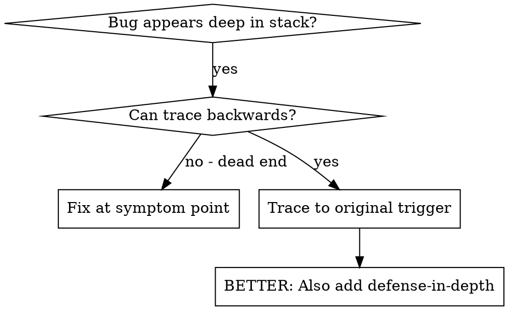
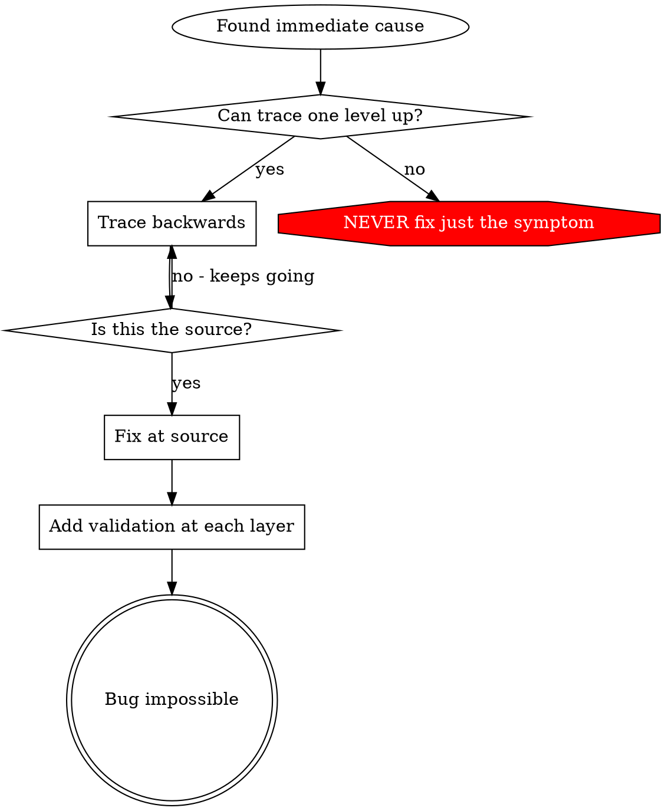

# 根本原因追踪

## 概述

Bug 通常在调用栈深处显现（git init 在错误目录、文件创建在错误位置、数据库以错误路径打开）。你的本能是在错误出现的地方修复，但那只是在治疗症状。

**核心原则：** 沿调用链向上追踪，直到找到原始触发点，然后在源头修复。

## 使用时机



**使用场景：**
- 错误发生在执行深处（而非入口点）
- 堆栈跟踪显示长调用链
- 不清楚无效数据来自哪里
- 需要找出哪个测试/代码触发了问题

## 追踪过程

### 1. 观察症状
```
Error: git init failed in /Users/jesse/project/packages/core
```

### 2. 找到直接原因
**哪段代码直接导致了这个？**
```typescript
await execFileAsync('git', ['init'], { cwd: projectDir });
```

### 3. 问：是什么调用了这个？
```typescript
WorktreeManager.createSessionWorktree(projectDir, sessionId)
  → 被 Session.initializeWorkspace() 调用
  → 被 Session.create() 调用
  → 被测试中的 Project.create() 调用
```

### 4. 继续向上追踪
**传入了什么值？**
- `projectDir = ''`（空字符串！）
- 空字符串作为 `cwd` 解析为 `process.cwd()`
- 那就是源代码目录！

### 5. 找到原始触发点
**空字符串从哪里来？**
```typescript
const context = setupCoreTest(); // 返回 { tempDir: '' }
Project.create('name', context.tempDir); // 在 beforeEach 之前访问！
```

## 添加堆栈跟踪

当无法手动追踪时，添加埋点：

```typescript
// 在有问题的操作之前
async function gitInit(directory: string) {
  const stack = new Error().stack;
  console.error('DEBUG git init:', {
    directory,
    cwd: process.cwd(),
    nodeEnv: process.env.NODE_ENV,
    stack,
  });

  await execFileAsync('git', ['init'], { cwd: directory });
}
```

**关键：** 在测试中使用 `console.error()`（而非 logger——可能不显示）

**运行并捕获：**
```bash
npm test 2>&1 | grep 'DEBUG git init'
```

**分析堆栈跟踪：**
- 查找测试文件名
- 找到触发调用的行号
- 识别模式（同一个测试？同一个参数？）

## 找出哪个测试造成污染

如果测试期间出现某些问题但不知道是哪个测试：

使用本目录中的二分脚本 `find-polluter.sh`：

```bash
./find-polluter.sh '.git' 'src/**/*.test.ts'
```

逐一运行测试，在第一个污染者处停止。使用方法见脚本。

## 真实示例：空 projectDir

**症状：** `.git` 在 `packages/core/`（源代码）中创建

**追踪链：**
1. `git init` 在 `process.cwd()` 中运行 ← 空 cwd 参数
2. WorktreeManager 以空 projectDir 调用
3. Session.create() 传入空字符串
4. 测试在 beforeEach 之前访问了 `context.tempDir`
5. setupCoreTest() 初始返回 `{ tempDir: '' }`

**根本原因：** 顶层变量初始化访问了空值

**修复：** 将 tempDir 改为 getter，在 beforeEach 之前访问时抛出错误

**同时添加了纵深防御：**
- 第 1 层：Project.create() 验证目录
- 第 2 层：WorkspaceManager 验证非空
- 第 3 层：NODE_ENV 守卫拒绝在 tmpdir 外执行 git init
- 第 4 层：git init 前的堆栈跟踪日志

## 关键原则



**绝不只修复错误出现的地方。** 向上追踪找到原始触发点。

## 堆栈跟踪技巧

**在测试中：** 使用 `console.error()` 而非 logger——logger 可能被抑制
**在操作前：** 在危险操作之前记录，而非失败后
**包含上下文：** 目录、cwd、环境变量、时间戳
**捕获堆栈：** `new Error().stack` 显示完整调用链

## 实际影响

来自调试会话（2025-10-03）：
- 通过 5 层追踪找到根本原因
- 在源头修复（getter 验证）
- 添加了 4 层防御
- 1847 个测试通过，零污染
