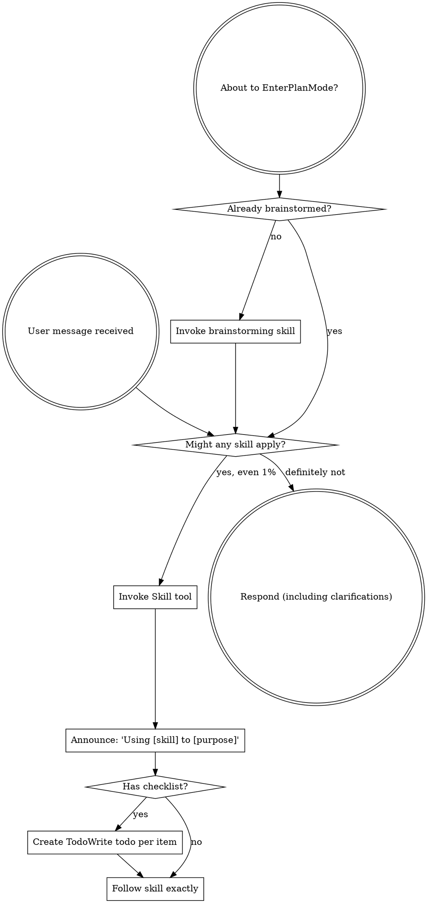

<EXTREMELY-IMPORTANT>
如果你认为某个 skill 有哪怕 1% 的可能适用于你正在做的事情，你绝对必须调用该 skill。

如果一个 SKILL 适用于你的任务，你没有选择。你必须使用它。

这不可协商。这不是可选的。你无法通过理性化来逃避这一点。
</EXTREMELY-IMPORTANT>

## 如何访问 Skill

**在 Claude Code 中：** 使用 `Skill` 工具。当你调用一个 skill 时，其内容会被加载并呈现给你——直接遵循它。永远不要在 skill 文件上使用 Read 工具。

**在其他环境中：** 查看你的平台文档了解如何加载 skill。

# 使用 Skill

## 规则

**在任何响应或行动之前调用相关 skill。** 即使只有 1% 的可能性某个 skill 适用，也意味着你应该调用该 skill 进行检查。如果调用的 skill 结果不适合当前情况，你不需要使用它。

## 红旗

这些想法意味着停下——你在自我合理化：

| 想法 | 现实 |
|------|------|
| "这只是个简单问题" | 问题也是任务。检查 skill。 |
| "我需要先了解更多上下文" | Skill 检查在澄清问题之前。 |
| "让我先探索代码库" | Skill 告诉你如何探索。先检查。 |
| "我可以快速检查 git/文件" | 文件缺乏对话上下文。检查 skill。 |
| "让我先收集信息" | Skill 告诉你如何收集信息。 |
| "这不需要正式的 skill" | 如果 skill 存在，就使用它。 |
| "我记得这个 skill" | Skill 会演进。阅读当前版本。 |
| "这不算任务" | 行动 = 任务。检查 skill。 |
| "这个 skill 太重了" | 简单的事情会变复杂。使用它。 |
| "我先做这一件事" | 在做任何事之前先检查。 |
| "这感觉很有效率" | 无纪律的行动浪费时间。Skill 防止这种情况。 |
| "我知道那是什么意思" | 了解概念 ≠ 使用 skill。调用它。 |

## Skill 优先级

当多个 skill 可能适用时，按此顺序使用：

1. **流程 skill 优先**（brainstorming、debugging）- 这些决定如何处理任务
2. **实施 skill 其次**（frontend-design、mcp-builder）- 这些指导执行

"让我们构建 X" → 先 brainstorming，然后实施 skill。
"修复这个 bug" → 先 debugging，然后领域特定 skill。

## Skill 类型

**刚性**（TDD、debugging）：严格遵循。不要偏离纪律。

**灵活**（patterns）：将原则适应上下文。

Skill 本身会告诉你是哪种类型。

## 用户指令

指令说明做什么，而非如何做。"添加 X"或"修复 Y"不意味着跳过工作流。
