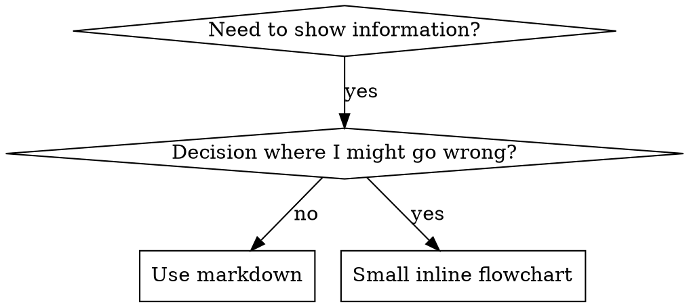

# 编写 Skill

## 概述

**编写 skill 就是将测试驱动开发应用于流程文档。**

**个人 skill 存放在 agent 专属目录（Claude Code 为 `~/.claude/skills`，Codex 为 `~/.agents/skills/`）**

你编写测试用例（带 subagent 的压力场景），观察它们失败（基线行为），编写 skill（文档），观察测试通过（agent 遵从），然后重构（堵住漏洞）。

**核心原则：** 如果你没有观察过 agent 在没有 skill 的情况下失败，你就不知道 skill 是否教了正确的东西。

**必需背景：** 使用本 skill 前，你必须理解 superpowers:test-driven-development。该 skill 定义了基本的 RED-GREEN-REFACTOR 循环。本 skill 将 TDD 适配到文档。

**官方指导：** 关于 Anthropic 官方 skill 编写最佳实践，请参阅 anthropic-best-practices.md。该文档提供了补充本 skill TDD 方法的额外模式和指南。

## 什么是 Skill？

**skill** 是经过验证的技术、模式或工具的参考指南。Skill 帮助未来的 Claude 实例找到并应用有效的方法。

**Skill 是：** 可复用的技术、模式、工具、参考指南

**Skill 不是：** 关于你曾经如何解决某个问题的叙述

## TDD 与 Skill 的映射

| TDD 概念 | Skill 创建 |
|----------|-----------|
| **测试用例** | 带 subagent 的压力场景 |
| **生产代码** | Skill 文档（SKILL.md） |
| **测试失败（RED）** | Agent 在没有 skill 时违反规则（基线） |
| **测试通过（GREEN）** | Agent 在有 skill 时遵从 |
| **重构** | 在保持遵从的同时堵住漏洞 |
| **先写测试** | 在编写 skill 之前运行基线场景 |
| **观察失败** | 记录 agent 使用的确切理由 |
| **最小代码** | 编写针对那些具体违规的 skill |
| **观察通过** | 验证 agent 现在遵从 |
| **重构循环** | 发现新理由 → 堵住 → 重新验证 |

整个 skill 创建过程遵循 RED-GREEN-REFACTOR。

## 何时创建 Skill

**创建时机：**
- 技术对你来说不是直觉上显而易见的
- 你会在多个项目中再次引用
- 模式广泛适用（非项目特定）
- 他人会受益

**不要创建：**
- 一次性解决方案
- 其他地方有充分文档的标准实践
- 项目特定约定（放在 CLAUDE.md 中）
- 机械约束（如果可以用 regex/验证强制执行，就自动化——将文档留给判断调用）

## Skill 类型

### 技术（Technique）
有步骤可遵循的具体方法（condition-based-waiting、root-cause-tracing）

### 模式（Pattern）
思考问题的方式（flatten-with-flags、test-invariants）

### 参考（Reference）
API 文档、语法指南、工具文档（office docs）

## 目录结构

```
skills/
  skill-name/
    SKILL.md              # 主参考文件（必需）
    supporting-file.*     # 仅在需要时
```

**扁平命名空间** - 所有 skill 在一个可搜索的命名空间中

**单独文件用于：**
1. **重型参考**（100+ 行）- API 文档、全面语法
2. **可复用工具** - 脚本、工具、模板

**内联保留：**
- 原则和概念
- 代码模式（< 50 行）
- 其他所有内容

## SKILL.md 结构

**Frontmatter（YAML）：**
- 仅支持两个字段：`name` 和 `description`
- 最多 1024 个字符
- `name`：仅使用字母、数字和连字符（无括号、特殊字符）
- `description`：第三人称，仅描述何时使用（不描述功能）
  - 以"Use when..."开头，聚焦于触发条件
  - 包含具体症状、情况和上下文
  - **绝不总结 skill 的流程或工作流**（参见 CSO 部分了解原因）
  - 尽量保持在 500 个字符以内

```markdown
---
name: Skill-Name-With-Hyphens
description: Use when [specific triggering conditions and symptoms]
---

# Skill Name

## Overview
这是什么？1-2 句话的核心原则。

## When to Use
[如果决策不明显，添加小型内联流程图]

带症状和用例的项目符号列表
何时不使用

## Core Pattern（用于技术/模式）
前后代码对比

## Quick Reference
用于扫描常见操作的表格或项目符号

## Implementation
简单模式的内联代码
重型参考或可复用工具链接到文件

## Common Mistakes
出错原因 + 修复

## Real-World Impact（可选）
具体结果
```

## Claude 搜索优化（CSO）

**对发现至关重要：** 未来的 Claude 需要能够找到你的 skill

### 1. 丰富的描述字段

**目的：** Claude 读取描述来决定为给定任务加载哪些 skill。让它回答："我现在应该读这个 skill 吗？"

**格式：** 以"Use when..."开头，聚焦于触发条件

**关键：描述 = 何时使用，而非 Skill 做什么**

描述应该只描述触发条件。不要在描述中总结 skill 的流程或工作流。

**为何重要：** 测试表明，当描述总结 skill 的工作流时，Claude 可能会遵循描述而不是阅读完整的 skill 内容。描述"任务间代码审查"导致 Claude 只做一次审查，即使 skill 的流程图清楚地显示了两次审查（规格合规性然后代码质量）。

当描述改为仅"Use when executing implementation plans with independent tasks"（无工作流摘要）时，Claude 正确地阅读了流程图并遵循了两阶段审查流程。

**陷阱：** 总结工作流的描述为 Claude 创造了捷径。Skill 正文变成了 Claude 跳过的文档。

```yaml
# 差：总结工作流 - Claude 可能遵循此而不读 skill
description: Use when executing plans - dispatches subagent per task with code review between tasks

# 差：流程细节过多
description: Use for TDD - write test first, watch it fail, write minimal code, refactor

# 好：仅触发条件，无工作流摘要
description: Use when executing implementation plans with independent tasks in the current session

# 好：仅触发条件
description: Use when implementing any feature or bugfix, before writing implementation code
```

**内容：**
- 使用具体的触发器、症状和情况来表明此 skill 适用
- 描述*问题*（竞态条件、不一致行为）而非*语言特定症状*（setTimeout、sleep）
- 除非 skill 本身是技术特定的，否则保持触发器与技术无关
- 如果 skill 是技术特定的，在触发器中明确说明
- 以第三人称写作（注入到系统提示中）
- **绝不总结 skill 的流程或工作流**

```yaml
# 差：太抽象，模糊，不包含何时使用
description: For async testing

# 差：第一人称
description: I can help you with async tests when they're flaky

# 差：提到技术但 skill 不特定于它
description: Use when tests use setTimeout/sleep and are flaky

# 好：以"Use when"开头，描述问题，无工作流
description: Use when tests have race conditions, timing dependencies, or pass/fail inconsistently

# 好：带明确触发器的技术特定 skill
description: Use when using React Router and handling authentication redirects
```

### 2. 关键词覆盖

使用 Claude 会搜索的词：
- 错误消息："Hook timed out"、"ENOTEMPTY"、"race condition"
- 症状："flaky"、"hanging"、"zombie"、"pollution"
- 同义词："timeout/hang/freeze"、"cleanup/teardown/afterEach"
- 工具：实际命令、库名、文件类型

### 3. 描述性命名

**使用主动语态，动词优先：**
- `creating-skills` 而非 `skill-creation`
- `condition-based-waiting` 而非 `async-test-helpers`

### 4. Token 效率（关键）

**问题：** getting-started 和频繁引用的 skill 会加载到每次对话中。每个 token 都很重要。

**目标字数：**
- getting-started 工作流：每个 <150 词
- 频繁加载的 skill：总计 <200 词
- 其他 skill：<500 词（仍要简洁）

**技术：**

**将细节移至工具帮助：**
```bash
# 差：在 SKILL.md 中记录所有标志
search-conversations supports --text, --both, --after DATE, --before DATE, --limit N

# 好：引用 --help
search-conversations supports multiple modes and filters. Run --help for details.
```

**使用交叉引用：**
```markdown
# 差：重复工作流细节
When searching, dispatch subagent with template...
[20 行重复指令]

# 好：引用其他 skill
Always use subagents (50-100x context savings). REQUIRED: Use [other-skill-name] for workflow.
```

**压缩示例：**
```markdown
# 差：冗长示例（42 词）
your human partner: "How did we handle authentication errors in React Router before?"
You: I'll search past conversations for React Router authentication patterns.
[Dispatch subagent with search query: "React Router authentication error handling 401"]

# 好：最小示例（20 词）
Partner: "How did we handle auth errors in React Router?"
You: Searching...
[Dispatch subagent → synthesis]
```

**消除冗余：**
- 不要重复交叉引用 skill 中的内容
- 不要解释命令中显而易见的内容
- 不要包含同一模式的多个示例

**验证：**
```bash
wc -w skills/path/SKILL.md
# getting-started 工作流：目标 <150 每个
# 其他频繁加载：目标 <200 总计
```

**按你做什么或核心洞察命名：**
- `condition-based-waiting` > `async-test-helpers`
- `using-skills` 而非 `skill-usage`
- `flatten-with-flags` > `data-structure-refactoring`
- `root-cause-tracing` > `debugging-techniques`

**动名词（-ing）适合流程：**
- `creating-skills`、`testing-skills`、`debugging-with-logs`
- 主动，描述你正在采取的行动

### 4. 交叉引用其他 Skill

**编写引用其他 skill 的文档时：**

仅使用 skill 名称，带明确的要求标记：
- 好：`**REQUIRED SUB-SKILL:** Use superpowers:test-driven-development`
- 好：`**REQUIRED BACKGROUND:** You MUST understand superpowers:systematic-debugging`
- 差：`See skills/testing/test-driven-development`（不清楚是否必需）
- 差：`@skills/testing/test-driven-development/SKILL.md`（强制加载，消耗上下文）

**为何不用 @ 链接：** `@` 语法立即强制加载文件，在你需要之前消耗 200k+ 上下文。

## 流程图使用



**仅在以下情况使用流程图：**
- 非显而易见的决策点
- 可能过早停止的流程循环
- "何时使用 A vs B"的决策

**绝不用流程图表示：**
- 参考材料 → 表格、列表
- 代码示例 → Markdown 块
- 线性指令 → 编号列表
- 没有语义含义的标签（step1、helper2）

参见 @graphviz-conventions.dot 了解 graphviz 样式规则。

**为你的人类伙伴可视化：** 使用此目录中的 `render-graphs.js` 将 skill 的流程图渲染为 SVG：
```bash
./render-graphs.js ../some-skill           # 每个图表单独渲染
./render-graphs.js ../some-skill --combine # 所有图表合并为一个 SVG
```

## 代码示例

**一个优秀的示例胜过许多平庸的示例**

选择最相关的语言：
- 测试技术 → TypeScript/JavaScript
- 系统调试 → Shell/Python
- 数据处理 → Python

**好的示例：**
- 完整且可运行
- 注释充分，解释为什么
- 来自真实场景
- 清晰展示模式
- 可直接适配（非通用模板）

**不要：**
- 用 5+ 种语言实现
- 创建填空模板
- 编写人为示例

你擅长移植——一个优秀的示例就足够了。

## 文件组织

### 自包含 Skill
```
defense-in-depth/
  SKILL.md    # 所有内容内联
```
适用时机：所有内容适合，不需要重型参考

### 带可复用工具的 Skill
```
condition-based-waiting/
  SKILL.md    # 概述 + 模式
  example.ts  # 可适配的工作辅助函数
```
适用时机：工具是可复用代码，而非仅叙述

### 带重型参考的 Skill
```
pptx/
  SKILL.md       # 概述 + 工作流
  pptxgenjs.md   # 600 行 API 参考
  ooxml.md       # 500 行 XML 结构
  scripts/       # 可执行工具
```
适用时机：参考材料太大无法内联

## 铁律（与 TDD 相同）

```
NO SKILL WITHOUT A FAILING TEST FIRST
```

这适用于新 skill 和对现有 skill 的编辑。

先写 skill 再测试？删除它。重新开始。
不测试就编辑 skill？同样违规。

**无例外：**
- 不适用于"简单添加"
- 不适用于"只是添加一个部分"
- 不适用于"文档更新"
- 不要将未测试的更改保留为"参考"
- 不要在运行测试时"适配"
- 删除意味着删除

**必需背景：** superpowers:test-driven-development skill 解释了为何重要。同样的原则适用于文档。

## 测试所有 Skill 类型

不同的 skill 类型需要不同的测试方法：

### 纪律执行型 Skill（规则/要求）

**示例：** TDD、verification-before-completion、designing-before-coding

**测试方式：**
- 学术问题：他们理解规则吗？
- 压力场景：在压力下他们遵从吗？
- 多重压力组合：时间 + 沉没成本 + 疲惫
- 识别理由并添加明确的反驳

**成功标准：** Agent 在最大压力下遵循规则

### 技术型 Skill（操作指南）

**示例：** condition-based-waiting、root-cause-tracing、defensive-programming

**测试方式：**
- 应用场景：他们能正确应用技术吗？
- 变体场景：他们处理边缘情况吗？
- 缺失信息测试：指令有空白吗？

**成功标准：** Agent 成功将技术应用于新场景

### 模式型 Skill（心智模型）

**示例：** reducing-complexity、information-hiding 概念

**测试方式：**
- 识别场景：他们能识别模式何时适用吗？
- 应用场景：他们能使用心智模型吗？
- 反例：他们知道何时不应用吗？

**成功标准：** Agent 正确识别何时/如何应用模式

### 参考型 Skill（文档/API）

**示例：** API 文档、命令参考、库指南

**测试方式：**
- 检索场景：他们能找到正确信息吗？
- 应用场景：他们能正确使用找到的内容吗？
- 空白测试：常见用例是否涵盖？

**成功标准：** Agent 找到并正确应用参考信息

## 跳过测试的常见理由

| 借口 | 现实 |
|------|------|
| "Skill 显然很清晰" | 对你清晰 ≠ 对其他 agent 清晰。测试它。 |
| "只是参考" | 参考可能有空白、不清晰的部分。测试检索。 |
| "测试是过度杀伤" | 未测试的 skill 有问题。始终如此。15 分钟测试节省数小时。 |
| "出问题再测试" | 问题 = agent 无法使用 skill。部署前测试。 |
| "测试太繁琐" | 测试比在生产中调试糟糕的 skill 更不繁琐。 |
| "我有信心它很好" | 过度自信保证有问题。无论如何都要测试。 |
| "学术审查就够了" | 阅读 ≠ 使用。测试应用场景。 |
| "没时间测试" | 部署未测试的 skill 以后修复浪费更多时间。 |

**所有这些都意味着：部署前测试。无例外。**

## 防止 Skill 被理由化

执行纪律的 skill（如 TDD）需要抵抗理由化。Agent 很聪明，在压力下会找到漏洞。

**心理学注意：** 理解说服技术为何有效有助于系统地应用它们。参见 persuasion-principles.md 了解研究基础（Cialdini, 2021; Meincke et al., 2025）关于权威、承诺、稀缺性、社会证明和统一原则。

### 明确堵住每个漏洞

不要只陈述规则——禁止具体的变通方法：

差：
```markdown
Write code before test? Delete it.
```

好：
```markdown
Write code before test? Delete it. Start over.

**No exceptions:**
- Don't keep it as "reference"
- Don't "adapt" it while writing tests
- Don't look at it
- Delete means delete
```

### 处理"精神 vs 字面"争论

早期添加基础原则：

```markdown
**Violating the letter of the rules is violating the spirit of the rules.**
```

这切断了整类"我在遵循精神"的理由化。

### 构建理由化表格

从基线测试中捕获理由化（见下方测试部分）。Agent 提出的每个借口都进入表格：

```markdown
| Excuse | Reality |
|--------|---------|
| "Too simple to test" | Simple code breaks. Test takes 30 seconds. |
| "I'll test after" | Tests passing immediately prove nothing. |
| "Tests after achieve same goals" | Tests-after = "what does this do?" Tests-first = "what should this do?" |
```

### 创建红旗列表

让 agent 在理由化时容易自我检查：

```markdown
## Red Flags - STOP and Start Over

- Code before test
- "I already manually tested it"
- "Tests after achieve the same purpose"
- "It's about spirit not ritual"
- "This is different because..."

**All of these mean: Delete code. Start over with TDD.**
```

### 为违规症状更新 CSO

在描述中添加：你即将违反规则时的症状：

```yaml
description: use when implementing any feature or bugfix, before writing implementation code
```

## Skill 的 RED-GREEN-REFACTOR

遵循 TDD 循环：

### RED：编写失败测试（基线）

在没有 skill 的情况下运行带 subagent 的压力场景。记录确切行为：
- 他们做了什么选择？
- 他们使用了什么理由（逐字）？
- 哪些压力触发了违规？

这是"观察测试失败"——你必须在编写 skill 之前看到 agent 自然会做什么。

### GREEN：编写最小 Skill

编写针对那些具体理由化的 skill。不要为假设情况添加额外内容。

在有 skill 的情况下运行相同场景。Agent 现在应该遵从。

### REFACTOR：堵住漏洞

Agent 找到新的理由化？添加明确的反驳。重新测试直到无懈可击。

**测试方法：** 参见 @testing-skills-with-subagents.md 了解完整测试方法：
- 如何编写压力场景
- 压力类型（时间、沉没成本、权威、疲惫）
- 系统地堵住漏洞
- 元测试技术

## 反模式

### 叙述示例
"在 2025-10-03 的 session 中，我们发现空的 projectDir 导致..."
**为何差：** 太具体，不可复用

### 多语言稀释
example-js.js、example-py.py、example-go.go
**为何差：** 质量平庸，维护负担

### 流程图中的代码
```dot
step1 [label="import fs"];
step2 [label="read file"];
```
**为何差：** 无法复制粘贴，难以阅读

### 通用标签
helper1、helper2、step3、pattern4
**为何差：** 标签应有语义含义

## 停止：进入下一个 Skill 之前

**编写任何 skill 后，你必须停下并完成部署流程。**

**不要：**
- 批量创建多个 skill 而不逐一测试
- 在当前 skill 验证之前进入下一个
- 以"批量更高效"为由跳过测试

**下方的部署清单对每个 skill 都是强制性的。**

部署未测试的 skill = 部署未测试的代码。这违反了质量标准。

## Skill 创建清单（TDD 适配）

**重要：使用 TodoWrite 为下方每个清单项创建 todo。**

**RED 阶段 - 编写失败测试：**
- [ ] 创建压力场景（纪律型 skill 需要 3+ 个组合压力）
- [ ] 在没有 skill 的情况下运行场景——逐字记录基线行为
- [ ] 识别理由化/失败中的模式

**GREEN 阶段 - 编写最小 Skill：**
- [ ] 名称仅使用字母、数字、连字符（无括号/特殊字符）
- [ ] YAML frontmatter 仅含 name 和 description（最多 1024 字符）
- [ ] 描述以"Use when..."开头，包含具体触发器/症状
- [ ] 描述以第三人称写作
- [ ] 全文包含搜索关键词（错误、症状、工具）
- [ ] 清晰的概述，含核心原则
- [ ] 针对 RED 阶段识别的具体失败
- [ ] 代码内联或链接到单独文件
- [ ] 一个优秀示例（非多语言）
- [ ] 在有 skill 的情况下运行场景——验证 agent 现在遵从

**REFACTOR 阶段 - 堵住漏洞：**
- [ ] 从测试中识别新的理由化
- [ ] 添加明确的反驳（如果是纪律型 skill）
- [ ] 从所有测试迭代构建理由化表格
- [ ] 创建红旗列表
- [ ] 重新测试直到无懈可击

**质量检查：**
- [ ] 仅在决策不明显时使用小型流程图
- [ ] 快速参考表格
- [ ] 常见错误部分
- [ ] 无叙述性故事
- [ ] 仅工具或重型参考使用支持文件

**部署：**
- [ ] 将 skill 提交到 git 并推送到你的 fork（如果已配置）
- [ ] 考虑通过 PR 贡献回来（如果广泛有用）

## 发现工作流

未来的 Claude 如何找到你的 skill：

1. **遇到问题**（"tests are flaky"）
3. **找到 SKILL**（描述匹配）
4. **扫描概述**（这相关吗？）
5. **阅读模式**（快速参考表格）
6. **加载示例**（仅在实现时）

**为此流程优化** - 早且频繁地放置可搜索的术语。

## 底线

**创建 skill 就是为流程文档做 TDD。**

同样的铁律：没有失败测试就没有 skill。
同样的循环：RED（基线）→ GREEN（编写 skill）→ REFACTOR（堵住漏洞）。
同样的好处：更高质量、更少意外、无懈可击的结果。

如果你为代码遵循 TDD，就为 skill 遵循它。这是应用于文档的同一纪律。

## 路由触发

skill 压力测试通过后调用 `next-step-router`：
- current_skill: "writing-skills"
- stage: "stress_test_passed"
- output_summary: 测试的 skill 名称、通过的测试场景数
